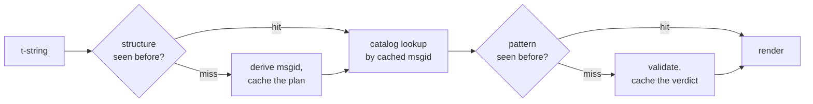

# How it works

Nothing on this page is required to use the library — the [tutorial](tutorial.md)
and [guide](guide.md) cover that. This page rebuilds the library from first
principles instead: what a t-string actually is, how a msgid falls out of it,
what makes a translation valid, and how the implementation makes all that
checking cost tenths of a microsecond. Read it if you are curious, if you want
to contribute, or if you plan to [implement the convention yourself](#reimplementing-it).

## What a t-string actually is

An f-string produces a `str`, and produces it immediately — by the time any
function receives it, the value has been interpolated and the sentence is
sealed. A t-string ([PEP 750]) has the same syntax and the same eager
evaluation of its expressions, but produces a different type:

```pycon
>>> name = "Ada"
>>> f"Hello {name}!"
'Hello Ada!'
>>> t"Hello {name}!"
Template(strings=('Hello ', '!'), interpolations=(Interpolation('Ada', 'name', None, ''),))
```

That `Template` object keeps the parts a catalog pipeline needs, still
separated:

```pycon
>>> template = t"Total: {amount:,.2f}"
>>> template.strings
('Total: ', '')
>>> template.interpolations[0].expression
'amount'
>>> template.interpolations[0].value
1234.5
>>> template.interpolations[0].format_spec
',.2f'
```

- `strings` — the literal text around the interpolations, in order.
- For each interpolation: the **expression** as source text (`'amount'`), its
  evaluated **value** (`1234.5`), and any **conversion** (`!r`) and
  **format spec** (`,.2f`) — carried separately instead of applied.

Everything this library does is a disciplined consumption of that structure.
The language already made the one separation i18n needs — static text apart
from values — so the library never parses your source code and never guesses
where a value sits inside a sentence. What remains is three decisions: how the
structure becomes a catalog key, what a translation of that key may say, and
how the two render back together.

## From template to msgid

A msgid — the key a catalog is indexed by — is derived from the template's
*static* parts only. Walk `strings` and `interpolations` in source order;
brace-escape each literal segment (`{` becomes `{{`); for each interpolation,
emit one `{name}` token, where `name` is the expression text with surrounding
whitespace stripped. From `t"Total: {amount:,.2f}"`:

```text
strings         ('Total: ', '')
interpolations  expression 'amount'   conversion None   format_spec ',.2f'
msgid           'Total: {amount}'
```

Each part of that rule has a reason:

- **The expression must be a plain name** — `str.isidentifier()` is true and
  it is not a Python keyword. `t"Hello {user.name}"` is rejected at the call
  site. A msgid is a *key*: it has to come out identical on every run and
  every extraction, and it is read by translators, so the placeholder must be
  a stable, meaningful word — not a code fragment that invites the catalog to
  become an expression language.
- **The conversion and format spec never enter the msgid.** Translators
  should not have to read `:,.2f`, and no translation should be able to
  change it. The corollary is worth knowing: tightening `:,.2f` to `:,.0f`
  in your code changes no msgid, so it invalidates no translation in any
  language. The catalog key tracks *what the sentence says*, not how the
  value is formatted.
- **A repeated name must repeat its formatting exactly.**
  `t"{x:.2f} vs {x:.3f}"` is rejected, because both occurrences collapse into
  the same `{x}` token and the msgid could no longer say which formatting a
  render should use.
- **The empty msgid is never looked up**, because gettext reserves it for the
  catalog's own metadata header. `t""` renders as `""` without touching the
  catalog.

The full rule set, including edge cases this page skips, is
[SPEC §2](https://github.com/yhay81/gettext-tstrings/blob/main/SPEC.md).

## What a translation may say

A pattern coming back from a catalog is parsed with `string.Formatter` — the
same parser `str.format` uses. The grammar is deliberately borrowed rather
than invented: a pattern this library accepts is one the wider ecosystem
already understands. Then two checks apply.

**Shape:** every field must be a bare `{name}`. A conversion or format spec —
including the explicitly empty `{name:}` — is rejected, as are positional
fields (`{0}`, `{}`) and whitespace-padded names (`{ name }`). The last one
matters more than it looks: `str.format` and GNU `msgfmt` both reject
`{ name }`, so accepting it here would produce catalogs that no other tool in
the chain can validate.

**Names:** the pattern's placeholder set is compared against the source's.
For a singular message every source name is *required* and nothing else is
*allowed*. For a plural message the two branches are merged:

- **allowed** = the union of both branches' names
- **required** = their intersection

So against `t"One file"` / `t"{n} files"`, the name `n` is allowed in a
translation of either form but required of neither. That asymmetry is what
lets a target language's plural system differ from the source's — Japanese
translates both branches with one form that probably uses `{n}`; a language
with more forms than English may need `{n}` in a form where English has none.

None of that is hypothetical: this site's own chrome catalog carries the
plural message `Built {n} localized page` / `Built {n} localized pages` — two
English branches — and the site's editions translate that one message into
anywhere from one form to six:

| Catalog | Forms | The translations, in form order |
| --- | --- | --- |
| Japanese | 1 | `ローカライズ済みページを{n}件ビルドしました` |
| Turkish | 2 | `{n} yerelleştirilmiş sayfa oluşturuldu` — twice, identically: Turkish nouns stay singular after a numeral |
| Italian | 2 | `Generata {n} pagina localizzata` · `Generate {n} pagine localizzate` — the participle agrees in gender and number |
| Latvian | 3 | `Izveidota {n} lokalizēta lapa` · `Izveidotas {n} lokalizētas lapas` · `Izveidots {n} lokalizētu lapu` — the third form is for **zero alone** |
| Russian | 3 | `Собрана {n} локализованная страница` · `Собраны {n} локализованные страницы` · `Собрано {n} локализованных страниц` |
| Polish | 3 | `Zbudowano {n} zlokalizowaną stronę` · `Zbudowano {n} zlokalizowane strony` · `Zbudowano {n} zlokalizowanych stron` |
| Slovenian | 4 | `Zgrajena {n} lokalizirana stran` · `Zgrajeni {n} lokalizirani strani` · `Zgrajene {n} lokalizirane strani` · `Zgrajenih {n} lokaliziranih strani` — the second is a **dual**, for exactly two |
| Irish | 5 | `Tógadh {n} leathanach logánaithe` · `Tógadh {n} leathanaigh logánaithe` — one, two, 3–6, 7–10, and the rest; the stem alternates but *leathanach* begins with `l`, which no Irish mutation writes, so several forms coincide |
| Arabic | 6 | among them `تم إنشاء صفحة مترجمة واحدة ({n})` for exactly one and `تم إنشاء {n} صفحات مترجمة` for a few |

Every row is a live entry in this repository's `i18n/*/LC_MESSAGES/site.po`,
rendered by the [multilingual build](index.md) on every release — and a test
pins this table to those catalogs, so the two cannot drift apart.

Within those bounds, reordering and repetition are deliberately
unconstrained. Both are grammatically necessary in real languages, and
restricting occurrence counts would reject correct translations to no
security benefit: a translation still cannot *evaluate* anything, because no
evaluation path exists — placeholders are looked up by name in the template's
already-computed values, never fed to `eval`, `getattr`, or `str.format`
itself.

## Rendering

Rendering a validated pattern is a walk over its chunks: emit each literal
part, and for each placeholder, take the interpolation's captured value and
apply the *source-side* conversion and format spec — `format(convert(value,
conversion), format_spec)`. Two guarantees are kept while doing it:

- **Each distinct value is formatted at most once per render**, even when the
  translation repeats a placeholder. Repetition changes how often the result
  is inserted, not how often your `__format__` runs.
- **For plurals, a placeholder reads the branch that defined it.** A name
  present in both branches reads the value captured by the branch the
  *source* language selects (`singular` when `n == 1`, else `plural`); a
  branch-specific name always reads its own branch, even when the target
  language's plural rules made it available in another form.

When validation fails at render time, the response is split by who supplied
the pattern. A pattern that came out of a *catalog* degrades: log one warning
and render the source text, keeping gettext's contract that a broken catalog
never takes the application down ([the guide shows both modes](guide.md#what-happens-when-a-catalog-is-wrong)).
A pattern the caller passed in directly — `CompiledTemplate.render` — always
raises, because there is no source text to degrade *from*; leniency exists
for catalog lookups, not for arguments.

## Diagnostics are part of the design

A placeholder error usually lands in front of a translator, not a
programmer, and often in a file where the problem is invisible. Saying
`{name} is missing` to someone who can see those exact characters in their
editor is a dead end, so the messages are computed with three rules:

- A name containing an **invisible character** — a no-break space an input
  method produced, a zero-width space — is printed with that character
  replaced by its code point, in place: `{<U+00A0>name}`. The reader needs to
  see *where*.
- A name whose letters **mix writing systems**, the homoglyph case, is shown
  twice — once readably, once escaped — because `{nаme}` with a Cyrillic
  `а` is indistinguishable from `{name}` in print, and the escaped form
  `(nаme)` is the only spelling that tells them apart.
- Everything else is shown **as written**. `{名前}` and `{café}` are ordinary
  names; escaping them would leave the reader unable to find what was meant.

On the same principle, a "missing" placeholder that *looks* present gets its
absence explained — full-width braces from an East Asian input method,
`{{name}}` doubling from an escaping round trip, the name outside any braces.
The [failure-reading table](translators.md#reading-a-failure-message) written
for translators shows each of these messages verbatim.

## The hot path

All of the above happens on every translated string an application renders,
so the implementation is built around one idea: **validation is never
skipped, so validation must be what gets cached.**



Three caches, one per stage:

- **A plan per call-site structure.** The template's `strings` tuple — an
  object the interpreter already built — is the cache key, so a lookup
  allocates nothing. On a hit, each interpolation's expression, conversion,
  and format spec is still compared against the recorded ones: two call sites
  that share literal text but differ in formatting (`t"{x:.2f}"` against
  `t"{x:.3f}"`) must not collide, and that comparison is the price of using a
  key the interpreter hands over for free.
- **A verdict per pattern.** The first time a catalog answers with a given
  pattern, it is parsed and validated; the result — a compiled render plan,
  or a record of invalidity — is kept on the plan. Every later render of that
  message reaches it in one dictionary lookup. Invalid patterns are
  remembered too, which is why a broken catalog entry warns once rather than
  on every render.
- **A merged plan per plural pair**, holding the union/intersection sets so
  the branch arithmetic happens once per message, not once per call.

Every cache is bounded, and none retains interpolated *values* — only static
structure and pattern text. The result, measured by
[`benchmarks/runtime.py`](https://github.com/yhay81/gettext-tstrings/blob/main/benchmarks/runtime.py):
roughly 0.4 µs for a one-field message including the construction of the
t-string itself, about 2.5× a plain `gettext(...).format(...)` that checks
nothing. The commentary at the top of
[`core.py`](https://github.com/yhay81/gettext-tstrings/blob/main/src/gettext_tstrings/core.py)
records the individual measurements behind that shape.

## Reimplementing it

None of the above is private lore: the convention is written down as
[spec v1](spec.md), and its machine-readable
[conformance suite](spec.md#conformance) lets an extractor, an IDE plugin, or
an implementation in another language check itself against every rule this
page explained. This implementation runs the suite in its own tests, which is
what keeps this page, the spec, and the code from drifting apart in silence.

  [PEP 750]: https://peps.python.org/pep-0750/
