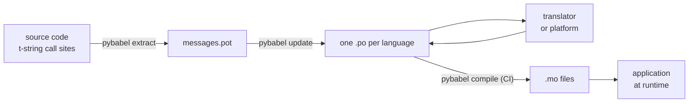

# In production

The [tutorial](tutorial.md) runs the loop once, alone, on a program with one
message. On a real project the loop keeps turning: messages change after they
have been translated, the translator works elsewhere and on their own
schedule, and a compiled catalog ships with every release. This page is that
practice — what stays in the repository, what travels, what CI must gate, and
where the runtime binds a language.

## The shape of a project

```text
myapp/
├── babel.cfg
├── pyproject.toml
├── src/
│   └── myapp/
└── locales/
    ├── messages.pot
    ├── ja/LC_MESSAGES/messages.po
    └── de/LC_MESSAGES/messages.po
```

Commit `babel.cfg`, the `.pot` template, and every `.po` — they are the
sources of the translation build, and their diffs are how you review
translation changes. The compiled `.mo` files are build artifacts: produce
them in CI or at packaging time rather than committing them, so a `.po` and
its `.mo` can never disagree about what ships.

One file has a role in each direction: the `.pot` carries your messages *out*
to translators, the `.po` files carry translations *back*. Everything below
is the traffic between those two.



## The cycle after the first translation

The tutorial's `pybabel init` runs once per language, ever. From then on the
working cycle is **extract → update → translate → compile**, and its center
is `pybabel update`, which folds a fresh template into the existing catalogs
without discarding the translations already in them.

Suppose the greeting `Hello {name}` — already translated as
`こんにちは {name}` — is reworded in code to `Welcome back, {name}`. Extract
and update:

```console
$ pybabel extract -F babel.cfg -c "Translators:" -o locales/messages.pot .
extracting messages from app.py (encoding="utf-8")
writing PO template file to locales/messages.pot
$ pybabel update -i locales/messages.pot -d locales
updating catalog locales/ja/LC_MESSAGES/messages.po based on locales/messages.pot
```

The Japanese catalog now contains:

```po
#. gettext-tstrings
#: app.py:4
#, fuzzy, python-brace-format
msgid "Welcome back, {name}"
msgstr "こんにちは {name}"
```

Babel noticed the new msgid resembles a removed one and paired it with the
old translation — but flagged the pair **fuzzy**: a machine's guess awaiting
a human. The flag has teeth. `pybabel compile` **excludes fuzzy entries from
the `.mo`**, so until a translator confirms the pair, the application renders
the new English text rather than a stale Japanese one:

```console
$ pybabel compile -d locales
compiling catalog locales/ja/LC_MESSAGES/messages.po to locales/ja/LC_MESSAGES/messages.mo
$ python app.py
Welcome back, Ada
```

A changed message therefore degrades the same way a broken one does — to the
source language, never to an outdated translation. The translator's part of
the cycle is to revise the `msgstr` and delete the `fuzzy` flag; the next
compile picks the entry up.

!!! note "Placeholder names are part of the message's identity"

    The msgid is the catalog key, and the placeholder's *name* is inside it —
    so renaming a variable in code (`name` → `user_name`) changes the msgid
    and sends every language's translation of it back through the fuzzy
    cycle. Name interpolated variables as words a translator will understand,
    and rename them only for a reason.

    Formatting is the mirror image: `!r` and `:.2f` are [not part of the
    msgid](internals.md#from-template-to-msgid), so tightening `{amount:,.2f}`
    to `{amount:,.0f}` changes nothing in any catalog. Rewording the
    *sentence*, of course, is a real change — that is the cycle above.

## What CI gates

Three failures are worth a red build: the catalogs fell behind the code, a
translation broke a placeholder, or a broken entry slipped through to the
runtime. One step per failure:

```yaml
- run: pybabel extract -F babel.cfg -c "Translators:" -o locales/messages.pot .
- run: pybabel update -i locales/messages.pot -d locales --check
- run: pybabel compile -d locales
- run: pytest
```

`pybabel update --check` rewrites nothing and exits non-zero when a catalog
is out of date with the freshly extracted template — the guard against
merging code whose messages nobody re-extracted. `pybabel compile` runs the
placeholder checks of both Babel and this package's
[registered checker](extraction.md#your-existing-toolchain-validates-these-catalogs).

!!! bug "`--check` cannot gate a catalog that uses contexts"

    On Babel 2.18.0, `pybabel update --check` reports **every** catalog
    containing a `msgctxt` as out of date, on every run, no matter how current
    it is. The comparison runs through `Catalog.is_identical`, which looks each
    message up by the key it is stored under — and for a contextual message
    that key is the `(id, context)` pair, which `Catalog.get` does not accept.
    The lookup returns nothing, and the catalogs never compare equal:

    ```pycon
    >>> from babel.messages.catalog import Catalog
    >>> c = Catalog(locale="ja")
    >>> c.add("Guide", "ガイド", context="navigation")
    <Message 'Guide' (flags: [])>
    >>> c.is_identical(c)
    False
    ```

    So if you use `pgettext` or `npgettext` at all — and disambiguating a
    homonym is the reason they exist — this step fails open in the worst way:
    always red, so a team turns it off, so nothing gates staleness. Until it is
    fixed upstream, compare the message sets yourself. Reading the template and
    each catalog with `babel.messages.pofile.read_po` and comparing
    `{(m.context, m.id) for m in catalog if m.id}` is the whole check, and it is
    what [this site's own build](index.md) does.

!!! danger "Check the exit status, not the log"

    `pybabel compile` reports each placeholder error, exits non-zero — **and
    writes the `.mo` anyway**. A pipeline that compiles and then copies
    `locales/` into an image ships the broken catalog unless the non-zero
    exit actually stops it. Letting the step fail the build, as above, is the
    entire fix.

The last line is your ordinary test suite, with one habit added: somewhere in
it, render at least one message per shipped language through a strict
translator —

```python
import gettext

from gettext_tstrings import Translator


def test_catalogs_render(language: str) -> None:
    translations = gettext.translation("messages", localedir="locales", languages=[language])
    _ = Translator(translations, strict=True)
    name = "Ada"
    assert _(t"Welcome back, {name}")
```

— because `strict=True` [raises where production would silently fall back](guide.md#what-happens-when-a-catalog-is-wrong),
and a runtime render is the one check that sees the catalog exactly as the
application will, `.mo` and all.

## Working with translators and platforms

The `.po` file is the interchange format of the whole gettext world, which is
the reason this library reuses it: handing translation off means handing over
a file, whether the recipient is a colleague with a PO editor or a platform
like Weblate or Crowdin. Three things make the handoff work well:

**Say what the message is for.** A comment in the code travels with the
message — that is what the `-c "Translators:"` flag collects:

```python
from gettext_tstrings import tr

name = "Ada"
# Translators: shown on the dashboard right after sign-in
print(tr(t"Welcome back, {name}"))
```

```po
#. Translators: shown on the dashboard right after sign-in
#. gettext-tstrings
#: app.py:5
#, python-brace-format
msgid "Welcome back, {name}"
msgstr ""
```

A translator sees that comment in their editor, next to the message, on the
other side of the world. It is the cheapest quality lever in the entire
workflow. For a word that is its own homonym — "Open" the button versus
"Open" the state — give the message a [context](guide.md#binding-a-catalog)
with `pgettext`, which becomes a visible `msgctxt` in the catalog.

**Let the platform validate placeholders.** Every message extracted from a
t-string carries the `python-brace-format` flag, and that one line is what
switches on placeholder QA in tools you do not control — Weblate documents
the check, commercial platforms key their own on the same flag, and
`msgfmt --check-format` enforces it in any GNU pipeline. The details, and
what the bundled checker catches beyond them, are on the
[extraction page](extraction.md#your-existing-toolchain-validates-these-catalogs).

**Trust the safety net exactly as far as it goes.** Whatever comes back from
a platform is still data entering your build; the CI gates above are what
turn "the platform probably checked this" into "this cannot ship broken".

## Binding a language at runtime

Everything so far produces catalogs. The remaining decision is where the
application selects one, and it has one honest answer: bind once per
*scope of a language* — the process for a CLI, the request for a web service.

=== "One process, one language"

    A command-line tool or desktop application reads the user's environment
    once, at startup. Passing no `languages=` lets the standard library
    negotiate from `LANGUAGE`, `LC_ALL`, `LC_MESSAGES`, and `LANG`;
    `fallback=True` returns a null catalog — source text — rather than
    raising when none of them matches a catalog you ship.

    ```python
    import gettext

    from gettext_tstrings import Translator

    _ = Translator(gettext.translation("messages", localedir="locales", fallback=True))

    name = "Ada"
    print(_(t"Welcome back, {name}"))
    ```

=== "Flask"

    A web application decides per request. Load each catalog once at import,
    then bind the negotiated one to the context before the view runs —
    [`set_translations`](guide.md#per-request-language) is context-local, so
    concurrent requests in different languages never see each other's
    binding.

    ```python
    import gettext

    from flask import Flask, request

    from gettext_tstrings import set_translations, tr

    LANGUAGES = ("en", "ja", "de")
    CATALOGS = {
        language: gettext.translation(
            "messages", localedir="locales", languages=[language], fallback=True
        )
        for language in LANGUAGES
    }

    app = Flask(__name__)


    @app.before_request
    def bind_language() -> None:
        language = request.accept_languages.best_match(LANGUAGES) or "en"
        set_translations(CATALOGS[language])


    @app.get("/")
    def home() -> str:
        name = "Ada"
        return tr(t"Welcome back, {name}")
    ```

=== "ASGI middleware"

    Under async frameworks — FastAPI, Starlette, and anything else ASGI —
    wrap the request in [`use_translations`](guide.md#per-request-language):
    the binding lives in a `ContextVar`, which async task switching
    preserves per request.

    ```python
    import gettext

    from fastapi import FastAPI, Request

    from gettext_tstrings import tr, use_translations

    LANGUAGES = ("en", "ja", "de")
    CATALOGS = {
        language: gettext.translation(
            "messages", localedir="locales", languages=[language], fallback=True
        )
        for language in LANGUAGES
    }

    app = FastAPI()


    @app.middleware("http")
    async def bind_language(request: Request, call_next):
        language = negotiate_language(request.headers.get("accept-language"), LANGUAGES)
        with use_translations(CATALOGS[language]):
            return await call_next(request)
    ```

    `negotiate_language` stands for your Accept-Language parsing — most
    frameworks or their ecosystems provide one; what matters here is the
    binding around `call_next`.

Two runtime habits complete the picture. Strings created at import time — a
form label, an enum's display name — must not capture whatever language was
active during import; define them with
[`lazy_gettext`](guide.md#deferred-translation) and they render in the
language active at *use*. And route the `gettext_tstrings` logger somewhere a
human looks: its warnings are the lenient mode reporting a translation that
slipped past every gate, one line per broken message rather than one per
render.

## Shipping

Production needs the package, the `.mo` files, and nothing else. Babel is a
development and CI dependency — keep `gettext-tstrings[babel]` out of the
production image and install the bare package there; rendering runs on the
standard library alone. Compile catalogs in the same build that produces the
artifact you deploy, so the `.mo` files inside it are exactly the reviewed
`.po` files, and nothing compiled on someone's laptop ever ships.

Before a release, the checklist this page reduces to:

- `pybabel update --check` passes — no message changed without the catalogs
  hearing about it.
- `pybabel compile` gates the build on its exit status.
- Remaining `fuzzy` entries are intentional — each one renders as source
  text until a translator confirms it.
- The test suite renders each shipped language once with `strict=True`.
- The production artifact contains `.mo` files and no Babel.
- The `gettext_tstrings` logger is routed to monitoring.

## Where next

- [Extraction](extraction.md) — the reference for the tooling half of this
  page: mapping options, custom function names, strict mode, and every
  checker.
- [Guide](guide.md) — the runtime half: plurals, contexts, deferred strings,
  and the failure modes in detail.
- [How it works](internals.md) — why the msgid looks the way it does, and
  what validation actually checks.
