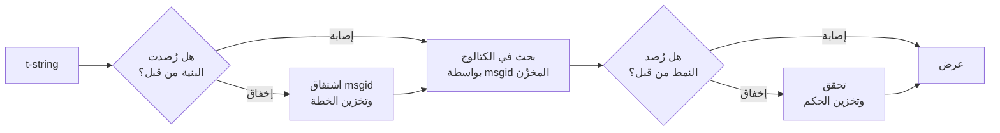

# كيف تعمل

لا شيء في هذه الصفحة مطلوب لاستخدام المكتبة — يغطي
[الدرس التعليمي](tutorial.md) و[الدليل](guide.md) ذلك. هذه الصفحة تعيد بناء
المكتبة من المبادئ الأولى بدلاً من ذلك: ما هي t-string فعلاً، وكيف ينبثق
msgid منها، وما الذي يجعل ترجمةً صحيحة، وكيف يجعل التنفيذ كلَّ ذلك الفحص
يكلف أعشار الميكروثانية. اقرأها إن كنت فضولياً، أو أردت المساهمة، أو كنت
تخطط لأن [تنفذ الاتفاقية بنفسك](#reimplementing-it).

## ما هي t-string فعلاً { #what-a-t-string-actually-is }

تنتج f-string كائن `str`، وتنتجه فوراً — فبحلول وصولها إلى أي دالة تكون
القيمة قد استوفيت والجملة قد أُغلقت. أما t-string ([PEP 750]) فلها الصيغة
نفسها والتقييم الفوري نفسه لتعبيراتها، لكنها تنتج نوعاً مختلفاً:

```pycon
>>> name = "Ada"
>>> f"Hello {name}!"
'Hello Ada!'
>>> t"Hello {name}!"
Template(strings=('Hello ', '!'), interpolations=(Interpolation('Ada', 'name', None, ''),))
```

يحتفظ كائن `Template` ذاك بالأجزاء التي يحتاجها خطُّ أنابيب الكتالوج، وهي
لا تزال منفصلة:

```pycon
>>> template = t"Total: {amount:,.2f}"
>>> template.strings
('Total: ', '')
>>> template.interpolations[0].expression
'amount'
>>> template.interpolations[0].value
1234.5
>>> template.interpolations[0].format_spec
',.2f'
```

- `strings` — النص الحرفي المحيط بالاستيفاءات، بالترتيب.
- ولكل استيفاء: **التعبير** كنص مصدر (`'amount'`)، و**قيمته** المقيّمة
  (`1234.5`)، وأي **تحويل** (`!r`) و**مواصفة تنسيق** (`,.2f`) — محمولةً
  منفصلة بدلاً من مطبّقة.

كل ما تفعله هذه المكتبة هو استهلاك منضبط لتلك البنية. فاللغة أجرت بالفعل
الفصل الوحيد الذي يحتاجه التدويل — النص الثابت بمعزل عن القيم — لذا لا
تحلل المكتبة شيفرة مصدرك أبداً ولا تخمّن أين تقع قيمة داخل جملة. وما يتبقى
ثلاثة قرارات: كيف تصبح البنية مفتاح كتالوج، وما الذي يجوز لترجمة ذلك
المفتاح قوله، وكيف يُعرض الاثنان معاً من جديد.

## من القالب إلى msgid { #from-template-to-msgid }

يُشتق msgid — المفتاح الذي يُفهرس به الكتالوج — من الأجزاء *الثابتة*
للقالب وحدها. سِر على `strings` و`interpolations` بترتيب المصدر؛ وهرّب
أقواس كل مقطع حرفي (`{` تصبح `{{`)؛ وأصدِر لكل استيفاء رمزَ `{name}`
واحداً، حيث `name` هو نص التعبير بعد إزالة الفراغ المحيط به. من
`t"Total: {amount:,.2f}"`:

```text
strings         ('Total: ', '')
interpolations  expression 'amount'   conversion None   format_spec ',.2f'
msgid           'Total: {amount}'
```

ولكل جزء من تلك القاعدة سبب:

- **يجب أن يكون التعبير اسماً بسيطاً** — يحقق `str.isidentifier()` وليس
  كلمة محجوزة في Python. تُرفض `t"Hello {user.name}"` عند موضع الاستدعاء.
  فـmsgid *مفتاح*: يجب أن يخرج متطابقاً في كل تشغيل وكل استخراج، ويقرؤه
  المترجمون، لذا يجب أن يكون العنصر النائب كلمة مستقرة ذات معنى — لا جزءَ
  شيفرة يدعو الكتالوج إلى أن يصبح لغة تعبيرات.
- **لا يدخل التحويل ولا مواصفة التنسيق في msgid أبداً.** لا ينبغي أن يضطر
  المترجمون إلى قراءة `:,.2f`، ولا ينبغي أن تستطيع أي ترجمة تغييره.
  والنتيجة اللازمة تستحق المعرفة: تشديد `:,.2f` إلى `:,.0f` في شيفرتك لا
  يغيّر أي msgid، فلا يُبطل أي ترجمة في أي لغة. فمفتاح الكتالوج يتتبع *ما
  تقوله الجملة*، لا كيف تُنسَّق القيمة.
- **الاسم المكرر يجب أن يكرر تنسيقه تماماً.** تُرفض
  `t"{x:.2f} vs {x:.3f}"`، لأن كلا الظهورين ينهار إلى الرمز نفسه `{x}` وما
  عاد بوسع msgid أن يقول أيَّ تنسيق ينبغي أن يستخدمه العرض.
- **msgid الفارغ لا يُبحث عنه أبداً**، لأن gettext يحجزه لترويسة البيانات
  الوصفية للكتالوج نفسه. تُعرض `t""` بوصفها `""` من دون لمس الكتالوج.

مجموعة القواعد الكاملة، بما فيها الحالات الحدية التي تتخطاها هذه الصفحة،
في [SPEC §2](https://github.com/yhay81/gettext-tstrings/blob/main/SPEC.md).

## ما يجوز للترجمة قوله { #what-a-translation-may-say }

يُحلَّل النمط العائد من كتالوج بواسطة `string.Formatter` — المحلل نفسه
الذي يستخدمه `str.format`. والقواعد مستعارة عمداً لا مخترعة: فالنمط الذي
تقبله هذه المكتبة نمطٌ تفهمه المنظومة الأوسع بالفعل. ثم يُطبَّق فحصان.

**الشكل:** يجب أن يكون كل حقل `{name}` مجرداً. يُرفض التحويل أو مواصفة
التنسيق — بما في ذلك الفارغة صراحةً `{name:}` — كما تُرفض الحقول الموضعية
(`{0}` و`{}`) والأسماء المحاطة بفراغ (`{ name }`). الأخيرة أهم مما تبدو:
يرفض كل من `str.format` وGNU `msgfmt` الصيغة `{ name }`، فقبولها هنا كان
سينتج كتالوجات لا تستطيع أي أداة أخرى في السلسلة التحقق منها.

**الأسماء:** تُقارن مجموعة العناصر النائبة في النمط بمجموعة المصدر.
للرسالة المفردة كل اسم في المصدر *مطلوب* ولا شيء غيره *مسموح*. أما لرسالة
الجمع فيُدمج الفرعان:

- **المسموح** = اتحاد أسماء الفرعين
- **المطلوب** = تقاطعهما

فمقابل `t"One file"` / `t"{n} files"`، الاسم `n` مسموح في ترجمة أي من
الصيغتين لكنه غير مطلوب في أي منهما. هذا اللاتناظر هو ما يتيح لنظام الجمع
في اللغة الهدف أن يختلف عن نظام لغة المصدر — فاليابانية تترجم الفرعين
بصيغة واحدة تستخدم `{n}` على الأرجح؛ واللغة التي لديها صيغ أكثر من
الإنجليزية قد تحتاج `{n}` في صيغة لا تملك الإنجليزية مقابلاً لها.

لا شيء من ذلك افتراضي: فكتالوج واجهة هذا الموقع نفسه يحمل رسالة الجمع
`Built {n} localized page` / `Built {n} localized pages` — فرعين
إنجليزيين — وتترجم إصدارات الموقع هذه الرسالة الواحدة إلى ما يتراوح بين
صيغة واحدة وست صيغ:

| الكتالوج | الصيغ | الترجمات بترتيب الصيغ |
| --- | --- | --- |
| اليابانية | 1 | `ローカライズ済みページを{n}件ビルドしました` |
| التركية | 2 | `{n} yerelleştirilmiş sayfa oluşturuldu` — مرتين بالصيغة نفسها: فالأسماء في التركية تبقى مفردة بعد العدد |
| الإيطالية | 2 | `Generata {n} pagina localizzata` · `Generate {n} pagine localizzate` — يتطابق اسم المفعول في الجنس والعدد |
| اللاتفية | 3 | `Izveidota {n} lokalizēta lapa` · `Izveidotas {n} lokalizētas lapas` · `Izveidots {n} lokalizētu lapu` — الصيغة الثالثة **للصفر وحده** |
| الروسية | 3 | `Собрана {n} локализованная страница` · `Собраны {n} локализованные страницы` · `Собрано {n} локализованных страниц` |
| البولندية | 3 | `Zbudowano {n} zlokalizowaną stronę` · `Zbudowano {n} zlokalizowane strony` · `Zbudowano {n} zlokalizowanych stron` |
| السلوفينية | 4 | `Zgrajena {n} lokalizirana stran` · `Zgrajeni {n} lokalizirani strani` · `Zgrajene {n} lokalizirane strani` · `Zgrajenih {n} lokaliziranih strani` — الثانية **مثنّى**، للاثنين بالضبط |
| الأيرلندية | 5 | `Tógadh {n} leathanach logánaithe` · `Tógadh {n} leathanaigh logánaithe` — للواحد، وللاثنين، ولـ3–6، ولـ7–10، وللبقية؛ يتناوب الجذع لكن *leathanach* تبدأ بحرف `l`، ولا يُكتب على `l` أيٌّ من التغيّرات الاستهلالية في الأيرلندية، فتتطابق عدة صيغ |
| العربية | 6 | من بينها `تم إنشاء صفحة مترجمة واحدة ({n})` عندما يكون العدد واحداً بالضبط و`تم إنشاء {n} صفحات مترجمة` للعدد القليل |

كل صف هو مُدخل حي في `i18n/*/LC_MESSAGES/site.po` في هذا المستودع، يعرضه
[البناء متعدد اللغات](index.md) مع كل إصدار — ويثبّت اختبارٌ هذا الجدول
على تلك الكتالوجات، فلا يمكن أن ينحرف أحدهما عن الآخر.

وضمن تلك الحدود، إعادة الترتيب والتكرار غير مقيدين عمداً. فكلاهما ضرورة
نحوية في لغات حقيقية، وتقييد عدد مرات الظهور كان سيرفض ترجمات صحيحة من
دون أي فائدة أمنية: فالترجمة ما زالت لا تستطيع *تقييم* أي شيء، لأنه لا
يوجد مسار تقييم أصلاً — العناصر النائبة يُبحث عنها بالاسم في قيم القالب
المحسوبة مسبقاً، ولا تُغذَّى أبداً إلى `eval` أو `getattr` أو `str.format`
نفسها.

## العرض { #rendering }

عرضُ نمط تُحُقِّق منه هو سيرٌ على مقاطعه: أصدِر كل جزء حرفي، ولكل عنصر
نائب خذ القيمة الملتقطة في الاستيفاء وطبّق التحويل ومواصفة التنسيق من
*جهة المصدر* — `format(convert(value, conversion), format_spec)`. وأثناء
ذلك تُحفظ ضمانتان:

- **تُنسَّق كل قيمة مميزة مرة واحدة على الأكثر في كل عرض**، حتى عندما تكرر
  الترجمة عنصراً نائباً. فالتكرار يغيّر عدد مرات إدراج النتيجة، لا عدد
  مرات تشغيل `__format__` لديك.
- **في الجمع، يقرأ العنصر النائب الفرعَ الذي عرّفه.** الاسم الموجود في
  الفرعين يقرأ القيمة التي التقطها الفرع الذي تختاره لغة *المصدر*
  (`singular` عندما `n == 1`، وإلا `plural`)؛ والاسم الخاص بفرع واحد يقرأ
  فرعه دائماً، حتى عندما تكون قواعد الجمع في اللغة الهدف قد أتاحته في صيغة
  أخرى.

وعندما يفشل التحقق وقت العرض، ينقسم الرد بحسب من قدّم النمط. فالنمط الذي
جاء من *كتالوج* يتدهور: يُسجَّل تحذير واحد ويُعرض نص المصدر، حفاظاً على
عقد gettext القاضي بأن الكتالوج المعطوب لا يُسقط التطبيق أبداً
([يعرض الدليل الوضعين](guide.md#what-happens-when-a-catalog-is-wrong)).
أما النمط الذي مرره المستدعي مباشرةً — `CompiledTemplate.render` — فيرفع
استثناءً دائماً، لأنه لا وجود لنص مصدر يُتراجع إليه؛ فالتسامح موجود
لعمليات البحث في الكتالوج، لا للوسائط.

## التشخيصات جزء من التصميم { #diagnostics-are-part-of-the-design }

خطأ العنصر النائب يقع عادةً أمام مترجم لا مبرمج، وكثيراً ما يقع في ملف
تكون فيه المشكلة غير مرئية. وقول `{name} is missing` لشخص يرى تلك المحارف
بعينها في محرره طريق مسدود، لذا تُحسب الرسائل وفق ثلاث قواعد:

- الاسم الذي يحتوي **محرفاً خفياً** — مسافة غير فاصلة أنتجتها طريقة
  إدخال، أو مسافة صفرية العرض — يُطبع مع استبدال ذلك المحرف بنقطته
  الرمزية، في موضعه: `{<U+00A0>name}`. فالقارئ يحتاج إلى أن يرى *أين*.
- الاسم الذي **تخلط حروفه أنظمة كتابة** — حالة الأشباه الكتابية
  (homoglyphs) — يُعرض مرتين: مرة مقروءة ومرة مهرَّبة، لأن `{nаme}` بحرف
  `а` سيريلي لا يمكن تمييزه عن `{name}` في الطباعة، والصيغة المهرَّبة
  `(nаme)` هي الهجاء الوحيد الذي يفرّق بينهما.
- وكل ما عدا ذلك يُعرض **كما كُتب**. فـ`{名前}` و`{café}` اسمان عاديان؛
  وتهريبهما كان سيترك القارئ عاجزاً عن إيجاد المقصود.

وعلى المبدأ نفسه، العنصر النائب «المفقود» الذي *يبدو* حاضراً يحصل على
تفسير لغيابه — أقواس كاملة العرض من طريقة إدخال شرق آسيوية، أو مضاعفة
`{{name}}` من جولة تهريب ذهاباً وإياباً، أو الاسم الواقع خارج أي أقواس.
يعرض [جدول قراءة رسائل الخطأ في الدليل](guide.md#reading-a-failure-message)
كل واحدة من هذه الرسائل حرفياً.

## المسار الساخن { #the-hot-path }

كل ما سبق يحدث على كل سلسلة مترجمة يعرضها التطبيق، لذا بُني التنفيذ حول
فكرة واحدة: **التحقق لا يُتخطى أبداً، إذن التحقق هو ما يجب تخزينه
مؤقتاً.**



ثلاث ذواكر مؤقتة، واحدة لكل مرحلة:

- **خطة لكل بنية موضعِ استدعاء.** صفُّ `strings` الخاص بالقالب — كائن
  بناه المفسر بالفعل — هو مفتاح الذاكرة المؤقتة، فلا يخصص البحث أي شيء.
  وعند الإصابة، يظل تعبير كل استيفاء وتحويله ومواصفة تنسيقه تُقارن
  بالمسجّل منها: فموضعا استدعاء يتشاركان النص الحرفي ويختلفان في التنسيق
  (`t"{x:.2f}"` مقابل `t"{x:.3f}"`) يجب ألا يتصادما، وتلك المقارنة هي ثمن
  استخدام مفتاح يسلّمه المفسر مجاناً.
- **حكم لكل نمط.** أول مرة يجيب فيها كتالوج بنمط معين، يُحلَّل ويُتحقق
  منه؛ وتُحفظ النتيجة — خطة عرض مجمّعة، أو سجل بعدم الصلاحية — على الخطة.
  وكل عرض لاحق لتلك الرسالة يصل إليها ببحث قاموسي واحد. والأنماط غير
  الصالحة تُحفظ أيضاً، ولهذا يحذّر إدخال الكتالوج المعطوب مرة واحدة لا
  عند كل عرض.
- **خطة مدموجة لكل زوج جمع**، تحمل مجموعتي الاتحاد والتقاطع كي تجري
  حسابات الفروع مرة واحدة لكل رسالة، لا مرة لكل استدعاء.

كل ذاكرة مؤقتة محدودة الحجم، ولا تحتفظ أي منها *بالقيم* المستوفاة — بنية
ثابتة ونص أنماط لا غير. والنتيجة، مقيسةً بواسطة
[`benchmarks/runtime.py`](https://github.com/yhay81/gettext-tstrings/blob/main/benchmarks/runtime.py):
نحو 0.4 ميكروثانية لرسالة بحقل واحد شاملةً إنشاء t-string نفسها، أي نحو
2.5 ضعف `gettext(...).format(...)` مجردة لا تفحص شيئاً. وتسجّل الشروح في
أعلى
[`core.py`](https://github.com/yhay81/gettext-tstrings/blob/main/src/gettext_tstrings/core.py)
القياسات الفردية الكامنة وراء هذا الشكل.

## إعادة تنفيذها { #reimplementing-it }

لا شيء مما سبق معرفةٌ خاصة: فالاتفاقية مدوّنة بوصفها
[المواصفة v1](spec.md)، وتتيح
[حزمة التوافق](spec.md#conformance) القابلة للقراءة آلياً لمستخرجٍ أو ملحق
IDE أو تنفيذٍ بلغة أخرى أن يتحقق من نفسه أمام كل قاعدة شرحتها هذه الصفحة.
وهذا التنفيذ يشغّل الحزمة في اختباراته، وهو ما يمنع هذه الصفحة والمواصفة
والشيفرة من الانحراف بعضها عن بعض في صمت.

  [PEP 750]: https://peps.python.org/pep-0750/
