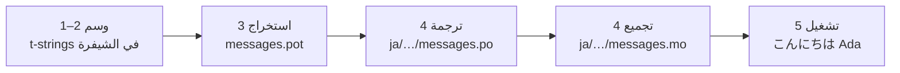

# الدرس التعليمي

تنتقل هذه الصفحة من مجلد فارغ إلى برنامج يلقي التحية باليابانية. خمس
خطوات، من دون افتراض أي خبرة في gettext، ومع عرض كل أمر والمخرجات التي
ينتجها فعلاً — فتعرف عند كل خطوة ما إذا كنت على المسار الصحيح.

تحتاج إلى Python 3.14 أو أحدث، لأن t-strings صيغة جديدة في 3.14.
اليابانية هي اللغة الهدف في مثال هذه الصفحة، لكن لا شيء يعتمد على هذا
الاختيار. ولاستخدام لغة أخرى، استبدل `ja` في الخطوة 4 — فرمز اللغة ذاك هو
الشيء الوحيد الذي يسمّيها.

## 1. التثبيت { #1-install }

```console
python -m pip install "gettext-tstrings[babel]"
```

تجلب إضافة `[babel]` مكتبة [Babel]، وهي الأداة التي تجمع رسائلك في ملفات
كتالوج في الخطوة 3. وهي أداة لوقت التطوير: شيفرة الإنتاج تعرض بالمكتبة
القياسية وحدها.

## 2. وسم رسالة في شيفرتك { #2-mark-a-message-in-your-code }

أنشئ `app.py`:

```python
from gettext_tstrings import tr

name = "Ada"
print(tr(t"Hello {name}"))
```

تبدو `t"Hello {name}"` مثل f-string، لكن البادئة `t` تبقي النص والقيمة
منفصلين بدلاً من دمجهما في الحال. هذا الفصل هو ما يتيح لـ`tr()` البحث عن
ترجمة للجملة الكاملة `Hello {name}` ثم إدراج القيمة بعد ذلك.

شغّله الآن:

```console
$ python app.py
Hello Ada
```

لم تُثبّت أي ترجمات بعد، فيُعرض نص المصدر كما هو. البرنامج الذي يستخدم
هذه المكتبة لا *يتطلب* كتالوجاً كي يعمل أبداً — فالإنجليزية (أو أياً كانت
لغتك المصدرية) هي البديل المدمج.

## 3. استخراج الرسائل { #3-extract-the-messages }

يعمل المترجمون عادةً من الكتالوجات لا من شيفرة المصدر، فيتنقل بينك وبينهم
ملف صغير يسمى **الكتالوج**. والخطوة الأولى نحوه هي جمع كل رسالة موسومة من
الشيفرة.

أخبر Babel كيف يعثر على رسائلك بإنشاء `babel.cfg`:

```ini
[gettext_tstrings: **.py]
encoding = utf-8
```

ثم استخرج إلى ملف قالب (`.pot`):

```console
$ mkdir -p locales
$ pybabel extract -F babel.cfg -c "Translators:" -o locales/messages.pot .
extracting messages from app.py (encoding="utf-8")
writing PO template file to locales/messages.pot
```

يحتوي `locales/messages.pot` الآن على إدخال واحد لكل رسالة:

```po
#. gettext-tstrings
#: app.py:4
#, python-brace-format
msgid "Hello {name}"
msgstr ""
```

`msgid` هو المفتاح الذي ستبحث عنه شيفرتك. أما `msgstr` الفارغ فهو موضع
الترجمة — لكن ليس في هذا الملف: فملف `.pot` *قالب*، والخطوة التالية تنسخه
مرة واحدة لكل لغة.

## 4. الترجمة والتجميع { #4-translate-and-compile }

أنشئ الكتالوج الياباني من القالب:

```console
$ pybabel init -i locales/messages.pot -d locales -l ja
creating catalog locales/ja/LC_MESSAGES/messages.po based on locales/messages.pot
```

افتح `locales/ja/LC_MESSAGES/messages.po` واملأ `msgstr`:

```po
msgid "Hello {name}"
msgstr "こんにちは {name}"
```

أبقِ `{name}` كما هو تماماً — العنصر النائب هو الطريقة التي تجد بها
القيمة موضعها داخل الجملة المترجمة، والترجمة حرة في نقله إلى حيث تحتاجه
اللغة الهدف. في مشروع حقيقي، ملف `.po` هذا هو ما تسلّمه إلى مترجم أو
ترفعه إلى منصة ترجمة؛ والصيغة واحدة في الحالتين.

تُحرر الكتالوجات كنص لكنها تُحمّل بصيغة ثنائية (`.mo`)، فجمّعها:

```console
$ pybabel compile -d locales
compiling catalog locales/ja/LC_MESSAGES/messages.po to locales/ja/LC_MESSAGES/messages.mo
```

هذا الأمر شبكة أمان أيضاً. فلو أتلفت الترجمة العنصر النائب — `{nome}`
بدلاً من `{name}` مثلاً — لرفض النجاح:

```console
$ pybabel compile -d locales
error: locales/ja/LC_MESSAGES/messages.po:24: translation does not match the
source placeholders: {name} is missing; {nome} is not in the source message
1 errors encountered.
```

وثمة تنبيه يحسن معرفته الآن: يُبلغ الأمر عن الخطأ ويخرج بحالة غير صفرية،
لكنه يكتب ملف `.mo` رغم ذلك. وفي مشروع حقيقي، CI هو من عليه التوقف عند حالة
الخروج تلك — و[في الإنتاج](workflow.md#what-ci-gates) يهيئ ذلك.

## 5. التشغيل { #5-run-it }

استخدمت الخطوات 2–4 دالة `tr()` التي تبحث عن كتالوج فلا تجد شيئاً. والآن وقد
صار هناك كتالوج، حمّله واربطه مرة واحدة: يحمل `Translator` كتالوجاً كي لا
تضطر مواضع الاستدعاء إلى تسميته، و`_` هو الاسم المتعارف عليه في gettext
للنتيجة.

وجّه `app.py` إلى الكتالوج المجمّع. انقر على العلامات لترى ما يفعله كل
سطر:

```python
import gettext

from gettext_tstrings import Translator

_ = Translator(gettext.translation("messages", localedir="locales", languages=["ja"]))  # (1)!

name = "Ada"
print(_(t"Hello {name}"))  # (2)!
```

1. تحمّل المكتبة القياسية ملف `.mo` المجمّع، ويربطه `Translator` بمعالج
   قابل للاستدعاء. `_` هو الاسم المتعارف عليه في gettext لعبارة «ترجم
   هذا» — قصير لأنه يظهر على كل نص موجه للمستخدم. وهو يؤدي الترجمة نفسها
   التي تؤديها `tr`، مربوطاً بكتالوج واحد.
2. عند الاستدعاء: يصبح نص t-string مفتاح البحث `Hello {name}`، ويجيب
   الكتالوج بـ`こんにちは {name}`، ويُفحص الجواب مقابل العناصر النائبة في
   المصدر، وعندها فقط تُدرج القيمة.

```console
$ python app.py
こんにちは Ada
```

هذه هي الحلقة كاملة، وتستحق أن تُرى في صورة واحدة:



**وسم ← استخراج ← ترجمة ← تجميع ← تشغيل.** كل ما عداها في هذا الموقع
تفصيل لإحدى هذه الخطوات الخمس.

## إلى أين بعد ذلك { #where-next }

- [لماذا t-strings؟](comparison.md) — ما الذي يحميك منه هذا التصميم،
  مقارنةً بـ`%(name)s` و`.format()` وسلاسل `$`.
- [الدليل](guide.md) — صيغ الجمع، لغة كل طلب، السلاسل المؤجلة، وما يحدث
  وقت التشغيل عندما يكون الكتالوج خاطئاً رغم كل شيء.
- [في الإنتاج](workflow.md) — هذه الحلقة نفسها كما يديرها فريق، أسبوعاً
  بعد أسبوع: تحديث الكتالوجات، وبوابات CI، ومنصات الترجمة.
- [الاستخراج](extraction.md) — مرجع `pybabel` الكامل: أسماء الدوال
  المخصصة، والوضع الصارم في CI، والفحوص التي تحرس كتالوجاتك.
- [الترحيل](migration.md) — إن كان المشروع الذي تريد فعل هذا فيه يملك
  كتالوجات gettext بالفعل.
- [للمترجمين](translators.md) — الصفحة الوحيدة التي تسلّمها لمن يملأ أسطر
  `msgstr` تلك.

  [Babel]: https://babel.pocoo.org/
