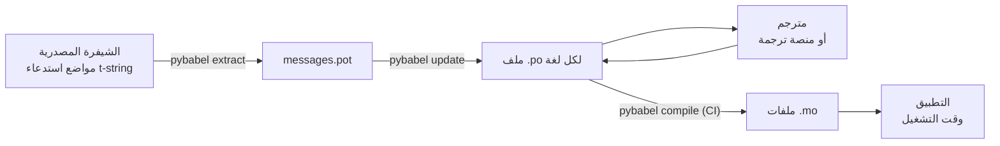

# في الإنتاج

يشغّل [الدرس التعليمي](tutorial.md) الحلقة مرة واحدة، بمفردك، على برنامج
برسالة واحدة. أما في مشروع حقيقي فالحلقة لا تتوقف عن الدوران: تتغير الرسائل
بعد أن تُرجمت، ويعمل المترجم في مكان آخر ووفق جدوله الخاص، ويُشحن كتالوج
مجمّع مع كل إصدار. هذه الصفحة هي تلك الممارسة — ما يبقى في المستودع، وما
يسافر، وما يجب أن تحرسه CI، وأين يربط وقت التشغيل اللغة.

ما ينتهي إليه كل ذلك هو ستة فحوص، وها هي أولاً؛ ويهيّئ كل قسم أدناه واحداً
منها.

- ينجح `pybabel update --check` — لم تتغير أي رسالة من دون أن تسمع
  الكتالوجات بذلك.
- يحرس `pybabel compile` البناء برمز خروجه.
- إدخالات `fuzzy` المتبقية مقصودة — يُعرض كل منها كنص مصدر إلى أن يؤكده
  مترجم.
- تعرض حزمة الاختبارات كل لغة مشحونة مرة واحدة مع `strict=True`.
- يحتوي ناتج الإنتاج على ملفات `.mo` ولا يحتوي على Babel.
- مسجّل `gettext_tstrings` موجّه إلى المراقبة.

## شكل المشروع { #the-shape-of-a-project }

```text
myapp/
├── babel.cfg
├── pyproject.toml
├── src/
│   └── myapp/
└── locales/
    ├── messages.pot
    ├── ja/LC_MESSAGES/messages.po
    └── de/LC_MESSAGES/messages.po
```

أودِع في المستودع `babel.cfg` وقالب `.pot` وكل ملف `.po` — فهي مصادر بناء
الترجمة، وفروقها (diffs) هي الطريقة التي تراجع بها تغييرات الترجمة. أما
ملفات `.mo` المجمّعة فهي نواتج بناء: أنتجها في CI أو عند التحزيم بدلاً من
إيداعها، كي لا يختلف ملف `.po` وملف `.mo` المقابل له أبداً حول ما يُشحن.

ملف واحد له دور في كل اتجاه: يحمل `.pot` رسائلك *خارجاً* إلى المترجمين،
وتحمل ملفات `.po` الترجمات *عائدةً*. وبقية هذه الصفحة هي ما ينتقل بينهما.



## الدورة بعد الترجمة الأولى { #the-cycle-after-the-first-translation }

يُنفَّذ أمر `pybabel init` من الدرس التعليمي عادةً مرة واحدة، عند إضافة لغة.
من ذلك الحين تصبح دورة العمل **استخراج ← تحديث ← ترجمة ← تجميع**، ومركزها
`pybabel update`، الذي يدمج القالب الجديد في الكتالوجات الموجودة من دون
التخلص من الترجمات التي فيها.

لنفترض أن التحية `Hello {name}` — المترجمة بالفعل إلى `こんにちは {name}` —
أعيدت صياغتها في الشيفرة إلى `Welcome back, {name}`. استخرج وحدّث:

```console
$ pybabel extract -F babel.cfg -c "Translators:" -o locales/messages.pot .
extracting messages from app.py (encoding="utf-8")
writing PO template file to locales/messages.pot
$ pybabel update -i locales/messages.pot -d locales
updating catalog locales/ja/LC_MESSAGES/messages.po based on locales/messages.pot
```

يحتوي الكتالوج الياباني الآن على:

```po
#. gettext-tstrings
#: app.py:4
#, fuzzy, python-brace-format
msgid "Welcome back, {name}"
msgstr "こんにちは {name}"
```

لاحظ Babel أن msgid الجديد يشبه واحداً محذوفاً فقرنه بالترجمة القديمة —
لكنه وسم الزوج بعلامة **fuzzy**: تخمينُ آلةٍ ينتظر إنساناً. وهذه العلامة
تغيّر ما يُجمَّع: فأمر `pybabel compile` **يستبعد إدخالات fuzzy من ملف
`.mo`**، فإلى
أن يؤكد مترجمٌ الزوج، يعرض التطبيق النص الإنجليزي الجديد بدلاً من نص ياباني
قديم:

```console
$ pybabel compile -d locales
compiling catalog locales/ja/LC_MESSAGES/messages.po to locales/ja/LC_MESSAGES/messages.mo
$ python app.py
Welcome back, Ada
```

وهكذا تتدهور الرسالة المتغيرة كما تتدهور الرسالة المعطوبة تماماً — إلى لغة
المصدر، لا إلى ترجمة قديمة أبداً. ودور المترجم في الدورة أن يراجع `msgstr`
ويحذف علامة `fuzzy`؛ فيلتقط التجميعُ التالي الإدخالَ.

!!! note "أسماء العناصر النائبة جزء من هوية الرسالة"

    msgid هو مفتاح الكتالوج، و*اسم* العنصر النائب جزء منه — لذا فإن إعادة
    تسمية متغير في الشيفرة (من `name` إلى `user_name`) تغيّر msgid وتعيد
    ترجمته في كل لغة إلى دورة fuzzy من جديد. سمِّ المتغيرات المستوفاة
    بكلمات يفهمها المترجم، ولا تُعِد تسميتها إلا لسبب.

    والتنسيق هو الصورة المعكوسة: `!r` و`:.2f` [ليسا جزءاً من
    msgid](internals.md#from-template-to-msgid)، لذا فإن تشديد
    `{amount:,.2f}` إلى `{amount:,.0f}` لا يغيّر شيئاً في أي كتالوج. أما
    إعادة صياغة *الجملة* نفسها فتغيير حقيقي بالطبع — وتلك هي الدورة أعلاه.

## ما تحرسه CI { #what-ci-gates }

ثلاثة إخفاقات تستحق بناءً أحمر: أن تتخلف الكتالوجات عن الشيفرة، أو أن تتلف
ترجمةٌ عنصراً نائباً، أو أن يتسلل إدخال معطوب إلى وقت التشغيل. خطوة واحدة
لكل إخفاق:

```yaml
- run: pybabel extract -F babel.cfg -c "Translators:" -o locales/messages.pot .
- run: pybabel update -i locales/messages.pot -d locales --check
- run: pybabel compile -d locales
- run: pytest
```

لا يعيد `pybabel update --check` كتابة أي شيء، ويخرج برمز غير صفري عندما
يكون كتالوجٌ متأخراً عن القالب المستخرج للتو — وهو الحارس ضد دمج شيفرة لم
يستخرج أحد رسائلها من جديد. ويشغّل `pybabel compile` فحوص العناصر النائبة
في Babel وفي [المدقق المسجّل](extraction.md#your-existing-toolchain-validates-these-catalogs)
الخاص بهذه الحزمة معاً.

!!! bug "Babel 2.18.0: ‏`--check` لا يستطيع حراسة كتالوج يستخدم السياقات"

    في Babel 2.18.0، يبلّغ `pybabel update --check` عن **كل** كتالوج يحتوي
    على `msgctxt` بأنه متأخر، في كل تشغيل، مهما كان محدَّثاً. والبوابة التي
    تُخفق دائماً أسوأ من غياب البوابة، لأن الفريق يوقفها — لذا إن كنت
    تستخدم `pgettext` أو `npgettext` أصلاً، فاستبدل هذه الخطوة بدلاً من
    التعايش معها. فقراءة القالب وكل كتالوج بـ`babel.messages.pofile.read_po`
    ومقارنة `{(m.context, m.id) for m in catalog if m.id}` هي الفحص كله،
    وهو ما يفعله [بناء هذا الموقع نفسه](index.md). أما السبب فهو
    [موثَّق في صفحة المزالق](pitfalls.md#your-tools-have-bugs-too).

!!! danger "افحص رمز الخروج لا السجل"

    يبلّغ `pybabel compile` عن كل خطأ في العناصر النائبة، ويخرج برمز غير
    صفري — **ويكتب ملف `.mo` رغم ذلك**. فخط الأنابيب الذي يجمّع ثم ينسخ
    `locales/` إلى صورة يشحن الكتالوج المعطوب ما لم يوقفه رمز الخروج غير
    الصفري فعلاً. ترك الخطوة تُفشل البناء، كما في المثال أعلاه، هو الإصلاح
    كله.

السطر الأخير هو حزمة اختباراتك المعتادة، مع عادة واحدة مضافة: في مكان ما
منها، اعرض رسالة واحدة على الأقل لكل لغة مشحونة عبر مترجم صارم —

```python
import gettext

from gettext_tstrings import Translator


def test_catalogs_render(language: str) -> None:
    translations = gettext.translation("messages", localedir="locales", languages=[language])
    _ = Translator(translations, strict=True)
    name = "Ada"
    assert _(t"Welcome back, {name}")
```

— لأن `strict=True` [يرفع استثناءً حيث كان الإنتاج سيتراجع
بصمت](guide.md#what-happens-when-a-catalog-is-wrong)، ولأن العرض وقت
التشغيل هو الفحص الوحيد الذي يرى الكتالوج تماماً كما سيراه التطبيق، بملف
`.mo` وكل شيء.

## العمل مع المترجمين والمنصات { #working-with-translators-and-platforms }

ملف `.po` هو صيغة التبادل في عالم gettext كله، وهذا هو سبب إعادة استخدام
هذه المكتبة له: تسليم الترجمة يعني تسليم ملف، سواء كان المستلم زميلاً لديه
محرر PO أو منصة مثل Weblate أو Crowdin. ثلاثة أشياء تجعل التسليم ناجحاً:

**قل ما الغرض من الرسالة.** التعليق في الشيفرة يسافر مع الرسالة — وهذا ما
يجمعه الخيار `-c "Translators:"`:

```python
from gettext_tstrings import tr

name = "Ada"
# Translators: shown on the dashboard right after sign-in
print(tr(t"Welcome back, {name}"))
```

```po
#. Translators: shown on the dashboard right after sign-in
#. gettext-tstrings
#: app.py:5
#, python-brace-format
msgid "Welcome back, {name}"
msgstr ""
```

يرى المترجم ذلك التعليق في محرره، بجوار الرسالة، في الطرف الآخر من العالم.
إنها أرخص رافعة جودة في سير العمل كله. وللكلمة التي هي جناسٌ لنفسها —
"Open" الزر مقابل "Open" الحالة — امنح الرسالة
[سياقاً](guide.md#binding-a-catalog) عبر `pgettext`، فيصبح `msgctxt`
ظاهراً في الكتالوج.

**دع المنصة تتحقق من العناصر النائبة.** كل رسالة مستخرجة من t-string تحمل
العلامة `python-brace-format`، وهذا السطر الواحد هو ما يشغّل ضمان جودة
العناصر النائبة في أدوات لا تتحكم فيها — توثّق Weblate هذا الفحص، وتبني
المنصات التجارية فحوصها على العلامة نفسها، ويفرضه `msgfmt --check-format`
في أي خط أنابيب GNU. التفاصيل، وما يلتقطه المدقق المرفق فوق ذلك، على
[صفحة الاستخراج](extraction.md#your-existing-toolchain-validates-these-catalogs).

**ثق بشبكة الأمان بقدر مداها بالضبط.** كل ما يعود من منصة يظل بيانات تدخل
بناءك؛ وبوابات CI أعلاه هي ما يحوّل «الأرجح أن المنصة فحصت هذا» إلى «لا
يمكن أن يُشحن هذا معطوباً».

## ربط لغة وقت التشغيل { #binding-a-language-at-runtime }

كل ما سبق ينتج كتالوجات. القرار المتبقي هو أين يختار التطبيق واحداً منها.
اربط مرة واحدة لكل *نطاق للغة* — العملية في أداة سطر الأوامر، والطلب في
خدمة الويب.

=== "عملية واحدة، لغة واحدة"

    تقرأ أداة سطر الأوامر أو تطبيق سطح المكتب بيئة المستخدم مرة واحدة، عند
    الإقلاع. تركُ `languages=` من دون تمرير يدع المكتبة القياسية تتفاوض
    انطلاقاً من `LANGUAGE` و`LC_ALL` و`LC_MESSAGES` و`LANG`؛ ويعيد
    `fallback=True` كتالوجاً فارغاً — أي نص المصدر — بدلاً من رفع استثناء
    عندما لا يطابق أيٌّ منها كتالوجاً تشحنه.

    ```python
    import gettext

    from gettext_tstrings import Translator

    _ = Translator(gettext.translation("messages", localedir="locales", fallback=True))

    name = "Ada"
    print(_(t"Welcome back, {name}"))
    ```

=== "Flask"

    يقرر تطبيق الويب لكل طلب. حمّل كل كتالوج مرة واحدة عند الاستيراد، ثم
    اربط الكتالوج المتفاوض عليه بالسياق قبل تشغيل دالة العرض —
    [`set_translations`](guide.md#per-request-language) محلي السياق، فلا
    ترى الطلبات المتزامنة بلغات مختلفة ربط بعضها البعض أبداً.

    ```python
    import gettext

    from flask import Flask, request

    from gettext_tstrings import set_translations, tr

    LANGUAGES = ("en", "ja", "de")
    CATALOGS = {
        language: gettext.translation(
            "messages", localedir="locales", languages=[language], fallback=True
        )
        for language in LANGUAGES
    }

    app = Flask(__name__)


    @app.before_request
    def bind_language() -> None:
        language = request.accept_languages.best_match(LANGUAGES) or "en"
        set_translations(CATALOGS[language])


    @app.get("/")
    def home() -> str:
        name = "Ada"
        return tr(t"Welcome back, {name}")
    ```

=== "وسيط ASGI"

    تحت أطر العمل غير المتزامنة — FastAPI وStarlette وكل ما هو ASGI — لُفّ
    الطلب داخل [`use_translations`](guide.md#per-request-language): يعيش
    الربط في `ContextVar`، الذي يحفظه تبديل المهام غير المتزامنة لكل طلب
    على حدة.

    ```python
    import gettext

    from fastapi import FastAPI, Request

    from gettext_tstrings import tr, use_translations

    LANGUAGES = ("en", "ja", "de")
    CATALOGS = {
        language: gettext.translation(
            "messages", localedir="locales", languages=[language], fallback=True
        )
        for language in LANGUAGES
    }

    app = FastAPI()


    @app.middleware("http")
    async def bind_language(request: Request, call_next):
        language = negotiate_language(request.headers.get("accept-language"), LANGUAGES)
        with use_translations(CATALOGS[language]):
            return await call_next(request)
    ```

    ينوب `negotiate_language` عن تحليل Accept-Language لديك — فمعظم أطر
    العمل أو منظوماتها توفر واحداً؛ المهم هنا هو الربط حول `call_next`.

عادتان في وقت التشغيل تكملان الصورة. السلاسل المنشأة عند الاستيراد — تسمية
نموذج، أو اسم العرض لعنصر enum — يجب ألا تلتقط أياً كانت اللغة الفعالة
أثناء الاستيراد؛ عرّفها بواسطة
[`lazy_gettext`](guide.md#deferred-translation) فتُعرض باللغة الفعالة وقت
*الاستخدام*. ووجّه مسجّل `gettext_tstrings` إلى مكان ينظر فيه إنسان:
تحذيراته هي الوضع المتسامح وهو يبلّغ عن ترجمة تسللت عبر كل بوابة، بسطر واحد
لكل رسالة معطوبة لا بسطر لكل عرض.

## الشحن { #shipping }

يحتاج الإنتاج إلى الحزمة وملفات `.mo` ولا شيء غير ذلك. Babel تبعية للتطوير
وCI — أبقِ `gettext-tstrings[babel]` خارج صورة الإنتاج وثبّت هناك الحزمة
المجردة؛ فالعرض يعمل بالمكتبة القياسية وحدها. جمّع الكتالوجات في البناء
نفسه الذي ينتج الناتج الذي تنشره، فتكون ملفات `.mo` داخله هي بالضبط ملفات
`.po` المراجعة، ولا يُشحن أبداً شيء جُمّع على حاسوب أحدهم المحمول.

أما كيفية سفرها فتتوقف على ما تنشره. العجلة (wheel) تحملها بوصفها بيانات
حزمة، ما يعني أن على الكتالوجات أن تعيش *داخل* دليل الحزمة —
`src/myapp/locales/` لا `locales/` في الجذر — وأن يُبلَّغ الواجهةَ الخلفيةَ
للبناء بتضمين ملفات يخفيها `.gitignore` عادةً:

=== "Hatchling"

    ```toml
    [tool.hatch.build]
    # .mo files are build output, so they are gitignored; name them or the
    # wheel ships without a single translation.
    artifacts = ["src/myapp/locales/**/*.mo"]
    ```

=== "setuptools"

    ```toml
    [tool.setuptools.package-data]
    myapp = ["locales/*/LC_MESSAGES/*.mo"]
    ```

واقرأها عبر الحزمة لا عبر مسار نسبي إلى شجرة المصدر، فذلك المسار يزول لحظة
تثبيت العجلة:

```python
import gettext
from importlib.resources import as_file, files

with as_file(files("myapp") / "locales") as localedir:
    translations = gettext.translation("messages", localedir=localedir, languages=["ja"])
```

ومهمة صورة الحاوية أيسر: جمّع أثناء مرحلة البناء وانسخ الناتج، تاركاً Babel
خلفك في تلك المرحلة.

```dockerfile
FROM python:3.14-slim AS build
COPY . /src
RUN cd /src && python -m pip install ".[babel]" \
    && pybabel compile -d src/myapp/locales

FROM python:3.14-slim
COPY --from=build /src /src
RUN python -m pip install /src   # no [babel]: rendering needs the stdlib only
```

قبل الإصدار، هذه هي قائمة التحقق التي تُختزل إليها هذه الصفحة:

- ينجح `pybabel update --check` — لم تتغير أي رسالة من دون أن تسمع
  الكتالوجات بذلك.
- يحرس `pybabel compile` البناء برمز خروجه.
- إدخالات `fuzzy` المتبقية مقصودة — يُعرض كل منها كنص مصدر إلى أن يؤكده
  مترجم.
- تعرض حزمة الاختبارات كل لغة مشحونة مرة واحدة مع `strict=True`.
- يحتوي ناتج الإنتاج على ملفات `.mo` ولا يحتوي على Babel.
- مسجّل `gettext_tstrings` موجّه إلى المراقبة.

## إلى أين بعد ذلك { #where-next }

- [الاستخراج](extraction.md) — مرجع الشق الأداتي من هذه الصفحة: خيارات
  التعيين، وأسماء الدوال المخصصة، والوضع الصارم، وكل مدقق.
- [الدليل](guide.md) — الشق الخاص بوقت التشغيل: صيغ الجمع، والسياقات،
  والسلاسل المؤجلة، وأنماط الفشل بالتفصيل.
- [كيف تعمل](internals.md) — لماذا يبدو msgid على هذا الشكل، وما الذي
  يفحصه التحقق فعلاً.
