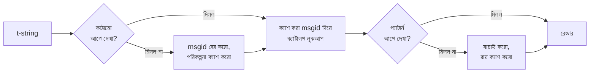

# এটি কীভাবে কাজ করে

এই পৃষ্ঠার কিছুই লাইব্রেরিটি ব্যবহার করার জন্য দরকারি নয় —
[টিউটোরিয়াল](tutorial.md) ও [গাইড](guide.md) সেটুকু ঢেকে দেয়। এই পৃষ্ঠা বরং
লাইব্রেরিটিকে গোড়া থেকে নতুন করে গড়ে: একটি t-string আসলে কী, তার থেকে একটি
msgid কীভাবে বেরিয়ে আসে, কোন জিনিস একটি অনুবাদকে বৈধ করে, আর বাস্তবায়ন
কীভাবে ওই সব যাচাইয়ের খরচ মাইক্রোসেকেন্ডের দশমাংশে নামিয়ে আনে। পড়ুন যদি
কৌতূহল হয়, যদি অবদান রাখতে চান, কিংবা যদি
[রীতিটি নিজে বাস্তবায়ন করার](#reimplementing-it) পরিকল্পনা থাকে।

## একটি t-string আসলে কী { #what-a-t-string-actually-is }

একটি f-string একটি `str` তৈরি করে, আর তা করে সঙ্গে সঙ্গেই — কোনও ফাংশন তাকে
পাওয়ার আগেই মান ইন্টারপোলেট হয়ে গেছে আর বাক্যটি সিল হয়ে গেছে। একটি t-string
([PEP 750])-এর সিনট্যাক্স একই, তার এক্সপ্রেশনগুলির তৎক্ষণাৎ মূল্যায়নও একই,
কিন্তু সে তৈরি করে অন্য একটি টাইপ:

```pycon
>>> name = "Ada"
>>> f"Hello {name}!"
'Hello Ada!'
>>> t"Hello {name}!"
Template(strings=('Hello ', '!'), interpolations=(Interpolation('Ada', 'name', None, ''),))
```

সেই `Template` অবজেক্ট ক্যাটালগ পাইপলাইনের যে অংশগুলি দরকার, তাদের আলাদা
রেখেই ধরে রাখে:

```pycon
>>> template = t"Total: {amount:,.2f}"
>>> template.strings
('Total: ', '')
>>> template.interpolations[0].expression
'amount'
>>> template.interpolations[0].value
1234.5
>>> template.interpolations[0].format_spec
',.2f'
```

- `strings` — ইন্টারপোলেশনগুলির চারপাশের আক্ষরিক টেক্সট, ক্রম অনুযায়ী।
- প্রতিটি ইন্টারপোলেশনের জন্য: সোর্স টেক্সট হিসেবে **এক্সপ্রেশন**
  (`'amount'`), তার মূল্যায়িত **মান** (`1234.5`), আর যেকোনও **কনভার্শন**
  (`!r`) ও **ফরম্যাট স্পেক** (`,.2f`) — প্রয়োগ না করে আলাদাভাবে বহন করা।

এই লাইব্রেরি যা কিছু করে, সবই ওই কাঠামোটির শৃঙ্খলাবদ্ধ ব্যবহার। ভাষা
ইতিমধ্যেই i18n-এর দরকারি সেই একটিমাত্র বিভাজন করে দিয়েছে — স্থির টেক্সট আর
মান আলাদা — তাই লাইব্রেরি কখনও আপনার সোর্স কোড parse করে না আর কখনও আন্দাজ
করে না বাক্যের ভিতরে মানটি কোথায় বসে। বাকি থাকে তিনটি সিদ্ধান্ত: কাঠামোটি
কীভাবে ক্যাটালগ কী হয়ে ওঠে, সেই কী-এর একটি অনুবাদ কী বলতে পারে, আর দুটি
কীভাবে আবার একসঙ্গে রেন্ডার হয়।

## টেমপ্লেট থেকে msgid { #from-template-to-msgid }

একটি msgid — যে কী দিয়ে ক্যাটালগ সূচিবদ্ধ — উদ্ভূত হয় কেবল টেমপ্লেটের
*স্থির* অংশগুলি থেকে। সোর্স ক্রমে `strings` ও `interpolations` ধরে হাঁটুন;
প্রতিটি আক্ষরিক খণ্ডে বন্ধনী escape করুন (`{` হয়ে যায় `{{`); প্রতিটি
ইন্টারপোলেশনের জন্য একটি করে `{name}` টোকেন দিন, যেখানে `name` হল চারপাশের
হোয়াইটস্পেস ছেঁটে ফেলা এক্সপ্রেশন টেক্সট। `t"Total: {amount:,.2f}"` থেকে:

```text
strings         ('Total: ', '')
interpolations  expression 'amount'   conversion None   format_spec ',.2f'
msgid           'Total: {amount}'
```

সেই নিয়মের প্রতিটি অংশের একটি করে কারণ আছে:

- **এক্সপ্রেশনকে সরল নাম হতেই হবে** — `str.isidentifier()` সত্য আর সেটি
  Python কীওয়ার্ড নয়। `t"Hello {user.name}"` কল-সাইটেই প্রত্যাখ্যাত হয়। একটি
  msgid একটি *কী*: প্রতিবার চললে আর প্রতিবার এক্সট্র্যাক্ট করলে তাকে হুবহু
  একই বেরোতে হবে, আর অনুবাদকেরা তাকে পড়েন, তাই placeholder-কে হতে হবে একটি
  স্থিতিশীল, অর্থবহ শব্দ — কোনও কোড-টুকরো নয়, যা ক্যাটালগকে এক্সপ্রেশন ভাষা
  হয়ে উঠতে ডাক দেয়।
- **কনভার্শন ও ফরম্যাট স্পেক কখনও msgid-এ ঢোকে না।** অনুবাদকদের `:,.2f` পড়তে
  হবে না, আর কোনও অনুবাদেরও তা বদলাতে পারা উচিত নয়। এর অনুসিদ্ধান্তটি জেনে
  রাখার মতো: নিজের কোডে `:,.2f`-কে `:,.0f` করে আঁটসাঁট করলে কোনও msgid বদলায়
  না, তাই কোনও ভাষার কোনও অনুবাদও বাতিল হয় না। ক্যাটালগ কী *বাক্যটি কী বলছে*
  তার হিসাব রাখে, মানটি কীভাবে ফরম্যাট হচ্ছে তার নয়।
- **পুনরাবৃত্ত একটি নামকে তার ফরম্যাটিং হুবহু পুনরাবৃত্তি করতেই হবে।**
  `t"{x:.2f} vs {x:.3f}"` প্রত্যাখ্যাত, কারণ দুটি উপস্থিতিই একই `{x}` টোকেনে
  মিশে যায় আর msgid তখন আর বলতে পারত না রেন্ডারের কোন ফরম্যাটিং ব্যবহার করা
  উচিত।
- **খালি msgid কখনও খোঁজা হয় না**, কারণ gettext সেটি ক্যাটালগের নিজের
  মেটাডেটা হেডারের জন্য সংরক্ষিত রেখেছে। `t""` ক্যাটালগ না ছুঁয়েই `""`
  হিসেবে রেন্ডার হয়।

এই পৃষ্ঠা যেসব প্রান্তিক ক্ষেত্র বাদ দিয়েছে তা-সহ সম্পূর্ণ নিয়মাবলি আছে
[SPEC §2](https://github.com/yhay81/gettext-tstrings/blob/main/SPEC.md)-এ।

## একটি অনুবাদ কী বলতে পারে { #what-a-translation-may-say }

ক্যাটালগ থেকে ফেরা একটি প্যাটার্ন parse হয় `string.Formatter` দিয়ে —
`str.format` যে parser ব্যবহার করে, সেই একই। ব্যাকরণটি ইচ্ছে করেই উদ্ভাবন না
করে ধার করা: এই লাইব্রেরি যে প্যাটার্ন গ্রহণ করে, বৃহত্তর ইকোসিস্টেম আগে
থেকেই তা বোঝে। তারপর দুটি যাচাই প্রযোজ্য।

**আকার:** প্রতিটি ফিল্ডকে খালি `{name}` হতে হবে। কনভার্শন বা ফরম্যাট স্পেক —
স্পষ্টভাবে খালি `{name:}`-ও — প্রত্যাখ্যাত, তেমনই অবস্থানভিত্তিক ফিল্ড
(`{0}`, `{}`) আর হোয়াইটস্পেস-ঘেরা নাম (`{ name }`)। শেষেরটি দেখতে যতটা মনে
হয় তার চেয়ে বেশি গুরুত্বপূর্ণ: `str.format` ও GNU `msgfmt` দুইই `{ name }`
প্রত্যাখ্যান করে, তাই এখানে তা মেনে নিলে এমন ক্যাটালগ তৈরি হত যা শৃঙ্খলের আর
কোনও টুলই যাচাই করতে পারত না।

**নাম:** প্যাটার্নের placeholder-সেটকে উৎসেরটির সঙ্গে মিলিয়ে দেখা হয়।
একবচন বার্তায় উৎসের প্রতিটি নাম *আবশ্যক* আর আর কিছুই *অনুমোদিত* নয়। বহুবচন
বার্তায় দুটি শাখা মিলিয়ে নেওয়া হয়:

- **অনুমোদিত** = দুই শাখার নামগুলির union
- **আবশ্যক** = তাদের intersection

তাই `t"One file"` / `t"{n} files"`-এর বিপরীতে `n` নামটি যেকোনও রূপের অনুবাদে
অনুমোদিত, কিন্তু কোনওটিতেই আবশ্যক নয়। ওই অসমতাই লক্ষ্য ভাষার বহুবচন ব্যবস্থাকে
উৎসের থেকে আলাদা হতে দেয় — জাপানি দুই শাখাকেই একটি রূপে অনুবাদ করে, যা সম্ভবত
`{n}` ব্যবহার করে; ইংরেজির চেয়ে বেশি রূপওয়ালা কোনও ভাষার এমন রূপে `{n}`
দরকার হতে পারে যেখানে ইংরেজির কোনও রূপই নেই।

এর কিছুই কাল্পনিক নয়: এই সাইটের নিজের chrome ক্যাটালগেই আছে বহুবচন বার্তা
`Built {n} localized page` / `Built {n} localized pages` — দুটি ইংরেজি শাখা —
আর সাইটের সংস্করণগুলি সেই একটি বার্তাকেই এক থেকে ছয়টি পর্যন্ত রূপে অনুবাদ
করে:

| ক্যাটালগ | রূপ | অনুবাদগুলি, রূপের ক্রমে |
| --- | --- | --- |
| জাপানি | 1 | `ローカライズ済みページを{n}件ビルドしました` |
| তুর্কি | 2 | `{n} yerelleştirilmiş sayfa oluşturuldu` — দুবার, হুবহু একই: সংখ্যার পরে তুর্কি বিশেষ্য একবচনেই থাকে |
| ইতালীয় | 2 | `Generata {n} pagina localizzata` · `Generate {n} pagine localizzate` — কৃদন্তটি লিঙ্গ ও বচনে মেলে |
| রুশ | 3 | `Собрана {n} локализованная страница` · `Собраны {n} локализованные страницы` · `Собрано {n} локализованных страниц` |
| পোলিশ | 3 | `Zbudowano {n} zlokalizowaną stronę` · `Zbudowano {n} zlokalizowane strony` · `Zbudowano {n} zlokalizowanych stron` |
| আরবি | 6 | তাদের মধ্যে ঠিক একটির জন্য `تم إنشاء صفحة مترجمة واحدة ({n})` আর কয়েকটির জন্য `تم إنشاء {n} صفحات مترجمة` |

প্রতিটি সারিই এই রিপোজিটরির `i18n/*/LC_MESSAGES/site.po`-তে একটি জীবন্ত
এন্ট্রি, যাকে [বহুভাষিক বিল্ড](index.md) প্রতিটি রিলিজে রেন্ডার করে — আর
একটি টেস্ট এই টেবিলটিকে সেই ক্যাটালগগুলির সঙ্গে গেঁথে রাখে, যাতে দুটি কখনও
আলাদা হয়ে যেতে না পারে।

ওই সীমানার ভিতরে পুনর্বিন্যাস ও পুনরাবৃত্তি ইচ্ছাকৃতভাবেই অনিয়ন্ত্রিত। দুটিই
বাস্তব ভাষায় ব্যাকরণগতভাবে প্রয়োজনীয়, আর উপস্থিতির সংখ্যা বেঁধে দিলে কোনও
নিরাপত্তা-লাভ ছাড়াই সঠিক অনুবাদ প্রত্যাখ্যাত হত: একটি অনুবাদ তবু কিছুই
*মূল্যায়ন* করতে পারে না, কারণ মূল্যায়নের কোনও পথই নেই — placeholder-গুলি
টেমপ্লেটের আগে থেকেই হিসেব করা মানের মধ্যে নাম ধরে খোঁজা হয়, কখনও `eval`,
`getattr` বা `str.format`-এর হাতে তুলে দেওয়া হয় না।

## রেন্ডারিং { #rendering }

যাচাই হয়ে যাওয়া একটি প্যাটার্ন রেন্ডার করা মানে তার খণ্ডগুলি ধরে হাঁটা:
প্রতিটি আক্ষরিক অংশ ছেড়ে দিন, আর প্রতিটি placeholder-এর জন্য ইন্টারপোলেশনের
ধরে রাখা মানটি নিয়ে *উৎস-দিকের* কনভার্শন ও ফরম্যাট স্পেক প্রয়োগ করুন —
`format(convert(value, conversion), format_spec)`। করার সময় দুটি নিশ্চয়তা
রক্ষা করা হয়:

- **প্রতিটি স্বতন্ত্র মান প্রতি রেন্ডারে বড়জোর একবারই ফরম্যাট হয়**, এমনকি
  অনুবাদ কোনও placeholder পুনরাবৃত্তি করলেও। পুনরাবৃত্তি বদলায় ফলটি কতবার
  বসানো হবে, আপনার `__format__` কতবার চলবে তা নয়।
- **বহুবচনে একটি placeholder সেই শাখাটিই পড়ে যে তাকে সংজ্ঞায়িত করেছে।**
  দুই শাখাতেই আছে এমন একটি নাম *উৎস* ভাষা যে শাখাটি বাছে সেটির ধরা মানই পড়ে
  (`n == 1` হলে `singular`, নইলে `plural`); শাখা-নির্দিষ্ট একটি নাম সর্বদা
  নিজের শাখাটিই পড়ে, এমনকি লক্ষ্য ভাষার বহুবচন নিয়ম তাকে অন্য রূপে উপলব্ধ
  করে তুললেও।

রেন্ডারের সময় যাচাই ব্যর্থ হলে প্রতিক্রিয়া ভাগ হয়ে যায় প্যাটার্নটি কে
জুগিয়েছে তার ভিত্তিতে। কোনও *ক্যাটালগ* থেকে আসা প্যাটার্ন নেমে আসে: একটি
সতর্কবার্তা লগ করে উৎস টেক্সট রেন্ডার করে, gettext-এর সেই চুক্তি রক্ষা করে যে
ভাঙা ক্যাটালগ কখনও অ্যাপ্লিকেশনকে ফেলে দেয় না
([গাইড দুটি মোডই দেখায়](guide.md#what-happens-when-a-catalog-is-wrong))।
কলার সরাসরি যে প্যাটার্ন পাঠিয়েছেন — `CompiledTemplate.render` — সেটি সর্বদা
এক্সেপশন তোলে, কারণ নেমে আসার মতো কোনও উৎস টেক্সট *নেই*; শিথিলতা আছে ক্যাটালগ
লুকআপের জন্য, আর্গুমেন্টের জন্য নয়।

## ডায়াগনস্টিকস নকশারই অংশ { #diagnostics-are-part-of-the-design }

placeholder-এর ত্রুটি সচরাচর প্রোগ্রামারের নয়, একজন অনুবাদকের সামনে এসে পড়ে,
আর প্রায়ই এমন একটি ফাইলে যেখানে সমস্যাটি অদৃশ্য। যিনি নিজের এডিটরে ঠিক ওই
অক্ষরগুলিই দেখতে পাচ্ছেন তাঁকে `{name} is missing` বলা একটি অন্ধগলি, তাই
বার্তাগুলি তিনটি নিয়ম মেনে হিসেব করা হয়:

- যে নামে কোনও **অদৃশ্য অক্ষর** আছে — কোনও input method-এর তৈরি একটি no-break
  space, একটি zero-width space — তাকে ছাপা হয় ওই অক্ষরটির জায়গায় তার code
  point বসিয়ে: `{<U+00A0>name}`। পাঠকের দেখা দরকার *কোথায়*।
- যে নামের অক্ষরগুলি **একাধিক লিখনপদ্ধতি মেশায়**, অর্থাৎ homoglyph-এর
  ক্ষেত্র, তাকে দুবার দেখানো হয় — একবার পাঠযোগ্যভাবে, একবার escape করে —
  কারণ সিরিলিক `а`-সহ `{nаme}` ছাপায় `{name}` থেকে আলাদা করা যায় না, আর
  escape করা রূপ `(nаme)`-ই একমাত্র বানান যা দুটিকে চিনিয়ে দেয়।
- বাকি সবই দেখানো হয় **যেমন লেখা তেমন**। `{名前}` ও `{café}` সাধারণ নাম;
  সেগুলি escape করলে পাঠক কী বোঝানো হয়েছে তা আর খুঁজেই পেতেন না।

একই নীতিতে, যে "অনুপস্থিত" placeholder-টিকে উপস্থিত বলে *মনে হয়*, তার
অনুপস্থিতির ব্যাখ্যাও দেওয়া হয় — কোনও পূর্ব এশীয় input method থেকে আসা
পূর্ণ-প্রস্থ বন্ধনী, escape-এর যাওয়া-আসায় `{{name}}` হয়ে দ্বিগুণ হওয়া, বা
কোনও বন্ধনীর বাইরে থাকা নাম।
[গাইডের ব্যর্থতা-পড়ার টেবিল](guide.md#reading-a-failure-message) এদের প্রতিটি
বার্তা হুবহু দেখায়।

## হট পাথ { #the-hot-path }

উপরের সবকিছুই একটি অ্যাপ্লিকেশনের রেন্ডার করা প্রতিটি অনূদিত স্ট্রিংয়ে ঘটে,
তাই বাস্তবায়নটি একটি ভাবনার চারপাশে গড়া: **যাচাই কখনও বাদ দেওয়া হয় না, তাই
ক্যাশ করতে হবে যাচাইকেই।**



তিনটি ক্যাশ, প্রতি ধাপে একটি:

- **প্রতি কল-সাইট কাঠামোয় একটি পরিকল্পনা।** টেমপ্লেটের `strings` টাপল —
  ইন্টারপ্রেটার যে অবজেক্টটি আগেই বানিয়ে ফেলেছে — সেটিই ক্যাশ কী, তাই একটি
  লুকআপ কিছুই allocate করে না। মিলে গেলেও প্রতিটি ইন্টারপোলেশনের এক্সপ্রেশন,
  কনভার্শন ও ফরম্যাট স্পেক নথিভুক্তগুলির সঙ্গে মিলিয়ে দেখা হয়: যে দুটি
  কল-সাইটের আক্ষরিক টেক্সট এক কিন্তু ফরম্যাটিং আলাদা (`t"{x:.2f}"` বনাম
  `t"{x:.3f}"`), তাদের সংঘর্ষ হওয়া চলবে না, আর ইন্টারপ্রেটার বিনামূল্যে যে কী
  হাতে তুলে দেয় তা ব্যবহারের দাম ওই তুলনাটুকুই।
- **প্রতি প্যাটার্নে একটি রায়।** কোনও ক্যাটালগ প্রথমবার একটি নির্দিষ্ট
  প্যাটার্ন দিয়ে উত্তর দিলে সেটি parse ও যাচাই হয়; ফলাফল — একটি কম্পাইল করা
  রেন্ডার পরিকল্পনা, বা অবৈধতার একটি নথি — পরিকল্পনার সঙ্গে রেখে দেওয়া হয়।
  সেই বার্তার পরের প্রতিটি রেন্ডার একটি ডিকশনারি লুকআপেই তার নাগাল পায়।
  অবৈধ প্যাটার্নও মনে রাখা হয়, আর সেই কারণেই একটি ভাঙা ক্যাটালগ এন্ট্রি
  প্রতি রেন্ডারে নয়, একবারই সতর্ক করে।
- **প্রতি বহুবচন জোড়ায় একটি মিলিত পরিকল্পনা**, যা union/intersection সেটগুলি
  ধরে রাখে, যাতে শাখার হিসেবটুকু প্রতি কলে নয়, প্রতি বার্তায় একবারই হয়।

প্রতিটি ক্যাশই সীমাবদ্ধ, আর কোনওটিই ইন্টারপোলেট করা *মান* ধরে রাখে না — কেবল
স্থির কাঠামো আর প্যাটার্ন টেক্সট।
[`benchmarks/runtime.py`](https://github.com/yhay81/gettext-tstrings/blob/main/benchmarks/runtime.py)
দিয়ে মাপা ফল: একটি এক-ফিল্ড বার্তায় t-string নিজে তৈরি করা ধরে মোটামুটি
0.4 µs, অর্থাৎ কিছুই যাচাই করে না এমন একটি সাদামাটা
`gettext(...).format(...)`-এর প্রায় ২.৫ গুণ।
[`core.py`](https://github.com/yhay81/gettext-tstrings/blob/main/src/gettext_tstrings/core.py)-এর
মাথায় থাকা মন্তব্যে সেই আকৃতির পিছনের আলাদা আলাদা মাপগুলি লেখা আছে।

## এটি নতুন করে বাস্তবায়ন করা { #reimplementing-it }

উপরের কিছুই গোপন বিদ্যা নয়: রীতিটি লিখিত আছে [spec v1](spec.md) হিসেবে, আর
তার মেশিন-পাঠযোগ্য [কনফরম্যান্স সুইট](spec.md#conformance) কোনও
এক্সট্র্যাক্টর, কোনও IDE প্লাগিন বা অন্য ভাষার কোনও বাস্তবায়নকে এই পৃষ্ঠায়
ব্যাখ্যা করা প্রতিটি নিয়মের বিপরীতে নিজেকে যাচাই করতে দেয়। এই বাস্তবায়ন
নিজের টেস্টেই সুইটটি চালায়, আর সেটাই এই পৃষ্ঠা, স্পেসিফিকেশন ও কোডকে নীরবে
আলাদা হয়ে যাওয়া থেকে ঠেকিয়ে রাখে।

  [PEP 750]: https://peps.python.org/pep-0750/
