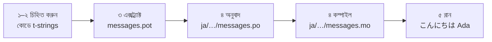

# টিউটোরিয়াল

এই পৃষ্ঠা একটি খালি ডিরেক্টরি থেকে শুরু করে এমন একটি প্রোগ্রাম পর্যন্ত যায়,
যা জাপানিতে অভিবাদন জানায়। পাঁচটি ধাপ, gettext-এর কোনও অভিজ্ঞতা ধরে নেওয়া
হয়নি, আর প্রতিটি কমান্ড দেখানো হয়েছে সে সত্যিই যে আউটপুট দেয় তার সঙ্গে — যাতে
প্রতি ধাপে আপনি বুঝতে পারেন ঠিক পথে আছেন কি না।

Python 3.14 বা নতুনতর দরকার, কারণ t-strings 3.14-এ আসা নতুন সিনট্যাক্স।
জাপানি এই পৃষ্ঠার উদাহরণ-লক্ষ্য, কিন্তু কিছুই সেই পছন্দের উপর নির্ভর করে না।
অন্য কোনও ভাষা ব্যবহার করতে হলে ৪ নম্বর ধাপের `ja` বদলে দিন — কেবল ওই locale
কোডটিই তার নাম বলে।

## ১. ইনস্টল { #1-install }

```console
python -m pip install "gettext-tstrings[babel]"
```

`[babel]` extra নিয়ে আসে [Babel]-কে, যে টুল ৩ নম্বর ধাপে আপনার বার্তাগুলিকে
ক্যাটালগ ফাইলে জড়ো করে। এটি ডেভেলপমেন্ট-সময়ের টুল: প্রোডাকশন কোড কেবল
স্ট্যান্ডার্ড লাইব্রেরি দিয়েই রেন্ডার করে।

## ২. নিজের কোডে একটি বার্তা চিহ্নিত করুন { #2-mark-a-message-in-your-code }

`app.py` তৈরি করুন:

```python
from gettext_tstrings import tr

name = "Ada"
print(tr(t"Hello {name}"))
```

`t"Hello {name}"` দেখতে f-string-এর মতো, কিন্তু `t` প্রিফিক্স টেক্সট আর মানকে
তখনই মিশিয়ে না দিয়ে আলাদা রাখে। সেই আলাদা থাকাটাই `tr()`-কে গোটা বাক্য
`Hello {name}`-এর অনুবাদ খুঁজে নিতে এবং তার পরে মানটি বসিয়ে দিতে দেয়।

এখনই চালিয়ে দেখুন:

```console
$ python app.py
Hello Ada
```

এখনও কোনও অনুবাদ ইনস্টল করা নেই, তাই উৎস টেক্সট যেমন আছে তেমনই রেন্ডার হয়।
এই লাইব্রেরি ব্যবহার করা প্রোগ্রামের চলতে কখনও ক্যাটালগ *লাগে* না — ইংরেজি
(বা আপনার উৎস ভাষা যা-ই হোক) তার অন্তর্নির্মিত ফলব্যাক।

## ৩. বার্তাগুলি এক্সট্র্যাক্ট করুন { #3-extract-the-messages }

অনুবাদকেরা সাধারণত সোর্স কোড নয়, ক্যাটালগ থেকেই কাজ করেন, তাই আপনার আর তাঁদের
মধ্যে যাতায়াত করে **ক্যাটালগ** নামের একটি ছোট ফাইল। সেদিকে প্রথম ধাপ হল কোড
থেকে চিহ্নিত প্রতিটি বার্তা জড়ো করা।

`babel.cfg` তৈরি করে Babel-কে বলে দিন আপনার বার্তা কোথায় খুঁজতে হবে:

```ini
[gettext_tstrings: **.py]
encoding = utf-8
```

তারপর একটি টেমপ্লেট ফাইলে (`.pot`) এক্সট্র্যাক্ট করুন:

```console
$ mkdir -p locales
$ pybabel extract -F babel.cfg -c "Translators:" -o locales/messages.pot .
extracting messages from app.py (encoding="utf-8")
writing PO template file to locales/messages.pot
```

`locales/messages.pot`-এ এখন প্রতি বার্তার জন্য একটি করে এন্ট্রি আছে:

```po
#. gettext-tstrings
#: app.py:4
#, python-brace-format
msgid "Hello {name}"
msgstr ""
```

`msgid` হল সেই কী, যা আপনার কোড খুঁজবে। খালি `msgstr` সেই জায়গা যেখানে অনুবাদ
বসে — তবে এই ফাইলে নয়: `.pot` একটি *টেমপ্লেট*, আর পরের ধাপ প্রতি ভাষার জন্য
একবার করে তার নকল বানায়।

## ৪. অনুবাদ ও কম্পাইল করুন { #4-translate-and-compile }

টেমপ্লেট থেকে জাপানি ক্যাটালগ তৈরি করুন:

```console
$ pybabel init -i locales/messages.pot -d locales -l ja
creating catalog locales/ja/LC_MESSAGES/messages.po based on locales/messages.pot
```

`locales/ja/LC_MESSAGES/messages.po` খুলে `msgstr` পূরণ করুন:

```po
msgid "Hello {name}"
msgstr "こんにちは {name}"
```

`{name}` হুবহু যেমন আছে তেমনই রাখুন — এই placeholder-এর মাধ্যমেই মানটি
অনূদিত বাক্যের ভিতরে নিজের জায়গা খুঁজে পায়, আর অনুবাদ তাকে লক্ষ্য ভাষার
যেখানে দরকার সেখানেই সরাতে স্বাধীন। সত্যিকারের প্রকল্পে এই `.po` ফাইলটিই
আপনি অনুবাদকের হাতে দেন বা অনুবাদ প্ল্যাটফর্মে আপলোড করেন; দুই ক্ষেত্রেই
ফরম্যাট একই।

ক্যাটালগ টেক্সট হিসেবে সম্পাদিত হয় কিন্তু লোড হয় বাইনারি রূপে (`.mo`), তাই
কম্পাইল করুন:

```console
$ pybabel compile -d locales
compiling catalog locales/ja/LC_MESSAGES/messages.po to locales/ja/LC_MESSAGES/messages.mo
```

এই কমান্ডটি একটি সুরক্ষা-জালও বটে। অনুবাদ যদি placeholder-টি নষ্ট করে ফেলত —
ধরুন `{name}`-এর বদলে `{nome}` — এটি তা পাশ করাতে অস্বীকার করত:

```console
$ pybabel compile -d locales
error: locales/ja/LC_MESSAGES/messages.po:24: translation does not match the
source placeholders: {name} is missing; {nome} is not in the source message
1 errors encountered.
```

এখনই জেনে রাখার মতো একটি সতর্কতা: সে ত্রুটিটি জানায় আর non-zero স্ট্যাটাসে
বেরিয়ে যায়, তবু `.mo` লিখেই দেয়। বাস্তব প্রকল্পে ওই exit স্ট্যাটাসে থেমে
যাওয়ার কাজটি CI-এরই — [প্রোডাকশনে](workflow.md#what-ci-gates) সেটি সাজিয়ে দেয়।

## ৫. চালান { #5-run-it }

২–৪ ধাপে `tr()` ব্যবহার হয়েছিল, যে ক্যাটালগ খোঁজে আর একটিও পায় না। এখন যেহেতু
একটি আছে, সেটি লোড করে একবারই বেঁধে দিন: `Translator` ক্যাটালগটি ধরে রাখে যাতে
কল-সাইটগুলিকে তার নাম বলতে না হয়, আর `_` হল ফলাফলটির প্রচলিত gettext নাম।

`app.py`-কে কম্পাইল করা ক্যাটালগের দিকে তাক করান। প্রতিটি লাইন কী করছে দেখতে
মার্কারগুলিতে ক্লিক করুন:

```python
import gettext

from gettext_tstrings import Translator

_ = Translator(gettext.translation("messages", localedir="locales", languages=["ja"]))  # (1)!

name = "Ada"
print(_(t"Hello {name}"))  # (2)!
```

1. স্ট্যান্ডার্ড লাইব্রেরি কম্পাইল করা `.mo` লোড করে, আর `Translator` তাকে
   একটি callable-এর সঙ্গে বাঁধে। `_` হল "এটি অনুবাদ করো"-র প্রচলিত gettext
   নাম — ছোট, কারণ ব্যবহারকারীর চোখে পড়া প্রতিটি স্ট্রিংয়ে এটি আসে। এটি
   `tr`-এর মতো একই অনুবাদই করে, একটি ক্যাটালগের সঙ্গে বাঁধা।
2. কলের সময়: t-string-এর টেক্সট হয়ে ওঠে লুকআপ কী `Hello {name}`, ক্যাটালগ
   উত্তর দেয় `こんにちは {name}`, উত্তরটি উৎসের placeholder-এর সঙ্গে মিলিয়ে
   দেখা হয়, আর কেবল তারপরেই মানটি বসানো হয়।

```console
$ python app.py
こんにちは Ada
```

এই তো গোটা লুপ, আর একে একটি ছবি হিসেবে দেখার মূল্য আছে:



**চিহ্নিত → এক্সট্র্যাক্ট → অনুবাদ → কম্পাইল → রান।** এই সাইটের বাকি সবই
ওই পাঁচ ধাপের কোনও একটির পরিশীলন।

## এরপর কোথায় { #where-next }

- [t-strings কেন](comparison.md) — `%(name)s`, `.format()` ও `$`-strings-এর
  তুলনায় এই নকশা আপনাকে কী থেকে রক্ষা করে।
- [গাইড](guide.md) — বহুবচন, প্রতি-request ভাষা, deferred স্ট্রিং, আর তবুও
  ক্যাটালগ ভুল হলে রানটাইমে কী ঘটে।
- [প্রোডাকশনে](workflow.md) — একটি দল সপ্তাহের পর সপ্তাহ এই একই লুপ যেভাবে
  চালায়: ক্যাটালগ আপডেট, CI গেট, আর অনুবাদ প্ল্যাটফর্ম।
- [এক্সট্র্যাকশন](extraction.md) — সম্পূর্ণ `pybabel` রেফারেন্স: নিজস্ব
  ফাংশন নাম, কড়া CI মোড, আর যে যাচাইগুলি আপনার ক্যাটালগ পাহারা দেয়।
- [মাইগ্রেশন](migration.md) — আপনি আসলে যে প্রকল্পে এটি করতে চান তাতে যদি আগে
  থেকেই gettext ক্যাটালগ থাকে।
- [অনুবাদকদের জন্য](translators.md) — যিনি ওই `msgstr` লাইনগুলি ভরাট করবেন,
  তাঁর হাতে তুলে দেওয়ার মতো একমাত্র পৃষ্ঠা।

  [Babel]: https://babel.pocoo.org/
