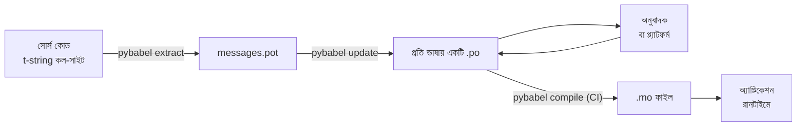

# প্রোডাকশনে

[টিউটোরিয়াল](tutorial.md) লুপটি একবার চালায়, একা, একটিমাত্র বার্তাওয়ালা একটি
প্রোগ্রামে। সত্যিকারের প্রকল্পে লুপটি ঘুরতেই থাকে: বার্তা অনূদিত হওয়ার পরেও
বদলায়, অনুবাদক কাজ করেন অন্য কোথাও আর নিজের সময়সূচিতে, আর প্রতিটি রিলিজের
সঙ্গে একটি কম্পাইল করা ক্যাটালগ পাঠানো হয়। এই পৃষ্ঠা সেই চর্চাটাই — কী
রিপোজিটরিতে থাকে, কী যাতায়াত করে, CI-কে কী গেট করতেই হবে, আর রানটাইম কোথায়
একটি ভাষা বাঁধে।

সব মিলিয়ে দাঁড়ায় ছয়টি যাচাইয়ে, তাই সেগুলিই আগে দেওয়া হল; নিচের প্রতিটি
অংশ তার একটি করে সাজিয়ে দেয়।

- `pybabel update --check` পাশ করে — ক্যাটালগ না জেনে কোনও বার্তা বদলায়নি।
- `pybabel compile` তার exit স্ট্যাটাসের উপর বিল্ডটিকে গেট করে।
- বাকি থাকা `fuzzy` এন্ট্রিগুলি ইচ্ছাকৃত — কোনও অনুবাদক নিশ্চিত না করা পর্যন্ত
  প্রতিটি উৎস টেক্সট হিসেবেই রেন্ডার হয়।
- টেস্ট সুইট পাঠানো প্রতিটি ভাষা একবার করে `strict=True` দিয়ে রেন্ডার করে।
- প্রোডাকশন আর্টিফ্যাক্টে `.mo` ফাইল থাকে, Babel থাকে না।
- `gettext_tstrings` লগারটি মনিটরিংয়ে পাঠানো হয়।

## একটি প্রকল্পের আকৃতি { #the-shape-of-a-project }

```text
myapp/
├── babel.cfg
├── pyproject.toml
├── src/
│   └── myapp/
└── locales/
    ├── messages.pot
    ├── ja/LC_MESSAGES/messages.po
    └── de/LC_MESSAGES/messages.po
```

`babel.cfg`, `.pot` টেমপ্লেট আর প্রতিটি `.po` কমিট করুন — এগুলিই অনুবাদ
বিল্ডের উৎস, আর এদের diff দেখেই আপনি অনুবাদের বদল রিভিউ করেন। কম্পাইল করা
`.mo` ফাইলগুলি বিল্ড আর্টিফ্যাক্ট: সেগুলি কমিট না করে CI-তে বা প্যাকেজিংয়ের
সময় তৈরি করুন, যাতে কী পাঠানো হচ্ছে তা নিয়ে একটি `.po` আর তার `.mo` কখনও
দ্বিমত হতে না পারে।

একটি ফাইলের দুই দিকেই ভূমিকা আছে: `.pot` আপনার বার্তাগুলিকে *বাইরে* নিয়ে যায়
অনুবাদকদের কাছে, আর `.po` ফাইলগুলি অনুবাদ *ফিরিয়ে* আনে। এই পৃষ্ঠার বাকিটা
হল ওই দুইয়ের মধ্যে যা যাতায়াত করে।



## প্রথম অনুবাদের পরের চক্র { #the-cycle-after-the-first-translation }

টিউটোরিয়ালের `pybabel init` সচরাচর একবারই চলে, যখন একটি ভাষা যোগ হয়। তারপর থেকে
কাজের চক্র হল **extract → update → translate → compile**, আর তার কেন্দ্রে
`pybabel update`, যে নতুন টেমপ্লেটটিকে বিদ্যমান ক্যাটালগে ভাঁজ করে নেয়,
সেখানে ইতিমধ্যেই থাকা অনুবাদ ফেলে না দিয়ে।

ধরুন `Hello {name}` অভিবাদনটি — যার অনুবাদ ইতিমধ্যেই `こんにちは {name}` —
কোডে নতুন ভাষায় লেখা হল `Welcome back, {name}`। এক্সট্র্যাক্ট ও আপডেট করুন:

```console
$ pybabel extract -F babel.cfg -c "Translators:" -o locales/messages.pot .
extracting messages from app.py (encoding="utf-8")
writing PO template file to locales/messages.pot
$ pybabel update -i locales/messages.pot -d locales
updating catalog locales/ja/LC_MESSAGES/messages.po based on locales/messages.pot
```

জাপানি ক্যাটালগে এখন আছে:

```po
#. gettext-tstrings
#: app.py:4
#, fuzzy, python-brace-format
msgid "Welcome back, {name}"
msgstr "こんにちは {name}"
```

Babel লক্ষ করল নতুন msgid-টি সরিয়ে ফেলা একটির সঙ্গে মিলে যায়, আর তাকে পুরনো
অনুবাদের সঙ্গে জোড়া বাঁধল — কিন্তু জোড়াটিকে **fuzzy** চিহ্ন দিল: মানুষের
অপেক্ষায় থাকা যন্ত্রের একটি আন্দাজ। এই ফ্ল্যাগ বদলে দেয় কী কম্পাইল হবে।
`pybabel compile`
**fuzzy এন্ট্রিগুলিকে `.mo` থেকে বাদ দেয়**, তাই কোনও অনুবাদক জোড়াটি নিশ্চিত
না করা পর্যন্ত অ্যাপ্লিকেশন পুরনো জাপানি নয়, নতুন ইংরেজি টেক্সটই রেন্ডার করে:

```console
$ pybabel compile -d locales
compiling catalog locales/ja/LC_MESSAGES/messages.po to locales/ja/LC_MESSAGES/messages.mo
$ python app.py
Welcome back, Ada
```

কাজেই বদলে যাওয়া একটি বার্তা ঠিক সেভাবেই নেমে আসে যেভাবে ভাঙা একটি বার্তা
আসে — উৎস ভাষায়, কখনও সেকেলে কোনও অনুবাদে নয়। চক্রে অনুবাদকের ভাগটুকু হল
`msgstr` সংশোধন করা আর `fuzzy` ফ্ল্যাগ মুছে দেওয়া; পরের কম্পাইল এন্ট্রিটি
তুলে নেয়।

!!! note "placeholder-এর নাম বার্তার পরিচয়েরই অংশ"

    msgid হল ক্যাটালগের কী, আর placeholder-এর *নাম* তার ভিতরেই আছে — তাই কোডে
    একটি ভেরিয়েবলের নাম বদলালে (`name` → `user_name`) msgid বদলে যায় আর
    প্রতিটি ভাষার অনুবাদকে আবার fuzzy চক্রে পাঠিয়ে দেয়। ইন্টারপোলেট করা
    ভেরিয়েবলের নাম এমন শব্দে রাখুন যা একজন অনুবাদক বুঝবেন, আর কারণ ছাড়া
    সেগুলি বদলাবেন না।

    ফরম্যাটিং তার উল্টো ছবি: `!r` ও `:.2f`
    [msgid-এর অংশ নয়](internals.md#from-template-to-msgid), তাই
    `{amount:,.2f}`-কে `{amount:,.0f}` করে আঁটসাঁট করলে কোনও ক্যাটালগে কিছুই
    বদলায় না। *বাক্যটি* নতুন করে লেখা অবশ্যই সত্যিকারের বদল — সেটাই উপরের
    চক্র।

## CI কী গেট করে { #what-ci-gates }

তিনটি ব্যর্থতা লাল বিল্ডের যোগ্য: ক্যাটালগ কোডের পিছনে পড়ে গেছে, কোনও অনুবাদ
একটি placeholder ভেঙেছে, বা কোনও ভাঙা এন্ট্রি রানটাইম পর্যন্ত গলে গেছে।
প্রতিটি ব্যর্থতার জন্য একটি করে ধাপ:

```yaml
- run: pybabel extract -F babel.cfg -c "Translators:" -o locales/messages.pot .
- run: pybabel update -i locales/messages.pot -d locales --check
- run: pybabel compile -d locales
- run: pytest
```

`pybabel update --check` কিছুই নতুন করে লেখে না, আর সদ্য এক্সট্র্যাক্ট করা
টেমপ্লেটের তুলনায় কোনও ক্যাটালগ পুরনো হলে non-zero দিয়ে বেরোয় — এটিই সেই
পাহারা, যা এমন কোড মার্জ করা আটকায় যার বার্তা কেউ আবার এক্সট্র্যাক্ট করেনি।
`pybabel compile` Babel আর এই প্যাকেজের
[নিবন্ধিত চেকার](extraction.md#your-existing-toolchain-validates-these-catalogs) —
দুইয়েরই placeholder যাচাই চালায়।

!!! bug "Babel 2.18.0: `--check` context ব্যবহার করা ক্যাটালগ গেট করতে পারে না"

    Babel 2.18.0-তে `pybabel update --check` `msgctxt` আছে এমন **প্রতিটি**
    ক্যাটালগকেই পুরনো বলে জানায়, প্রতিবার চললেই, সে যত হালনাগাদই হোক।
    চিরকাল ব্যর্থ হতে থাকা গেট কোনও গেট না থাকার চেয়েও খারাপ, কারণ দল সেটি
    বন্ধ করে দেয় — তাই আপনি `pgettext` বা `npgettext` আদৌ ব্যবহার করলে এই
    ধাপটি নিয়ে ঘর করার বদলে তাকে বদলে ফেলুন। `babel.messages.pofile.read_po`
    দিয়ে টেমপ্লেট আর প্রতিটি ক্যাটালগ পড়ে
    `{(m.context, m.id) for m in catalog if m.id}` তুলনা করাই গোটা যাচাই, আর
    [এই সাইটের নিজের বিল্ড](index.md) সেটাই করে। কারণটি
    [সমস্যা ও ফাঁদ পৃষ্ঠায় লেখা আছে](pitfalls.md#your-tools-have-bugs-too)।

!!! danger "লগ নয়, exit status দেখুন"

    `pybabel compile` প্রতিটি placeholder ত্রুটি জানায়, non-zero দিয়ে বেরোয় —
    **আর `.mo` তবু লিখে ফেলে**। যে পাইপলাইন কম্পাইল করে তারপর `locales/`
    একটি ইমেজে কপি করে, সে ভাঙা ক্যাটালগটিই পাঠিয়ে দেবে, যদি না ওই non-zero
    exit সত্যিই তাকে থামায়। উপরের মতো ধাপটিকে বিল্ড ব্যর্থ করতে দেওয়াই
    গোটা সমাধান।

শেষ লাইনটি আপনার সাধারণ টেস্ট সুইট, সঙ্গে একটি অভ্যাস যোগ করা: তার কোথাও,
প্রতিটি পাঠানো ভাষার অন্তত একটি বার্তা একটি strict translator দিয়ে রেন্ডার
করুন —

```python
import gettext

from gettext_tstrings import Translator


def test_catalogs_render(language: str) -> None:
    translations = gettext.translation("messages", localedir="locales", languages=[language])
    _ = Translator(translations, strict=True)
    name = "Ada"
    assert _(t"Welcome back, {name}")
```

— কারণ `strict=True`
[সেখানে এক্সেপশন তোলে যেখানে প্রোডাকশন নীরবে ফলব্যাক করত](guide.md#what-happens-when-a-catalog-is-wrong),
আর রানটাইমে একবার রেন্ডার করাই একমাত্র যাচাই যা ক্যাটালগটিকে হুবহু সেভাবেই
দেখে যেভাবে অ্যাপ্লিকেশন দেখবে, `.mo` ও সবকিছুসহ।

## অনুবাদক ও প্ল্যাটফর্মের সঙ্গে কাজ { #working-with-translators-and-platforms }

`.po` ফাইল গোটা gettext জগতের বিনিময় ফরম্যাট, আর সেই কারণেই এই লাইব্রেরি
তাকে পুনর্ব্যবহার করে: অনুবাদ হস্তান্তর করার অর্থ একটি ফাইল হস্তান্তর করা,
প্রাপক PO এডিটরওয়ালা কোনও সহকর্মী হোন বা Weblate কিংবা Crowdin-এর মতো কোনও
প্ল্যাটফর্ম। তিনটি জিনিস এই হস্তান্তরকে ভালোভাবে কাজ করায়:

**বার্তাটি কীসের জন্য তা বলুন।** কোডে লেখা একটি মন্তব্য বার্তার সঙ্গে
যাতায়াত করে — `-c "Translators:"` ফ্ল্যাগ সেটিই জড়ো করে:

```python
from gettext_tstrings import tr

name = "Ada"
# Translators: shown on the dashboard right after sign-in
print(tr(t"Welcome back, {name}"))
```

```po
#. Translators: shown on the dashboard right after sign-in
#. gettext-tstrings
#: app.py:5
#, python-brace-format
msgid "Welcome back, {name}"
msgstr ""
```

একজন অনুবাদক পৃথিবীর অন্য প্রান্তে বসে নিজের এডিটরে, বার্তাটির পাশেই ওই
মন্তব্য দেখতে পান। গোটা ওয়ার্কফ্লোয় এটিই সবচেয়ে সস্তা গুণমান-লিভার। যে শব্দ
নিজেই নিজের সমোচ্চারিত রূপ — বোতাম হিসেবে "Open" বনাম অবস্থা হিসেবে "Open" —
তার জন্য `pgettext` দিয়ে বার্তাটিকে একটি
[context](guide.md#binding-a-catalog) দিন, যা ক্যাটালগে দৃশ্যমান `msgctxt`
হয়ে ওঠে।

**প্ল্যাটফর্মকে placeholder যাচাই করতে দিন।** t-string থেকে এক্সট্র্যাক্ট করা
প্রতিটি বার্তা `python-brace-format` ফ্ল্যাগ বহন করে, আর ওই একটি লাইনই আপনার
নিয়ন্ত্রণের বাইরে থাকা টুলে placeholder QA চালু করে দেয় — Weblate যাচাইটি
নথিভুক্ত করে, বাণিজ্যিক প্ল্যাটফর্মগুলি নিজেদেরটি ওই একই ফ্ল্যাগে বাঁধে, আর
`msgfmt --check-format` যেকোনও GNU পাইপলাইনে তা প্রয়োগ করে। খুঁটিনাটি, আর
সঙ্গে দেওয়া চেকার এদের বাইরে আর কী ধরে, তা আছে
[এক্সট্র্যাকশন পৃষ্ঠায়](extraction.md#your-existing-toolchain-validates-these-catalogs)।

**সুরক্ষা-জালকে ঠিক যতটুকু সে যায় ততটুকুই বিশ্বাস করুন।** প্ল্যাটফর্ম থেকে যা
ফেরে তা আপনার বিল্ডে ঢোকা ডেটাই; উপরের CI গেটগুলিই "প্ল্যাটফর্ম সম্ভবত এটি
যাচাই করেছে"-কে "এটি ভাঙা অবস্থায় পাঠানো যাবে না"-তে বদলে দেয়।

## রানটাইমে একটি ভাষা বাঁধা { #binding-a-language-at-runtime }

এতক্ষণের সবটাই ক্যাটালগ তৈরি করে। বাকি সিদ্ধান্তটি হল অ্যাপ্লিকেশন কোথায়
একটি ক্যাটালগ বাছবে। প্রতি *ভাষার পরিসরে* একবার করে বাঁধুন — CLI-এর জন্য
প্রসেস, ওয়েব সার্ভিসের জন্য request।

=== "এক প্রসেস, এক ভাষা"

    একটি কমান্ড-লাইন টুল বা ডেস্কটপ অ্যাপ্লিকেশন ব্যবহারকারীর পরিবেশ একবারই
    পড়ে, চালু হওয়ার সময়। কোনও `languages=` না পাঠালে স্ট্যান্ডার্ড লাইব্রেরি
    `LANGUAGE`, `LC_ALL`, `LC_MESSAGES` ও `LANG` থেকে দর কষাকষি করে নেয়;
    `fallback=True` তাদের কোনওটিই আপনার পাঠানো কোনও ক্যাটালগের সঙ্গে না
    মিললে এক্সেপশন না তুলে একটি null ক্যাটালগ — অর্থাৎ উৎস টেক্সট — ফেরায়।

    ```python
    import gettext

    from gettext_tstrings import Translator

    _ = Translator(gettext.translation("messages", localedir="locales", fallback=True))

    name = "Ada"
    print(_(t"Welcome back, {name}"))
    ```

=== "Flask"

    একটি ওয়েব অ্যাপ্লিকেশন প্রতি request-এ সিদ্ধান্ত নেয়। প্রতিটি ক্যাটালগ
    import-এর সময় একবার লোড করুন, তারপর view চলার আগে দর কষাকষিতে বাছা
    ক্যাটালগটি কনটেক্সটে বেঁধে দিন —
    [`set_translations`](guide.md#per-request-language) কনটেক্সট-স্থানীয়, তাই
    ভিন্ন ভাষার সমান্তরাল request-গুলি কখনও একে অপরের বাঁধাই দেখে না।

    ```python
    import gettext

    from flask import Flask, request

    from gettext_tstrings import set_translations, tr

    LANGUAGES = ("en", "ja", "de")
    CATALOGS = {
        language: gettext.translation(
            "messages", localedir="locales", languages=[language], fallback=True
        )
        for language in LANGUAGES
    }

    app = Flask(__name__)


    @app.before_request
    def bind_language() -> None:
        language = request.accept_languages.best_match(LANGUAGES) or "en"
        set_translations(CATALOGS[language])


    @app.get("/")
    def home() -> str:
        name = "Ada"
        return tr(t"Welcome back, {name}")
    ```

=== "ASGI মিডলওয়্যার"

    async ফ্রেমওয়ার্কের নিচে — FastAPI, Starlette আর আর যা কিছু ASGI —
    request-টিকে [`use_translations`](guide.md#per-request-language) দিয়ে
    মুড়ে দিন: বাঁধাইটি থাকে একটি `ContextVar`-এ, যাকে async টাস্ক অদল-বদল
    প্রতি request-এ অক্ষত রাখে।

    ```python
    import gettext

    from fastapi import FastAPI, Request

    from gettext_tstrings import tr, use_translations

    LANGUAGES = ("en", "ja", "de")
    CATALOGS = {
        language: gettext.translation(
            "messages", localedir="locales", languages=[language], fallback=True
        )
        for language in LANGUAGES
    }

    app = FastAPI()


    @app.middleware("http")
    async def bind_language(request: Request, call_next):
        language = negotiate_language(request.headers.get("accept-language"), LANGUAGES)
        with use_translations(CATALOGS[language]):
            return await call_next(request)
    ```

    `negotiate_language` আপনার Accept-Language parse করার জায়গাটির প্রতীক —
    বেশিরভাগ ফ্রেমওয়ার্ক বা তাদের ইকোসিস্টেম একটি দেয়; এখানে যা গুরুত্বপূর্ণ
    তা হল `call_next`-এর চারপাশের বাঁধাইটি।

দুটি রানটাইম অভ্যাস ছবিটি সম্পূর্ণ করে। import-সময়ে তৈরি স্ট্রিং — একটি ফর্ম
লেবেল, একটি enum-এর প্রদর্শন নাম — import-এর সময় যে ভাষা সক্রিয় ছিল তাকে ধরে
রাখতে পারে না; সেগুলি [`lazy_gettext`](guide.md#deferred-translation) দিয়ে
সংজ্ঞায়িত করুন, তাহলে তারা *ব্যবহারের* সময় সক্রিয় ভাষাতেই রেন্ডার হবে। আর
`gettext_tstrings` লগারটিকে এমন কোথাও পাঠান যেখানে মানুষ তাকায়: তার
সতর্কবার্তাগুলিই শিথিল মোডের রিপোর্ট, প্রতিটি গেট এড়িয়ে যাওয়া কোনও অনুবাদ
নিয়ে, প্রতি রেন্ডারে নয়, প্রতি ভাঙা বার্তায় একটি করে লাইন।

## পাঠানো { #shipping }

প্রোডাকশনের দরকার প্যাকেজটি, `.mo` ফাইলগুলি, আর কিছুই নয়। Babel একটি
ডেভেলপমেন্ট ও CI নির্ভরতা — `gettext-tstrings[babel]`-কে প্রোডাকশন ইমেজের
বাইরে রাখুন আর সেখানে খালি প্যাকেজটিই ইনস্টল করুন; রেন্ডারিং কেবল
স্ট্যান্ডার্ড লাইব্রেরিতেই চলে। যে বিল্ড আপনার ডিপ্লয় করা আর্টিফ্যাক্টটি
তৈরি করে সেখানেই ক্যাটালগ কম্পাইল করুন, যাতে তার ভিতরের `.mo` ফাইলগুলি হুবহু
সেই রিভিউ করা `.po` ফাইলই হয়, আর কারও ল্যাপটপে কম্পাইল করা কিছু কখনও পাঠানো
না হয়।

এগুলি কীভাবে যাত্রা করে তা নির্ভর করে আপনি কী ডিপ্লয় করছেন তার উপর। একটি
wheel এগুলিকে প্যাকেজ ডেটা হিসেবে বয়ে নেয়, অর্থাৎ ক্যাটালগগুলিকে প্যাকেজ
ডিরেক্টরির *ভিতরে* থাকতে হবে — `src/myapp/locales/`, উপরের স্তরের
`locales/` নয় — আর বিল্ড ব্যাকএন্ডকে বলে দিতে হবে যে `.gitignore` সচরাচর যে
ফাইলগুলি আড়াল করে সেগুলিও অন্তর্ভুক্ত করতে হবে:

=== "Hatchling"

    ```toml
    [tool.hatch.build]
    # .mo files are build output, so they are gitignored; name them or the
    # wheel ships without a single translation.
    artifacts = ["src/myapp/locales/**/*.mo"]
    ```

=== "setuptools"

    ```toml
    [tool.setuptools.package-data]
    myapp = ["locales/*/LC_MESSAGES/*.mo"]
    ```

সোর্স ট্রি-সাপেক্ষ কোনও পথ দিয়ে নয়, প্যাকেজটির মধ্য দিয়েই এগুলি ফিরে পড়ুন —
wheel ইনস্টল হওয়ার মুহূর্তেই সেই পথটির আর অস্তিত্ব থাকে না:

```python
import gettext
from importlib.resources import as_file, files

with as_file(files("myapp") / "locales") as localedir:
    translations = gettext.translation("messages", localedir=localedir, languages=["ja"])
```

কন্টেইনার ইমেজের কাজটি সহজতর: বিল্ড স্টেজে কম্পাইল করুন আর ফলাফলটি কপি করুন,
Babel-কে সেই স্টেজেই ফেলে রেখে।

```dockerfile
FROM python:3.14-slim AS build
COPY . /src
RUN cd /src && python -m pip install ".[babel]" \
    && pybabel compile -d src/myapp/locales

FROM python:3.14-slim
COPY --from=build /src /src
RUN python -m pip install /src   # no [babel]: rendering needs the stdlib only
```

রিলিজের আগে এই পৃষ্ঠাটি যে চেকলিস্টে দাঁড়ায়:

- `pybabel update --check` পাশ করে — ক্যাটালগ না জেনে কোনও বার্তা বদলায়নি।
- `pybabel compile` তার exit status-এর উপর বিল্ডকে গেট করে।
- বাকি থাকা `fuzzy` এন্ট্রিগুলি ইচ্ছাকৃত — কোনও অনুবাদক নিশ্চিত না করা
  পর্যন্ত প্রতিটিই উৎস টেক্সট হিসেবে রেন্ডার হয়।
- টেস্ট সুইট প্রতিটি পাঠানো ভাষা একবার করে `strict=True` দিয়ে রেন্ডার করে।
- প্রোডাকশন আর্টিফ্যাক্টে `.mo` ফাইল আছে, Babel নেই।
- `gettext_tstrings` লগার মনিটরিংয়ে পাঠানো আছে।

## এরপর কোথায় { #where-next }

- [এক্সট্র্যাকশন](extraction.md) — এই পৃষ্ঠার টুলিং-অর্ধেকটির রেফারেন্স:
  ম্যাপিং অপশন, নিজস্ব ফাংশন নাম, কড়া মোড, আর প্রতিটি চেকার।
- [গাইড](guide.md) — রানটাইম-অর্ধেক: বহুবচন, context, deferred স্ট্রিং, আর
  ব্যর্থতার ধরনগুলি খুঁটিয়ে।
- [এটি কীভাবে কাজ করে](internals.md) — msgid কেন দেখতে এমন, আর যাচাই আসলে
  কী দেখে।
