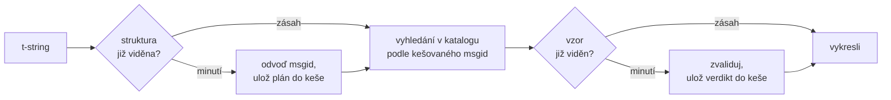

# Jak to funguje

Nic z této stránky nepotřebujete k tomu, abyste knihovnu používali — to
pokrývá [tutoriál](tutorial.md) a [průvodce](guide.md). Tato stránka místo
toho knihovnu znovu buduje od základních principů: čím t-string skutečně
je, jak z něj vyplývá msgid, co dělá překlad platným a jak implementace
zařizuje, že celá tato kontrola stojí desetiny mikrosekundy. Čtěte ji,
pokud jste zvědaví, pokud chcete přispívat, nebo pokud plánujete
[implementovat konvenci sami](#reimplementing-it).

## Čím t-string skutečně je { #what-a-t-string-actually-is }

F-string vytváří `str` a vytváří jej okamžitě — než jej jakákoli funkce
obdrží, hodnota je interpolována a věta zapečetěna. T-string ([PEP 750])
má stejnou syntaxi a stejné dychtivé vyhodnocení svých výrazů, ale vytváří
jiný typ:

```pycon
>>> name = "Ada"
>>> f"Hello {name}!"
'Hello Ada!'
>>> t"Hello {name}!"
Template(strings=('Hello ', '!'), interpolations=(Interpolation('Ada', 'name', None, ''),))
```

Tento objekt `Template` uchovává části, které katalogová pipeline
potřebuje, stále oddělené:

```pycon
>>> template = t"Total: {amount:,.2f}"
>>> template.strings
('Total: ', '')
>>> template.interpolations[0].expression
'amount'
>>> template.interpolations[0].value
1234.5
>>> template.interpolations[0].format_spec
',.2f'
```

- `strings` — literální text okolo interpolací, v pořadí.
- Pro každou interpolaci: **výraz** jako zdrojový text (`'amount'`), jeho
  vyhodnocená **hodnota** (`1234.5`) a případná **konverze** (`!r`) a
  **formátovací specifikace** (`,.2f`) — nesené odděleně, nikoli
  aplikované.

Vše, co tato knihovna dělá, je disciplinovaná konzumace této struktury.
Jazyk už provedl to jediné oddělení, které i18n potřebuje — statický text
odděleně od hodnot — takže knihovna nikdy neparsuje váš zdrojový kód a
nikdy nehádá, kde ve větě hodnota sedí. Zbývají tři rozhodnutí: jak se
struktura stane klíčem katalogu, co smí překlad tohoto klíče říkat a jak
se obojí vykreslí zpět dohromady.

## Od šablony k msgid { #from-template-to-msgid }

Msgid — klíč, kterým je katalog indexován — se odvozuje výhradně ze
*statických* částí šablony. Projděte `strings` a `interpolations` ve
zdrojovém pořadí; v každém literálním segmentu escapujte složené závorky
(`{` se stane `{{`); pro každou interpolaci vydejte jeden token `{name}`,
kde `name` je text výrazu s odstraněnými okolními bílými znaky.
Z `t"Total: {amount:,.2f}"`:

```text
strings         ('Total: ', '')
interpolations  expression 'amount'   conversion None   format_spec ',.2f'
msgid           'Total: {amount}'
```

Každá část tohoto pravidla má svůj důvod:

- **Výraz musí být prosté jméno** — `str.isidentifier()` platí a není to
  klíčové slovo Pythonu. `t"Hello {user.name}"` je odmítnut v místě
  volání. Msgid je *klíč*: musí vyjít identicky při každém běhu a každé
  extrakci a čtou jej překladatelé, takže zástupný symbol musí být
  stabilní, smysluplné slovo — ne úryvek kódu, který zve katalog k tomu,
  aby se stal jazykem výrazů.
- **Konverze a formátovací specifikace nikdy nevstupují do msgid.**
  Překladatelé by neměli muset číst `:,.2f` a žádný překlad by neměl mít
  možnost to změnit. Důsledek stojí za to znát: zpřísnění `:,.2f` na
  `:,.0f` ve vašem kódu nezmění žádný msgid, takže nezneplatní žádný
  překlad v žádném jazyce. Klíč katalogu sleduje to, *co věta říká*, ne
  způsob formátování hodnoty.
- **Opakované jméno musí přesně zopakovat své formátování.**
  `t"{x:.2f} vs {x:.3f}"` je odmítnut, protože oba výskyty se zhroutí do
  téhož tokenu `{x}` a msgid by už nedokázal říct, které formátování má
  vykreslení použít.
- **Prázdný msgid se nikdy nevyhledává**, protože gettext jej rezervuje
  pro hlavičku metadat samotného katalogu. `t""` se vykreslí jako `""`
  bez dotyku katalogu.

Úplná sada pravidel, včetně okrajových případů, které tato stránka
vynechává, je
[SPEC §2](https://github.com/yhay81/gettext-tstrings/blob/main/SPEC.md).

## Co smí překlad říkat { #what-a-translation-may-say }

Vzor vracející se z katalogu je parsován pomocí `string.Formatter` — téhož
parseru, který používá `str.format`. Gramatika je záměrně vypůjčená, nikoli
vymyšlená: vzor, který tato knihovna přijme, je takový, kterému širší
ekosystém už rozumí. Poté se uplatní dvě kontroly.

**Tvar:** každé pole musí být holé `{name}`. Konverze nebo formátovací
specifikace — včetně explicitně prázdného `{name:}` — je odmítnuta,
stejně jako poziční pole (`{0}`, `{}`) a jména doplněná bílými znaky
(`{ name }`). To poslední znamená víc, než se zdá: `str.format` i GNU
`msgfmt` `{ name }` odmítají oba, takže jeho přijetí zde by produkovalo
katalogy, které žádný jiný nástroj v řetězci neumí zvalidovat.

**Jména:** množina zástupných symbolů vzoru se porovnává se zdrojovou.
U zprávy v jednotném čísle je každé zdrojové jméno *vyžadováno* a nic
dalšího není *povoleno*. U zprávy v množném čísle se obě větve slučují:

- **povoleno** = sjednocení jmen obou větví
- **vyžadováno** = jejich průnik

Takže vůči `t"One file"` / `t"{n} files"` je jméno `n` povoleno v překladu
obou forem, ale vyžadováno v žádné. Právě tato asymetrie umožňuje, aby se
systém množného čísla cílového jazyka lišil od zdrojového — japonština
překládá obě větve jedinou formou, která nejspíš používá `{n}`; jazyk s
více formami než angličtina může potřebovat `{n}` ve formě, kterou
angličtina nemá.

Nic z toho není hypotetické: katalog rozhraní tohoto webu nese zprávu v
množném čísle `Built {n} localized page` / `Built {n} localized pages` —
dvě anglické větve — a jazykové edice webu překládají tuto jedinou zprávu
do jedné až šesti forem:

| Katalog | Formy | Překlady v pořadí forem |
| --- | --- | --- |
| Japonština | 1 | `ローカライズ済みページを{n}件ビルドしました` |
| Turečtina | 2 | `{n} yerelleştirilmiş sayfa oluşturuldu` — dvakrát, identicky: turecká podstatná jména zůstávají po číslovce v jednotném čísle |
| Italština | 2 | `Generata {n} pagina localizzata` · `Generate {n} pagine localizzate` — příčestí se shoduje v rodě a čísle |
| Lotyština | 3 | `Izveidota {n} lokalizēta lapa` · `Izveidotas {n} lokalizētas lapas` · `Izveidots {n} lokalizētu lapu` — třetí forma je **jen pro nulu** |
| Ruština | 3 | `Собрана {n} локализованная страница` · `Собраны {n} локализованные страницы` · `Собрано {n} локализованных страниц` |
| Polština | 3 | `Zbudowano {n} zlokalizowaną stronę` · `Zbudowano {n} zlokalizowane strony` · `Zbudowano {n} zlokalizowanych stron` |
| Slovinština | 4 | `Zgrajena {n} lokalizirana stran` · `Zgrajeni {n} lokalizirani strani` · `Zgrajene {n} lokalizirane strani` · `Zgrajenih {n} lokaliziranih strani` — druhá je **duál**, pro přesně dvě |
| Irština | 5 | `Tógadh {n} leathanach logánaithe` · `Tógadh {n} leathanaigh logánaithe` — jedna, dvě, 3–6, 7–10 a zbytek; kmen se střídá, ale *leathanach* začíná na `l`, na kterém se žádná irská mutace nepíše, takže několik forem splývá |
| Arabština | 6 | mezi nimi `تم إنشاء صفحة مترجمة واحدة ({n})` pro přesně jeden a `تم إنشاء {n} صفحات مترجمة` pro několik |

Každý řádek je živý záznam v `i18n/*/LC_MESSAGES/site.po` tohoto
repozitáře, vykreslovaný [vícejazyčným buildem](index.md) při každém
vydání — a test připíná tuto tabulku k těmto katalogům, takže se od sebe
nemohou rozjet.

V těchto mezích jsou přeuspořádání a opakování záměrně neomezené. Obojí
je v reálných jazycích gramaticky nezbytné a omezování počtu výskytů by
odmítalo správné překlady bez jakéhokoli bezpečnostního přínosu: překlad
stejně nemůže nic *vyhodnotit*, protože žádná vyhodnocovací cesta
neexistuje — zástupné symboly se vyhledávají podle jména v už spočítaných
hodnotách šablony, nikdy se nepředávají do `eval`, `getattr` ani
samotného `str.format`.

## Vykreslování { #rendering }

Vykreslení zvalidovaného vzoru je průchod jeho kousky: vydejte každou
literální část a pro každý zástupný symbol vezměte zachycenou hodnotu
interpolace a aplikujte konverzi a formátovací specifikaci *ze zdrojové
strany* — `format(convert(value, conversion), format_spec)`. Přitom se
dodržují dvě záruky:

- **Každá odlišná hodnota je formátována nejvýše jednou na vykreslení**,
  i když překlad zástupný symbol opakuje. Opakování mění to, jak často se
  výsledek vkládá, ne to, jak často běží váš `__format__`.
- **U množných čísel čte zástupný symbol větev, která jej definovala.**
  Jméno přítomné v obou větvích čte hodnotu zachycenou větví, kterou
  vybírá *zdrojový* jazyk (`singular` když `n == 1`, jinak `plural`);
  jméno specifické pro jednu větev čte vždy svou vlastní větev, i když
  jej pravidla množného čísla cílového jazyka zpřístupnila v jiné formě.

Když validace selže při vykreslování, odpověď se dělí podle toho, kdo
vzor dodal. Vzor, který vyšel z *katalogu*, degraduje: zaloguje se jedno
varování a vykreslí se zdrojový text, čímž zůstává zachován kontrakt
gettextu, že rozbitý katalog nikdy nepoloží aplikaci
([průvodce ukazuje oba režimy](guide.md#what-happens-when-a-catalog-is-wrong)).
Vzor, který volající předal přímo — `CompiledTemplate.render` — vždy
vyhodí výjimku, protože neexistuje zdrojový text, *k němuž* by šlo
degradovat; shovívavost existuje pro vyhledávání v katalogu, ne pro
argumenty.

## Diagnostika je součástí návrhu { #diagnostics-are-part-of-the-design }

Chyba zástupného symbolu obvykle přistane před překladatelem, ne
programátorem, a často v souboru, kde je problém neviditelný. Říct
`{name} is missing` někomu, kdo přesně tyto znaky vidí ve svém editoru,
je slepá ulička, takže zprávy se počítají podle tří pravidel:

- Jméno obsahující **neviditelný znak** — nezlomitelnou mezeru vytvořenou
  vstupní metodou, mezeru nulové šířky — se vypíše s tímto znakem
  nahrazeným jeho kódovým bodem, přímo na místě: `{<U+00A0>name}`.
  Čtenář potřebuje vidět *kde*.
- Jméno, jehož písmena **míchají písma**, případ homoglyfů, se ukáže
  dvakrát — jednou čitelně, jednou escapovaně — protože `{nаme}` s
  cyrilským `а` je v tisku nerozeznatelné od `{name}` a escapovaná podoba
  `(nаme)` je jediný zápis, který je od sebe odliší.
- Vše ostatní se ukáže **tak, jak bylo napsáno**. `{名前}` a `{café}`
  jsou obyčejná jména; jejich escapování by čtenáři znemožnilo najít, co
  bylo míněno.

Na stejném principu dostane „chybějící“ zástupný symbol, který *vypadá*
přítomně, vysvětlení své nepřítomnosti — složené závorky plné šířky z
východoasijské vstupní metody, zdvojení `{{name}}` z escapovacího
kolečka, jméno mimo jakékoli závorky.
[Tabulka čtení selhání v průvodci](guide.md#reading-a-failure-message)
ukazuje každou z těchto zpráv doslova.

## Horká cesta { #the-hot-path }

Vše výše uvedené se děje u každého přeloženého řetězce, který aplikace
vykreslí, takže implementace je postavena kolem jediné myšlenky:
**validace se nikdy nepřeskakuje, takže právě validace musí být tím, co
se kešuje.**



Tři keše, jedna na každou fázi:

- **Plán na strukturu místa volání.** N-tice `strings` šablony — objekt,
  který interpret už tak jako tak postavil — je klíčem keše, takže
  vyhledání nic nealokuje. Při zásahu se výraz, konverze a formátovací
  specifikace každé interpolace stále porovnávají se zaznamenanými: dvě
  místa volání, která sdílejí literální text, ale liší se formátováním
  (`t"{x:.2f}"` proti `t"{x:.3f}"`), se nesmějí srazit, a toto porovnání
  je cenou za použití klíče, který interpret odevzdává zdarma.
- **Verdikt na vzor.** Když katalog poprvé odpoví daným vzorem, je vzor
  naparsován a zvalidován; výsledek — zkompilovaný plán vykreslení, nebo
  záznam neplatnosti — se uchová na plánu. Každé pozdější vykreslení této
  zprávy se k němu dostane jediným vyhledáním ve slovníku. Neplatné vzory
  se pamatují také, a proto rozbitý záznam katalogu varuje jednou, a ne
  při každém vykreslení.
- **Sloučený plán na dvojici množného čísla**, držící množiny sjednocení
  a průniku, aby aritmetika větví proběhla jednou na zprávu, ne jednou na
  volání.

Každá keš je omezená a žádná neuchovává interpolované *hodnoty* — jen
statickou strukturu a text vzorů. Výsledek, změřený skriptem
[`benchmarks/runtime.py`](https://github.com/yhay81/gettext-tstrings/blob/main/benchmarks/runtime.py):
zhruba 0,4 µs pro zprávu s jedním polem včetně konstrukce samotného
t-stringu, tedy asi 2,5× víc než prostý `gettext(...).format(...)`, který
nic nekontroluje. Komentář na začátku
[`core.py`](https://github.com/yhay81/gettext-tstrings/blob/main/src/gettext_tstrings/core.py)
zaznamenává jednotlivá měření stojící za tímto tvarem.

## Reimplementace { #reimplementing-it }

Nic z výše uvedeného není soukromá nauka: konvence je sepsána jako
[spec v1](spec.md) a její strojově čitelná
[sada testů konformity](spec.md#conformance) umožňuje extraktoru,
zásuvnému modulu IDE nebo implementaci v jiném jazyce ověřit se vůči
každému pravidlu, které tato stránka vysvětlila. Tato implementace
spouští sadu ve vlastních testech — a právě to brání tomu, aby se tato
stránka, specifikace a kód od sebe potichu rozjely.

  [PEP 750]: https://peps.python.org/pep-0750/
