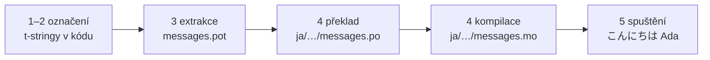

# Tutoriál

Tato stránka vede od prázdného adresáře k programu, který zdraví japonsky.
Pět kroků, žádné zkušenosti s gettextem se nepředpokládají a každý příkaz je
ukázán s výstupem, který skutečně produkuje — takže v každém kroku víte, zda
jste na správné cestě.

Potřebujete Python 3.14 nebo novější, protože t-stringy jsou nová syntaxe
ve 3.14. Cílovým jazykem příkladu je na této stránce japonština, ale na té
volbě nic nezávisí — dosaďte v kroku 4 libovolný jazyk; kód locale `ja` je
jediné místo, které ho jmenuje.

## 1. Nainstalujte { #1-install }

```console
python -m pip install "gettext-tstrings[babel]"
```

Extra `[babel]` přináší [Babel], nástroj, který v kroku 3 posbírá vaše zprávy
do katalogových souborů. Je to nástroj pro vývoj: produkční kód vykresluje
jen se standardní knihovnou.

## 2. Označte zprávu v kódu { #2-mark-a-message-in-your-code }

Vytvořte `app.py`:

```python
from gettext_tstrings import tr

name = "Ada"
print(tr(t"Hello {name}"))
```

`t"Hello {name}"` vypadá jako f-string, ale prefix `t` drží text a hodnotu
odděleně, místo aby je na místě sloučil. Právě toto oddělení umožňuje, aby si
`tr()` vyhledalo překlad celé věty `Hello {name}` a hodnotu vložilo až potom.

Spusťte to hned:

```console
$ python app.py
Hello Ada
```

Zatím nejsou nainstalovány žádné překlady, takže se zdrojový text vykreslí
tak, jak je. Program používající tuto knihovnu ke svému běhu katalog nikdy
*nevyžaduje* — angličtina (nebo jakýkoli je váš zdrojový jazyk) je vestavěná
záloha.

## 3. Extrahujte zprávy { #3-extract-the-messages }

Překladatelé váš zdrojový kód nečtou; mezi vámi a jimi putuje malý soubor
zvaný **katalog**. Prvním krokem k němu je posbírat z kódu každou označenou
zprávu.

Řekněte Babelu, jak vaše zprávy najít, vytvořením `babel.cfg`:

```ini
[gettext_tstrings: **.py]
encoding = utf-8
```

Pak extrahujte do souboru šablony (`.pot`):

```console
$ mkdir -p locales
$ pybabel extract -F babel.cfg -c "Translators:" -o locales/messages.pot .
extracting messages from app.py (encoding="utf-8")
writing PO template file to locales/messages.pot
```

`locales/messages.pot` teď obsahuje jeden záznam na zprávu:

```po
#. gettext-tstrings
#: app.py:4
#, python-brace-format
msgid "Hello {name}"
msgstr ""
```

`msgid` je klíč, který bude váš kód vyhledávat. Prázdný `msgstr` je místo pro
překlad — ale ne v tomto souboru: `.pot` je *šablona* a další krok ji
zkopíruje jednou pro každý jazyk.

## 4. Přeložte a zkompilujte { #4-translate-and-compile }

Vytvořte ze šablony japonský katalog:

```console
$ pybabel init -i locales/messages.pot -d locales -l ja
creating catalog locales/ja/LC_MESSAGES/messages.po based on locales/messages.pot
```

Otevřete `locales/ja/LC_MESSAGES/messages.po` a vyplňte `msgstr`:

```po
msgid "Hello {name}"
msgstr "こんにちは {name}"
```

Ponechte `{name}` přesně tak, jak je — zástupný symbol je způsob, jakým si
hodnota najde místo uvnitř přeložené věty, a překlad ho smí volně přesunout,
kamkoli to cílový jazyk potřebuje. Ve skutečném projektu je tento soubor
`.po` tím, co předáváte překladateli nebo nahráváte na překladatelskou
platformu; formát je v obou případech stejný.

Katalogy se editují jako text, ale načítají v binární podobě (`.mo`), takže
zkompilujte:

```console
$ pybabel compile -d locales
compiling catalog locales/ja/LC_MESSAGES/messages.po to locales/ja/LC_MESSAGES/messages.mo
```

Tento příkaz je zároveň záchranná síť. Kdyby překlad poškodil zástupný
symbol — řekněme `{nome}` místo `{name}` — odmítl by projít:

```console
$ pybabel compile -d locales
error: locales/ja/LC_MESSAGES/messages.po:24: translation does not match the
source placeholders: {name} is missing; {nome} is not in the source message
1 errors encountered.
```

## 5. Spusťte to { #5-run-it }

Nasměrujte `app.py` na zkompilovaný katalog. Klikněte na značky a uvidíte, co
který řádek dělá:

```python
import gettext

from gettext_tstrings import Translator

_ = Translator(gettext.translation("messages", localedir="locales", languages=["ja"]))  # (1)!

name = "Ada"
print(_(t"Hello {name}"))  # (2)!
```

1. Standardní knihovna načte zkompilovaný `.mo` a `Translator` ho naváže na
   volatelný objekt. `_` je konvenční gettextové jméno pro „přelož tohle" —
   krátké, protože se objevuje u každého řetězce viditelného uživateli. Je to
   tatáž funkce jako `tr`, navázaná na jeden katalog.
2. V místě volání: text t-stringu se stane vyhledávacím klíčem `Hello {name}`,
   katalog odpoví `こんにちは {name}`, odpověď se zkontroluje proti zdrojovým
   zástupným symbolům a teprve potom se vloží hodnota.

```console
$ python app.py
こんにちは Ada
```

To je celá smyčka a stojí za to vidět ji jako jeden obrázek:



**Označit → extrahovat → přeložit → zkompilovat → spustit.** Všechno ostatní
na tomto webu je zjemněním jednoho z těchto pěti kroků.

## Kam dál { #where-next }

- [Proč t-stringy](comparison.md) — před čím vás tento návrh chrání ve
  srovnání s `%(name)s`, `.format()` a `$`-stringy.
- [Průvodce](guide.md) — množná čísla, jazyky podle požadavku, odložené řetězce
  a co se za běhu stane, když je katalog přesto špatně.
- [V produkci](workflow.md) — tatáž smyčka, jak ji týden co týden provozuje
  tým: aktualizace katalogů, brány v CI a překladatelské platformy.
- [Extrakce](extraction.md) — úplná reference `pybabel`: vlastní jména
  funkcí, striktní režim pro CI a kontroly, které hlídají vaše katalogy.

  [Babel]: https://babel.pocoo.org/
