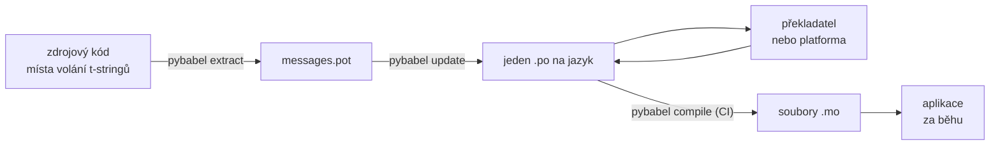

# V produkci

[Tutoriál](tutorial.md) projde smyčku jednou, o samotě, na programu s jedinou
zprávou. Ve skutečném projektu se smyčka točí dál: zprávy se mění poté, co už
byly přeloženy, překladatel pracuje jinde a podle vlastního rozvrhu a
zkompilovaný katalog vychází s každým vydáním. Tato stránka je právě tou
praxí — co zůstává v repozitáři, co cestuje, co musí hlídat CI a kde běhové
prostředí váže jazyk.

Dohromady to dává šest kontrol, takže tady jsou hned na začátek; každá sekce
níže jednu z nich nastavuje.

- `pybabel update --check` prochází — žádná zpráva se nezměnila, aniž by
  se to katalogy dozvěděly.
- `pybabel compile` hlídá build svým návratovým kódem.
- Zbývající záznamy `fuzzy` jsou záměrné — každý se vykresluje jako
  zdrojový text, dokud jej překladatel nepotvrdí.
- Testovací sada vykreslí každý dodávaný jazyk jednou se `strict=True`.
- Produkční artefakt obsahuje soubory `.mo` a žádný Babel.
- Logger `gettext_tstrings` je napojen na monitoring.

## Tvar projektu { #the-shape-of-a-project }

```text
myapp/
├── babel.cfg
├── pyproject.toml
├── src/
│   └── myapp/
└── locales/
    ├── messages.pot
    ├── ja/LC_MESSAGES/messages.po
    └── de/LC_MESSAGES/messages.po
```

Commitujte `babel.cfg`, šablonu `.pot` a každý `.po` — jsou to zdroje
překladového buildu a jejich diffy jsou způsobem, jak revidovat změny
překladů. Zkompilované soubory `.mo` jsou artefakty buildu: vytvářejte je
v CI nebo při balení, místo abyste je commitovali, aby se `.po` a jeho `.mo`
nikdy nemohly rozcházet v tom, co se dodává.

Jeden soubor má roli v každém směru: `.pot` nese vaše zprávy *ven*
k překladatelům, soubory `.po` nesou překlady *zpět*. Zbytek této stránky je
o tom, co se mezi nimi pohybuje.



## Cyklus po prvním překladu { #the-cycle-after-the-first-translation }

Tutoriálový `pybabel init` se běžně spouští jednou, když se jazyk přidává.
Od té chvíle je pracovní cyklus **extrakce → aktualizace → překlad →
kompilace** a jeho středem je `pybabel update`, který vpraví čerstvou šablonu
do existujících katalogů, aniž by zahodil překlady, které v nich už jsou.

Předpokládejme, že pozdrav `Hello {name}` — už přeložený jako
`こんにちは {name}` — je v kódu přeformulován na `Welcome back, {name}`.
Extrahujte a aktualizujte:

```console
$ pybabel extract -F babel.cfg -c "Translators:" -o locales/messages.pot .
extracting messages from app.py (encoding="utf-8")
writing PO template file to locales/messages.pot
$ pybabel update -i locales/messages.pot -d locales
updating catalog locales/ja/LC_MESSAGES/messages.po based on locales/messages.pot
```

Japonský katalog nyní obsahuje:

```po
#. gettext-tstrings
#: app.py:4
#, fuzzy, python-brace-format
msgid "Welcome back, {name}"
msgstr "こんにちは {name}"
```

Babel si všiml, že nový msgid připomíná odstraněný, a spároval jej se
starým překladem — ale označil dvojici jako **fuzzy**: strojový odhad
čekající na člověka. Tento příznak mění to, co se zkompiluje.
`pybabel compile` **vylučuje fuzzy záznamy z `.mo`**, takže dokud
překladatel dvojici nepotvrdí, aplikace vykresluje nový anglický text, a ne
zastaralý japonský:

```console
$ pybabel compile -d locales
compiling catalog locales/ja/LC_MESSAGES/messages.po to locales/ja/LC_MESSAGES/messages.mo
$ python app.py
Welcome back, Ada
```

Změněná zpráva tedy degraduje stejně jako rozbitá — na zdrojový jazyk,
nikdy na zastaralý překlad. Úkolem překladatele v cyklu je upravit
`msgstr` a smazat příznak `fuzzy`; příští kompilace záznam převezme.

!!! note "Názvy zástupných symbolů jsou součástí identity zprávy"

    Msgid je klíčem katalogu a *název* zástupného symbolu je uvnitř něj —
    takže přejmenování proměnné v kódu (`name` → `user_name`) změní msgid
    a pošle překlad v každém jazyce znovu fuzzy cyklem. Pojmenovávejte
    interpolované proměnné slovy, kterým překladatel porozumí, a
    přejmenovávejte je jen z dobrého důvodu.

    Formátování je zrcadlovým obrazem: `!r` a `:.2f` [nejsou součástí
    msgid](internals.md#from-template-to-msgid), takže zpřísnění
    `{amount:,.2f}` na `{amount:,.0f}` nezmění v žádném katalogu nic.
    Přeformulování *věty* je ovšem skutečná změna — to je cyklus výše.

## Co hlídá CI { #what-ci-gates }

Tři selhání stojí za červený build: katalogy zaostaly za kódem, překlad
rozbil zástupný symbol, nebo rozbitý záznam proklouzl až do běhového
prostředí. Jeden krok na každé selhání:

```yaml
- run: pybabel extract -F babel.cfg -c "Translators:" -o locales/messages.pot .
- run: pybabel update -i locales/messages.pot -d locales --check
- run: pybabel compile -d locales
- run: pytest
```

`pybabel update --check` nic nepřepisuje a končí s nenulovým kódem, když
je katalog zastaralý vůči čerstvě extrahované šabloně — to je pojistka
proti sloučení kódu, jehož zprávy nikdo znovu neextrahoval.
`pybabel compile` spouští kontroly zástupných symbolů jak Babelu, tak
[registrovaného checkeru](extraction.md#your-existing-toolchain-validates-these-catalogs)
tohoto balíčku.

!!! bug "Babel 2.18.0: `--check` neumí hlídat katalog, který používá kontexty"

    Na Babelu 2.18.0 hlásí `pybabel update --check` **každý** katalog
    obsahující `msgctxt` jako zastaralý, při každém spuštění, jakkoli je
    aktuální. Trvale selhávající brána je horší než žádná, protože ji tým
    vypne — takže pokud `pgettext` nebo `npgettext` vůbec používáte, tento
    krok raději nahraďte, než abyste s ním žili. Přečíst šablonu a každý
    katalog pomocí `babel.messages.pofile.read_po` a porovnat
    `{(m.context, m.id) for m in catalog if m.id}` je celá ta kontrola —
    a přesně to dělá [build tohoto webu](index.md). Příčina je
    [rozepsaná na stránce Úskalí](pitfalls.md#your-tools-have-bugs-too).

!!! danger "Kontrolujte návratový kód, ne log"

    `pybabel compile` nahlásí každou chybu zástupných symbolů, skončí
    s nenulovým kódem — **a přesto `.mo` zapíše**. Pipeline, která
    kompiluje a pak kopíruje `locales/` do image, dodá rozbitý katalog,
    pokud ji nenulový návratový kód skutečně nezastaví. Nechat tento krok
    shodit build, jak výše, je celá oprava.

Poslední řádek je vaše běžná testovací sada s jedním přidaným návykem:
někde v ní vykreslete alespoň jednu zprávu za každý dodávaný jazyk přes
striktní translator —

```python
import gettext

from gettext_tstrings import Translator


def test_catalogs_render(language: str) -> None:
    translations = gettext.translation("messages", localedir="locales", languages=[language])
    _ = Translator(translations, strict=True)
    name = "Ada"
    assert _(t"Welcome back, {name}")
```

— protože `strict=True` [vyhazuje výjimku tam, kde by produkce tiše
ustoupila](guide.md#what-happens-when-a-catalog-is-wrong), a vykreslení za
běhu je jediná kontrola, která vidí katalog přesně tak, jak jej uvidí
aplikace, včetně `.mo`.

## Práce s překladateli a platformami { #working-with-translators-and-platforms }

Soubor `.po` je výměnným formátem celého světa gettextu, a to je důvod,
proč jej tato knihovna znovu využívá: předat překlad znamená předat
soubor, ať už je příjemcem kolega s PO editorem, nebo platforma jako
Weblate či Crowdin. Tři věci zajistí, že předání funguje dobře:

**Řekněte, k čemu zpráva slouží.** Komentář v kódu cestuje se zprávou —
právě to sbírá přepínač `-c "Translators:"`:

```python
from gettext_tstrings import tr

name = "Ada"
# Translators: shown on the dashboard right after sign-in
print(tr(t"Welcome back, {name}"))
```

```po
#. Translators: shown on the dashboard right after sign-in
#. gettext-tstrings
#: app.py:5
#, python-brace-format
msgid "Welcome back, {name}"
msgstr ""
```

Překladatel ten komentář vidí ve svém editoru, hned vedle zprávy, na
druhém konci světa. Je to nejlevnější páka kvality v celém pracovním
postupu. Pro slovo, které je samo sobě homonymem — „Open“ jako tlačítko
versus „Open“ jako stav — dejte zprávě [kontext](guide.md#binding-a-catalog)
pomocí `pgettext`, který se v katalogu stane viditelným `msgctxt`.

**Nechte platformu validovat zástupné symboly.** Každá zpráva extrahovaná
z t-stringu nese příznak `python-brace-format` a tento jediný řádek zapíná
QA zástupných symbolů v nástrojích, které nemáte pod kontrolou — Weblate
tuto kontrolu dokumentuje, komerční platformy na tomtéž příznaku staví své
vlastní a `msgfmt --check-format` ji vynucuje v každé GNU pipeline.
Podrobnosti — a co nad jejich rámec zachytí přibalený checker — najdete na
[stránce extrakce](extraction.md#your-existing-toolchain-validates-these-catalogs).

**Důvěřujte záchranné síti přesně tak daleko, kam sahá.** Cokoli se
z platformy vrátí, jsou stále data vstupující do vašeho buildu; brány CI
výše jsou tím, co promění „platforma to nejspíš zkontrolovala“ v „tohle
nemůže odejít rozbité“.

## Vázání jazyka za běhu { #binding-a-language-at-runtime }

Vše dosud vytváří katalogy. Zbývá rozhodnout, kde si aplikace jeden z nich
vybere. Važte jednou na *rozsah jazyka* — proces u CLI, požadavek u webové
služby.

=== "Jeden proces, jeden jazyk"

    Nástroj příkazové řádky nebo desktopová aplikace čte prostředí
    uživatele jednou, při startu. Vynecháte-li `languages=`, necháte
    standardní knihovnu vyjednávat z `LANGUAGE`, `LC_ALL`, `LC_MESSAGES`
    a `LANG`; `fallback=True` vrátí nulový katalog — zdrojový text —
    místo vyhození výjimky, když žádná z nich neodpovídá katalogu, který
    dodáváte.

    ```python
    import gettext

    from gettext_tstrings import Translator

    _ = Translator(gettext.translation("messages", localedir="locales", fallback=True))

    name = "Ada"
    print(_(t"Welcome back, {name}"))
    ```

=== "Flask"

    Webová aplikace rozhoduje za každý požadavek. Načtěte každý katalog
    jednou při importu a pak vyjednaný katalog navažte na kontext dřív,
    než se spustí view — [`set_translations`](guide.md#per-request-language)
    je lokální vůči kontextu, takže souběžné požadavky v různých jazycích
    nikdy nevidí vzájemně svá vázání.

    ```python
    import gettext

    from flask import Flask, request

    from gettext_tstrings import set_translations, tr

    LANGUAGES = ("en", "ja", "de")
    CATALOGS = {
        language: gettext.translation(
            "messages", localedir="locales", languages=[language], fallback=True
        )
        for language in LANGUAGES
    }

    app = Flask(__name__)


    @app.before_request
    def bind_language() -> None:
        language = request.accept_languages.best_match(LANGUAGES) or "en"
        set_translations(CATALOGS[language])


    @app.get("/")
    def home() -> str:
        name = "Ada"
        return tr(t"Welcome back, {name}")
    ```

=== "ASGI middleware"

    Pod asynchronními frameworky — FastAPI, Starlette a čímkoli dalším na
    ASGI — obalte požadavek do
    [`use_translations`](guide.md#per-request-language): vázání žije
    v `ContextVar`, který přepínání asynchronních úloh zachovává pro každý
    požadavek.

    ```python
    import gettext

    from fastapi import FastAPI, Request

    from gettext_tstrings import tr, use_translations

    LANGUAGES = ("en", "ja", "de")
    CATALOGS = {
        language: gettext.translation(
            "messages", localedir="locales", languages=[language], fallback=True
        )
        for language in LANGUAGES
    }

    app = FastAPI()


    @app.middleware("http")
    async def bind_language(request: Request, call_next):
        language = negotiate_language(request.headers.get("accept-language"), LANGUAGES)
        with use_translations(CATALOGS[language]):
            return await call_next(request)
    ```

    `negotiate_language` zastupuje vaše parsování Accept-Language —
    většina frameworků nebo jejich ekosystémů nějaké poskytuje; podstatné
    je zde vázání kolem `call_next`.

Dva běhové návyky doplňují obraz. Řetězce vytvářené při importu — popisek
formuláře, zobrazovaný název enumu — nesmějí zachytit jazyk, který byl
zrovna aktivní během importu; definujte je pomocí
[`lazy_gettext`](guide.md#deferred-translation) a vykreslí se v jazyce
aktivním při *použití*. A směrujte logger `gettext_tstrings` někam, kam se
dívá člověk: jeho varování jsou benevolentní režim hlásící překlad, který
proklouzl každou branou — jeden řádek na rozbitou zprávu, ne jeden na
každé vykreslení.

## Nasazení { #shipping }

Produkce potřebuje balíček, soubory `.mo` a nic jiného. Babel je závislost
pro vývoj a CI — nechte `gettext-tstrings[babel]` mimo produkční image a
instalujte tam holý balíček; vykreslování běží jen na standardní knihovně.
Kompilujte katalogy v tomtéž buildu, který vytváří nasazovaný artefakt,
aby soubory `.mo` uvnitř byly přesně těmi zrevidovanými soubory `.po` a
nic zkompilovaného na něčím laptopu nikdy neodešlo.

Jak katalogy cestují, závisí na tom, co nasazujete. Wheel je nese jako data
balíčku, což znamená, že musí ležet *uvnitř* adresáře balíčku —
`src/myapp/locales/`, ne v `locales/` na nejvyšší úrovni — a build backendu
je třeba říct, aby zahrnul soubory, které `.gitignore` běžně skrývá:

=== "Hatchling"

    ```toml
    [tool.hatch.build]
    # .mo files are build output, so they are gitignored; name them or the
    # wheel ships without a single translation.
    artifacts = ["src/myapp/locales/**/*.mo"]
    ```

=== "setuptools"

    ```toml
    [tool.setuptools.package-data]
    myapp = ["locales/*/LC_MESSAGES/*.mo"]
    ```

Čtěte je zpátky skrze balíček, ne skrze cestu relativní ke zdrojovému
stromu, která přestane existovat ve chvíli, kdy je wheel nainstalován:

```python
import gettext
from importlib.resources import as_file, files

with as_file(files("myapp") / "locales") as localedir:
    translations = gettext.translation("messages", localedir=localedir, languages=["ja"])
```

Kontejnerový image to má snazší: zkompilujte během build fáze a výsledek
zkopírujte, přičemž Babel v té fázi zůstane.

```dockerfile
FROM python:3.14-slim AS build
COPY . /src
RUN cd /src && python -m pip install ".[babel]" \
    && pybabel compile -d src/myapp/locales

FROM python:3.14-slim
COPY --from=build /src /src
RUN python -m pip install /src   # no [babel]: rendering needs the stdlib only
```

Před vydáním — kontrolní seznam, na který se tato stránka redukuje:

- `pybabel update --check` prochází — žádná zpráva se nezměnila, aniž by
  se to katalogy dozvěděly.
- `pybabel compile` hlídá build svým návratovým kódem.
- Zbývající záznamy `fuzzy` jsou záměrné — každý se vykresluje jako
  zdrojový text, dokud jej překladatel nepotvrdí.
- Testovací sada vykreslí každý dodávaný jazyk jednou se `strict=True`.
- Produkční artefakt obsahuje soubory `.mo` a žádný Babel.
- Logger `gettext_tstrings` je napojen na monitoring.

## Kam dál { #where-next }

- [Extrakce](extraction.md) — reference k nástrojové polovině této
  stránky: volby mapování, vlastní názvy funkcí, striktní režim a každý
  checker.
- [Průvodce](guide.md) — běhová polovina: množná čísla, kontexty, odložené
  řetězce a režimy selhání do detailu.
- [Jak to funguje](internals.md) — proč msgid vypadá tak, jak vypadá, a co
  validace skutečně kontroluje.
