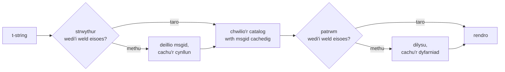

# Sut mae'n gweithio

Nid oes dim ar y dudalen hon yn ofynnol er mwyn defnyddio'r llyfrgell — mae'r
[tiwtorial](tutorial.md) a'r [canllaw](guide.md) yn ymdrin â hynny. Yn lle
hynny, mae'r dudalen hon yn ailadeiladu'r llyfrgell o'r egwyddorion cyntaf: beth
yw llinyn-t mewn gwirionedd, sut y mae msgid yn syrthio allan ohono, beth sy'n
gwneud cyfieithiad yn ddilys, a sut y mae'r gweithrediad yn gwneud i'r holl
wirio hwnnw gostio degfedau o ficrosecond. Darllenwch hi os ydych yn chwilfrydig,
os ydych am gyfrannu, neu os ydych yn bwriadu
[gweithredu'r confensiwn eich hun](#reimplementing-it).

## Beth yw llinyn-t mewn gwirionedd { #what-a-t-string-actually-is }

Mae llinyn-f yn cynhyrchu `str`, ac yn ei gynhyrchu ar unwaith — erbyn i unrhyw
ffwythiant ei dderbyn, mae'r gwerth wedi'i ryngosod ac mae'r frawddeg wedi'i
selio. Mae gan linyn-t ([PEP 750]) yr un gystrawen a'r un gwerthuso awchus o'i
ymadroddion, ond mae'n cynhyrchu math gwahanol:

```pycon
>>> name = "Ada"
>>> f"Hello {name}!"
'Hello Ada!'
>>> t"Hello {name}!"
Template(strings=('Hello ', '!'), interpolations=(Interpolation('Ada', 'name', None, ''),))
```

Mae'r gwrthrych `Template` hwnnw'n cadw'r rhannau y mae piblinell gatalog eu
hangen, yn dal ar wahân:

```pycon
>>> template = t"Total: {amount:,.2f}"
>>> template.strings
('Total: ', '')
>>> template.interpolations[0].expression
'amount'
>>> template.interpolations[0].value
1234.5
>>> template.interpolations[0].format_spec
',.2f'
```

- `strings` — y testun llythrennol o amgylch y rhyngosodiadau, yn nhrefn.
- Ar gyfer pob rhyngosodiad: yr **ymadrodd** fel testun ffynhonnell
  (`'amount'`), ei **werth** wedi'i werthuso (`1234.5`), ac unrhyw
  **drawsnewidiad** (`!r`) a **manyleb fformat** (`,.2f`) — a gludir ar wahân yn
  lle eu cymhwyso.

Bwyta disgybledig o'r strwythur hwnnw yw popeth y mae'r llyfrgell hon yn ei
wneud. Mae'r iaith eisoes wedi gwneud yr un gwahaniad y mae i18n ei angen —
testun statig ar wahân i werthoedd — felly nid yw'r llyfrgell byth yn parsio
eich cod ffynhonnell ac nid yw byth yn dyfalu ble mae gwerth yn eistedd y tu
mewn i frawddeg. Yr hyn sy'n weddill yw tri phenderfyniad: sut y mae'r strwythur
yn dod yn allwedd catalog, beth gaiff cyfieithiad o'r allwedd honno ei ddweud, a
sut y mae'r ddau'n rendro'n ôl gyda'i gilydd.

## O dempled i msgid { #from-template-to-msgid }

Deillir msgid — yr allwedd y mae catalog wedi'i fynegeio wrthi — o rannau
*statig* y templed yn unig. Cerddwch `strings` ac `interpolations` yn nhrefn y
ffynhonnell; dyblwch fracedi pob segment llythrennol i ddianc (`{` yn dod yn
`{{`); ar gyfer pob rhyngosodiad, allyrrwch un tocyn `{name}`, lle mai `name` yw
testun yr ymadrodd â bylchau o'i amgylch wedi'u tynnu. O
`t"Total: {amount:,.2f}"`:

```text
strings         ('Total: ', '')
interpolations  expression 'amount'   conversion None   format_spec ',.2f'
msgid           'Total: {amount}'
```

Mae rheswm i bob rhan o'r rheol honno:

- **Rhaid i'r ymadrodd fod yn enw syml** — mae `str.isidentifier()` yn wir ac
  nid yw'n allweddair Python. Gwrthodir `t"Hello {user.name}"` yn safle'r
  alwad. *Allwedd* yw msgid: rhaid iddi ddod allan yn union yr un fath ar bob
  rhediad a phob echdyniad, a chaiff ei darllen gan gyfieithwyr, felly rhaid i'r
  daliwr lle fod yn air sefydlog, ystyrlon — nid yn ddarn o god sy'n gwahodd y
  catalog i ddod yn iaith ymadroddion.
- **Nid yw'r trawsnewidiad a'r fanyleb fformat byth yn mynd i mewn i'r msgid.**
  Ni ddylai fod raid i gyfieithwyr ddarllen `:,.2f`, ac ni ddylai unrhyw
  gyfieithiad allu ei newid. Mae'r canlyniad yn werth ei wybod: nid yw tynhau
  `:,.2f` yn `:,.0f` yn eich cod yn newid unrhyw msgid, felly nid yw'n annilysu
  unrhyw gyfieithiad mewn unrhyw iaith. Mae allwedd y catalog yn dilyn *yr hyn y
  mae'r frawddeg yn ei ddweud*, nid sut y caiff y gwerth ei fformatio.
- **Rhaid i enw a ailadroddir ailadrodd ei fformatio'n union.** Gwrthodir
  `t"{x:.2f} vs {x:.3f}"`, am fod y ddau ddigwyddiad yn cwympo i'r un tocyn
  `{x}` ac ni allai'r msgid ddweud mwyach pa fformatio y dylai rendro ei
  ddefnyddio.
- **Ni chwilir byth am y msgid gwag**, am fod gettext yn ei gadw ar gyfer pennyn
  metadata'r catalog ei hun. Mae `t""` yn rendro fel `""` heb gyffwrdd â'r
  catalog.

Y set reolau lawn, gan gynnwys achosion ymylol y mae'r dudalen hon yn eu
hepgor, yw
[SPEC §2](https://github.com/yhay81/gettext-tstrings/blob/main/SPEC.md).

## Beth gaiff cyfieithiad ei ddweud { #what-a-translation-may-say }

Caiff patrwm sy'n dod yn ôl o gatalog ei barsio â `string.Formatter` — yr un
parsiwr y mae `str.format` yn ei ddefnyddio. Benthycir y gramadeg yn fwriadol yn
hytrach na'i ddyfeisio: patrwm y mae'r ecosystem ehangach eisoes yn ei ddeall yw
un y mae'r llyfrgell hon yn ei dderbyn. Wedyn mae dau wiriad yn gymwys.

**Siâp:** rhaid i bob maes fod yn `{name}` noeth. Gwrthodir trawsnewidiad neu
fanyleb fformat — gan gynnwys y `{name:}` gwag penodol — fel y gwrthodir meysydd
safleol (`{0}`, `{}`) ac enwau wedi'u padio â bylchau (`{ name }`). Mae'r un
olaf o bwys mwy nag y mae'n ymddangos: mae `str.format` a `msgfmt` GNU ill dau
yn gwrthod `{ name }`, felly byddai ei dderbyn yma'n cynhyrchu catalogau na all
unrhyw offeryn arall yn y gadwyn eu dilysu.

**Enwau:** cymherir set dalwyr lle'r patrwm â set y ffynhonnell. Ar gyfer neges
unigol mae pob enw ffynhonnell yn *ofynnol* ac nid *caniateir* dim arall. Ar
gyfer neges luosog cyfunir y ddwy gangen:

- **caniateir** = uniad enwau'r ddwy gangen
- **gofynnol** = eu croestoriad

Felly yn erbyn `t"One file"` / `t"{n} files"`, caniateir yr enw `n` mewn
cyfieithiad o'r naill ffurf neu'r llall ond nid yw'n ofynnol gan yr un. Yr
anghymesuredd hwnnw sy'n gadael i system luosog iaith darged fod yn wahanol i un
y ffynhonnell — mae Japaneg yn cyfieithu'r ddwy gangen ag un ffurf sy'n debygol
o ddefnyddio `{n}`; gall fod angen `{n}` ar iaith â mwy o ffurfiau na'r Saesneg
mewn ffurf lle nad oes gan y Saesneg yr un.

Nid yw dim o hynny'n ddamcaniaethol: mae catalog cragen y wefan hon ei hun yn
cario'r neges luosog `Built {n} localized page` / `Built {n} localized pages` —
dwy gangen Saesneg — ac mae argraffiadau'r wefan yn cyfieithu'r un neges honno i
unrhyw le rhwng un ffurf a chwech:

| Catalog | Ffurfiau | Y cyfieithiadau, yn nhrefn y ffurfiau |
| --- | --- | --- |
| Japaneg | 1 | `ローカライズ済みページを{n}件ビルドしました` |
| Twrceg | 2 | `{n} yerelleştirilmiş sayfa oluşturuldu` — ddwywaith, yr un fath: mae enwau Twrceg yn aros yn unigol ar ôl rhifolyn |
| Eidaleg | 2 | `Generata {n} pagina localizzata` · `Generate {n} pagine localizzate` — mae'r rhangymeriad yn cytuno o ran cenedl a rhif |
| Latfieg | 3 | `Izveidota {n} lokalizēta lapa` · `Izveidotas {n} lokalizētas lapas` · `Izveidots {n} lokalizētu lapu` — ar gyfer **sero'n unig** y mae'r drydedd ffurf |
| Rwseg | 3 | `Собрана {n} локализованная страница` · `Собраны {n} локализованные страницы` · `Собрано {n} локализованных страниц` |
| Pwyleg | 3 | `Zbudowano {n} zlokalizowaną stronę` · `Zbudowano {n} zlokalizowane strony` · `Zbudowano {n} zlokalizowanych stron` |
| Slofeneg | 4 | `Zgrajena {n} lokalizirana stran` · `Zgrajeni {n} lokalizirani strani` · `Zgrajene {n} lokalizirane strani` · `Zgrajenih {n} lokaliziranih strani` — **deuol** yw'r ail, ar gyfer union ddau |
| Gwyddeleg | 5 | `Tógadh {n} leathanach logánaithe` · `Tógadh {n} leathanaigh logánaithe` — un, dau, 3–6, 7–10, a'r gweddill; mae'r bôn yn amrywio ond mae *leathanach* yn dechrau ag `l`, nad yw'r un treiglad Gwyddeleg yn ei ysgrifennu, felly mae sawl ffurf yn cyd-daro |
| Arabeg | 6 | yn eu plith `تم إنشاء صفحة مترجمة واحدة ({n})` ar gyfer union un a `تم إنشاء {n} صفحات مترجمة` ar gyfer ychydig |

Mae pob rhes yn gofnod byw yn `i18n/*/LC_MESSAGES/site.po` y storfa hon, wedi'i
rendro gan yr [adeiladu amlieithog](index.md) ar bob rhyddhad — ac mae prawf yn
pinio'r tabl hwn i'r catalogau hynny, fel na all y ddau ymwahanu.

O fewn y ffiniau hynny, mae aildrefnu ac ailadrodd yn fwriadol ddigyfyngiad. Mae'r
ddau'n ramadegol angenrheidiol mewn ieithoedd go iawn, a byddai cyfyngu ar nifer
y digwyddiadau'n gwrthod cyfieithiadau cywir heb unrhyw fudd diogelwch:
ni all cyfieithiad *werthuso* dim o hyd, am nad oes llwybr gwerthuso'n bodoli —
chwilir am ddalwyr lle wrth eu henwau yng ngwerthoedd y templed a gyfrifwyd
eisoes, ni chânt byth eu bwydo i `eval`, `getattr`, nac i `str.format` ei hun.

## Rendro { #rendering }

Mae rendro patrwm wedi'i ddilysu'n daith gerdded dros ei ddarnau: allyrrwch bob
rhan lythrennol, ac ar gyfer pob daliwr lle, cymerwch werth a ddaliwyd y
rhyngosodiad a chymhwyswch y trawsnewidiad a'r fanyleb fformat *ochr y
ffynhonnell* — `format(convert(value, conversion), format_spec)`. Cedwir dwy
warant wrth wneud hynny:

- **Caiff pob gwerth gwahanol ei fformatio unwaith ar y mwyaf fesul rendro**,
  hyd yn oed pan fo'r cyfieithiad yn ailadrodd daliwr lle. Mae ailadrodd yn
  newid pa mor aml y mewnosodir y canlyniad, nid pa mor aml y mae eich
  `__format__` yn rhedeg.
- **Ar gyfer lluosogion, mae daliwr lle'n darllen y gangen a'i diffiniodd.** Mae
  enw sy'n bresennol yn y ddwy gangen yn darllen y gwerth a ddaliwyd gan y
  gangen y mae'r iaith *ffynhonnell* yn ei dewis (`singular` pan fo `n == 1`,
  fel arall `plural`); mae enw sy'n perthyn i un gangen bob amser yn darllen ei
  gangen ei hun, hyd yn oed pan fo rheolau lluosog yr iaith darged wedi'i wneud
  ar gael mewn ffurf arall.

Pan fo dilysu'n methu adeg rendro, rhennir yr ymateb yn ôl pwy a gyflenwodd y
patrwm. Mae patrwm a ddaeth allan o *gatalog* yn diraddio: cofnodwch un rhybudd
a rendrwch y testun ffynhonnell, gan gadw contract gettext nad yw catalog
toredig byth yn bwrw'r rhaglen i lawr
([mae'r canllaw'n dangos y ddau fodd](guide.md#what-happens-when-a-catalog-is-wrong)).
Mae patrwm a basiodd y galwr i mewn yn uniongyrchol —
`CompiledTemplate.render` — bob amser yn codi gwall, am nad oes testun
ffynhonnell i ddiraddio *ohono*; mae goddefgarwch yn bodoli ar gyfer chwilio
catalogau, nid ar gyfer ymresymiadau.

## Mae diagnosteg yn rhan o'r dyluniad { #diagnostics-are-part-of-the-design }

Mae gwall daliwr lle fel arfer yn glanio o flaen cyfieithydd, nid rhaglennydd,
ac yn aml mewn ffeil lle mae'r broblem yn anweledig. Mae dweud
`{name} is missing` wrth rywun sy'n gallu gweld yr union nodau hynny yn ei
olygydd yn ben ffordd, felly cyfrifir y negeseuon â thair rheol:

- Argraffir enw sy'n cynnwys **nod anweledig** — bwlch di-dor a gynhyrchodd dull
  mewnbwn, bwlch dim-lled — gyda'r nod hwnnw wedi'i ddisodli gan ei bwynt cod,
  yn ei le: `{<U+00A0>name}`. Mae angen i'r darllenydd weld *ble*.
- Dangosir enw y mae ei lythrennau'n **cymysgu systemau ysgrifennu**, yr achos
  homoglyff, ddwywaith — unwaith yn ddarllenadwy, unwaith wedi'i ddianc — am fod
  `{nаme}` ag `а` Cyrilig yn anwahanadwy oddi wrth `{name}` mewn print, a'r
  ffurf wedi'i dianc `(nаme)` yw'r unig sillafiad sy'n gwahaniaethu rhyngddynt.
- Dangosir popeth arall **fel yr ysgrifennwyd**. Enwau cyffredin yw `{名前}` a
  `{café}`; byddai eu dianc yn gadael y darllenydd yn methu â dod o hyd i'r hyn
  a olygwyd.

Ar yr un egwyddor, caiff daliwr lle "coll" sydd *yn edrych* yn bresennol ei
absenoldeb wedi'i esbonio — bracedi lled-llawn o ddull mewnbwn Dwyrain Asiaidd,
dyblu `{{name}}` o daith osgoi, yr enw y tu allan i unrhyw fracedi. Mae
[tabl darllen methiannau](translators.md#reading-a-failure-message) a
ysgrifennwyd ar gyfer cyfieithwyr yn dangos pob un o'r negeseuon hyn air am air.

## Y llwybr poeth { #the-hot-path }

Mae popeth uchod yn digwydd ar bob llinyn wedi'i gyfieithu y mae rhaglen yn ei
rendro, felly adeiledir y gweithrediad o amgylch un syniad: **ni chaiff dilysu
byth ei hepgor, felly dilysu yw'r hyn y mae'n rhaid ei gachu.**



Tri chache, un fesul cam:

- **Cynllun fesul strwythur safle galw.** Tiwpl `strings` y templed — gwrthrych
  y mae'r dehonglydd eisoes wedi'i adeiladu — yw allwedd y cache, felly nid yw
  chwiliad yn dyrannu dim. Ar drawiad, cymherir ymadrodd, trawsnewidiad, a
  manyleb fformat pob rhyngosodiad â'r rhai a gofnodwyd o hyd: rhaid i ddau
  safle galw sy'n rhannu testun llythrennol ond sy'n gwahaniaethu mewn fformatio
  (`t"{x:.2f}"` yn erbyn `t"{x:.3f}"`) beidio â gwrthdaro, a'r gymhariaeth honno
  yw pris defnyddio allwedd y mae'r dehonglydd yn ei rhoi am ddim.
- **Dyfarniad fesul patrwm.** Y tro cyntaf y mae catalog yn ateb â phatrwm
  penodol, caiff ei barsio a'i ddilysu; cedwir y canlyniad — cynllun rendro
  wedi'i grynhoi, neu gofnod o annilysrwydd — ar y cynllun. Mae pob rendro
  diweddarach o'r neges honno'n ei gyrraedd mewn un chwiliad geiriadur. Cofir
  patrymau annilys hefyd, sef pam y mae cofnod catalog toredig yn rhybuddio
  unwaith yn hytrach nag ar bob rendro.
- **Cynllun cyfunol fesul pâr lluosog**, yn dal y setiau uniad/croestoriad fel
  bod rhifyddeg y canghennau'n digwydd unwaith fesul neges, nid unwaith fesul
  galwad.

Mae pob cache wedi'i ffinio, ac nid oes yr un yn cadw *gwerthoedd* wedi'u
rhyngosod — dim ond strwythur statig a thestun patrymau. Y canlyniad, wedi'i
fesur gan
[`benchmarks/runtime.py`](https://github.com/yhay81/gettext-tstrings/blob/main/benchmarks/runtime.py):
tua 0.4 µs ar gyfer neges ag un maes gan gynnwys adeiladu'r llinyn-t ei hun,
tua 2.5× `gettext(...).format(...)` plaen nad yw'n gwirio dim. Mae'r sylwebaeth
ar frig
[`core.py`](https://github.com/yhay81/gettext-tstrings/blob/main/src/gettext_tstrings/core.py)
yn cofnodi'r mesuriadau unigol y tu ôl i'r siâp hwnnw.

## Ei ailweithredu { #reimplementing-it }

Nid llên breifat yw dim o'r uchod: ysgrifennwyd y confensiwn i lawr fel
[manyleb v1](spec.md), ac mae ei [chyfres gydymffurfio](spec.md#conformance) y
gall peiriant ei darllen yn gadael i echdynnwr, ategyn IDE, neu weithrediad mewn
iaith arall wirio ei hun yn erbyn pob rheol a esboniodd y dudalen hon. Mae'r
gweithrediad hwn yn rhedeg y gyfres yn ei brofion ei hun, sef yr hyn sy'n cadw'r
dudalen hon, y fanyleb, a'r cod rhag ymwahanu'n dawel.

  [PEP 750]: https://peps.python.org/pep-0750/
