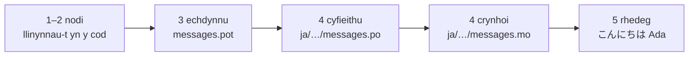

# Tiwtorial

Mae'r dudalen hon yn mynd o gyfeiriadur gwag at raglen sy'n cyfarch yn Japaneg.
Pum cam, heb dybio unrhyw brofiad o gettext, a dangosir pob gorchymyn gyda'r
allbwn y mae'n ei gynhyrchu mewn gwirionedd — fel eich bod yn gwybod ym mhob
cam a ydych ar y trywydd iawn.

Mae angen Python 3.14 neu fwy newydd arnoch, am fod llinynnau-t yn gystrawen
newydd yn 3.14. Japaneg yw targed enghreifftiol y dudalen hon, ond nid oes dim
yn dibynnu ar y dewis hwnnw — rhowch unrhyw iaith yn ei lle yng ngham 4, lle
mai'r cod locale `ja` yw'r unig beth sy'n ei henwi.

## 1. Gosod { #1-install }

```console
python -m pip install "gettext-tstrings[babel]"
```

Mae'r ychwanegyn `[babel]` yn dod â [Babel] i mewn, sef yr offeryn sy'n casglu
eich negeseuon i ffeiliau catalog yng ngham 3. Offeryn amser datblygu ydyw:
mae cod cynhyrchu'n rendro gyda'r llyfrgell safonol yn unig.

## 2. Nodi neges yn eich cod { #2-mark-a-message-in-your-code }

Crëwch `app.py`:

```python
from gettext_tstrings import tr

name = "Ada"
print(tr(t"Hello {name}"))
```

Mae `t"Hello {name}"` yn edrych fel llinyn-f, ond mae'r rhagddodiad `t` yn
cadw'r testun a'r gwerth ar wahân yn lle eu cyfuno yn y fan a'r lle. Y gwahanu
hwnnw sy'n gadael i `tr()` chwilio am gyfieithiad o'r frawddeg gyfan
`Hello {name}` a mewnosod y gwerth wedyn.

Rhedwch ef nawr:

```console
$ python app.py
Hello Ada
```

Nid oes cyfieithiadau wedi'u gosod eto, felly mae'r testun ffynhonnell yn
rendro fel y mae. Nid yw rhaglen sy'n defnyddio'r llyfrgell hon byth yn *mynnu*
catalog er mwyn rhedeg — Saesneg (neu ba iaith bynnag yw eich iaith ffynhonnell)
yw'r cwymp-yn-ôl adeiledig.

## 3. Echdynnu'r negeseuon { #3-extract-the-messages }

Nid yw cyfieithwyr yn darllen eich cod ffynhonnell; mae ffeil fach o'r enw
**catalog** yn teithio rhyngoch chi a nhw. Y cam cyntaf tuag at un yw casglu
pob neges wedi'i nodi allan o'r cod.

Dywedwch wrth Babel sut i ddod o hyd i'ch negeseuon drwy greu `babel.cfg`:

```ini
[gettext_tstrings: **.py]
encoding = utf-8
```

Yna echdynnwch i ffeil dempled (`.pot`):

```console
$ mkdir -p locales
$ pybabel extract -F babel.cfg -c "Translators:" -o locales/messages.pot .
extracting messages from app.py (encoding="utf-8")
writing PO template file to locales/messages.pot
```

Mae `locales/messages.pot` bellach yn cynnwys un cofnod fesul neges:

```po
#. gettext-tstrings
#: app.py:4
#, python-brace-format
msgid "Hello {name}"
msgstr ""
```

`msgid` yw'r allwedd y bydd eich cod yn chwilio amdani. Y `msgstr` gwag yw'r
lle y mae cyfieithiad yn mynd — ond nid yn y ffeil hon: *templed* yw `.pot`, ac
mae'r cam nesaf yn ei gopïo unwaith fesul iaith.

## 4. Cyfieithu a chrynhoi { #4-translate-and-compile }

Crëwch y catalog Japaneg o'r templed:

```console
$ pybabel init -i locales/messages.pot -d locales -l ja
creating catalog locales/ja/LC_MESSAGES/messages.po based on locales/messages.pot
```

Agorwch `locales/ja/LC_MESSAGES/messages.po` a llenwch y `msgstr`:

```po
msgid "Hello {name}"
msgstr "こんにちは {name}"
```

Cadwch `{name}` yn union fel y mae — y daliwr lle yw sut y mae'r gwerth yn dod
o hyd i'w le y tu mewn i'r frawddeg wedi'i chyfieithu, ac mae'r cyfieithiad yn
rhydd i'w symud ple bynnag y mae angen ar yr iaith darged. Ar brosiect go iawn,
y ffeil `.po` hon yw'r hyn a roddwch i gyfieithydd neu a lwythwch i lwyfan
cyfieithu; yr un yw'r fformat y naill ffordd neu'r llall.

Caiff catalogau eu golygu fel testun ond eu llwytho mewn ffurf ddeuaidd (`.mo`),
felly crynhowch:

```console
$ pybabel compile -d locales
compiling catalog locales/ja/LC_MESSAGES/messages.po to locales/ja/LC_MESSAGES/messages.mo
```

Mae'r gorchymyn hwn hefyd yn rhwyd ddiogelwch. Pe bai'r cyfieithiad wedi
niweidio'r daliwr lle — `{nome}` yn lle `{name}`, dyweder — byddai'n gwrthod ei
basio:

```console
$ pybabel compile -d locales
error: locales/ja/LC_MESSAGES/messages.po:24: translation does not match the
source placeholders: {name} is missing; {nome} is not in the source message
1 errors encountered.
```

## 5. Ei redeg { #5-run-it }

Cyfeiriwch `app.py` at y catalog wedi'i grynhoi. Cliciwch y marcwyr i weld beth
mae pob llinell yn ei wneud:

```python
import gettext

from gettext_tstrings import Translator

_ = Translator(gettext.translation("messages", localedir="locales", languages=["ja"]))  # (1)!

name = "Ada"
print(_(t"Hello {name}"))  # (2)!
```

1. Mae'r llyfrgell safonol yn llwytho'r `.mo` wedi'i grynhoi, ac mae
   `Translator` yn ei rwymo i alwadwy. `_` yw'r enw gettext confensiynol am
   "cyfieitha hyn" — byr am ei fod yn ymddangos ar bob llinyn sy'n wynebu'r
   defnyddiwr. Yr un ffwythiant ydyw â `tr`, wedi'i rwymo i un catalog.
2. Wrth yr alwad: daw testun y llinyn-t yn allwedd chwilio `Hello {name}`, mae'r
   catalog yn ateb `こんにちは {name}`, gwirir yr ateb yn erbyn dalwyr lle'r
   ffynhonnell, a dim ond wedyn y rhoddir y gwerth i mewn.

```console
$ python app.py
こんにちは Ada
```

Dyna'r ddolen gyfan, ac mae'n werth ei gweld fel un llun:



**Nodi → echdynnu → cyfieithu → crynhoi → rhedeg.** Mireinio un o'r pum cam
hynny yw popeth arall ar y wefan hon.

## I ble nesaf { #where-next }

- [Pam llinynnau-t](comparison.md) — rhag beth y mae'r cynllun hwn yn eich
  gwarchod, o'i gymharu â `%(name)s`, `.format()` a llinynnau `$`.
- [Canllaw](guide.md) — ffurfiau lluosog, ieithoedd fesul cais, llinynnau
  gohiriedig, a beth sy'n digwydd wrth redeg pan fo catalog yn anghywir beth
  bynnag.
- [Mewn cynhyrchu](workflow.md) — yr un ddolen hon fel y mae tîm yn ei rhedeg,
  wythnos ar ôl wythnos: diweddaru catalogau, gatiau CI, a llwyfannau cyfieithu.
- [Echdynnu](extraction.md) — y cyfeirlyfr `pybabel` llawn: enwau ffwythiannau
  pwrpasol, modd CI llym, a'r gwiriadau sy'n gwarchod eich catalogau.

  [Babel]: https://babel.pocoo.org/
