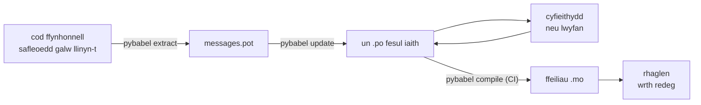

# Mewn cynhyrchu

Mae'r [tiwtorial](tutorial.md) yn rhedeg y ddolen unwaith, ar ei phen ei hun, ar
raglen ag un neges. Ar brosiect go iawn mae'r ddolen yn dal i droi: mae
negeseuon yn newid ar ôl iddynt gael eu cyfieithu, mae'r cyfieithydd yn gweithio
mewn man arall ac ar ei amserlen ei hun, ac mae catalog wedi'i grynhoi'n cludo
gyda phob rhyddhad. Yr arfer hwnnw yw'r dudalen hon — beth sy'n aros yn y
storfa, beth sy'n teithio, beth sy'n rhaid i CI ei gatio, a lle mae'r rhedeg yn
rhwymo iaith.

Chwe gwiriad yw'r cyfanswm, felly dyma nhw'n gyntaf; mae pob adran isod yn
gosod un ohonynt.

- Mae `pybabel update --check` yn pasio — ni newidiodd yr un neges heb i'r
  catalogau glywed amdani.
- Mae `pybabel compile` yn gatio'r adeiladwaith ar ei statws ymadael.
- Mae'r cofnodion `fuzzy` sy'n weddill yn fwriadol — mae pob un yn rendro fel
  testun ffynhonnell hyd nes y bydd cyfieithydd yn ei gadarnhau.
- Mae'r gyfres brofi yn rendro pob iaith a gludir unwaith gyda `strict=True`.
- Mae'r arteffact cynhyrchu'n cynnwys ffeiliau `.mo` a dim Babel.
- Caiff cofnodydd `gettext_tstrings` ei gyfeirio at fonitro.

## Siâp prosiect { #the-shape-of-a-project }

```text
myapp/
├── babel.cfg
├── pyproject.toml
├── src/
│   └── myapp/
└── locales/
    ├── messages.pot
    ├── ja/LC_MESSAGES/messages.po
    └── de/LC_MESSAGES/messages.po
```

Ymrwymwch `babel.cfg`, y templed `.pot`, a phob `.po` — nhw yw ffynonellau'r
adeiladu cyfieithu, a'u diffiau yw sut yr adolygwch newidiadau cyfieithu.
Arteffactau adeiladu yw'r ffeiliau `.mo` wedi'u crynhoi: cynhyrchwch nhw mewn CI
neu adeg pecynnu yn hytrach na'u hymrwymo, fel na all `.po` a'i `.mo` byth
anghytuno ynghylch beth sy'n cludo.

Mae gan un ffeil rôl i bob cyfeiriad: mae'r `.pot` yn cario eich negeseuon
*allan* at gyfieithwyr, mae'r ffeiliau `.po` yn cario cyfieithiadau *yn ôl*.
Gweddill y dudalen hon yw'r hyn sy'n symud rhyngddynt.



## Y cylch ar ôl y cyfieithiad cyntaf { #the-cycle-after-the-first-translation }

Fel arfer mae `pybabel init` y tiwtorial yn rhedeg unwaith, pan ychwanegir
iaith. O hynny ymlaen y cylch gwaith yw **echdynnu → diweddaru → cyfieithu → crynhoi**, a'i
ganol yw `pybabel update`, sy'n plygu templed ffres i mewn i'r catalogau sy'n
bodoli heb daflu'r cyfieithiadau sydd ynddynt eisoes.

Tybiwch fod y cyfarchiad `Hello {name}` — a gyfieithwyd eisoes fel
`こんにちは {name}` — yn cael ei aralleirio yn y cod yn `Welcome back, {name}`.
Echdynnwch a diweddarwch:

```console
$ pybabel extract -F babel.cfg -c "Translators:" -o locales/messages.pot .
extracting messages from app.py (encoding="utf-8")
writing PO template file to locales/messages.pot
$ pybabel update -i locales/messages.pot -d locales
updating catalog locales/ja/LC_MESSAGES/messages.po based on locales/messages.pot
```

Mae'r catalog Japaneg bellach yn cynnwys:

```po
#. gettext-tstrings
#: app.py:4
#, fuzzy, python-brace-format
msgid "Welcome back, {name}"
msgstr "こんにちは {name}"
```

Sylwodd Babel fod y msgid newydd yn debyg i un a dynnwyd a'i baru â'r hen
gyfieithiad — ond baneriodd y pâr yn **fuzzy**: dyfaliad peiriant yn aros am
berson. Mae'r faner yn newid yr hyn a grynhoir. Mae `pybabel compile` yn **eithrio cofnodion
fuzzy o'r `.mo`**, felly hyd nes y bydd cyfieithydd yn cadarnhau'r pâr, mae'r
rhaglen yn rendro'r testun Saesneg newydd yn hytrach nag un Japaneg hen:

```console
$ pybabel compile -d locales
compiling catalog locales/ja/LC_MESSAGES/messages.po to locales/ja/LC_MESSAGES/messages.mo
$ python app.py
Welcome back, Ada
```

Felly mae neges a newidiwyd yn diraddio'r un ffordd ag y mae un doredig — i'r
iaith ffynhonnell, byth i gyfieithiad hen ffasiwn. Rhan y cyfieithydd o'r cylch
yw diwygio'r `msgstr` a dileu'r faner `fuzzy`; mae'r crynhoi nesaf yn codi'r
cofnod.

!!! note "Mae enwau dalwyr lle'n rhan o hunaniaeth y neges"

    Y msgid yw allwedd y catalog, ac mae *enw*'r daliwr lle y tu mewn iddi —
    felly mae ailenwi newidyn yn y cod (`name` → `user_name`) yn newid y msgid
    ac yn anfon cyfieithiad pob iaith ohono'n ôl drwy'r cylch fuzzy. Enwch
    newidynnau a ryngosodir fel geiriau y bydd cyfieithydd yn eu deall, a'u
    hailenwi ond am reswm.

    Mae fformatio'n ddrych i hynny: nid yw `!r` a `:.2f` yn [rhan o'r
    msgid](internals.md#from-template-to-msgid), felly nid yw tynhau
    `{amount:,.2f}` yn `{amount:,.0f}` yn newid dim mewn unrhyw gatalog. Mae
    aralleirio'r *frawddeg*, wrth gwrs, yn newid go iawn — dyna'r cylch uchod.

## Yr hyn y mae CI yn ei gatio { #what-ci-gates }

Mae tri methiant yn haeddu adeiladwaith coch: syrthiodd y catalogau ar ôl y cod,
torrodd cyfieithiad ddaliwr lle, neu lithrodd cofnod toredig drwodd i'r rhedeg.
Un cam fesul methiant:

```yaml
- run: pybabel extract -F babel.cfg -c "Translators:" -o locales/messages.pot .
- run: pybabel update -i locales/messages.pot -d locales --check
- run: pybabel compile -d locales
- run: pytest
```

Nid yw `pybabel update --check` yn ailysgrifennu dim ac mae'n ymadael yn
ddi-sero pan fo catalog yn hen ffasiwn o'i gymharu â'r templed a echdynnwyd yn
ffres — y gwarchodwr rhag uno cod nad ailechdynnodd neb ei negeseuon. Mae
`pybabel compile` yn rhedeg gwiriadau dalwyr lle Babel a
[gwiriwr cofrestredig](extraction.md#your-existing-toolchain-validates-these-catalogs)
y pecyn hwn fel ei gilydd.

!!! bug "Babel 2.18.0: ni all `--check` gatio catalog sy'n defnyddio cyd-destunau"

    Ar Babel 2.18.0, mae `pybabel update --check` yn adrodd bod **pob** catalog
    sy'n cynnwys `msgctxt` yn hen ffasiwn, ar bob rhediad, pa mor gyfredol
    bynnag ydyw. Mae gât sy'n methu'n barhaol yn waeth na dim gât, oherwydd bod
    tîm yn ei diffodd — felly os ydych yn defnyddio `pgettext` neu `npgettext` o
    gwbl, rhowch rywbeth yn lle'r cam hwn yn hytrach na byw gydag ef. Darllen y
    templed a phob catalog gyda `babel.messages.pofile.read_po` a chymharu
    `{(m.context, m.id) for m in catalog if m.id}` yw'r gwiriad cyfan, a dyna
    mae [adeiladu'r wefan hon ei hun](index.md) yn ei wneud. Mae'r achos
    [wedi'i ysgrifennu ar Beryglon](pitfalls.md#your-tools-have-bugs-too).

!!! danger "Gwiriwch y statws ymadael, nid y log"

    Mae `pybabel compile` yn adrodd pob gwall daliwr lle, yn ymadael yn
    ddi-sero — **ac yn ysgrifennu'r `.mo` beth bynnag**. Mae piblinell sy'n
    crynhoi ac wedyn yn copïo `locales/` i mewn i ddelwedd yn cludo'r catalog
    toredig oni bai bod yr ymadawiad di-sero yn ei hatal mewn gwirionedd. Gadael
    i'r cam fethu'r adeiladwaith, fel uchod, yw'r cyfan sydd raid ei drwsio.

Eich cyfres brofi arferol yw'r llinell olaf, gydag un arferiad wedi'i ychwanegu:
rywle ynddi, rendrwch o leiaf un neges fesul iaith a gludir drwy gyfieithydd
llym —

```python
import gettext

from gettext_tstrings import Translator


def test_catalogs_render(language: str) -> None:
    translations = gettext.translation("messages", localedir="locales", languages=[language])
    _ = Translator(translations, strict=True)
    name = "Ada"
    assert _(t"Welcome back, {name}")
```

— am fod `strict=True` yn [codi gwall lle byddai cynhyrchu'n cwympo'n ôl yn dawel](guide.md#what-happens-when-a-catalog-is-wrong),
ac mai rendro wrth redeg yw'r un gwiriad sy'n gweld y catalog yn union fel y
bydd y rhaglen yn ei weld, `.mo` a'r cyfan.

## Gweithio gyda chyfieithwyr a llwyfannau { #working-with-translators-and-platforms }

Y ffeil `.po` yw fformat cyfnewid byd gettext cyfan, sef y rheswm y mae'r
llyfrgell hon yn ei hailddefnyddio: mae trosglwyddo cyfieithu'n golygu
trosglwyddo ffeil, boed y derbynnydd yn gydweithiwr â golygydd PO neu'n llwyfan
fel Weblate neu Crowdin. Mae tri pheth yn gwneud i'r trosglwyddo weithio'n dda:

**Dywedwch at beth y mae'r neges.** Mae sylw yn y cod yn teithio gyda'r neges —
dyna mae'r faner `-c "Translators:"` yn ei chasglu:

```python
from gettext_tstrings import tr

name = "Ada"
# Translators: shown on the dashboard right after sign-in
print(tr(t"Welcome back, {name}"))
```

```po
#. Translators: shown on the dashboard right after sign-in
#. gettext-tstrings
#: app.py:5
#, python-brace-format
msgid "Welcome back, {name}"
msgstr ""
```

Mae cyfieithydd yn gweld y sylw hwnnw yn ei olygydd, wrth ymyl y neges, ar ochr
arall y byd. Dyna'r lifer ansawdd rhataf yn y llif gwaith cyfan. Ar gyfer gair
sy'n homonym iddo'i hun — "Open" y botwm yn erbyn "Open" y cyflwr — rhowch
[gyd-destun](guide.md#binding-a-catalog) i'r neges gyda `pgettext`, sy'n dod yn
`msgctxt` gweladwy yn y catalog.

**Gadewch i'r llwyfan ddilysu dalwyr lle.** Mae pob neges a echdynnir o linyn-t
yn cario'r faner `python-brace-format`, a'r un llinell honno sy'n troi QA dalwyr
lle ymlaen mewn offer nad ydych yn eu rheoli — mae Weblate yn dogfennu'r
gwiriad, mae llwyfannau masnachol yn allweddu eu rhai eu hunain ar yr un faner,
ac mae `msgfmt --check-format` yn ei orfodi mewn unrhyw biblinell GNU. Mae'r
manylion, a'r hyn y mae'r gwiriwr cynwysedig yn ei ddal y tu hwnt iddynt, ar y
[dudalen echdynnu](extraction.md#your-existing-toolchain-validates-these-catalogs).

**Ymddiriedwch yn y rhwyd ddiogelwch yn union cyn belled ag y mae'n mynd.** Mae
beth bynnag a ddaw'n ôl o lwyfan yn dal yn ddata sy'n mynd i mewn i'ch
adeiladwaith; y gatiau CI uchod sy'n troi "mae'n debyg bod y llwyfan wedi gwirio
hyn" yn "ni all hyn gludo'n doredig".

## Rhwymo iaith wrth redeg { #binding-a-language-at-runtime }

Mae popeth hyd yma'n cynhyrchu catalogau. Y penderfyniad sy'n weddill yw ble mae'r
rhaglen yn dewis un, ac mae ganddo un ateb gonest: rhwymwch unwaith fesul
*cwmpas iaith* — y broses ar gyfer CLI, y cais ar gyfer gwasanaeth gwe.

=== "Un broses, un iaith"

    Mae offeryn llinell orchymyn neu raglen bwrdd gwaith yn darllen amgylchedd y
    defnyddiwr unwaith, adeg cychwyn. Mae peidio â phasio `languages=` yn gadael
    i'r llyfrgell safonol negodi o `LANGUAGE`, `LC_ALL`, `LC_MESSAGES`, a
    `LANG`; mae `fallback=True` yn dychwelyd catalog nwl — testun ffynhonnell —
    yn hytrach na chodi gwall pan nad oes yr un ohonynt yn cyfateb i gatalog a
    gludwch.

    ```python
    import gettext

    from gettext_tstrings import Translator

    _ = Translator(gettext.translation("messages", localedir="locales", fallback=True))

    name = "Ada"
    print(_(t"Welcome back, {name}"))
    ```

=== "Flask"

    Mae rhaglen we'n penderfynu fesul cais. Llwythwch bob catalog unwaith adeg
    mewnforio, wedyn rhwymwch yr un a negodwyd i'r cyd-destun cyn i'r olwg
    redeg — mae [`set_translations`](guide.md#per-request-language) yn lleol i'r
    cyd-destun, felly nid yw ceisiadau cydredol mewn ieithoedd gwahanol byth yn
    gweld rhwymiad ei gilydd.

    ```python
    import gettext

    from flask import Flask, request

    from gettext_tstrings import set_translations, tr

    LANGUAGES = ("en", "ja", "de")
    CATALOGS = {
        language: gettext.translation(
            "messages", localedir="locales", languages=[language], fallback=True
        )
        for language in LANGUAGES
    }

    app = Flask(__name__)


    @app.before_request
    def bind_language() -> None:
        language = request.accept_languages.best_match(LANGUAGES) or "en"
        set_translations(CATALOGS[language])


    @app.get("/")
    def home() -> str:
        name = "Ada"
        return tr(t"Welcome back, {name}")
    ```

=== "Canolwedd ASGI"

    Dan fframweithiau anghydamserol — FastAPI, Starlette, ac unrhyw beth arall
    sy'n ASGI — lapiwch y cais mewn
    [`use_translations`](guide.md#per-request-language): mae'r rhwymiad yn byw
    mewn `ContextVar`, y mae newid tasgau anghydamserol yn ei gadw fesul cais.

    ```python
    import gettext

    from fastapi import FastAPI, Request

    from gettext_tstrings import tr, use_translations

    LANGUAGES = ("en", "ja", "de")
    CATALOGS = {
        language: gettext.translation(
            "messages", localedir="locales", languages=[language], fallback=True
        )
        for language in LANGUAGES
    }

    app = FastAPI()


    @app.middleware("http")
    async def bind_language(request: Request, call_next):
        language = negotiate_language(request.headers.get("accept-language"), LANGUAGES)
        with use_translations(CATALOGS[language]):
            return await call_next(request)
    ```

    Mae `negotiate_language` yn sefyll dros eich parsio Accept-Language — mae'r
    rhan fwyaf o fframweithiau neu eu hecosystemau'n darparu un; yr hyn sy'n
    bwysig yma yw'r rhwymo o amgylch `call_next`.

Mae dau arferiad rhedeg yn cwblhau'r darlun. Rhaid i linynnau a grëir adeg
mewnforio — label ffurflen, enw arddangos enum — beidio â dal pa iaith bynnag
oedd yn weithredol yn ystod y mewnforio; diffiniwch nhw gyda
[`lazy_gettext`](guide.md#deferred-translation) a byddant yn rendro yn yr iaith
sy'n weithredol adeg eu *defnyddio*. A llwybrwch gofnodydd `gettext_tstrings`
rywle y mae person yn edrych: ei rybuddion yw'r modd goddefgar yn adrodd am
gyfieithiad a lithrodd heibio pob gât, un llinell fesul neges doredig yn hytrach
nag un fesul rendro.

## Cludo { #shipping }

Mae angen y pecyn, y ffeiliau `.mo`, a dim byd arall ar gynhyrchu. Dibyniaeth
datblygu a CI yw Babel — cadwch `gettext-tstrings[babel]` allan o'r ddelwedd
gynhyrchu a gosodwch y pecyn noeth yno; mae'r rendro'n rhedeg ar y llyfrgell
safonol yn unig. Crynhowch gatalogau yn yr un adeiladwaith sy'n cynhyrchu'r
arteffact a ddefnyddiwch, fel mai'r ffeiliau `.mo` y tu mewn iddo yw'n union y
ffeiliau `.po` a adolygwyd, ac na chludir byth ddim a grynhowyd ar liniadur
rhywun.

Cyn rhyddhad, y rhestr wirio y mae'r dudalen hon yn crebachu iddi:

- Mae `pybabel update --check` yn pasio — nid oes neges wedi newid heb i'r
  catalogau glywed amdani.
- Mae `pybabel compile` yn gatio'r adeiladwaith ar ei statws ymadael.
- Mae'r cofnodion `fuzzy` sy'n weddill yn fwriadol — mae pob un yn rendro fel
  testun ffynhonnell nes bod cyfieithydd yn ei gadarnhau.
- Mae'r gyfres brofi'n rendro pob iaith a gludir unwaith gyda `strict=True`.
- Mae'r arteffact cynhyrchu'n cynnwys ffeiliau `.mo` a dim Babel.
- Caiff cofnodydd `gettext_tstrings` ei lwybro i fonitro.

## I ble nesaf { #where-next }

- [Echdynnu](extraction.md) — y cyfeirlyfr ar gyfer hanner offer y dudalen hon:
  opsiynau mapio, enwau ffwythiannau pwrpasol, modd llym, a phob gwiriwr.
- [Canllaw](guide.md) — yr hanner rhedeg: lluosogion, cyd-destunau, llinynnau
  gohiriedig, a'r moddau methu'n fanwl.
- [Sut mae'n gweithio](internals.md) — pam mae'r msgid ar y siâp hwnnw, a beth y
  mae'r dilysu'n ei wirio mewn gwirionedd.
