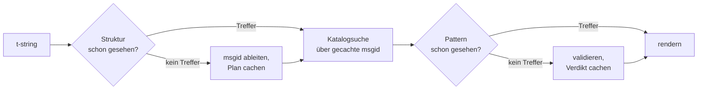

# Funktionsweise

Nichts auf dieser Seite ist nötig, um die Bibliothek zu benutzen — das decken
[Tutorial](tutorial.md) und [Anleitung](guide.md) ab. Diese Seite baut die
Bibliothek stattdessen aus ersten Prinzipien wieder auf: was eine t-string
wirklich ist, wie daraus eine msgid herausfällt, was eine Übersetzung gültig
macht und wie die Implementierung all dieses Prüfen Zehntel einer
Mikrosekunde kosten lässt. Lies sie aus Neugier, wenn du beitragen möchtest
oder wenn du [die Konvention selbst implementieren](#reimplementing-it)
willst.

## Was eine t-string wirklich ist { #what-a-t-string-actually-is }

Ein f-string erzeugt einen `str`, und zwar sofort — wenn irgendeine Funktion
ihn erhält, ist der Wert bereits interpoliert und der Satz versiegelt. Eine
t-string ([PEP 750]) hat dieselbe Syntax und dieselbe eifrige Auswertung
ihrer Ausdrücke, erzeugt aber einen anderen Typ:

```pycon
>>> name = "Ada"
>>> f"Hello {name}!"
'Hello Ada!'
>>> t"Hello {name}!"
Template(strings=('Hello ', '!'), interpolations=(Interpolation('Ada', 'name', None, ''),))
```

Dieses `Template`-Objekt bewahrt die Teile, die eine Katalog-Pipeline
braucht, weiterhin getrennt:

```pycon
>>> template = t"Total: {amount:,.2f}"
>>> template.strings
('Total: ', '')
>>> template.interpolations[0].expression
'amount'
>>> template.interpolations[0].value
1234.5
>>> template.interpolations[0].format_spec
',.2f'
```

- `strings` — der literale Text um die Interpolationen, in Reihenfolge.
- Pro Interpolation: der **Ausdruck** als Quelltext (`'amount'`), sein
  ausgewerteter **Wert** (`1234.5`) sowie eine etwaige **Konvertierung**
  (`!r`) und **Formatspezifikation** (`,.2f`) — getrennt mitgeführt statt
  angewendet.

Alles, was diese Bibliothek tut, ist ein diszipliniertes Konsumieren dieser
Struktur. Die Sprache hat die eine Trennung, die i18n braucht — statischer
Text getrennt von Werten —, bereits vollzogen; die Bibliothek parst also nie
deinen Quellcode und rät nie, wo in einem Satz ein Wert sitzt. Übrig bleiben
drei Entscheidungen: wie die Struktur zu einem Katalogschlüssel wird, was
eine Übersetzung dieses Schlüssels sagen darf und wie beides wieder zusammen
rendert.

## Vom Template zur msgid { #from-template-to-msgid }

Eine msgid — der Schlüssel, über den ein Katalog indiziert ist — wird allein
aus den *statischen* Teilen des Templates abgeleitet. Gehe `strings` und
`interpolations` in Quellreihenfolge durch; maskiere in jedem Literalsegment
die Klammern (`{` wird `{{`); gib für jede Interpolation ein Token `{name}`
aus, wobei `name` der Ausdruckstext ohne umgebende Leerzeichen ist. Aus
`t"Total: {amount:,.2f}"`:

```text
strings         ('Total: ', '')
interpolations  expression 'amount'   conversion None   format_spec ',.2f'
msgid           'Total: {amount}'
```

Jeder Teil dieser Regel hat einen Grund:

- **Der Ausdruck muss ein einfacher Name sein** — `str.isidentifier()` ist
  wahr, und er ist kein Python-Schlüsselwort. `t"Hello {user.name}"` wird an
  der Aufrufstelle abgelehnt. Eine msgid ist ein *Schlüssel*: Sie muss bei
  jedem Lauf und jeder Extraktion identisch herauskommen, und sie wird von
  Übersetzenden gelesen — der Platzhalter muss also ein stabiles,
  bedeutungstragendes Wort sein, kein Codefragment, das den Katalog einlädt,
  zu einer Ausdruckssprache zu werden.
- **Konvertierung und Formatspezifikation gelangen nie in die msgid.**
  Übersetzende sollen kein `:,.2f` lesen müssen, und keine Übersetzung soll
  es ändern können. Die Konsequenz ist es wert, gewusst zu werden: Wer im
  Code `:,.2f` zu `:,.0f` verschärft, ändert keine msgid und macht damit in
  keiner Sprache eine Übersetzung ungültig. Der Katalogschlüssel folgt dem,
  *was der Satz sagt*, nicht der Formatierung des Werts.
- **Ein wiederholter Name muss seine Formatierung exakt wiederholen.**
  `t"{x:.2f} vs {x:.3f}"` wird abgelehnt, weil beide Vorkommen in dasselbe
  Token `{x}` zusammenfallen und die msgid nicht mehr sagen könnte, mit
  welcher Formatierung ein Rendern arbeiten soll.
- **Die leere msgid wird nie nachgeschlagen**, weil gettext sie für den
  Metadaten-Header des Katalogs reserviert. `t""` rendert als `""`, ohne den
  Katalog zu berühren.

Das vollständige Regelwerk, einschließlich der Randfälle, die diese Seite
auslässt, ist
[SPEC §2](https://github.com/yhay81/gettext-tstrings/blob/main/SPEC.md).

## Was eine Übersetzung sagen darf { #what-a-translation-may-say }

Ein Pattern, das aus einem Katalog zurückkommt, wird mit `string.Formatter`
geparst — demselben Parser, den `str.format` verwendet. Die Grammatik ist
bewusst geliehen statt erfunden: Ein Pattern, das diese Bibliothek
akzeptiert, versteht das weitere Ökosystem bereits. Dann greifen zwei
Prüfungen.

**Form:** Jedes Feld muss ein bloßes `{name}` sein. Eine Konvertierung oder
Formatspezifikation — auch die explizit leere `{name:}` — wird abgelehnt,
ebenso Positionsfelder (`{0}`, `{}`) und mit Leerzeichen gepolsterte Namen
(`{ name }`). Der letzte Fall wiegt schwerer, als er aussieht: `str.format`
und GNU `msgfmt` lehnen `{ name }` beide ab; es hier zu akzeptieren, ergäbe
Kataloge, die kein anderes Werkzeug der Kette validieren kann.

**Namen:** Die Platzhaltermenge des Patterns wird mit der der Quelle
verglichen. Für eine Singular-Nachricht ist jeder Quellname *erforderlich*,
und nichts anderes ist *erlaubt*. Für eine Plural-Nachricht werden die
beiden Zweige zusammengeführt:

- **erlaubt** = die Vereinigung der Namen beider Zweige
- **erforderlich** = ihre Schnittmenge

Gegen `t"One file"` / `t"{n} files"` ist der Name `n` also in einer
Übersetzung beider Formen erlaubt, aber in keiner erforderlich. Diese
Asymmetrie erlaubt es dem Pluralsystem einer Zielsprache, vom Quellsystem
abzuweichen — Japanisch übersetzt beide Zweige mit einer Form, die
vermutlich `{n}` verwendet; eine Sprache mit mehr Formen als Englisch
braucht `{n}` womöglich in einer Form, wo Englisch keine hat.

Nichts davon ist hypothetisch: Der Katalog für das Seitengerüst dieser
Website führt selbst die Plural-Nachricht `Built {n} localized page` /
`Built {n} localized pages` — zwei englische Zweige — und die Sprachausgaben
der Website übersetzen diese eine Nachricht in eine bis sechs Formen:

| Katalog | Formen | Die Übersetzungen, in der Reihenfolge der Formen |
| --- | --- | --- |
| Japanisch | 1 | `ローカライズ済みページを{n}件ビルドしました` |
| Türkisch | 2 | `{n} yerelleştirilmiş sayfa oluşturuldu` — zweimal, identisch: türkische Substantive bleiben nach einem Zahlwort im Singular |
| Italienisch | 2 | `Generata {n} pagina localizzata` · `Generate {n} pagine localizzate` — das Partizip kongruiert in Genus und Numerus |
| Lettisch | 3 | `Izveidota {n} lokalizēta lapa` · `Izveidotas {n} lokalizētas lapas` · `Izveidots {n} lokalizētu lapu` — die dritte Form gilt **allein der Null** |
| Russisch | 3 | `Собрана {n} локализованная страница` · `Собраны {n} локализованные страницы` · `Собрано {n} локализованных страниц` |
| Polnisch | 3 | `Zbudowano {n} zlokalizowaną stronę` · `Zbudowano {n} zlokalizowane strony` · `Zbudowano {n} zlokalizowanych stron` |
| Slowenisch | 4 | `Zgrajena {n} lokalizirana stran` · `Zgrajeni {n} lokalizirani strani` · `Zgrajene {n} lokalizirane strani` · `Zgrajenih {n} lokaliziranih strani` — die zweite ist ein **Dual**, für genau zwei |
| Irisch | 5 | `Tógadh {n} leathanach logánaithe` · `Tógadh {n} leathanaigh logánaithe` — eins, zwei, 3–6, 7–10 und der Rest; der Stamm wechselt, doch *leathanach* beginnt mit `l`, das keine irische Mutation schreibt, sodass mehrere Formen zusammenfallen |
| Arabisch | 6 | darunter `تم إنشاء صفحة مترجمة واحدة ({n})` für genau eins und `تم إنشاء {n} صفحات مترجمة` für wenige |

Jede Zeile ist ein echter Eintrag in `i18n/*/LC_MESSAGES/site.po` dieses
Repositorys, gerendert vom [mehrsprachigen Build](index.md) bei jedem
Release — und ein Test heftet diese Tabelle an jene Kataloge, sodass beide
nicht auseinanderdriften können.

Innerhalb dieser Grenzen sind Umstellung und Wiederholung bewusst
unbeschränkt. Beides ist in echten Sprachen grammatisch notwendig, und ein
Begrenzen der Vorkommen würde korrekte Übersetzungen ohne jeden
Sicherheitsgewinn ablehnen: Eine Übersetzung kann trotzdem nichts
*auswerten*, weil kein Auswertungspfad existiert — Platzhalter werden per
Name in den bereits berechneten Werten des Templates nachgeschlagen und nie
an `eval`, `getattr` oder `str.format` selbst gereicht.

## Rendern { #rendering }

Ein validiertes Pattern zu rendern ist ein Durchlauf über seine Stücke: Gib
jeden Literalteil aus, und nimm für jeden Platzhalter den erfassten Wert der
Interpolation und wende die *quellseitige* Konvertierung und
Formatspezifikation an — `format(convert(value, conversion), format_spec)`.
Zwei Garantien bleiben dabei gewahrt:

- **Jeder eigenständige Wert wird höchstens einmal pro Rendern formatiert**,
  auch wenn die Übersetzung einen Platzhalter wiederholt. Wiederholung
  ändert, wie oft das Ergebnis eingefügt wird, nicht, wie oft dein
  `__format__` läuft.
- **Bei Pluralformen liest ein Platzhalter den Zweig, der ihn definiert
  hat.** Ein in beiden Zweigen vorhandener Name liest den Wert, den der von
  der *Quellsprache* gewählte Zweig erfasst hat (`singular` bei `n == 1`,
  sonst `plural`); ein zweigspezifischer Name liest immer seinen eigenen
  Zweig, auch wenn die Pluralregeln der Zielsprache ihn in einer anderen
  Form verfügbar gemacht haben.

Schlägt die Validierung beim Rendern fehl, richtet sich die Antwort danach,
wer das Pattern geliefert hat. Ein Pattern, das aus einem *Katalog* kam,
degradiert: eine Warnung ins Log, gerendert wird der Quelltext — das wahrt
gettexts Vertrag, dass ein defekter Katalog die Anwendung nie mitreißt
([die Anleitung zeigt beide Modi](guide.md#what-happens-when-a-catalog-is-wrong)).
Ein Pattern, das der Aufrufer direkt übergeben hat —
`CompiledTemplate.render` — löst immer eine Exception aus, denn es gibt
keinen Quelltext, *auf* den degradiert werden könnte; Nachsicht gilt
Katalogsuchen, nicht Argumenten.

## Diagnostik ist Teil des Designs { #diagnostics-are-part-of-the-design }

Ein Platzhalterfehler landet meist vor einer übersetzenden Person, nicht vor
einer programmierenden, und oft in einer Datei, in der das Problem
unsichtbar ist. Jemandem, der genau diese Zeichen in seinem Editor sehen
kann, `{name} is missing` zu sagen, ist eine Sackgasse; die Meldungen folgen
deshalb drei Regeln:

- Ein Name mit einem **unsichtbaren Zeichen** — ein geschütztes Leerzeichen
  aus einer Eingabemethode, ein Leerzeichen der Breite null — wird mit
  diesem Zeichen als Codepoint gedruckt, an Ort und Stelle:
  `{<U+00A0>name}`. Die lesende Person muss sehen, *wo*.
- Ein Name, dessen Buchstaben **Schriftsysteme mischen**, der
  Homoglyphen-Fall, erscheint doppelt — einmal lesbar, einmal maskiert —,
  denn `{nаme}` mit kyrillischem `а` ist im Druckbild von `{name}` nicht zu
  unterscheiden, und die maskierte Form `(nаme)` ist die einzige
  Schreibweise, die beide auseinanderhält.
- Alles andere erscheint **wie geschrieben**. `{名前}` und `{café}` sind
  gewöhnliche Namen; sie zu maskieren, ließe die lesende Person nicht mehr
  finden, was gemeint war.

Nach demselben Prinzip bekommt ein „fehlender“ Platzhalter, der vorhanden
*aussieht*, sein Fehlen erklärt — vollbreite Klammern aus einer
ostasiatischen Eingabemethode, ein durch eine Maskierungs-Rundreise
verdoppeltes `{{name}}`, der Name außerhalb jeder Klammer. Die für
Übersetzende geschriebene
[Fehlertabelle](translators.md#reading-a-failure-message) zeigt jede dieser
Meldungen im Wortlaut.

## Der Hot Path { #the-hot-path }

Alles Obige geschieht bei jedem übersetzten String, den eine Anwendung
rendert; die Implementierung ist deshalb um einen Gedanken herum gebaut:
**Validierung wird nie übersprungen, also muss die Validierung das sein, was
gecacht wird.**



Drei Caches, einer pro Stufe:

- **Ein Plan pro Aufrufstellen-Struktur.** Das `strings`-Tupel des Templates
  — ein Objekt, das der Interpreter ohnehin gebaut hat — ist der
  Cache-Schlüssel, sodass ein Lookup nichts alloziert. Bei einem Treffer
  werden Ausdruck, Konvertierung und Formatspezifikation jeder Interpolation
  trotzdem mit den aufgezeichneten verglichen: Zwei Aufrufstellen, die den
  Literaltext teilen, sich aber in der Formatierung unterscheiden
  (`t"{x:.2f}"` gegen `t"{x:.3f}"`), dürfen nicht kollidieren, und dieser
  Vergleich ist der Preis eines Schlüssels, den der Interpreter gratis
  hereinreicht.
- **Ein Verdikt pro Pattern.** Beim ersten Mal, dass ein Katalog mit einem
  bestimmten Pattern antwortet, wird es geparst und validiert; das Ergebnis
  — ein kompilierter Renderplan oder ein Vermerk der Ungültigkeit — bleibt
  am Plan erhalten. Jedes spätere Rendern dieser Nachricht erreicht es mit
  einem einzigen Dictionary-Lookup. Auch ungültige Patterns werden gemerkt —
  deshalb warnt ein defekter Katalogeintrag einmal statt bei jedem Rendern.
- **Ein zusammengeführter Plan pro Pluralpaar**, der die Vereinigungs- und
  Schnittmengen hält, sodass die Zweigarithmetik einmal pro Nachricht
  stattfindet, nicht einmal pro Aufruf.

Jeder Cache ist begrenzt, und keiner behält interpolierte *Werte* — nur
statische Struktur und Patterntext. Das Ergebnis, gemessen von
[`benchmarks/runtime.py`](https://github.com/yhay81/gettext-tstrings/blob/main/benchmarks/runtime.py):
rund 0,4 µs für eine Nachricht mit einem Feld, den Bau der t-string selbst
eingeschlossen — etwa das 2,5-Fache eines schlichten
`gettext(...).format(...)`, das nichts prüft. Der Kommentar am Kopf von
[`core.py`](https://github.com/yhay81/gettext-tstrings/blob/main/src/gettext_tstrings/core.py)
hält die Einzelmessungen hinter dieser Gestalt fest.

## Selbst implementieren { #reimplementing-it }

Nichts davon ist Geheimwissen: Die Konvention ist als
[Spezifikation v1](spec.md) niedergeschrieben, und ihre maschinenlesbare
[Konformitätssuite](spec.md#conformance) lässt einen Extraktor, ein
IDE-Plugin oder eine Implementierung in einer anderen Sprache sich gegen
jede Regel prüfen, die diese Seite erklärt hat. Diese Implementierung führt
die Suite in ihren eigenen Tests aus — genau das bewahrt diese Seite, die
Spezifikation und den Code davor, still auseinanderzudriften.

  [PEP 750]: https://peps.python.org/pep-0750/
