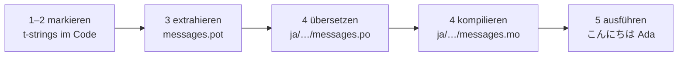

# Tutorial

Diese Seite führt vom leeren Verzeichnis zu einem Programm, das auf Japanisch
grüßt. Fünf Schritte, keine gettext-Erfahrung vorausgesetzt, und jeder Befehl
wird mit der Ausgabe gezeigt, die er tatsächlich erzeugt — sodass du bei jedem
Schritt weißt, ob du auf Kurs bist.

Du brauchst Python 3.14 oder neuer, denn t-strings sind neue Syntax in 3.14.
Japanisch ist die Beispielsprache dieser Seite, aber nichts hängt von dieser
Wahl ab — setze in Schritt 4 eine beliebige Sprache ein; der Locale-Code `ja`
ist dort das Einzige, was sie benennt.

## 1. Installieren { #1-install }

```console
python -m pip install "gettext-tstrings[babel]"
```

Das Extra `[babel]` bringt [Babel] mit, das Werkzeug, das in Schritt 3 deine
Nachrichten in Katalogdateien einsammelt. Es ist ein Entwicklungswerkzeug:
Produktionscode rendert allein mit der Standardbibliothek.

## 2. Eine Nachricht im Code markieren { #2-mark-a-message-in-your-code }

Erstelle `app.py`:

```python
from gettext_tstrings import tr

name = "Ada"
print(tr(t"Hello {name}"))
```

`t"Hello {name}"` sieht aus wie ein f-string, aber das Präfix `t` hält Text
und Wert getrennt, statt sie an Ort und Stelle zu verschmelzen. Diese Trennung
erlaubt es `tr()`, eine Übersetzung für den ganzen Satz `Hello {name}`
nachzuschlagen und den Wert danach einzusetzen.

Führe es gleich aus:

```console
$ python app.py
Hello Ada
```

Noch sind keine Übersetzungen installiert, also wird der Quelltext unverändert
gerendert. Ein Programm mit dieser Bibliothek *benötigt* nie einen Katalog, um
zu laufen — Englisch (oder was auch immer deine Quellsprache ist) ist der
eingebaute Fallback.

## 3. Die Nachrichten extrahieren { #3-extract-the-messages }

Übersetzende lesen nicht deinen Quellcode; zwischen euch reist eine kleine
Datei, ein **Katalog**. Der erste Schritt dorthin ist, jede markierte
Nachricht aus dem Code einzusammeln.

Sag Babel, wo deine Nachrichten zu finden sind, indem du `babel.cfg` anlegst:

```ini
[gettext_tstrings: **.py]
encoding = utf-8
```

Extrahiere dann in eine Vorlagendatei (`.pot`):

```console
$ mkdir -p locales
$ pybabel extract -F babel.cfg -c "Translators:" -o locales/messages.pot .
extracting messages from app.py (encoding="utf-8")
writing PO template file to locales/messages.pot
```

`locales/messages.pot` enthält jetzt einen Eintrag pro Nachricht:

```po
#. gettext-tstrings
#: app.py:4
#, python-brace-format
msgid "Hello {name}"
msgstr ""
```

`msgid` ist der Schlüssel, den dein Code nachschlägt. Das leere `msgstr` ist
der Platz für eine Übersetzung — aber nicht in dieser Datei: Eine `.pot` ist
eine *Vorlage*, und der nächste Schritt kopiert sie einmal pro Sprache.

## 4. Übersetzen und kompilieren { #4-translate-and-compile }

Erzeuge den japanischen Katalog aus der Vorlage:

```console
$ pybabel init -i locales/messages.pot -d locales -l ja
creating catalog locales/ja/LC_MESSAGES/messages.po based on locales/messages.pot
```

Öffne `locales/ja/LC_MESSAGES/messages.po` und fülle das `msgstr` aus:

```po
msgid "Hello {name}"
msgstr "こんにちは {name}"
```

Lass `{name}` genau so, wie es ist — über den Platzhalter findet der Wert
seinen Platz im übersetzten Satz, und die Übersetzung darf ihn dorthin
verschieben, wo die Zielsprache ihn braucht. In einem echten Projekt ist diese
`.po`-Datei das, was du Übersetzenden übergibst oder auf eine
Übersetzungsplattform hochlädst; das Format ist in beiden Fällen dasselbe.

Kataloge werden als Text bearbeitet, aber in binärer Form (`.mo`) geladen,
also kompiliere:

```console
$ pybabel compile -d locales
compiling catalog locales/ja/LC_MESSAGES/messages.po to locales/ja/LC_MESSAGES/messages.mo
```

Dieser Befehl ist zugleich ein Sicherheitsnetz. Hätte die Übersetzung den
Platzhalter beschädigt — etwa `{nome}` statt `{name}` —, würde er sie nicht
durchlassen:

```console
$ pybabel compile -d locales
error: locales/ja/LC_MESSAGES/messages.po:24: translation does not match the
source placeholders: {name} is missing; {nome} is not in the source message
1 errors encountered.
```

## 5. Ausführen { #5-run-it }

Richte `app.py` auf den kompilierten Katalog. Klick die Marker an, um zu
sehen, was jede Zeile tut:

```python
import gettext

from gettext_tstrings import Translator

_ = Translator(gettext.translation("messages", localedir="locales", languages=["ja"]))  # (1)!

name = "Ada"
print(_(t"Hello {name}"))  # (2)!
```

1. Die Standardbibliothek lädt die kompilierte `.mo`, und `Translator` bindet
   sie an ein aufrufbares Objekt. `_` ist der konventionelle gettext-Name für
   „übersetze das“ — kurz, weil er an jedem für Nutzer sichtbaren String
   auftaucht. Es ist dieselbe Funktion wie `tr`, gebunden an einen Katalog.
2. Beim Aufruf: Der Text der t-string wird zum Suchschlüssel `Hello {name}`,
   der Katalog antwortet `こんにちは {name}`, die Antwort wird gegen die
   Quellplatzhalter geprüft, und erst dann wird der Wert eingesetzt.

```console
$ python app.py
こんにちは Ada
```

Das ist die ganze Schleife, und es lohnt sich, sie als ein Bild zu sehen:



**Markieren → extrahieren → übersetzen → kompilieren → ausführen.** Alles
Weitere auf dieser Website verfeinert einen dieser fünf Schritte.

## Wie es weitergeht { #where-next }

- [Warum t-strings](comparison.md) — wovor dich dieses Design schützt,
  verglichen mit `%(name)s`, `.format()` und `$`-Strings.
- [Anleitung](guide.md) — Pluralformen, Sprache pro Anfrage, verzögerte
  Strings und was zur Laufzeit geschieht, wenn ein Katalog doch fehlerhaft
  ist.
- [Im Produktivbetrieb](workflow.md) — dieselbe Schleife, wie ein Team sie
  Woche für Woche betreibt: Kataloge aktualisieren, CI-Schranken und
  Übersetzungsplattformen.
- [Extraktion](extraction.md) — die vollständige `pybabel`-Referenz: eigene
  Funktionsnamen, strikter CI-Modus und die Prüfungen, die deine Kataloge
  absichern.

  [Babel]: https://babel.pocoo.org/
