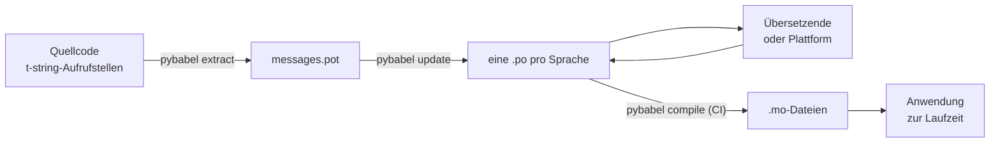

# Im Produktivbetrieb

Das [Tutorial](tutorial.md) durchläuft die Schleife einmal, allein, an einem
Programm mit einer einzigen Nachricht. In einem echten Projekt dreht sich die
Schleife weiter: Nachrichten ändern sich, nachdem sie übersetzt wurden, die
übersetzende Person arbeitet woanders und nach eigenem Zeitplan, und mit jedem
Release wird ein kompilierter Katalog ausgeliefert. Diese Seite ist diese
Praxis — was im Repository bleibt, was auf Reisen geht, was CI absichern muss
und wo die Laufzeit eine Sprache bindet.

## Die Gestalt eines Projekts { #the-shape-of-a-project }

```text
myapp/
├── babel.cfg
├── pyproject.toml
├── src/
│   └── myapp/
└── locales/
    ├── messages.pot
    ├── ja/LC_MESSAGES/messages.po
    └── de/LC_MESSAGES/messages.po
```

Committe `babel.cfg`, die `.pot`-Vorlage und jede `.po` — sie sind die Quellen
des Übersetzungs-Builds, und ihre Diffs sind der Weg, Übersetzungsänderungen
zu reviewen. Die kompilierten `.mo`-Dateien sind Build-Artefakte: Erzeuge sie
in CI oder beim Paketieren, statt sie zu committen, damit eine `.po` und ihre
`.mo` nie uneins darüber sein können, was ausgeliefert wird.

Eine Datei hat in jede Richtung eine Rolle: Die `.pot` trägt deine Nachrichten
*hinaus* zu den Übersetzenden, die `.po`-Dateien tragen Übersetzungen
*zurück*. Alles Folgende ist der Verkehr zwischen diesen beiden.



## Der Zyklus nach der ersten Übersetzung { #the-cycle-after-the-first-translation }

Das `pybabel init` des Tutorials läuft einmal pro Sprache — und nie wieder.
Von da an lautet der Arbeitszyklus **extrahieren → aktualisieren → übersetzen
→ kompilieren**, und sein Zentrum ist `pybabel update`, das eine frische
Vorlage in die vorhandenen Kataloge einarbeitet, ohne die bereits enthaltenen
Übersetzungen zu verwerfen.

Angenommen, die Begrüßung `Hello {name}` — bereits als `こんにちは {name}`
übersetzt — wird im Code zu `Welcome back, {name}` umformuliert. Extrahieren
und aktualisieren:

```console
$ pybabel extract -F babel.cfg -c "Translators:" -o locales/messages.pot .
extracting messages from app.py (encoding="utf-8")
writing PO template file to locales/messages.pot
$ pybabel update -i locales/messages.pot -d locales
updating catalog locales/ja/LC_MESSAGES/messages.po based on locales/messages.pot
```

Der japanische Katalog enthält jetzt:

```po
#. gettext-tstrings
#: app.py:4
#, fuzzy, python-brace-format
msgid "Welcome back, {name}"
msgstr "こんにちは {name}"
```

Babel hat bemerkt, dass die neue msgid einer entfernten ähnelt, und sie mit
der alten Übersetzung gepaart — das Paar aber als **fuzzy** markiert: die
Vermutung einer Maschine, die auf einen Menschen wartet. Das Flag hat Zähne.
`pybabel compile` **schließt fuzzy-Einträge aus der `.mo` aus** — bis eine
übersetzende Person das Paar bestätigt, rendert die Anwendung also den neuen
englischen Text statt eines veralteten japanischen:

```console
$ pybabel compile -d locales
compiling catalog locales/ja/LC_MESSAGES/messages.po to locales/ja/LC_MESSAGES/messages.mo
$ python app.py
Welcome back, Ada
```

Eine geänderte Nachricht degradiert daher genauso wie eine fehlerhafte — zur
Quellsprache, nie zu einer veralteten Übersetzung. Der Part der übersetzenden
Person in diesem Zyklus ist, das `msgstr` zu überarbeiten und das
`fuzzy`-Flag zu löschen; das nächste Kompilieren nimmt den Eintrag wieder
auf.

!!! note "Platzhalternamen sind Teil der Identität einer Nachricht"

    Die msgid ist der Katalogschlüssel, und der *Name* des Platzhalters
    steckt darin — wer also eine Variable im Code umbenennt
    (`name` → `user_name`), ändert die msgid und schickt die Übersetzung
    jeder Sprache erneut durch den fuzzy-Zyklus. Benenne interpolierte
    Variablen als Wörter, die eine übersetzende Person versteht, und benenne
    sie nur aus gutem Grund um.

    Die Formatierung ist das Spiegelbild: `!r` und `:.2f` sind
    [nicht Teil der msgid](internals.md#from-template-to-msgid), sodass das
    Verschärfen von `{amount:,.2f}` zu `{amount:,.0f}` in keinem Katalog
    etwas ändert. Den *Satz* umzuformulieren ist natürlich eine echte
    Änderung — das ist der Zyklus oben.

## Was CI absichert { #what-ci-gates }

Drei Fehlschläge sind einen roten Build wert: Die Kataloge sind hinter den
Code zurückgefallen, eine Übersetzung hat einen Platzhalter beschädigt, oder
ein fehlerhafter Eintrag hat sich bis zur Laufzeit durchgeschlichen. Ein
Schritt pro Fehlschlag:

```yaml
- run: pybabel extract -F babel.cfg -c "Translators:" -o locales/messages.pot .
- run: pybabel update -i locales/messages.pot -d locales --check
- run: pybabel compile -d locales
- run: pytest
```

`pybabel update --check` schreibt nichts um und endet mit einem Exitstatus
ungleich null, wenn ein Katalog gegenüber der frisch extrahierten Vorlage
veraltet ist — die Schranke gegen das Mergen von Code, dessen Nachrichten
niemand neu extrahiert hat. `pybabel compile` führt die Platzhalterprüfungen
von Babel und dem
[registrierten Checker](extraction.md#your-existing-toolchain-validates-these-catalogs)
dieses Pakets aus.

!!! bug "`--check` kann keinen Katalog absichern, der Kontexte verwendet"

    Unter Babel 2.18.0 meldet `pybabel update --check` **jeden** Katalog, der
    ein `msgctxt` enthält, bei jedem Lauf als veraltet, ganz gleich wie aktuell
    er ist. Der Vergleich läuft über `Catalog.is_identical`, das jede Nachricht
    unter dem Schlüssel nachschlägt, unter dem sie abgelegt ist — und bei einer
    kontextbehafteten Nachricht ist dieser Schlüssel das Paar `(id, context)`,
    das `Catalog.get` nicht annimmt. Die Suche liefert nichts zurück, und die
    Kataloge sind nie gleich:

    ```pycon
    >>> from babel.messages.catalog import Catalog
    >>> c = Catalog(locale="ja")
    >>> c.add("Guide", "ガイド", context="navigation")
    <Message 'Guide' (flags: [])>
    >>> c.is_identical(c)
    False
    ```

    Wenn du also `pgettext` oder `npgettext` überhaupt verwendest — und genau
    dafür gibt es sie, zur Unterscheidung eines Homonyms —, schlägt dieser
    Schritt auf die denkbar schlechteste Weise fehl: immer rot, also schaltet
    ein Team ihn ab, also sichert nichts mehr gegen Veralten ab. Bis das
    upstream behoben ist, vergleiche die Nachrichtenmengen selbst. Die Vorlage
    und jeden Katalog mit `babel.messages.pofile.read_po` einzulesen und
    `{(m.context, m.id) for m in catalog if m.id}` zu vergleichen ist die ganze
    Prüfung — und genau das tut
    [der eigene Build dieser Website](index.md).

!!! danger "Prüfe den Exitstatus, nicht das Log"

    `pybabel compile` meldet jeden Platzhalterfehler, endet mit einem Status
    ungleich null — **und schreibt die `.mo` trotzdem**. Eine Pipeline, die
    kompiliert und danach `locales/` in ein Image kopiert, liefert den
    fehlerhaften Katalog aus, sofern der Exitstatus ungleich null sie nicht
    tatsächlich stoppt. Den Schritt den Build fehlschlagen zu lassen, wie
    oben, ist die ganze Lösung.

Die letzte Zeile ist deine gewöhnliche Testsuite, um eine Gewohnheit ergänzt:
Irgendwo darin wird mindestens eine Nachricht pro ausgelieferter Sprache
durch einen strikten Übersetzer gerendert —

```python
import gettext

from gettext_tstrings import Translator


def test_catalogs_render(language: str) -> None:
    translations = gettext.translation("messages", localedir="locales", languages=[language])
    _ = Translator(translations, strict=True)
    name = "Ada"
    assert _(t"Welcome back, {name}")
```

— denn `strict=True`
[löst dort aus, wo die Produktion stillschweigend zurückfallen würde](guide.md#what-happens-when-a-catalog-is-wrong),
und ein Rendern zur Laufzeit ist die eine Prüfung, die den Katalog genau so
sieht, wie die Anwendung es tun wird, `.mo` inklusive.

## Zusammenarbeit mit Übersetzenden und Plattformen { #working-with-translators-and-platforms }

Die `.po`-Datei ist das Austauschformat der gesamten gettext-Welt — genau
deshalb verwendet diese Bibliothek sie weiter: Übersetzung zu übergeben
heißt, eine Datei zu übergeben, ob die Empfängerin eine Kollegin mit
PO-Editor ist oder eine Plattform wie Weblate oder Crowdin. Drei Dinge machen
die Übergabe gut:

**Sag, wozu die Nachricht dient.** Ein Kommentar im Code reist mit der
Nachricht — genau das sammelt das Flag `-c "Translators:"` ein:

```python
from gettext_tstrings import tr

name = "Ada"
# Translators: shown on the dashboard right after sign-in
print(tr(t"Welcome back, {name}"))
```

```po
#. Translators: shown on the dashboard right after sign-in
#. gettext-tstrings
#: app.py:5
#, python-brace-format
msgid "Welcome back, {name}"
msgstr ""
```

Eine übersetzende Person sieht diesen Kommentar in ihrem Editor, neben der
Nachricht, am anderen Ende der Welt. Es ist der günstigste Qualitätshebel im
gesamten Workflow. Für ein Wort, das sein eigenes Homonym ist — „Open“ der
Button gegenüber „Open“ der Zustand —, gib der Nachricht mit `pgettext`
einen [Kontext](guide.md#binding-a-catalog), der im Katalog als sichtbares
`msgctxt` erscheint.

**Lass die Plattform Platzhalter validieren.** Jede aus einer t-string
extrahierte Nachricht trägt das Flag `python-brace-format`, und diese eine
Zeile schaltet die Platzhalter-QA in Werkzeugen ein, die du nicht
kontrollierst — Weblate dokumentiert die Prüfung, kommerzielle Plattformen
knüpfen ihre eigene an dasselbe Flag, und `msgfmt --check-format` erzwingt
sie in jeder GNU-Pipeline. Die Details, und was der mitgelieferte Checker
darüber hinaus erkennt, stehen auf der
[Extraktionsseite](extraction.md#your-existing-toolchain-validates-these-catalogs).

**Vertrau dem Sicherheitsnetz genau so weit, wie es reicht.** Was von einer
Plattform zurückkommt, sind weiterhin Daten, die in deinen Build gelangen;
erst die CI-Schranken oben machen aus „die Plattform hat das vermutlich
geprüft“ ein „das kann nicht defekt ausgeliefert werden“.

## Eine Sprache zur Laufzeit binden { #binding-a-language-at-runtime }

Alles bisher erzeugt Kataloge. Die verbleibende Entscheidung ist, wo die
Anwendung einen auswählt, und sie hat eine einzige ehrliche Antwort: Binde
einmal pro *Geltungsbereich einer Sprache* — den Prozess bei einem CLI, die
Anfrage bei einem Webservice.

=== "Ein Prozess, eine Sprache"

    Ein Kommandozeilenwerkzeug oder eine Desktop-Anwendung liest die Umgebung
    der Nutzerin einmal, beim Start. Ohne `languages=` verhandelt die
    Standardbibliothek über `LANGUAGE`, `LC_ALL`, `LC_MESSAGES` und `LANG`;
    `fallback=True` liefert einen Null-Katalog — Quelltext — statt eine
    Exception auszulösen, wenn keine davon zu einem ausgelieferten Katalog
    passt.

    ```python
    import gettext

    from gettext_tstrings import Translator

    _ = Translator(gettext.translation("messages", localedir="locales", fallback=True))

    name = "Ada"
    print(_(t"Welcome back, {name}"))
    ```

=== "Flask"

    Eine Webanwendung entscheidet pro Anfrage. Lade jeden Katalog einmal beim
    Import und binde dann den ausgehandelten an den Kontext, bevor die View
    läuft — [`set_translations`](guide.md#per-request-language) ist
    kontextlokal, sodass gleichzeitige Anfragen in verschiedenen Sprachen nie
    die Bindung der jeweils anderen sehen.

    ```python
    import gettext

    from flask import Flask, request

    from gettext_tstrings import set_translations, tr

    LANGUAGES = ("en", "ja", "de")
    CATALOGS = {
        language: gettext.translation(
            "messages", localedir="locales", languages=[language], fallback=True
        )
        for language in LANGUAGES
    }

    app = Flask(__name__)


    @app.before_request
    def bind_language() -> None:
        language = request.accept_languages.best_match(LANGUAGES) or "en"
        set_translations(CATALOGS[language])


    @app.get("/")
    def home() -> str:
        name = "Ada"
        return tr(t"Welcome back, {name}")
    ```

=== "ASGI-Middleware"

    Unter async-Frameworks — FastAPI, Starlette und allem anderen, was ASGI
    spricht — umschließe die Anfrage mit
    [`use_translations`](guide.md#per-request-language): Die Bindung lebt in
    einer `ContextVar`, die async-Taskwechsel pro Anfrage bewahren.

    ```python
    import gettext

    from fastapi import FastAPI, Request

    from gettext_tstrings import tr, use_translations

    LANGUAGES = ("en", "ja", "de")
    CATALOGS = {
        language: gettext.translation(
            "messages", localedir="locales", languages=[language], fallback=True
        )
        for language in LANGUAGES
    }

    app = FastAPI()


    @app.middleware("http")
    async def bind_language(request: Request, call_next):
        language = negotiate_language(request.headers.get("accept-language"), LANGUAGES)
        with use_translations(CATALOGS[language]):
            return await call_next(request)
    ```

    `negotiate_language` steht für dein Accept-Language-Parsing — die meisten
    Frameworks oder ihre Ökosysteme bringen eines mit; worauf es hier
    ankommt, ist die Bindung um `call_next`.

Zwei Laufzeitgewohnheiten vervollständigen das Bild. Strings, die zur
Importzeit entstehen — ein Formularlabel, der Anzeigename eines Enums —,
dürfen nicht die Sprache einfangen, die während des Imports gerade aktiv
war; definiere sie mit [`lazy_gettext`](guide.md#deferred-translation), und
sie rendern in der Sprache, die bei der *Nutzung* aktiv ist. Und leite den
Logger `gettext_tstrings` dorthin, wo ein Mensch hinschaut: Seine Warnungen
sind der nachsichtige Modus, der eine Übersetzung meldet, die an jeder
Schranke vorbeigerutscht ist — eine Zeile pro defekter Nachricht statt einer
pro Rendern.

## Ausliefern { #shipping }

Die Produktion braucht das Paket, die `.mo`-Dateien und sonst nichts. Babel
ist eine Entwicklungs- und CI-Abhängigkeit — halte `gettext-tstrings[babel]`
aus dem Produktions-Image heraus und installiere dort das nackte Paket; das
Rendern läuft allein mit der Standardbibliothek. Kompiliere Kataloge in
demselben Build, der das auszuliefernde Artefakt erzeugt, damit die
`.mo`-Dateien darin exakt den reviewten `.po`-Dateien entsprechen und nie
etwas ausgeliefert wird, das auf irgendeinem Laptop kompiliert wurde.

Vor einem Release lautet die Checkliste, auf die sich diese Seite reduziert:

- `pybabel update --check` läuft durch — keine Nachricht hat sich geändert,
  ohne dass die Kataloge davon erfahren haben.
- `pybabel compile` schrankt den Build über seinen Exitstatus.
- Verbleibende `fuzzy`-Einträge sind beabsichtigt — jeder rendert als
  Quelltext, bis eine übersetzende Person ihn bestätigt.
- Die Testsuite rendert jede ausgelieferte Sprache einmal mit `strict=True`.
- Das Produktionsartefakt enthält `.mo`-Dateien und kein Babel.
- Der Logger `gettext_tstrings` ist ans Monitoring angebunden.

## Wie es weitergeht { #where-next }

- [Extraktion](extraction.md) — die Referenz für die Werkzeughälfte dieser
  Seite: Mapping-Optionen, eigene Funktionsnamen, strikter Modus und jeder
  Checker.
- [Anleitung](guide.md) — die Laufzeithälfte: Pluralformen, Kontexte,
  verzögerte Strings und die Fehlermodi im Detail.
- [Funktionsweise](internals.md) — warum die msgid so aussieht, wie sie
  aussieht, und was die Validierung tatsächlich prüft.
