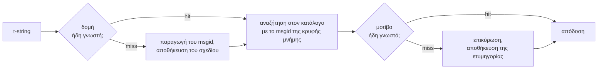

# Πώς λειτουργεί

Τίποτα σε αυτή τη σελίδα δεν απαιτείται για να χρησιμοποιήσετε τη
βιβλιοθήκη — αυτό το καλύπτουν η [εκμάθηση](tutorial.md) και ο
[οδηγός](guide.md). Αυτή η σελίδα ξαναχτίζει αντ' αυτού τη βιβλιοθήκη από τις
πρώτες αρχές: τι είναι πραγματικά ένα t-string, πώς προκύπτει από αυτό ένα
msgid, τι κάνει μια μετάφραση έγκυρη, και πώς η υλοποίηση κάνει όλον αυτόν
τον έλεγχο να κοστίζει δέκατα του μικροδευτερολέπτου. Διαβάστε τη αν έχετε
περιέργεια, αν θέλετε να συνεισφέρετε, ή αν σκοπεύετε να
[υλοποιήσετε μόνοι σας τη σύμβαση](#reimplementing-it).

## Τι είναι πραγματικά ένα t-string { #what-a-t-string-actually-is }

Ένα f-string παράγει μια `str`, και την παράγει αμέσως — μέχρι να το
παραλάβει οποιαδήποτε συνάρτηση, η τιμή έχει ήδη παρεμβληθεί και η πρόταση
έχει σφραγιστεί. Ένα t-string ([PEP 750]) έχει την ίδια σύνταξη και την ίδια
άπληστη αποτίμηση των εκφράσεών του, αλλά παράγει διαφορετικό τύπο:

```pycon
>>> name = "Ada"
>>> f"Hello {name}!"
'Hello Ada!'
>>> t"Hello {name}!"
Template(strings=('Hello ', '!'), interpolations=(Interpolation('Ada', 'name', None, ''),))
```

Αυτό το αντικείμενο `Template` κρατά, ακόμη χωριστά, τα μέρη που χρειάζεται
μια γραμμή παραγωγής καταλόγων:

```pycon
>>> template = t"Total: {amount:,.2f}"
>>> template.strings
('Total: ', '')
>>> template.interpolations[0].expression
'amount'
>>> template.interpolations[0].value
1234.5
>>> template.interpolations[0].format_spec
',.2f'
```

- `strings` — το κυριολεκτικό κείμενο γύρω από τις παρεμβολές, με τη σειρά
  του.
- Για κάθε παρεμβολή: η **έκφραση** ως πηγαίο κείμενο (`'amount'`), η
  αποτιμημένη **τιμή** της (`1234.5`), και όποια **μετατροπή** (`!r`) και
  **προδιαγραφή μορφοποίησης** (`,.2f`) — μεταφέρονται χωριστά αντί να
  εφαρμόζονται.

Ό,τι κάνει αυτή η βιβλιοθήκη είναι μια πειθαρχημένη κατανάλωση αυτής της
δομής. Η γλώσσα έχει ήδη κάνει τον έναν διαχωρισμό που χρειάζεται η i18n — το
στατικό κείμενο ξέχωρα από τις τιμές — οπότε η βιβλιοθήκη δεν αναλύει ποτέ
τον πηγαίο σας κώδικα και δεν μαντεύει ποτέ πού βρίσκεται μια τιμή μέσα σε
μια πρόταση. Απομένουν τρεις αποφάσεις: πώς η δομή γίνεται κλειδί καταλόγου,
τι επιτρέπεται να λέει μια μετάφραση αυτού του κλειδιού, και πώς τα δύο
αποδίδονται ξανά μαζί.

## Από το πρότυπο στο msgid { #from-template-to-msgid }

Ένα msgid — το κλειδί με το οποίο ευρετηριάζεται ένας κατάλογος — παράγεται
μόνο από τα *στατικά* μέρη του προτύπου. Διατρέξτε τα `strings` και τα
`interpolations` με τη σειρά της πηγής· διαφύγετε τα άγκιστρα κάθε
κυριολεκτικού τμήματος (το `{` γίνεται `{{`)· για κάθε παρεμβολή, εκπέμψτε
ένα διακριτικό `{name}`, όπου το `name` είναι το κείμενο της έκφρασης με
αφαιρεμένα τα περιβάλλοντα κενά. Από το `t"Total: {amount:,.2f}"`:

```text
strings         ('Total: ', '')
interpolations  expression 'amount'   conversion None   format_spec ',.2f'
msgid           'Total: {amount}'
```

Κάθε μέρος αυτού του κανόνα έχει τον λόγο του:

- **Η έκφραση πρέπει να είναι απλό όνομα** — η `str.isidentifier()` είναι
  αληθής και δεν πρόκειται για δεσμευμένη λέξη της Python. Το
  `t"Hello {user.name}"` απορρίπτεται στο σημείο κλήσης. Ένα msgid είναι
  *κλειδί*: πρέπει να βγαίνει πανομοιότυπο σε κάθε εκτέλεση και κάθε εξαγωγή,
  και το διαβάζουν μεταφραστές, οπότε το σύμβολο κράτησης θέσης πρέπει να
  είναι μια σταθερή, ουσιαστική λέξη — όχι ένα απόσπασμα κώδικα που
  προσκαλεί τον κατάλογο να γίνει γλώσσα εκφράσεων.
- **Η μετατροπή και η προδιαγραφή μορφοποίησης δεν μπαίνουν ποτέ στο msgid.**
  Οι μεταφραστές δεν θα έπρεπε να χρειάζεται να διαβάζουν το `:,.2f`, και
  καμία μετάφραση δεν θα έπρεπε να μπορεί να το αλλάξει. Το πόρισμα αξίζει να
  το ξέρετε: το σφίξιμο του `:,.2f` σε `:,.0f` στον κώδικά σας δεν αλλάζει
  κανένα msgid, οπότε δεν ακυρώνει καμία μετάφραση σε καμία γλώσσα. Το κλειδί
  του καταλόγου παρακολουθεί *τι λέει η πρόταση*, όχι πώς μορφοποιείται η
  τιμή.
- **Ένα επαναλαμβανόμενο όνομα πρέπει να επαναλαμβάνει ακριβώς και τη
  μορφοποίησή του.** Το `t"{x:.2f} vs {x:.3f}"` απορρίπτεται, γιατί και οι
  δύο εμφανίσεις καταρρέουν στο ίδιο διακριτικό `{x}` και το msgid δεν θα
  μπορούσε πια να πει ποια μορφοποίηση πρέπει να χρησιμοποιήσει μια απόδοση.
- **Το κενό msgid δεν αναζητείται ποτέ**, γιατί το gettext το δεσμεύει για
  την ίδια την κεφαλίδα μεταδεδομένων του καταλόγου. Το `t""` αποδίδεται ως
  `""` χωρίς να αγγίξει τον κατάλογο.

Το πλήρες σύνολο κανόνων, μαζί με τις ακραίες περιπτώσεις που παραλείπει αυτή
η σελίδα, είναι το
[SPEC §2](https://github.com/yhay81/gettext-tstrings/blob/main/SPEC.md).

## Τι επιτρέπεται να λέει μια μετάφραση { #what-a-translation-may-say }

Ένα μοτίβο που επιστρέφει από έναν κατάλογο αναλύεται με τον
`string.Formatter` — τον ίδιο αναλυτή που χρησιμοποιεί η `str.format`. Η
γραμματική είναι σκόπιμα δανεισμένη αντί για επινοημένη: ένα μοτίβο που
δέχεται αυτή η βιβλιοθήκη είναι μοτίβο που το ευρύτερο οικοσύστημα ήδη
καταλαβαίνει. Έπειτα εφαρμόζονται δύο έλεγχοι.

**Μορφή:** κάθε πεδίο πρέπει να είναι ένα γυμνό `{name}`. Μια μετατροπή ή
προδιαγραφή μορφοποίησης — συμπεριλαμβανομένου του ρητά κενού `{name:}` —
απορρίπτεται, όπως και τα θεσιακά πεδία (`{0}`, `{}`) και τα ονόματα με
γέμισμα κενών (`{ name }`). Το τελευταίο μετράει περισσότερο απ' όσο
φαίνεται: η `str.format` και το GNU `msgfmt` απορρίπτουν και τα δύο το
`{ name }`, οπότε το να γινόταν εδώ δεκτό θα παρήγαγε καταλόγους που κανένα
άλλο εργαλείο της αλυσίδας δεν μπορεί να επικυρώσει.

**Ονόματα:** το σύνολο των συμβόλων κράτησης θέσης του μοτίβου συγκρίνεται με
εκείνο της πηγής. Για ένα μήνυμα ενικού κάθε πηγαίο όνομα είναι *απαιτούμενο*
και τίποτε άλλο δεν είναι *επιτρεπτό*. Για ένα μήνυμα πληθυντικού οι δύο
κλάδοι συγχωνεύονται:

- **επιτρεπτά** = η ένωση των ονομάτων και των δύο κλάδων
- **απαιτούμενα** = η τομή τους

Έτσι, απέναντι στα `t"One file"` / `t"{n} files"`, το όνομα `n` είναι
επιτρεπτό σε μετάφραση οποιασδήποτε από τις δύο μορφές αλλά απαιτούμενο σε
καμία. Αυτή η ασυμμετρία είναι που επιτρέπει στο σύστημα πληθυντικού μιας
γλώσσας-στόχου να διαφέρει από εκείνο της πηγής — τα ιαπωνικά μεταφράζουν και
τους δύο κλάδους με μία μορφή που πιθανότατα χρησιμοποιεί το `{n}`· μια
γλώσσα με περισσότερες μορφές από τα αγγλικά μπορεί να χρειαστεί το `{n}` σε
μια μορφή όπου τα αγγλικά δεν έχουν καμία.

Τίποτα από αυτά δεν είναι υποθετικό: ο κατάλογος της ίδιας της διεπαφής αυτού
του ιστότοπου φέρει το μήνυμα πληθυντικού `Built {n} localized page` /
`Built {n} localized pages` — δύο αγγλικοί κλάδοι — και οι εκδόσεις του
ιστότοπου μεταφράζουν αυτό το ένα μήνυμα σε οπουδήποτε από μία μορφή ώς έξι:

| Κατάλογος | Μορφές | Οι μεταφράσεις, με τη σειρά των μορφών |
| --- | --- | --- |
| Ιαπωνικά | 1 | `ローカライズ済みページを{n}件ビルドしました` |
| Τουρκικά | 2 | `{n} yerelleştirilmiş sayfa oluşturuldu` — δύο φορές, πανομοιότυπη: τα τουρκικά ουσιαστικά μένουν στον ενικό μετά από αριθμητικό |
| Ιταλικά | 2 | `Generata {n} pagina localizzata` · `Generate {n} pagine localizzate` — η μετοχή συμφωνεί σε γένος και αριθμό |
| Ρωσικά | 3 | `Собрана {n} локализованная страница` · `Собраны {n} локализованные страницы` · `Собрано {n} локализованных страниц` |
| Πολωνικά | 3 | `Zbudowano {n} zlokalizowaną stronę` · `Zbudowano {n} zlokalizowane strony` · `Zbudowano {n} zlokalizowanych stron` |
| Αραβικά | 6 | ανάμεσά τους `تم إنشاء صفحة مترجمة واحدة ({n})` για ακριβώς ένα και `تم إنشاء {n} صفحات مترجمة` για λίγα |

Κάθε γραμμή είναι ζωντανή καταχώριση στα `i18n/*/LC_MESSAGES/site.po` αυτού
του αποθετηρίου, που αποδίδεται από το [πολύγλωσσο build](index.md) σε κάθε
έκδοση — και μια δοκιμή καρφιτσώνει αυτόν τον πίνακα σε εκείνους τους
καταλόγους, ώστε τα δύο να μην μπορούν να αποκλίνουν.

Μέσα σε αυτά τα όρια, η αναδιάταξη και η επανάληψη είναι σκόπιμα χωρίς
περιορισμούς. Και τα δύο είναι γραμματικά αναγκαία σε πραγματικές γλώσσες,
και ο περιορισμός του πλήθους των εμφανίσεων θα απέρριπτε σωστές μεταφράσεις
χωρίς κανένα όφελος ασφάλειας: μια μετάφραση εξακολουθεί να μην μπορεί να
*αποτιμήσει* τίποτα, γιατί δεν υπάρχει διαδρομή αποτίμησης — τα σύμβολα
κράτησης θέσης αναζητούνται με το όνομά τους μέσα στις ήδη υπολογισμένες
τιμές του προτύπου, και δεν τροφοδοτούνται ποτέ στην `eval`, στην `getattr`
ή στην ίδια την `str.format`.

## Απόδοση { #rendering }

Η απόδοση ενός επικυρωμένου μοτίβου είναι μια διαδρομή πάνω στα κομμάτια του:
εκπέμπεται κάθε κυριολεκτικό μέρος και, για κάθε σύμβολο κράτησης θέσης,
λαμβάνεται η αιχμαλωτισμένη τιμή της παρεμβολής και εφαρμόζονται η μετατροπή
και η προδιαγραφή μορφοποίησης *της πλευράς της πηγής* —
`format(convert(value, conversion), format_spec)`. Δύο εγγυήσεις τηρούνται
στην πορεία:

- **Κάθε διακριτή τιμή μορφοποιείται το πολύ μία φορά ανά απόδοση**, ακόμη κι
  όταν η μετάφραση επαναλαμβάνει ένα σύμβολο κράτησης θέσης. Η επανάληψη
  αλλάζει το πόσο συχνά εισάγεται το αποτέλεσμα, όχι το πόσο συχνά τρέχει η
  δική σας `__format__`.
- **Στους πληθυντικούς, ένα σύμβολο κράτησης θέσης διαβάζει τον κλάδο που το
  όρισε.** Ένα όνομα παρόν και στους δύο κλάδους διαβάζει την τιμή που
  αιχμαλώτισε ο κλάδος τον οποίο επιλέγει η γλώσσα *προέλευσης* (`singular`
  όταν `n == 1`, αλλιώς `plural`)· ένα όνομα ειδικό για έναν κλάδο διαβάζει
  πάντα τον δικό του κλάδο, ακόμη κι όταν οι κανόνες πληθυντικού της
  γλώσσας-στόχου το κατέστησαν διαθέσιμο σε άλλη μορφή.

Όταν η επικύρωση αποτυγχάνει κατά την απόδοση, η αντίδραση χωρίζεται ανάλογα
με το ποιος έδωσε το μοτίβο. Ένα μοτίβο που βγήκε από *κατάλογο*
υποβαθμίζεται: καταγράφεται μία προειδοποίηση και αποδίδεται το πηγαίο
κείμενο, τηρώντας το συμβόλαιο του gettext ότι ένας χαλασμένος κατάλογος δεν
ρίχνει ποτέ την εφαρμογή
([ο οδηγός δείχνει και τις δύο λειτουργίες](guide.md#what-happens-when-a-catalog-is-wrong)).
Ένα μοτίβο που πέρασε απευθείας ο καλών — η `CompiledTemplate.render` —
εγείρει πάντα εξαίρεση, γιατί δεν υπάρχει πηγαίο κείμενο *από* το οποίο να
υποβαθμιστεί· η επιείκεια υπάρχει για τις αναζητήσεις καταλόγου, όχι για τα
ορίσματα.

## Τα διαγνωστικά είναι μέρος του σχεδιασμού { #diagnostics-are-part-of-the-design }

Ένα σφάλμα συμβόλου κράτησης θέσης καταλήγει συνήθως μπροστά σε μεταφραστή,
όχι σε προγραμματιστή, και συχνά σε ένα αρχείο όπου το πρόβλημα είναι
αόρατο. Το να πεις `{name} is missing` σε κάποιον που βλέπει ακριβώς αυτούς
τους χαρακτήρες στον επεξεργαστή του είναι αδιέξοδο, οπότε τα μηνύματα
υπολογίζονται με τρεις κανόνες:

- Ένα όνομα που περιέχει **αόρατο χαρακτήρα** — ένα διάστημα χωρίς αλλαγή
  γραμμής που παρήγαγε μια μέθοδος εισαγωγής, ένα διάστημα μηδενικού πλάτους
  — τυπώνεται με τον χαρακτήρα αυτόν αντικατεστημένο από το σημείο κώδικά
  του, στη θέση του: `{<U+00A0>name}`. Ο αναγνώστης χρειάζεται να δει το
  *πού*.
- Ένα όνομα του οποίου τα γράμματα **αναμειγνύουν συστήματα γραφής**, η
  περίπτωση των ομοιόγλυφων, εμφανίζεται δύο φορές — μία ευανάγνωστα, μία με
  διαφυγή — γιατί το `{nаme}` με κυριλλικό `а` είναι αδιάκριτο από το
  `{name}` στο τυπωμένο κείμενο, και η μορφή με διαφυγή `(nаme)` είναι η μόνη
  γραφή που τα ξεχωρίζει.
- Οτιδήποτε άλλο εμφανίζεται **όπως γράφτηκε**. Τα `{名前}` και `{café}`
  είναι συνηθισμένα ονόματα· η διαφυγή τους θα άφηνε τον αναγνώστη ανίκανο
  να βρει τι εννοούνταν.

Με την ίδια αρχή, ένα σύμβολο κράτησης θέσης που «λείπει» ενώ *μοιάζει* παρόν
παίρνει εξήγηση για την απουσία του — άγκιστρα πλήρους πλάτους από μια
ανατολικοασιατική μέθοδο εισαγωγής, ο διπλασιασμός `{{name}}` από μια
διαδρομή διαφυγής και επιστροφής, το όνομα έξω από κάθε άγκιστρο. Ο
[πίνακας ανάγνωσης αποτυχιών του οδηγού](guide.md#reading-a-failure-message)
δείχνει καθένα από αυτά τα μηνύματα αυτολεξεί.

## Η θερμή διαδρομή { #the-hot-path }

Όλα τα παραπάνω συμβαίνουν σε κάθε μεταφρασμένη συμβολοσειρά που αποδίδει μια
εφαρμογή, οπότε η υλοποίηση είναι χτισμένη γύρω από μία ιδέα: **η επικύρωση
δεν παραλείπεται ποτέ, άρα η επικύρωση πρέπει να είναι αυτό που μπαίνει στην
κρυφή μνήμη.**



Τρεις κρυφές μνήμες, μία ανά στάδιο:

- **Ένα σχέδιο ανά δομή σημείου κλήσης.** Η πλειάδα `strings` του προτύπου —
  ένα αντικείμενο που ο διερμηνέας έχει ήδη κατασκευάσει — είναι το κλειδί
  της κρυφής μνήμης, οπότε μια αναζήτηση δεν δεσμεύει τίποτα. Σε μια
  επιτυχία, η έκφραση, η μετατροπή και η προδιαγραφή μορφοποίησης κάθε
  παρεμβολής συγκρίνονται και πάλι με τις καταγεγραμμένες: δύο σημεία κλήσης
  που μοιράζονται το κυριολεκτικό κείμενο αλλά διαφέρουν στη μορφοποίηση (το
  `t"{x:.2f}"` απέναντι στο `t"{x:.3f}"`) δεν πρέπει να συγκρουστούν, και
  αυτή η σύγκριση είναι το τίμημα της χρήσης ενός κλειδιού που ο διερμηνέας
  παραδίδει δωρεάν.
- **Μια ετυμηγορία ανά μοτίβο.** Την πρώτη φορά που ένας κατάλογος απαντά με
  ένα δεδομένο μοτίβο, αυτό αναλύεται και επικυρώνεται· το αποτέλεσμα — ένα
  μεταγλωττισμένο σχέδιο απόδοσης, ή μια καταγραφή της ακυρότητας —
  φυλάσσεται πάνω στο σχέδιο. Κάθε μεταγενέστερη απόδοση αυτού του μηνύματος
  το φτάνει με μία αναζήτηση σε λεξικό. Τα άκυρα μοτίβα θυμούνται κι αυτά,
  γι' αυτό και μια χαλασμένη καταχώριση καταλόγου προειδοποιεί μία φορά αντί
  σε κάθε απόδοση.
- **Ένα συγχωνευμένο σχέδιο ανά ζεύγος πληθυντικού**, που κρατά τα σύνολα
  ένωσης/τομής ώστε η αριθμητική των κλάδων να γίνεται μία φορά ανά μήνυμα,
  όχι μία φορά ανά κλήση.

Κάθε κρυφή μνήμη είναι φραγμένη, και καμία δεν κρατά παρεμβαλλόμενες *τιμές*
— μόνο στατική δομή και κείμενο μοτίβων. Το αποτέλεσμα, μετρημένο από το
[`benchmarks/runtime.py`](https://github.com/yhay81/gettext-tstrings/blob/main/benchmarks/runtime.py):
περίπου 0,4 µs για ένα μήνυμα ενός πεδίου, συμπεριλαμβανομένης της
κατασκευής του ίδιου του t-string, περίπου 2,5× ένα σκέτο
`gettext(...).format(...)` που δεν ελέγχει τίποτα. Ο σχολιασμός στην κορυφή
του
[`core.py`](https://github.com/yhay81/gettext-tstrings/blob/main/src/gettext_tstrings/core.py)
καταγράφει τις επιμέρους μετρήσεις πίσω από αυτό το σχήμα.

## Η επανυλοποίησή της { #reimplementing-it }

Τίποτα από τα παραπάνω δεν είναι απόκρυφη γνώση: η σύμβαση είναι
καταγεγραμμένη ως [spec v1](spec.md), και η μηχανικά αναγνώσιμη
[σουίτα συμμόρφωσής](spec.md#conformance) της επιτρέπει σε έναν εξαγωγέα, σε
ένα πρόσθετο IDE ή σε μια υλοποίηση σε άλλη γλώσσα να ελεγχθεί απέναντι σε
κάθε κανόνα που εξήγησε αυτή η σελίδα. Αυτή η υλοποίηση τρέχει τη σουίτα
μέσα στις δικές της δοκιμές, και αυτό είναι που εμποδίζει αυτή τη σελίδα, την
προδιαγραφή και τον κώδικα να αποκλίνουν σιωπηλά.

  [PEP 750]: https://peps.python.org/pep-0750/
