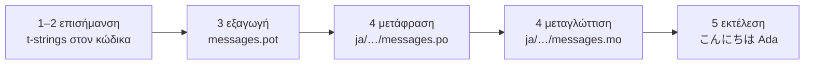

# Εκμάθηση

Αυτή η σελίδα ξεκινά από έναν άδειο κατάλογο και καταλήγει σε ένα πρόγραμμα
που χαιρετά στα ιαπωνικά. Πέντε βήματα, χωρίς να προϋποτίθεται εμπειρία με το
gettext, και κάθε εντολή εμφανίζεται με την έξοδο που πραγματικά παράγει —
ώστε σε κάθε βήμα να ξέρετε αν βρίσκεστε στον σωστό δρόμο.

Χρειάζεστε Python 3.14 ή νεότερη, γιατί τα t-strings είναι νέα σύνταξη της
3.14. Τα ιαπωνικά είναι η γλώσσα-στόχος του παραδείγματος αυτής της σελίδας,
αλλά τίποτα δεν εξαρτάται από αυτή την επιλογή — αντικαταστήστε όποια γλώσσα
θέλετε στο βήμα 4, όπου ο κωδικός τοπικών ρυθμίσεων `ja` είναι το μόνο
σημείο που την κατονομάζει.

## 1. Εγκατάσταση { #1-install }

```console
python -m pip install "gettext-tstrings[babel]"
```

Το extra `[babel]` φέρνει το [Babel], το εργαλείο που συλλέγει τα μηνύματά
σας σε αρχεία καταλόγου στο βήμα 3. Είναι εργαλείο για την ώρα της
ανάπτυξης: ο κώδικας παραγωγής αποδίδει μόνο με την τυπική βιβλιοθήκη.

## 2. Επισημάνετε ένα μήνυμα στον κώδικά σας { #2-mark-a-message-in-your-code }

Δημιουργήστε το `app.py`:

```python
from gettext_tstrings import tr

name = "Ada"
print(tr(t"Hello {name}"))
```

Το `t"Hello {name}"` μοιάζει με f-string, αλλά το πρόθεμα `t` κρατά το
κείμενο και την τιμή χωριστά αντί να τα συγχωνεύσει επιτόπου. Αυτός ο
διαχωρισμός είναι που επιτρέπει στην `tr()` να αναζητήσει μια μετάφραση για
ολόκληρη την πρόταση `Hello {name}` και να εισαγάγει την τιμή μετά.

Εκτελέστε το τώρα:

```console
$ python app.py
Hello Ada
```

Καμία μετάφραση δεν είναι ακόμη εγκατεστημένη, οπότε το πηγαίο κείμενο
αποδίδεται ως έχει. Ένα πρόγραμμα που χρησιμοποιεί αυτή τη βιβλιοθήκη δεν
*απαιτεί* ποτέ κατάλογο για να τρέξει — τα αγγλικά (ή όποια κι αν είναι η
πηγαία γλώσσα σας) είναι η ενσωματωμένη εφεδρεία.

## 3. Εξαγάγετε τα μηνύματα { #3-extract-the-messages }

Οι μεταφραστές δεν διαβάζουν τον πηγαίο κώδικά σας· ένα μικρό αρχείο που
λέγεται **κατάλογος** ταξιδεύει ανάμεσα σε εσάς και σε αυτούς. Το πρώτο βήμα
προς αυτόν είναι να συλλεχθεί από τον κώδικα κάθε επισημασμένο μήνυμα.

Πείτε στο Babel πώς να βρίσκει τα μηνύματά σας δημιουργώντας το `babel.cfg`:

```ini
[gettext_tstrings: **.py]
encoding = utf-8
```

Έπειτα εξαγάγετε σε ένα αρχείο-πρότυπο (`.pot`):

```console
$ mkdir -p locales
$ pybabel extract -F babel.cfg -c "Translators:" -o locales/messages.pot .
extracting messages from app.py (encoding="utf-8")
writing PO template file to locales/messages.pot
```

Το `locales/messages.pot` περιέχει τώρα μία καταχώριση ανά μήνυμα:

```po
#. gettext-tstrings
#: app.py:4
#, python-brace-format
msgid "Hello {name}"
msgstr ""
```

Το `msgid` είναι το κλειδί που θα αναζητά ο κώδικάς σας. Το κενό `msgstr`
είναι το σημείο όπου μπαίνει μια μετάφραση — αλλά όχι σε αυτό το αρχείο: ένα
`.pot` είναι *πρότυπο*, και το επόμενο βήμα το αντιγράφει μία φορά ανά
γλώσσα.

## 4. Μεταφράστε και μεταγλωττίστε { #4-translate-and-compile }

Δημιουργήστε τον ιαπωνικό κατάλογο από το πρότυπο:

```console
$ pybabel init -i locales/messages.pot -d locales -l ja
creating catalog locales/ja/LC_MESSAGES/messages.po based on locales/messages.pot
```

Ανοίξτε το `locales/ja/LC_MESSAGES/messages.po` και συμπληρώστε το `msgstr`:

```po
msgid "Hello {name}"
msgstr "こんにちは {name}"
```

Κρατήστε το `{name}` ακριβώς όπως είναι — το σύμβολο κράτησης θέσης είναι ο
τρόπος με τον οποίο η τιμή βρίσκει τη θέση της μέσα στη μεταφρασμένη
πρόταση, και η μετάφραση είναι ελεύθερη να το μετακινήσει όπου το χρειάζεται
η γλώσσα-στόχος. Σε ένα πραγματικό έργο, αυτό το αρχείο `.po` είναι αυτό που
παραδίδετε σε έναν μεταφραστή ή ανεβάζετε σε μια πλατφόρμα μετάφρασης· η
μορφή είναι η ίδια σε κάθε περίπτωση.

Οι κατάλογοι επεξεργάζονται ως κείμενο αλλά φορτώνονται σε δυαδική μορφή
(`.mo`), οπότε μεταγλωττίστε:

```console
$ pybabel compile -d locales
compiling catalog locales/ja/LC_MESSAGES/messages.po to locales/ja/LC_MESSAGES/messages.mo
```

Αυτή η εντολή είναι και δίχτυ ασφαλείας. Αν η μετάφραση είχε χαλάσει το
σύμβολο κράτησης θέσης — `{nome}` αντί για `{name}`, ας πούμε — θα αρνιόταν
να περάσει:

```console
$ pybabel compile -d locales
error: locales/ja/LC_MESSAGES/messages.po:24: translation does not match the
source placeholders: {name} is missing; {nome} is not in the source message
1 errors encountered.
```

## 5. Εκτελέστε το { #5-run-it }

Στρέψτε το `app.py` προς τον μεταγλωττισμένο κατάλογο. Κάντε κλικ στους
δείκτες για να δείτε τι κάνει κάθε γραμμή:

```python
import gettext

from gettext_tstrings import Translator

_ = Translator(gettext.translation("messages", localedir="locales", languages=["ja"]))  # (1)!

name = "Ada"
print(_(t"Hello {name}"))  # (2)!
```

1. Η τυπική βιβλιοθήκη φορτώνει το μεταγλωττισμένο `.mo` και ο `Translator`
   το δένει σε ένα καλέσιμο αντικείμενο. Το `_` είναι το καθιερωμένο όνομα
   του gettext για το «μετάφρασε αυτό» — σύντομο επειδή εμφανίζεται σε κάθε
   συμβολοσειρά που βλέπει ο χρήστης. Είναι η ίδια συνάρτηση με την `tr`,
   δεμένη σε έναν κατάλογο.
2. Στην κλήση: το κείμενο του t-string γίνεται το κλειδί αναζήτησης
   `Hello {name}`, ο κατάλογος απαντά `こんにちは {name}`, η απάντηση
   ελέγχεται ως προς τα πηγαία σύμβολα κράτησης θέσης, και μόνο τότε
   τοποθετείται η τιμή.

```console
$ python app.py
こんにちは Ada
```

Αυτός είναι όλος ο βρόχος, και αξίζει να τον δείτε ως μία εικόνα:



**Επισήμανση → εξαγωγή → μετάφραση → μεταγλώττιση → εκτέλεση.** Όλα τα
υπόλοιπα σε αυτόν τον ιστότοπο είναι εκλέπτυνση ενός από αυτά τα πέντε
βήματα.

## Πού να συνεχίσετε { #where-next }

- [Γιατί t-strings](comparison.md) — από τι σας προστατεύει αυτός ο
  σχεδιασμός, σε σύγκριση με τα `%(name)s`, `.format()` και τις
  συμβολοσειρές `$`.
- [Οδηγός](guide.md) — πληθυντικοί, γλώσσες ανά αίτημα, αναβαλλόμενες
  συμβολοσειρές, και τι συμβαίνει κατά την εκτέλεση όταν ένας κατάλογος
  είναι έτσι κι αλλιώς λανθασμένος.
- [Στην παραγωγή](workflow.md) — ο ίδιος βρόχος όπως τον τρέχει μια ομάδα,
  εβδομάδα με την εβδομάδα: ενημέρωση καταλόγων, πύλες CI και πλατφόρμες
  μετάφρασης.
- [Εξαγωγή](extraction.md) — η πλήρης αναφορά του `pybabel`: προσαρμοσμένα
  ονόματα συναρτήσεων, αυστηρή λειτουργία για CI, και οι έλεγχοι που
  φρουρούν τους καταλόγους σας.

  [Babel]: https://babel.pocoo.org/
