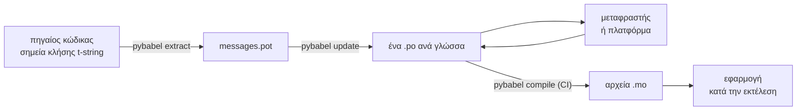

# Στην παραγωγή

Η [εκμάθηση](tutorial.md) τρέχει τον βρόχο μία φορά, μόνη, σε ένα πρόγραμμα
με ένα μήνυμα. Σε ένα πραγματικό έργο ο βρόχος συνεχίζει να γυρίζει: τα
μηνύματα αλλάζουν αφού έχουν μεταφραστεί, ο μεταφραστής δουλεύει αλλού και
με το δικό του πρόγραμμα, και ένας μεταγλωττισμένος κατάλογος αποστέλλεται
με κάθε έκδοση. Αυτή η σελίδα είναι αυτή η πρακτική — τι μένει στο
αποθετήριο, τι ταξιδεύει, τι πρέπει να φρουρεί το CI, και πού δένει ο χρόνος
εκτέλεσης μια γλώσσα.

## Η μορφή ενός έργου { #the-shape-of-a-project }

```text
myapp/
├── babel.cfg
├── pyproject.toml
├── src/
│   └── myapp/
└── locales/
    ├── messages.pot
    ├── ja/LC_MESSAGES/messages.po
    └── de/LC_MESSAGES/messages.po
```

Κάντε commit το `babel.cfg`, το πρότυπο `.pot` και κάθε `.po` — είναι οι
πηγές του build της μετάφρασης, και τα diff τους είναι ο τρόπος με τον οποίο
αναθεωρείτε τις αλλαγές των μεταφράσεων. Τα μεταγλωττισμένα αρχεία `.mo`
είναι τεχνουργήματα build: παράγετέ τα στο CI ή τη στιγμή της συσκευασίας
αντί να τα κάνετε commit, ώστε ένα `.po` και το `.mo` του να μην μπορούν
ποτέ να διαφωνήσουν για το τι αποστέλλεται.

Ένα αρχείο έχει ρόλο προς κάθε κατεύθυνση: το `.pot` μεταφέρει τα μηνύματά
σας *προς τα έξω*, στους μεταφραστές, και τα αρχεία `.po` φέρνουν τις
μεταφράσεις *πίσω*. Όλα τα παρακάτω είναι η κίνηση ανάμεσα σε αυτά τα δύο.



## Ο κύκλος μετά την πρώτη μετάφραση { #the-cycle-after-the-first-translation }

Το `pybabel init` της εκμάθησης τρέχει μία φορά ανά γλώσσα, για πάντα. Από
εκεί και έπειτα ο κύκλος εργασίας είναι **εξαγωγή → ενημέρωση → μετάφραση →
μεταγλώττιση**, και το κέντρο του είναι το `pybabel update`, που ενσωματώνει
ένα φρέσκο πρότυπο στους υπάρχοντες καταλόγους χωρίς να πετά τις μεταφράσεις
που ήδη περιέχουν.

Ας υποθέσουμε ότι ο χαιρετισμός `Hello {name}` — ήδη μεταφρασμένος ως
`こんにちは {name}` — αναδιατυπώνεται στον κώδικα σε `Welcome back, {name}`.
Εξαγάγετε και ενημερώστε:

```console
$ pybabel extract -F babel.cfg -c "Translators:" -o locales/messages.pot .
extracting messages from app.py (encoding="utf-8")
writing PO template file to locales/messages.pot
$ pybabel update -i locales/messages.pot -d locales
updating catalog locales/ja/LC_MESSAGES/messages.po based on locales/messages.pot
```

Ο ιαπωνικός κατάλογος τώρα περιέχει:

```po
#. gettext-tstrings
#: app.py:4
#, fuzzy, python-brace-format
msgid "Welcome back, {name}"
msgstr "こんにちは {name}"
```

Το Babel παρατήρησε ότι το νέο msgid μοιάζει με ένα που αφαιρέθηκε και το
ζευγάρωσε με την παλιά μετάφραση — αλλά σημείωσε το ζευγάρι ως **fuzzy**: η
εικασία μιας μηχανής που περιμένει έναν άνθρωπο. Η σημαία έχει δόντια. Το
`pybabel compile` **αποκλείει τις καταχωρίσεις fuzzy από το `.mo`**, οπότε
μέχρι να επιβεβαιώσει το ζευγάρι ένας μεταφραστής, η εφαρμογή αποδίδει το
νέο αγγλικό κείμενο και όχι ένα μπαγιάτικο ιαπωνικό:

```console
$ pybabel compile -d locales
compiling catalog locales/ja/LC_MESSAGES/messages.po to locales/ja/LC_MESSAGES/messages.mo
$ python app.py
Welcome back, Ada
```

Ένα αλλαγμένο μήνυμα, επομένως, υποβαθμίζεται όπως και ένα χαλασμένο — στη
γλώσσα προέλευσης, ποτέ σε μια ξεπερασμένη μετάφραση. Το μερίδιο του
μεταφραστή στον κύκλο είναι να αναθεωρήσει το `msgstr` και να διαγράψει τη
σημαία `fuzzy`· η επόμενη μεταγλώττιση παραλαμβάνει την καταχώριση.

!!! note "Τα ονόματα των συμβόλων κράτησης θέσης είναι μέρος της ταυτότητας του μηνύματος"

    Το msgid είναι το κλειδί του καταλόγου, και το *όνομα* του συμβόλου
    κράτησης θέσης βρίσκεται μέσα του — οπότε η μετονομασία μιας μεταβλητής
    στον κώδικα (`name` → `user_name`) αλλάζει το msgid και στέλνει τη
    μετάφρασή του σε κάθε γλώσσα ξανά μέσα από τον κύκλο του fuzzy.
    Ονομάζετε τις παρεμβαλλόμενες μεταβλητές με λέξεις που θα καταλάβει ένας
    μεταφραστής, και μετονομάζετέ τις μόνο με λόγο.

    Η μορφοποίηση είναι το είδωλο στον καθρέφτη: τα `!r` και `:.2f`
    [δεν είναι μέρος του msgid](internals.md#from-template-to-msgid), οπότε
    το σφίξιμο του `{amount:,.2f}` σε `{amount:,.0f}` δεν αλλάζει τίποτα σε
    κανέναν κατάλογο. Η αναδιατύπωση της *πρότασης*, φυσικά, είναι
    πραγματική αλλαγή — αυτός είναι ο παραπάνω κύκλος.

## Τι φρουρεί το CI { #what-ci-gates }

Τρεις αποτυχίες αξίζουν ένα κόκκινο build: οι κατάλογοι έμειναν πίσω από τον
κώδικα, μια μετάφραση χάλασε ένα σύμβολο κράτησης θέσης, ή μια χαλασμένη
καταχώριση γλίστρησε ώς τον χρόνο εκτέλεσης. Ένα βήμα ανά αποτυχία:

```yaml
- run: pybabel extract -F babel.cfg -c "Translators:" -o locales/messages.pot .
- run: pybabel update -i locales/messages.pot -d locales --check
- run: pybabel compile -d locales
- run: pytest
```

Το `pybabel update --check` δεν ξαναγράφει τίποτα και τερματίζει με μη
μηδενικό κωδικό όταν ένας κατάλογος έχει μείνει πίσω από το φρεσκοεξαγμένο
πρότυπο — η φρουρά ενάντια στη συγχώνευση κώδικα του οποίου τα μηνύματα
κανείς δεν εξήγαγε ξανά. Το `pybabel compile` τρέχει τους ελέγχους συμβόλων
κράτησης θέσης τόσο του Babel όσο και του
[καταχωρισμένου ελεγκτή](extraction.md#your-existing-toolchain-validates-these-catalogs)
αυτού του πακέτου.

!!! bug "Το `--check` δεν μπορεί να φρουρήσει κατάλογο που χρησιμοποιεί συγκείμενα"

    Στο Babel 2.18.0, το `pybabel update --check` αναφέρει **κάθε** κατάλογο
    που περιέχει ένα `msgctxt` ως παρωχημένο, σε κάθε εκτέλεση, όσο
    ενημερωμένος κι αν είναι. Η σύγκριση περνά από το `Catalog.is_identical`,
    το οποίο αναζητά κάθε μήνυμα με το κλειδί υπό το οποίο είναι
    αποθηκευμένο — και για ένα μήνυμα με συγκείμενο το κλειδί αυτό είναι το
    ζεύγος `(id, context)`, το οποίο το `Catalog.get` δεν δέχεται. Η
    αναζήτηση δεν επιστρέφει τίποτα, και οι κατάλογοι δεν βγαίνουν ποτέ ίσοι:

    ```pycon
    >>> from babel.messages.catalog import Catalog
    >>> c = Catalog(locale="ja")
    >>> c.add("Guide", "ガイド", context="navigation")
    <Message 'Guide' (flags: [])>
    >>> c.is_identical(c)
    False
    ```

    Άρα, αν χρησιμοποιείτε καθόλου την `pgettext` ή την `npgettext` — και η
    αποσαφήνιση ενός ομωνύμου είναι ο λόγος που υπάρχουν — αυτό το βήμα
    αποτυγχάνει με τον χειρότερο δυνατό τρόπο: πάντα κόκκινο, οπότε μια ομάδα
    το απενεργοποιεί, οπότε τίποτα δεν φρουρεί πια ενάντια στην παλαίωση.
    Μέχρι να διορθωθεί upstream, συγκρίνετε μόνοι σας τα σύνολα των
    μηνυμάτων. Το να διαβάσετε το πρότυπο και κάθε κατάλογο με τη
    `babel.messages.pofile.read_po` και να συγκρίνετε το
    `{(m.context, m.id) for m in catalog if m.id}` είναι ολόκληρος ο έλεγχος,
    και είναι αυτό ακριβώς που κάνει
    [το ίδιο το build αυτού του ιστότοπου](index.md).

!!! danger "Ελέγξτε τον κωδικό εξόδου, όχι το αρχείο καταγραφής"

    Το `pybabel compile` αναφέρει κάθε σφάλμα συμβόλων κράτησης θέσης,
    τερματίζει με μη μηδενικό κωδικό — **και γράφει το `.mo` ούτως ή
    άλλως**. Μια γραμμή παραγωγής που μεταγλωττίζει και μετά αντιγράφει το
    `locales/` σε μια εικόνα αποστέλλει τον χαλασμένο κατάλογο, εκτός αν ο
    μη μηδενικός κωδικός εξόδου πράγματι τη σταματήσει. Το να αφήσετε το
    βήμα να ρίξει το build, όπως παραπάνω, είναι ολόκληρη η διόρθωση.

Η τελευταία γραμμή είναι η συνηθισμένη σας σουίτα δοκιμών, με μία συνήθεια
επιπλέον: κάπου μέσα της, αποδώστε τουλάχιστον ένα μήνυμα ανά αποστελλόμενη
γλώσσα μέσα από έναν αυστηρό μεταφραστή —

```python
import gettext

from gettext_tstrings import Translator


def test_catalogs_render(language: str) -> None:
    translations = gettext.translation("messages", localedir="locales", languages=[language])
    _ = Translator(translations, strict=True)
    name = "Ada"
    assert _(t"Welcome back, {name}")
```

— γιατί το `strict=True`
[εγείρει εξαίρεση εκεί όπου η παραγωγή θα υποχωρούσε σιωπηλά](guide.md#what-happens-when-a-catalog-is-wrong),
και μια απόδοση σε χρόνο εκτέλεσης είναι ο ένας έλεγχος που βλέπει τον
κατάλογο ακριβώς όπως θα τον δει η εφαρμογή, `.mo` και όλα.

## Συνεργασία με μεταφραστές και πλατφόρμες { #working-with-translators-and-platforms }

Το αρχείο `.po` είναι η μορφή ανταλλαγής όλου του κόσμου του gettext, και
αυτός είναι ο λόγος που αυτή η βιβλιοθήκη το επαναχρησιμοποιεί: η ανάθεση
της μετάφρασης σημαίνει την παράδοση ενός αρχείου, είτε ο παραλήπτης είναι
συνάδελφος με έναν επεξεργαστή PO είτε μια πλατφόρμα όπως το Weblate ή το
Crowdin. Τρία πράγματα κάνουν την παράδοση να δουλεύει καλά:

**Πείτε σε τι χρησιμεύει το μήνυμα.** Ένα σχόλιο στον κώδικα ταξιδεύει μαζί
με το μήνυμα — αυτό είναι που συλλέγει η σημαία `-c "Translators:"`:

```python
from gettext_tstrings import tr

name = "Ada"
# Translators: shown on the dashboard right after sign-in
print(tr(t"Welcome back, {name}"))
```

```po
#. Translators: shown on the dashboard right after sign-in
#. gettext-tstrings
#: app.py:5
#, python-brace-format
msgid "Welcome back, {name}"
msgstr ""
```

Ένας μεταφραστής βλέπει αυτό το σχόλιο στον επεξεργαστή του, δίπλα στο
μήνυμα, στην άλλη άκρη του κόσμου. Είναι ο φθηνότερος μοχλός ποιότητας σε
ολόκληρη τη ροή εργασίας. Για μια λέξη που είναι ομώνυμη με τον εαυτό της —
«Open» το κουμπί έναντι «Open» η κατάσταση — δώστε στο μήνυμα ένα
[συγκείμενο](guide.md#binding-a-catalog) με την `pgettext`, που γίνεται ένα
ορατό `msgctxt` στον κατάλογο.

**Αφήστε την πλατφόρμα να επικυρώνει τα σύμβολα κράτησης θέσης.** Κάθε
μήνυμα που εξάγεται από ένα t-string φέρει τη σημαία `python-brace-format`,
και αυτή η μία γραμμή είναι που ενεργοποιεί το QA συμβόλων κράτησης θέσης σε
εργαλεία που δεν ελέγχετε — το Weblate τεκμηριώνει τον έλεγχο, οι εμπορικές
πλατφόρμες δένουν τον δικό τους στην ίδια σημαία, και το
`msgfmt --check-format` τον επιβάλλει σε κάθε γραμμή παραγωγής GNU. Οι
λεπτομέρειες, και τι πιάνει ο ενσωματωμένος ελεγκτής πέρα από αυτές,
βρίσκονται στη
[σελίδα εξαγωγής](extraction.md#your-existing-toolchain-validates-these-catalogs).

**Εμπιστευτείτε το δίχτυ ασφαλείας ακριβώς ώς εκεί που φτάνει.** Ό,τι
επιστρέφει από μια πλατφόρμα παραμένει δεδομένα που μπαίνουν στο build σας·
οι παραπάνω πύλες CI είναι αυτό που μετατρέπει το «η πλατφόρμα μάλλον το
έλεγξε» σε «αυτό δεν μπορεί να αποσταλεί χαλασμένο».

## Δέσιμο μιας γλώσσας κατά την εκτέλεση { #binding-a-language-at-runtime }

Όλα τα παραπάνω παράγουν καταλόγους. Η απόφαση που απομένει είναι πού
επιλέγει έναν η εφαρμογή, και έχει μία τίμια απάντηση: δέστε μία φορά ανά
*εμβέλεια μιας γλώσσας* — τη διεργασία για ένα CLI, το αίτημα για μια
υπηρεσία ιστού.

=== "Μία διεργασία, μία γλώσσα"

    Ένα εργαλείο γραμμής εντολών ή μια εφαρμογή επιφάνειας εργασίας διαβάζει
    το περιβάλλον του χρήστη μία φορά, στην εκκίνηση. Παραλείποντας το
    `languages=` αφήνετε την τυπική βιβλιοθήκη να διαπραγματευτεί από τα
    `LANGUAGE`, `LC_ALL`, `LC_MESSAGES` και `LANG`· το `fallback=True`
    επιστρέφει έναν μηδενικό κατάλογο — πηγαίο κείμενο — αντί να εγείρει
    εξαίρεση όταν κανένα από αυτά δεν ταιριάζει με κατάλογο που
    αποστέλλετε.

    ```python
    import gettext

    from gettext_tstrings import Translator

    _ = Translator(gettext.translation("messages", localedir="locales", fallback=True))

    name = "Ada"
    print(_(t"Welcome back, {name}"))
    ```

=== "Flask"

    Μια εφαρμογή ιστού αποφασίζει ανά αίτημα. Φορτώστε κάθε κατάλογο μία
    φορά κατά την εισαγωγή, και μετά δέστε τον διαπραγματευμένο στο
    συγκείμενο πριν τρέξει το view — η
    [`set_translations`](guide.md#per-request-language) είναι τοπική στο
    συγκείμενο, οπότε ταυτόχρονα αιτήματα σε διαφορετικές γλώσσες δεν
    βλέπουν ποτέ το ένα το δέσιμο του άλλου.

    ```python
    import gettext

    from flask import Flask, request

    from gettext_tstrings import set_translations, tr

    LANGUAGES = ("en", "ja", "de")
    CATALOGS = {
        language: gettext.translation(
            "messages", localedir="locales", languages=[language], fallback=True
        )
        for language in LANGUAGES
    }

    app = Flask(__name__)


    @app.before_request
    def bind_language() -> None:
        language = request.accept_languages.best_match(LANGUAGES) or "en"
        set_translations(CATALOGS[language])


    @app.get("/")
    def home() -> str:
        name = "Ada"
        return tr(t"Welcome back, {name}")
    ```

=== "Ενδιάμεσο λογισμικό ASGI"

    Κάτω από ασύγχρονα πλαίσια — FastAPI, Starlette, και οτιδήποτε άλλο
    ASGI — τυλίξτε το αίτημα στο
    [`use_translations`](guide.md#per-request-language): το δέσιμο ζει σε
    ένα `ContextVar`, το οποίο η εναλλαγή ασύγχρονων εργασιών διατηρεί ανά
    αίτημα.

    ```python
    import gettext

    from fastapi import FastAPI, Request

    from gettext_tstrings import tr, use_translations

    LANGUAGES = ("en", "ja", "de")
    CATALOGS = {
        language: gettext.translation(
            "messages", localedir="locales", languages=[language], fallback=True
        )
        for language in LANGUAGES
    }

    app = FastAPI()


    @app.middleware("http")
    async def bind_language(request: Request, call_next):
        language = negotiate_language(request.headers.get("accept-language"), LANGUAGES)
        with use_translations(CATALOGS[language]):
            return await call_next(request)
    ```

    Η `negotiate_language` αντιπροσωπεύει τη δική σας ανάλυση του
    Accept-Language — τα περισσότερα πλαίσια ή τα οικοσυστήματά τους
    παρέχουν μία· αυτό που μετρά εδώ είναι το δέσιμο γύρω από το
    `call_next`.

Δύο συνήθειες χρόνου εκτέλεσης ολοκληρώνουν την εικόνα. Οι συμβολοσειρές που
δημιουργούνται κατά την εισαγωγή — μια ετικέτα φόρμας, το εμφανιζόμενο όνομα
ενός enum — δεν πρέπει να αιχμαλωτίζουν όποια γλώσσα ήταν ενεργή κατά την
εισαγωγή· ορίστε τες με τη
[`lazy_gettext`](guide.md#deferred-translation) και αποδίδονται στη γλώσσα
που είναι ενεργή κατά τη *χρήση*. Και δρομολογήστε τον καταγραφέα
`gettext_tstrings` κάπου όπου κοιτάζει ένας άνθρωπος: οι προειδοποιήσεις του
είναι η επιεικής λειτουργία που αναφέρει μια μετάφραση που ξέφυγε από κάθε
πύλη, μία γραμμή ανά χαλασμένο μήνυμα και όχι μία ανά απόδοση.

## Αποστολή { #shipping }

Η παραγωγή χρειάζεται το πακέτο, τα αρχεία `.mo`, και τίποτα άλλο. Το Babel
είναι εξάρτηση ανάπτυξης και CI — κρατήστε το `gettext-tstrings[babel]` έξω
από την εικόνα παραγωγής και εγκαταστήστε εκεί το γυμνό πακέτο· η απόδοση
τρέχει μόνο με την τυπική βιβλιοθήκη. Μεταγλωττίστε τους καταλόγους στο ίδιο
build που παράγει το τεχνούργημα που αναπτύσσετε, ώστε τα αρχεία `.mo` μέσα
του να είναι ακριβώς τα αναθεωρημένα αρχεία `.po`, και τίποτα μεταγλωττισμένο
στον φορητό υπολογιστή κάποιου να μην αποστέλλεται ποτέ.

Πριν από μια έκδοση, η λίστα ελέγχου στην οποία συνοψίζεται αυτή η σελίδα:

- Το `pybabel update --check` περνά — κανένα μήνυμα δεν άλλαξε χωρίς να το
  μάθουν οι κατάλογοι.
- Το `pybabel compile` φρουρεί το build με τον κωδικό εξόδου του.
- Οι εναπομείνασες καταχωρίσεις `fuzzy` είναι σκόπιμες — καθεμία αποδίδεται
  ως πηγαίο κείμενο μέχρι να την επιβεβαιώσει ένας μεταφραστής.
- Η σουίτα δοκιμών αποδίδει κάθε αποστελλόμενη γλώσσα μία φορά με
  `strict=True`.
- Το τεχνούργημα παραγωγής περιέχει αρχεία `.mo` και καθόλου Babel.
- Ο καταγραφέας `gettext_tstrings` δρομολογείται στην παρακολούθηση.

## Πού να συνεχίσετε { #where-next }

- [Εξαγωγή](extraction.md) — η αναφορά για το εργαλειακό μισό αυτής της
  σελίδας: επιλογές αντιστοίχισης, προσαρμοσμένα ονόματα συναρτήσεων,
  αυστηρή λειτουργία, και κάθε ελεγκτής.
- [Οδηγός](guide.md) — το μισό του χρόνου εκτέλεσης: πληθυντικοί,
  συγκείμενα, αναβαλλόμενες συμβολοσειρές, και οι τρόποι αποτυχίας
  αναλυτικά.
- [Πώς λειτουργεί](internals.md) — γιατί το msgid μοιάζει όπως μοιάζει, και
  τι ελέγχει πραγματικά η επικύρωση.
