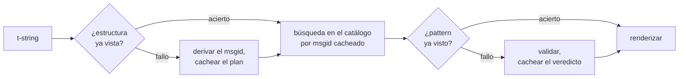

# Cómo funciona

Nada de esta página es necesario para usar la biblioteca: el
[tutorial](tutorial.md) y la [guía](guide.md) cubren eso. Esta página, en
cambio, reconstruye la biblioteca desde los primeros principios: qué es
realmente una t-string, cómo se deriva de ella un msgid, qué hace válida una
traducción y cómo consigue la implementación que toda esa comprobación cueste
décimas de microsegundo. Léela si tienes curiosidad, si quieres contribuir o
si piensas [implementar la convención por tu cuenta](#reimplementing-it).

## Qué es realmente una t-string { #what-a-t-string-actually-is }

Una f-string produce un `str`, y lo produce de inmediato: para cuando
cualquier función la recibe, el valor ya se ha interpolado y la frase está
sellada. Una t-string ([PEP 750]) tiene la misma sintaxis y la misma
evaluación inmediata de sus expresiones, pero produce un tipo distinto:

```pycon
>>> name = "Ada"
>>> f"Hello {name}!"
'Hello Ada!'
>>> t"Hello {name}!"
Template(strings=('Hello ', '!'), interpolations=(Interpolation('Ada', 'name', None, ''),))
```

Ese objeto `Template` conserva, todavía separadas, las partes que necesita un
pipeline de catálogos:

```pycon
>>> template = t"Total: {amount:,.2f}"
>>> template.strings
('Total: ', '')
>>> template.interpolations[0].expression
'amount'
>>> template.interpolations[0].value
1234.5
>>> template.interpolations[0].format_spec
',.2f'
```

- `strings` — el texto literal alrededor de las interpolaciones, en orden.
- Para cada interpolación: la **expresión** como texto fuente (`'amount'`), su
  **valor** evaluado (`1234.5`) y cualquier **conversión** (`!r`) y
  **especificación de formato** (`,.2f`) — transportadas por separado en lugar
  de aplicadas.

Todo lo que hace esta biblioteca es un consumo disciplinado de esa estructura.
El lenguaje ya hizo la única separación que necesita la i18n —el texto
estático aparte de los valores—, así que la biblioteca nunca analiza tu código
fuente ni adivina dónde se encuentra un valor dentro de una frase. Quedan tres
decisiones: cómo la estructura se convierte en una clave de catálogo, qué
puede decir una traducción de esa clave y cómo las dos se renderizan de nuevo
juntas.

## De la plantilla al msgid { #from-template-to-msgid }

Un msgid —la clave por la que se indexa un catálogo— se deriva únicamente de
las partes *estáticas* de la plantilla. Recorre `strings` e `interpolations`
en el orden del código fuente; escapa las llaves de cada segmento literal
(`{` pasa a ser `{{`); por cada interpolación, emite un token `{name}`, donde
`name` es el texto de la expresión sin los espacios en blanco que la rodean.
De `t"Total: {amount:,.2f}"`:

```text
strings         ('Total: ', '')
interpolations  expression 'amount'   conversion None   format_spec ',.2f'
msgid           'Total: {amount}'
```

Cada parte de esa regla tiene una razón:

- **La expresión debe ser un nombre simple** — `str.isidentifier()` es
  verdadero y no es una palabra reservada de Python. `t"Hello {user.name}"` se
  rechaza en el punto de llamada. Un msgid es una *clave*: tiene que salir
  idéntico en cada ejecución y en cada extracción, y lo leen los traductores,
  así que el marcador debe ser una palabra estable y con significado, no un
  fragmento de código que invite al catálogo a convertirse en un lenguaje de
  expresiones.
- **La conversión y la especificación de formato nunca entran en el msgid.**
  Los traductores no deberían tener que leer `:,.2f`, y ninguna traducción
  debería poder cambiarlo. Merece la pena conocer el corolario: ajustar
  `:,.2f` a `:,.0f` en tu código no cambia ningún msgid, así que no invalida
  ninguna traducción en ningún idioma. La clave del catálogo sigue *lo que
  dice la frase*, no cómo se formatea el valor.
- **Un nombre repetido debe repetir su formato exactamente.**
  `t"{x:.2f} vs {x:.3f}"` se rechaza, porque ambas apariciones colapsan en el
  mismo token `{x}` y el msgid ya no podría decir qué formato debe usar un
  renderizado.
- **El msgid vacío nunca se busca**, porque gettext lo reserva para la
  cabecera de metadatos del propio catálogo. `t""` se renderiza como `""` sin
  tocar el catálogo.

El conjunto completo de reglas, incluidos los casos límite que esta página
omite, es
[SPEC §2](https://github.com/yhay81/gettext-tstrings/blob/main/SPEC.md).

## Qué puede decir una traducción { #what-a-translation-may-say }

Un pattern que vuelve de un catálogo se analiza con `string.Formatter`, el
mismo parser que usa `str.format`. La gramática se toma prestada a propósito
en lugar de inventarse: un pattern que esta biblioteca acepta es uno que el
resto del ecosistema ya entiende. Después se aplican dos comprobaciones.

**Forma:** cada campo debe ser un `{name}` a secas. Una conversión o una
especificación de formato —incluida la explícitamente vacía `{name:}`— se
rechaza, igual que los campos posicionales (`{0}`, `{}`) y los nombres con
espacios dentro de las llaves (`{ name }`). Este último caso importa más de lo
que parece: tanto `str.format` como el `msgfmt` de GNU rechazan `{ name }`,
así que aceptarlo aquí produciría catálogos que ninguna otra herramienta de la
cadena puede validar.

**Nombres:** el conjunto de marcadores del pattern se compara con el del
mensaje de origen. En un mensaje singular, todos los nombres del origen son
*obligatorios* y no se *permite* nada más. En un mensaje plural, las dos ramas
se combinan:

- **permitidos** = la unión de los nombres de ambas ramas
- **obligatorios** = su intersección

Así, frente a `t"One file"` / `t"{n} files"`, el nombre `n` está permitido en
la traducción de cualquiera de las dos formas, pero no es obligatorio en
ninguna. Esa asimetría es lo que permite que el sistema de plurales del idioma
de destino difiera del de origen: el japonés traduce ambas ramas con una sola
forma que probablemente usa `{n}`; un idioma con más formas que el inglés
puede necesitar `{n}` en una forma donde el inglés no tiene ninguna.

Nada de eso es hipotético: el catálogo de interfaz de este mismo sitio contiene
el mensaje plural `Built {n} localized page` / `Built {n} localized pages` —dos
ramas en inglés— y las ediciones del sitio traducen ese único mensaje a entre
una y seis formas:

| Catálogo | Formas | Las traducciones, en orden de forma |
| --- | --- | --- |
| Japonés | 1 | `ローカライズ済みページを{n}件ビルドしました` |
| Turco | 2 | `{n} yerelleştirilmiş sayfa oluşturuldu` — dos veces, idéntica: los sustantivos turcos permanecen en singular tras un numeral |
| Italiano | 2 | `Generata {n} pagina localizzata` · `Generate {n} pagine localizzate` — el participio concuerda en género y número |
| Letón | 3 | `Izveidota {n} lokalizēta lapa` · `Izveidotas {n} lokalizētas lapas` · `Izveidots {n} lokalizētu lapu` — la tercera forma es solo para el **cero** |
| Ruso | 3 | `Собрана {n} локализованная страница` · `Собраны {n} локализованные страницы` · `Собрано {n} локализованных страниц` |
| Polaco | 3 | `Zbudowano {n} zlokalizowaną stronę` · `Zbudowano {n} zlokalizowane strony` · `Zbudowano {n} zlokalizowanych stron` |
| Esloveno | 4 | `Zgrajena {n} lokalizirana stran` · `Zgrajeni {n} lokalizirani strani` · `Zgrajene {n} lokalizirane strani` · `Zgrajenih {n} lokaliziranih strani` — la segunda es un **dual**, para exactamente dos |
| Irlandés | 5 | `Tógadh {n} leathanach logánaithe` · `Tógadh {n} leathanaigh logánaithe` — uno, dos, 3–6, 7–10 y el resto; la raíz alterna, pero *leathanach* empieza por `l`, letra sobre la que no se escribe ninguna mutación irlandesa, así que varias formas coinciden |
| Árabe | 6 | entre ellas `تم إنشاء صفحة مترجمة واحدة ({n})` para exactamente uno y `تم إنشاء {n} صفحات مترجمة` para unos pocos |

Cada fila es una entrada viva en los `i18n/*/LC_MESSAGES/site.po` de este
repositorio, renderizada por la [compilación multilingüe](index.md) en cada
release — y una prueba fija esta tabla a esos catálogos, de modo que las dos no
pueden divergir.

Dentro de esos límites, reordenar y repetir queda deliberadamente sin
restricciones. Ambas cosas son gramaticalmente necesarias en idiomas reales, y
restringir el número de apariciones rechazaría traducciones correctas sin
ningún beneficio de seguridad: una traducción sigue sin poder *evaluar* nada,
porque no existe ninguna ruta de evaluación — los marcadores se buscan por
nombre entre los valores ya calculados de la plantilla, y nunca se pasan a
`eval`, `getattr` ni al propio `str.format`.

## Renderizado { #rendering }

Renderizar un pattern validado es un recorrido por sus fragmentos: emite cada
parte literal y, para cada marcador, toma el valor capturado por la
interpolación y aplica la conversión y la especificación de formato *del lado
del origen*: `format(convert(value, conversion), format_spec)`. Al hacerlo se
mantienen dos garantías:

- **Cada valor distinto se formatea como mucho una vez por renderizado**,
  incluso cuando la traducción repite un marcador. La repetición cambia
  cuántas veces se inserta el resultado, no cuántas veces se ejecuta tu
  `__format__`.
- **En los plurales, un marcador lee la rama que lo definió.** Un nombre
  presente en ambas ramas lee el valor capturado por la rama que selecciona el
  idioma de *origen* (`singular` cuando `n == 1`, `plural` en caso contrario);
  un nombre específico de una rama siempre lee su propia rama, incluso cuando
  las reglas de plural del idioma de destino lo hicieron disponible en otra
  forma.

Cuando la validación falla en el momento de renderizar, la respuesta depende
de quién suministró el pattern. Un pattern que salió de un *catálogo* se
degrada: se registra un aviso y se renderiza el texto de origen, manteniendo
el contrato de gettext de que un catálogo roto nunca tumba la aplicación
([la guía muestra ambos modos](guide.md#what-happens-when-a-catalog-is-wrong)).
Un pattern que el llamante pasó directamente —`CompiledTemplate.render`—
siempre lanza una excepción, porque no hay texto de origen desde el que
degradar; la tolerancia existe para las búsquedas en catálogo, no para los
argumentos.

## Los diagnósticos forman parte del diseño { #diagnostics-are-part-of-the-design }

Un error de marcadores suele aterrizar delante de un traductor, no de un
programador, y a menudo en un archivo donde el problema es invisible. Decir
`{name} is missing` a alguien que puede ver exactamente esos caracteres en su
editor es un callejón sin salida, así que los mensajes se calculan con tres
reglas:

- Un nombre que contiene un **carácter invisible** —un espacio de no
  separación producido por un método de entrada, un espacio de ancho cero— se
  imprime con ese carácter sustituido por su punto de código, en su posición:
  `{<U+00A0>name}`. El lector necesita ver *dónde*.
- Un nombre cuyas letras **mezclan sistemas de escritura**, el caso de los
  homoglifos, se muestra dos veces —una legible, otra escapada—, porque
  `{nаme}` con una `а` cirílica es indistinguible de `{name}` sobre el papel,
  y la forma escapada `(nаme)` es la única grafía que los diferencia.
- Todo lo demás se muestra **tal como está escrito**. `{名前}` y `{café}` son
  nombres normales; escaparlos dejaría al lector sin poder encontrar lo que se
  quería decir.

Por el mismo principio, un marcador «ausente» que *parece* presente recibe una
explicación de su ausencia: llaves de ancho completo de un método de entrada
de Asia oriental, la duplicación `{{name}}` de una ronda de escapado, el
nombre fuera de cualquier llave. La
[tabla de lectura de fallos de la guía](guide.md#reading-a-failure-message)
muestra cada uno de estos mensajes literalmente.

## La ruta caliente { #the-hot-path }

Todo lo anterior ocurre en cada cadena traducida que renderiza una
aplicación, así que la implementación se construye alrededor de una idea: **la
validación nunca se omite, así que lo que hay que cachear es la validación.**



Tres cachés, una por etapa:

- **Un plan por estructura de punto de llamada.** La tupla `strings` de la
  plantilla —un objeto que el intérprete ya construyó— es la clave de la
  caché, así que una búsqueda no asigna memoria alguna. En un acierto, la
  expresión, la conversión y la especificación de formato de cada
  interpolación se comparan igualmente con las registradas: dos puntos de
  llamada que comparten el texto literal pero difieren en el formato
  (`t"{x:.2f}"` frente a `t"{x:.3f}"`) no deben colisionar, y esa comparación
  es el precio de usar una clave que el intérprete entrega gratis.
- **Un veredicto por pattern.** La primera vez que un catálogo responde con un
  pattern dado, este se analiza y se valida; el resultado —un plan de
  renderizado compilado o un registro de invalidez— se conserva en el plan.
  Cada renderizado posterior de ese mensaje lo alcanza en una sola búsqueda de
  diccionario. Los patterns inválidos también se recuerdan, y por eso una
  entrada rota del catálogo avisa una vez y no en cada renderizado.
- **Un plan combinado por pareja de plurales**, que guarda los conjuntos de
  unión e intersección para que la aritmética de ramas ocurra una vez por
  mensaje, no una vez por llamada.

Todas las cachés están acotadas y ninguna retiene *valores* interpolados: solo
estructura estática y texto de patterns. El resultado, medido por
[`benchmarks/runtime.py`](https://github.com/yhay81/gettext-tstrings/blob/main/benchmarks/runtime.py):
aproximadamente 0,4 µs para un mensaje de un campo, incluida la construcción
de la propia t-string, en torno a 2,5 veces un simple
`gettext(...).format(...)` que no comprueba nada. El comentario al principio
de
[`core.py`](https://github.com/yhay81/gettext-tstrings/blob/main/src/gettext_tstrings/core.py)
recoge las mediciones individuales que hay detrás de esa forma.

## Reimplementarla { #reimplementing-it }

Nada de lo anterior es saber privado: la convención está escrita como la
[especificación v1](spec.md), y su
[suite de conformidad](spec.md#conformance) legible por máquinas permite que un
extractor, un plugin de IDE o una implementación en otro lenguaje se compruebe
contra cada regla que explica esta página. Esta implementación ejecuta la suite
en sus propias pruebas, que es lo que evita que esta página, la especificación
y el código se separen en silencio.

  [PEP 750]: https://peps.python.org/pep-0750/
