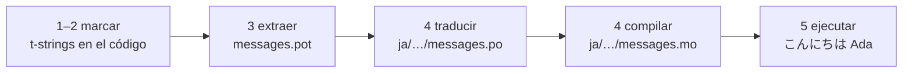

# Tutorial

Esta página va de un directorio vacío a un programa que saluda en japonés.
Cinco pasos, sin necesidad de experiencia previa con gettext, y cada comando se
muestra con la salida que realmente produce, para que en cada paso sepas si vas
por buen camino.

Necesitas Python 3.14 o posterior, porque las t-strings son sintaxis nueva de
la versión 3.14. El japonés es el idioma de ejemplo de esta página, pero nada
depende de esa elección: sustitúyelo por cualquier idioma en el paso 4, donde
el código de locale `ja` es lo único que lo nombra.

## 1. Instalar { #1-install }

```console
python -m pip install "gettext-tstrings[babel]"
```

El extra `[babel]` instala [Babel], la herramienta que recopila tus mensajes en
archivos de catálogo en el paso 3. Es una herramienta de desarrollo: el código
de producción renderiza únicamente con la biblioteca estándar.

## 2. Marcar un mensaje en el código { #2-mark-a-message-in-your-code }

Crea `app.py`:

```python
from gettext_tstrings import tr

name = "Ada"
print(tr(t"Hello {name}"))
```

`t"Hello {name}"` se parece a una f-string, pero el prefijo `t` mantiene
separados el texto y el valor en lugar de fusionarlos en el acto. Esa
separación es lo que permite a `tr()` buscar una traducción para la frase
completa `Hello {name}` e insertar el valor después.

Ejecútalo ahora:

```console
$ python app.py
Hello Ada
```

Todavía no hay traducciones instaladas, así que el texto de origen se renderiza
tal cual. Un programa que usa esta biblioteca nunca *requiere* un catálogo para
funcionar: el inglés (o el idioma de origen que utilices) es el fallback
incorporado.

## 3. Extraer los mensajes { #3-extract-the-messages }

Los traductores no leen tu código fuente; entre ellos y tú viaja un pequeño
archivo llamado **catálogo**. El primer paso hacia uno es recopilar todos los
mensajes marcados en el código.

Indica a Babel cómo encontrar tus mensajes creando `babel.cfg`:

```ini
[gettext_tstrings: **.py]
encoding = utf-8
```

Después extrae a un archivo de plantilla (`.pot`):

```console
$ mkdir -p locales
$ pybabel extract -F babel.cfg -c "Translators:" -o locales/messages.pot .
extracting messages from app.py (encoding="utf-8")
writing PO template file to locales/messages.pot
```

`locales/messages.pot` contiene ahora una entrada por mensaje:

```po
#. gettext-tstrings
#: app.py:4
#, python-brace-format
msgid "Hello {name}"
msgstr ""
```

`msgid` es la clave que buscará tu código. El `msgstr` vacío es donde va una
traducción, pero no en este archivo: un `.pot` es una *plantilla*, y el paso
siguiente la copia una vez por idioma.

## 4. Traducir y compilar { #4-translate-and-compile }

Crea el catálogo japonés a partir de la plantilla:

```console
$ pybabel init -i locales/messages.pot -d locales -l ja
creating catalog locales/ja/LC_MESSAGES/messages.po based on locales/messages.pot
```

Abre `locales/ja/LC_MESSAGES/messages.po` y rellena el `msgstr`:

```po
msgid "Hello {name}"
msgstr "こんにちは {name}"
```

Mantén `{name}` exactamente como está: el marcador es la forma en que el valor
encuentra su lugar dentro de la frase traducida, y la traducción es libre de
moverlo adonde lo necesite el idioma de destino. En un proyecto real este
archivo `.po` es lo que entregas a un traductor o subes a una plataforma de
traducción; el formato es el mismo en ambos casos.

Los catálogos se editan como texto pero se cargan en forma binaria (`.mo`), así
que compila:

```console
$ pybabel compile -d locales
compiling catalog locales/ja/LC_MESSAGES/messages.po to locales/ja/LC_MESSAGES/messages.mo
```

Este comando también es una red de seguridad. Si la traducción hubiera dañado
el marcador —`{nome}` en lugar de `{name}`, por ejemplo—, se negaría a pasar:

```console
$ pybabel compile -d locales
error: locales/ja/LC_MESSAGES/messages.po:24: translation does not match the
source placeholders: {name} is missing; {nome} is not in the source message
1 errors encountered.
```

## 5. Ejecutarlo { #5-run-it }

Apunta `app.py` al catálogo compilado. Haz clic en los marcadores para ver qué
hace cada línea:

```python
import gettext

from gettext_tstrings import Translator

_ = Translator(gettext.translation("messages", localedir="locales", languages=["ja"]))  # (1)!

name = "Ada"
print(_(t"Hello {name}"))  # (2)!
```

1. La biblioteca estándar carga el `.mo` compilado y `Translator` lo vincula a
   un invocable. `_` es el nombre convencional de gettext para «traduce
   esto»: corto porque aparece en todas las cadenas visibles para el usuario.
   Es la misma función que `tr`, vinculada a un catálogo.
2. En la llamada: el texto de la t-string se convierte en la clave de búsqueda
   `Hello {name}`, el catálogo responde `こんにちは {name}`, la respuesta se
   comprueba contra los marcadores del mensaje de origen y solo entonces se
   inserta el valor.

```console
$ python app.py
こんにちは Ada
```

Ese es el ciclo completo, y merece la pena verlo como una sola imagen:



**Marcar → extraer → traducir → compilar → ejecutar.** Todo lo demás en este
sitio es un refinamiento de uno de esos cinco pasos.

## Próximos pasos { #where-next }

- [Por qué usar t-strings](comparison.md) — de qué te protege este diseño en
  comparación con `%(name)s`, `.format()` y las cadenas `$`.
- [Guía](guide.md) — plurales, idiomas por petición, cadenas diferidas y qué
  ocurre en tiempo de ejecución cuando, aun así, un catálogo es incorrecto.
- [En producción](workflow.md) — este mismo ciclo tal como lo ejecuta un
  equipo, semana tras semana: actualización de catálogos, puertas de CI y
  plataformas de traducción.
- [Extracción](extraction.md) — la referencia completa de `pybabel`: nombres de
  función propios, modo estricto para CI y las comprobaciones que protegen tus
  catálogos.

  [Babel]: https://babel.pocoo.org/
