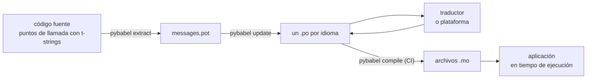

# En producción

El [tutorial](tutorial.md) ejecuta el ciclo una vez, en solitario, sobre un
programa con un solo mensaje. En un proyecto real el ciclo no se detiene: los
mensajes cambian después de haber sido traducidos, el traductor trabaja en
otro sitio y con su propio calendario, y con cada versión se distribuye un
catálogo compilado. Esta página es esa práctica: qué permanece en el
repositorio, qué viaja, qué debe bloquear la CI y dónde vincula un idioma el
tiempo de ejecución.

## La forma de un proyecto { #the-shape-of-a-project }

```text
myapp/
├── babel.cfg
├── pyproject.toml
├── src/
│   └── myapp/
└── locales/
    ├── messages.pot
    ├── ja/LC_MESSAGES/messages.po
    └── de/LC_MESSAGES/messages.po
```

Versiona `babel.cfg`, la plantilla `.pot` y todos los `.po`: son las fuentes
de la build de traducción, y sus diffs son la forma de revisar los cambios de
traducción. Los archivos `.mo` compilados son artefactos de build: prodúcelos
en CI o al empaquetar, en lugar de versionarlos, para que un `.po` y su `.mo`
nunca puedan discrepar sobre lo que se distribuye.

Un archivo tiene un papel en cada dirección: el `.pot` lleva tus mensajes
*hacia* los traductores y los archivos `.po` traen las traducciones *de
vuelta*. Todo lo que sigue es el tráfico entre esos dos.



## El ciclo tras la primera traducción { #the-cycle-after-the-first-translation }

El `pybabel init` del tutorial se ejecuta una sola vez por idioma, para
siempre. A partir de ahí el ciclo de trabajo es **extraer → actualizar →
traducir → compilar**, y su centro es `pybabel update`, que incorpora una
plantilla recién extraída a los catálogos existentes sin descartar las
traducciones que ya contienen.

Supón que el saludo `Hello {name}` —ya traducido como `こんにちは {name}`— se
reescribe en el código como `Welcome back, {name}`. Extrae y actualiza:

```console
$ pybabel extract -F babel.cfg -c "Translators:" -o locales/messages.pot .
extracting messages from app.py (encoding="utf-8")
writing PO template file to locales/messages.pot
$ pybabel update -i locales/messages.pot -d locales
updating catalog locales/ja/LC_MESSAGES/messages.po based on locales/messages.pot
```

El catálogo japonés contiene ahora:

```po
#. gettext-tstrings
#: app.py:4
#, fuzzy, python-brace-format
msgid "Welcome back, {name}"
msgstr "こんにちは {name}"
```

Babel ha notado que el nuevo msgid se parece a uno eliminado y lo ha
emparejado con la traducción antigua, pero ha marcado la pareja como
**fuzzy**: la suposición de una máquina a la espera de un humano. La marca
tiene consecuencias. `pybabel compile` **excluye las entradas fuzzy del
`.mo`**, así que, hasta que un traductor confirme la pareja, la aplicación
renderiza el nuevo texto inglés en lugar de un japonés obsoleto:

```console
$ pybabel compile -d locales
compiling catalog locales/ja/LC_MESSAGES/messages.po to locales/ja/LC_MESSAGES/messages.mo
$ python app.py
Welcome back, Ada
```

Un mensaje modificado se degrada, por tanto, igual que uno roto: al idioma de
origen, nunca a una traducción desactualizada. La parte del traductor en el
ciclo consiste en revisar el `msgstr` y borrar la marca `fuzzy`; la siguiente
compilación recoge la entrada.

!!! note "Los nombres de los marcadores forman parte de la identidad del mensaje"

    El msgid es la clave del catálogo, y el *nombre* del marcador está dentro
    de él, así que renombrar una variable en el código (`name` → `user_name`)
    cambia el msgid y devuelve al ciclo fuzzy la traducción de ese mensaje en
    todos los idiomas. Da a las variables interpoladas nombres que un
    traductor pueda entender, y renómbralas solo con motivo.

    El formato es la imagen especular: `!r` y `:.2f` [no forman parte del
    msgid](internals.md#from-template-to-msgid), de modo que ajustar
    `{amount:,.2f}` a `{amount:,.0f}` no cambia nada en ningún catálogo.
    Reformular la *frase*, por supuesto, sí es un cambio real: ese es el ciclo
    de arriba.

## Qué controla la CI { #what-ci-gates }

Tres fallos merecen una build en rojo: los catálogos se quedaron atrás
respecto al código, una traducción rompió un marcador o una entrada rota llegó
hasta el tiempo de ejecución. Un paso por fallo:

```yaml
- run: pybabel extract -F babel.cfg -c "Translators:" -o locales/messages.pot .
- run: pybabel update -i locales/messages.pot -d locales --check
- run: pybabel compile -d locales
- run: pytest
```

`pybabel update --check` no reescribe nada y sale con código distinto de cero
cuando un catálogo está desactualizado respecto a la plantilla recién
extraída: la protección contra fusionar código cuyos mensajes nadie volvió a
extraer. `pybabel compile` ejecuta las comprobaciones de marcadores de Babel y
del
[checker registrado](extraction.md#your-existing-toolchain-validates-these-catalogs)
de este paquete.

!!! bug "`--check` no puede controlar un catálogo que usa contextos"

    En Babel 2.18.0, `pybabel update --check` informa de que **todos** los
    catálogos que contienen un `msgctxt` están desactualizados, en cada
    ejecución, por muy al día que estén. La comparación pasa por
    `Catalog.is_identical`, que busca cada mensaje por la clave con la que está
    almacenado —y, en un mensaje con contexto, esa clave es el par
    `(id, context)`, que `Catalog.get` no acepta—. La búsqueda no devuelve
    nada, y los catálogos nunca resultan iguales:

    ```pycon
    >>> from babel.messages.catalog import Catalog
    >>> c = Catalog(locale="ja")
    >>> c.add("Guide", "ガイド", context="navigation")
    <Message 'Guide' (flags: [])>
    >>> c.is_identical(c)
    False
    ```

    Así que, si usas `pgettext` o `npgettext` aunque sea mínimamente —y
    desambiguar un homónimo es la razón por la que existen—, este paso falla
    hacia el lado peor: siempre en rojo, así que el equipo lo desactiva, así
    que nada controla la obsolescencia. Hasta que se corrija aguas arriba,
    compara tú mismo los conjuntos de mensajes. Leer la plantilla y cada
    catálogo con `babel.messages.pofile.read_po` y comparar
    `{(m.context, m.id) for m in catalog if m.id}` es toda la comprobación, y
    es lo que hace [la propia build de este sitio](index.md).

!!! danger "Comprueba el código de salida, no el log"

    `pybabel compile` informa de cada error de marcadores, sale con código
    distinto de cero **y aun así escribe el `.mo`**. Un pipeline que compila y
    luego copia `locales/` en una imagen distribuye el catálogo roto, salvo
    que el código de salida distinto de cero realmente lo detenga. Dejar que
    el paso haga fallar la build, como arriba, es toda la solución.

La última línea es tu suite de pruebas habitual, con un hábito añadido: en
algún lugar de ella, renderiza al menos un mensaje por idioma distribuido a
través de un traductor estricto —

```python
import gettext

from gettext_tstrings import Translator


def test_catalogs_render(language: str) -> None:
    translations = gettext.translation("messages", localedir="locales", languages=[language])
    _ = Translator(translations, strict=True)
    name = "Ada"
    assert _(t"Welcome back, {name}")
```

— porque `strict=True` [lanza una excepción donde producción degradaría en
silencio](guide.md#what-happens-when-a-catalog-is-wrong), y un renderizado en
tiempo de ejecución es la única comprobación que ve el catálogo exactamente
como lo verá la aplicación, `.mo` incluido.

## Trabajar con traductores y plataformas { #working-with-translators-and-platforms }

El archivo `.po` es el formato de intercambio de todo el mundo gettext, y esa
es la razón por la que esta biblioteca lo reutiliza: delegar la traducción
significa entregar un archivo, tanto si el destinatario es un colega con un
editor de PO como una plataforma tipo Weblate o Crowdin. Tres cosas hacen que
la entrega funcione bien:

**Di para qué sirve el mensaje.** Un comentario en el código viaja con el
mensaje: eso es lo que recoge la opción `-c "Translators:"`:

```python
from gettext_tstrings import tr

name = "Ada"
# Translators: shown on the dashboard right after sign-in
print(tr(t"Welcome back, {name}"))
```

```po
#. Translators: shown on the dashboard right after sign-in
#. gettext-tstrings
#: app.py:5
#, python-brace-format
msgid "Welcome back, {name}"
msgstr ""
```

Un traductor ve ese comentario en su editor, junto al mensaje, al otro lado
del mundo. Es la palanca de calidad más barata de todo el flujo de trabajo.
Para una palabra que es su propio homónimo —«Open» el botón frente a «Open» el
estado— dale al mensaje un [contexto](guide.md#binding-a-catalog) con
`pgettext`, que se convierte en un `msgctxt` visible en el catálogo.

**Deja que la plataforma valide los marcadores.** Cada mensaje extraído de una
t-string lleva la marca `python-brace-format`, y esa única línea es lo que
activa el control de calidad de marcadores en herramientas que no controlas:
Weblate documenta la comprobación, las plataformas comerciales basan la suya
en la misma marca y `msgfmt --check-format` la aplica en cualquier pipeline
GNU. Los detalles, y lo que el checker incluido detecta más allá de ellos,
están en la
[página de extracción](extraction.md#your-existing-toolchain-validates-these-catalogs).

**Confía en la red de seguridad exactamente hasta donde llega.** Lo que
vuelve de una plataforma sigue siendo datos que entran en tu build; las
puertas de CI de arriba son lo que convierte «la plataforma probablemente lo
comprobó» en «esto no puede distribuirse roto».

## Vincular un idioma en tiempo de ejecución { #binding-a-language-at-runtime }

Todo lo anterior produce catálogos. La decisión que queda es dónde selecciona
uno la aplicación, y tiene una única respuesta honesta: vincula una vez por
*ámbito de un idioma* — el proceso en una CLI, la petición en un servicio web.

=== "Un proceso, un idioma"

    Una herramienta de línea de comandos o una aplicación de escritorio lee
    el entorno del usuario una vez, al arrancar. No pasar `languages=` deja
    que la biblioteca estándar negocie a partir de `LANGUAGE`, `LC_ALL`,
    `LC_MESSAGES` y `LANG`; `fallback=True` devuelve un catálogo nulo —texto
    de origen— en lugar de lanzar una excepción cuando ninguna de esas
    variables coincide con un catálogo que distribuyas.

    ```python
    import gettext

    from gettext_tstrings import Translator

    _ = Translator(gettext.translation("messages", localedir="locales", fallback=True))

    name = "Ada"
    print(_(t"Welcome back, {name}"))
    ```

=== "Flask"

    Una aplicación web decide por petición. Carga cada catálogo una vez en el
    import y vincula el negociado al contexto antes de que se ejecute la
    vista: [`set_translations`](guide.md#per-request-language) es local al
    contexto, así que las peticiones concurrentes en idiomas distintos nunca
    ven la vinculación de las demás.

    ```python
    import gettext

    from flask import Flask, request

    from gettext_tstrings import set_translations, tr

    LANGUAGES = ("en", "ja", "de")
    CATALOGS = {
        language: gettext.translation(
            "messages", localedir="locales", languages=[language], fallback=True
        )
        for language in LANGUAGES
    }

    app = Flask(__name__)


    @app.before_request
    def bind_language() -> None:
        language = request.accept_languages.best_match(LANGUAGES) or "en"
        set_translations(CATALOGS[language])


    @app.get("/")
    def home() -> str:
        name = "Ada"
        return tr(t"Welcome back, {name}")
    ```

=== "Middleware ASGI"

    Con frameworks asíncronos —FastAPI, Starlette y cualquier otro ASGI—,
    envuelve la petición en
    [`use_translations`](guide.md#per-request-language): la vinculación vive
    en un `ContextVar`, que el cambio de tareas asíncronas conserva por
    petición.

    ```python
    import gettext

    from fastapi import FastAPI, Request

    from gettext_tstrings import tr, use_translations

    LANGUAGES = ("en", "ja", "de")
    CATALOGS = {
        language: gettext.translation(
            "messages", localedir="locales", languages=[language], fallback=True
        )
        for language in LANGUAGES
    }

    app = FastAPI()


    @app.middleware("http")
    async def bind_language(request: Request, call_next):
        language = negotiate_language(request.headers.get("accept-language"), LANGUAGES)
        with use_translations(CATALOGS[language]):
            return await call_next(request)
    ```

    `negotiate_language` representa tu análisis de Accept-Language: la
    mayoría de los frameworks o sus ecosistemas ofrecen uno; lo que importa
    aquí es la vinculación alrededor de `call_next`.

Dos hábitos de ejecución completan el cuadro. Las cadenas creadas durante el
import —una etiqueta de formulario, el nombre visible de un enum— no deben
capturar el idioma que estuviera activo durante el import; defínelas con
[`lazy_gettext`](guide.md#deferred-translation) y se renderizarán en el idioma
activo en el momento de *usarlas*. Y encamina el logger `gettext_tstrings`
adonde mire un humano: sus avisos son el modo tolerante informando de una
traducción que se coló por todas las puertas, una línea por mensaje roto en
lugar de una por renderizado.

## Despliegue { #shipping }

Producción necesita el paquete, los archivos `.mo` y nada más. Babel es una
dependencia de desarrollo y de CI: deja `gettext-tstrings[babel]` fuera de la
imagen de producción e instala allí el paquete básico; el renderizado funciona
solo con la biblioteca estándar. Compila los catálogos en la misma build que
produce el artefacto que despliegas, para que los `.mo` de su interior sean
exactamente los `.po` revisados y nunca se distribuya nada compilado en el
portátil de alguien.

Antes de una versión, la lista de comprobación a la que se reduce esta página:

- `pybabel update --check` pasa: ningún mensaje cambió sin que los catálogos
  se enteraran.
- `pybabel compile` bloquea la build con su código de salida.
- Las entradas `fuzzy` restantes son intencionadas: cada una se renderiza como
  texto de origen hasta que un traductor la confirme.
- La suite de pruebas renderiza cada idioma distribuido una vez con
  `strict=True`.
- El artefacto de producción contiene archivos `.mo` y ningún Babel.
- El logger `gettext_tstrings` está encaminado a la monitorización.

## Próximos pasos { #where-next }

- [Extracción](extraction.md) — la referencia de la mitad de herramientas de
  esta página: opciones de mapping, nombres de función propios, modo estricto
  y todos los checkers.
- [Guía](guide.md) — la mitad de ejecución: plurales, contextos, cadenas
  diferidas y los modos de fallo en detalle.
- [Cómo funciona](internals.md) — por qué el msgid tiene la forma que tiene y
  qué comprueba realmente la validación.
