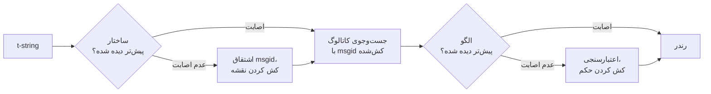

# چگونه کار می‌کند

هیچ‌چیز در این صفحه برای استفاده از این کتابخانه لازم نیست —
[آموزش](tutorial.md) و [راهنما](guide.md) آن را پوشش می‌دهند. این صفحه
به‌جای آن، کتابخانه را از اصول نخستین بازمی‌سازد: یک t-string واقعاً
چیست، msgid چگونه از آن بیرون می‌افتد، چه چیزی یک ترجمه را معتبر
می‌کند، و پیاده‌سازی چگونه هزینهٔ همهٔ این بررسی‌ها را به دهم‌های
میکروثانیه می‌رساند. اگر کنجکاوید، اگر می‌خواهید مشارکت کنید، یا اگر
قصد دارید [خودتان این قرارداد را پیاده کنید](#reimplementing-it)، آن را
بخوانید.

## یک t-string واقعاً چیست { #what-a-t-string-actually-is }

یک f-string یک `str` تولید می‌کند، و بی‌درنگ تولیدش می‌کند — تا وقتی
تابعی آن را دریافت کند، مقدار درون‌یابی شده و جمله مهروموم شده است. یک
t-string ([PEP 750]) همان نحو و همان ارزیابی مشتاقانهٔ عبارت‌هایش را
دارد، اما نوعی متفاوت تولید می‌کند:

```pycon
>>> name = "Ada"
>>> f"Hello {name}!"
'Hello Ada!'
>>> t"Hello {name}!"
Template(strings=('Hello ', '!'), interpolations=(Interpolation('Ada', 'name', None, ''),))
```

آن شیء `Template` بخش‌هایی را که خط لولهٔ کاتالوگ لازم دارد، همچنان جدا
از هم، نگه می‌دارد:

```pycon
>>> template = t"Total: {amount:,.2f}"
>>> template.strings
('Total: ', '')
>>> template.interpolations[0].expression
'amount'
>>> template.interpolations[0].value
1234.5
>>> template.interpolations[0].format_spec
',.2f'
```

- `strings` — متن تحت‌اللفظی پیرامون درون‌یابی‌ها، به ترتیب.
- برای هر درون‌یابی: **عبارت** به‌صورت متن مبدأ (`'amount'`)،
  **مقدار** ارزیابی‌شدهٔ آن (`1234.5`)، و هر **تبدیل** (`!r`) و
  **مشخصهٔ قالب‌بندی** (`,.2f`) — که به‌جای اعمال‌شدن، جداگانه حمل
  می‌شوند.

هر چه این کتابخانه می‌کند، مصرفِ منضبطِ همین ساختار است. زبان همان یک
تفکیکی را که i18n لازم دارد پیشاپیش انجام داده — متن ثابت جدا از
مقدارها — پس کتابخانه هرگز کد مبدأ شما را parse نمی‌کند و هرگز حدس
نمی‌زند که یک مقدار کجای جمله می‌نشیند. آنچه می‌ماند سه تصمیم است:
ساختار چگونه به کلید کاتالوگ بدل می‌شود، ترجمهٔ آن کلید چه اجازه دارد
بگوید، و آن دو چگونه با هم دوباره رندر می‌شوند.

## از قالب تا msgid { #from-template-to-msgid }

msgid — کلیدی که کاتالوگ بر پایهٔ آن نمایه می‌شود — تنها از بخش‌های
*ایستای* قالب مشتق می‌شود. `strings` و `interpolations` را به ترتیب
مبدأ بپیمایید؛ هر قطعهٔ تحت‌اللفظی را با آکولاد escape کنید (`{` به
`{{` بدل می‌شود)؛ و برای هر درون‌یابی یک نشانهٔ `{name}` بیرون بدهید که
در آن `name` متنِ عبارت است پس از حذف فاصله‌های پیرامون. از
`t"Total: {amount:,.2f}"`:

```text
strings         ('Total: ', '')
interpolations  expression 'amount'   conversion None   format_spec ',.2f'
msgid           'Total: {amount}'
```

هر بخش این قاعده دلیلی دارد:

- **عبارت باید نامی ساده باشد** — `str.isidentifier()` بر آن صادق است و
  کلیدواژهٔ پایتون نیست. `t"Hello {user.name}"` همان‌جا در محل فراخوانی
  رد می‌شود. msgid یک *کلید* است: باید در هر اجرا و هر استخراج یکسان
  بیرون بیاید، و مترجم‌ها آن را می‌خوانند؛ پس جای‌نگهدار باید واژه‌ای
  پایدار و معنادار باشد — نه قطعه‌کدی که کاتالوگ را به بدل‌شدن به یک
  زبان عبارت دعوت کند.
- **تبدیل و مشخصهٔ قالب‌بندی هرگز وارد msgid نمی‌شوند.** مترجم‌ها نباید
  ناچار به خواندن `:,.2f` باشند، و هیچ ترجمه‌ای نباید بتواند عوضش کند.
  نتیجهٔ فرعی‌اش ارزش دانستن دارد: سفت کردن `:,.2f` به `:,.0f` در
  کدتان هیچ msgidی را تغییر نمی‌دهد؛ پس هیچ ترجمه‌ای را در هیچ زبانی
  باطل نمی‌کند. کلید کاتالوگ *آنچه جمله می‌گوید* را دنبال می‌کند، نه
  شیوهٔ قالب‌بندی مقدار را.
- **نامی که تکرار می‌شود باید قالب‌بندی‌اش را دقیقاً تکرار کند.**
  `t"{x:.2f} vs {x:.3f}"` رد می‌شود، چون هر دو ظهور در همان یک نشانهٔ
  `{x}` فرومی‌ریزند و msgid دیگر نمی‌توانست بگوید رندر باید از کدام
  قالب‌بندی استفاده کند.
- **msgid تهی هرگز جست‌وجو نمی‌شود**، چون gettext آن را برای سرآیند
  فرادادهٔ خودِ کاتالوگ نگه داشته است. `t""` بدون دست‌زدن به کاتالوگ
  به‌صورت `""` رندر می‌شود.

مجموعهٔ کامل قواعد، از جمله حالت‌های مرزی‌ای که این صفحه از آن‌ها
می‌گذرد، در
[SPEC §2](https://github.com/yhay81/gettext-tstrings/blob/main/SPEC.md)
است.

## ترجمه چه اجازه دارد بگوید { #what-a-translation-may-say }

الگویی که از کاتالوگ بازمی‌گردد با `string.Formatter` تجزیه می‌شود —
همان parserی که `str.format` به کار می‌برد. دستور زبان عمداً قرض گرفته
شده و نه ابداع: الگویی که این کتابخانه می‌پذیرد، الگویی است که زیست‌بومِ
گسترده‌تر پیشاپیش می‌فهمدش. سپس دو بررسی اعمال می‌شود.

**شکل:** هر فیلد باید یک `{name}`ِ خالی باشد. تبدیل یا مشخصهٔ
قالب‌بندی — از جمله `{name:}`ِ صریحاً تهی — رد می‌شود، و همچنین
فیلدهای موضعی (`{0}`، `{}`) و نام‌های فاصله‌گذاری‌شده (`{ name }`).
آخری بیش از آنچه به نظر می‌رسد اهمیت دارد: هم `str.format` و هم
`msgfmt`ِ گنو `{ name }` را رد می‌کنند؛ پس پذیرفتنش این‌جا
کاتالوگ‌هایی می‌ساخت که هیچ ابزار دیگری در زنجیره نمی‌تواند
اعتبارسنجی‌شان کند.

**نام‌ها:** مجموعهٔ جای‌نگهدارهای الگو با مجموعهٔ مبدأ سنجیده می‌شود.
برای پیام مفرد، هر نام مبدأ *لازم* است و هیچ‌چیز دیگری *مجاز* نیست.
برای پیام جمع، دو شاخه ادغام می‌شوند:

- **مجاز** = اجتماع نام‌های دو شاخه
- **لازم** = اشتراک آن‌ها

پس در برابر `t"One file"` / `t"{n} files"`، نام `n` در ترجمهٔ هر یک از
دو صورت مجاز است اما در هیچ‌کدام لازم نیست. همین عدم‌تقارن است که
می‌گذارد نظام جمعِ زبان مقصد با نظام مبدأ فرق کند — ژاپنی هر دو شاخه را
با یک صورت ترجمه می‌کند که احتمالاً `{n}` را به کار می‌برد؛ زبانی با
صورت‌های بیشتر از انگلیسی ممکن است در صورتی به `{n}` نیاز داشته باشد که
انگلیسی اصلاً ندارد.

هیچ‌یک از این‌ها فرضی نیست: کاتالوگ پوستهٔ همین وب‌گاه پیام جمعِ
`Built {n} localized page` / `Built {n} localized pages` را با خود دارد
— دو شاخهٔ انگلیسی — و نسخه‌های زبانی وب‌گاه همان یک پیام را به هر
تعدادی میان یک تا شش صورت ترجمه می‌کنند.

??? example "نُه نسخه از آن‌ها، به ترتیب صورت"

    | کاتالوگ | صورت‌ها | ترجمه‌ها، به ترتیب صورت |
    | --- | --- | --- |
    | ژاپنی | ۱ | `ローカライズ済みページを{n}件ビルドしました` |
    | ترکی | ۲ | `{n} yerelleştirilmiş sayfa oluşturuldu` — دو بار، عیناً یکسان: اسم در ترکی پس از عدد مفرد می‌ماند |
    | ایتالیایی | ۲ | `Generata {n} pagina localizzata` · `Generate {n} pagine localizzate` — صفت مفعولی در جنس و شمار مطابقت می‌کند |
    | لتونیایی | ۳ | `Izveidota {n} lokalizēta lapa` · `Izveidotas {n} lokalizētas lapas` · `Izveidots {n} lokalizētu lapu` — صورت سوم **تنها برای صفر** است |
    | روسی | ۳ | `Собрана {n} локализованная страница` · `Собраны {n} локализованные страницы` · `Собрано {n} локализованных страниц` |
    | لهستانی | ۳ | `Zbudowano {n} zlokalizowaną stronę` · `Zbudowano {n} zlokalizowane strony` · `Zbudowano {n} zlokalizowanych stron` |
    | اسلوونیایی | ۴ | `Zgrajena {n} lokalizirana stran` · `Zgrajeni {n} lokalizirani strani` · `Zgrajene {n} lokalizirane strani` · `Zgrajenih {n} lokaliziranih strani` — دومی **مثنّی** است، برای دقیقاً دو |
    | ایرلندی | ۵ | `Tógadh {n} leathanach logánaithe` · `Tógadh {n} leathanaigh logánaithe` — برای یک، دو، ۳–۶، ۷–۱۰ و بقیه؛ ریشه تغییر می‌کند اما *leathanach* با `l` آغاز می‌شود و هیچ‌یک از تغییرهای آغازینِ ایرلندی روی `l` نوشته نمی‌شود، پس چند صورت یکسان درمی‌آیند |
    | عربی | ۶ | از میانشان `تم إنشاء صفحة مترجمة واحدة ({n})` برای دقیقاً یکی و `تم إنشاء {n} صفحات مترجمة` برای چند تا |

    هر ردیف مدخلی زنده در `i18n/*/LC_MESSAGES/site.po`ِ همین مخزن است که
    [بیلد چندزبانه](index.md) در هر انتشار رندرش می‌کند — و یک آزمون این
    جدول را به همان کاتالوگ‌ها سنجاق می‌کند، تا آن دو نتوانند از هم دور
    شوند.

در همین محدوده، جابه‌جایی و تکرار عمداً بی‌قید مانده‌اند. هر دو در
زبان‌های واقعی از نظر دستوری ضروری‌اند، و محدود کردن شمار ظهورها
ترجمه‌های درست را بی‌هیچ سود امنیتی رد می‌کرد: ترجمه همچنان نمی‌تواند
چیزی را *ارزیابی* کند، چون هیچ مسیر ارزیابی‌ای وجود ندارد —
جای‌نگهدارها با نام، در مقدارهای ازپیش‌محاسبه‌شدهٔ قالب جست‌وجو می‌شوند
و هرگز به `eval` یا `getattr` یا خودِ `str.format` سپرده نمی‌شوند.

## رندر { #rendering }

رندر کردن یک الگوی اعتبارسنجی‌شده پیمایشی بر تکه‌های آن است: هر بخش
تحت‌اللفظی را بیرون بده، و برای هر جای‌نگهدار مقدارِ ثبت‌شدهٔ درون‌یابی
را بگیر و تبدیل و مشخصهٔ قالب‌بندیِ *سمت مبدأ* را بر آن اعمال کن —
`format(convert(value, conversion), format_spec)`. حین انجام این کار دو
تضمین حفظ می‌شود:

- **هر مقدار متمایز در هر رندر حداکثر یک بار قالب‌بندی می‌شود**، حتی
  وقتی ترجمه جای‌نگهداری را تکرار می‌کند. تکرار تغییر می‌دهد که نتیجه
  چند بار درج شود، نه این‌که `__format__` شما چند بار اجرا شود.
- **در صورت‌های جمع، جای‌نگهدار شاخه‌ای را می‌خواند که تعریفش کرده
  است.** نامی که در هر دو شاخه حاضر است، مقدارِ ثبت‌شدهٔ همان شاخه‌ای
  را می‌خواند که زبان *مبدأ* برمی‌گزیند (`singular` وقتی `n == 1` و در
  غیر این صورت `plural`)؛ نامی که ویژهٔ یک شاخه است همیشه شاخهٔ خودش را
  می‌خواند، حتی وقتی قواعد جمعِ زبان مقصد آن را در صورتی دیگر در دسترس
  کرده باشند.

وقتی اعتبارسنجی در زمان رندر شکست می‌خورد، پاسخ بر پایهٔ این‌که چه کسی
الگو را داده است تقسیم می‌شود. الگویی که از یک *کاتالوگ* آمده تنزل
می‌کند: یک هشدار ثبت می‌شود و متن مبدأ رندر می‌شود، و پیمان gettext
نگه داشته می‌شود که کاتالوگ خراب هرگز برنامه را از پا نمی‌اندازد
([راهنما هر دو حالت را نشان می‌دهد](guide.md#what-happens-when-a-catalog-is-wrong)).
الگویی که فراخواننده مستقیم پاس داده — `CompiledTemplate.render` — همیشه
استثنا پرتاب می‌کند، چون هیچ متن مبدئی نیست که به آن فرو بنشیند؛
آسان‌گیری برای جست‌وجوهای کاتالوگ هست، نه برای آرگومان‌ها.

## تشخیص بخشی از طراحی است { #diagnostics-are-part-of-the-design }

خطای جای‌نگهدار معمولاً پیش روی یک مترجم می‌نشیند، نه یک برنامه‌نویس، و
اغلب در فایلی که مشکل در آن نادیدنی است. گفتنِ `{name} is missing` به
کسی که همان نویسه‌ها را جلوی چشمش می‌بیند بن‌بست است؛ پس پیام‌ها با سه
قاعده محاسبه می‌شوند:

- نامی که **نویسه‌ای نامرئی** در خود دارد — فاصلهٔ نشکنی که یک روش
  ورودی تولید کرده، یک فاصلهٔ بی‌عرض — با همان نویسه چاپ می‌شود که سر
  جای خودش با کدنقطه‌اش جایگزین شده است: `{<U+00A0>name}`. خواننده
  باید *جا* را ببیند.
- نامی که حروفش **نظام‌های نوشتاری را می‌آمیزد**، حالت هم‌نگاره، دو بار
  نشان داده می‌شود — یک بار خوانا، یک بار escape‌شده — چون `{nаme}` با
  `а`ِ سیریلی در چاپ از `{name}` بازشناختنی نیست، و صورت escape‌شدهٔ
  `(nаme)` تنها املایی است که آن دو را از هم جدا می‌کند.
- هر چیز دیگر **همان‌گونه که نوشته شده** نشان داده می‌شود. `{名前}` و
  `{café}` نام‌های عادی‌اند؛ escape کردنشان خواننده را از یافتن آنچه
  منظور بوده ناتوان می‌کرد.

بر همین اصل، جای‌نگهدارِ «غایب»ی که *حاضر* به نظر می‌رسد، غیبتش توضیح
داده می‌شود — آکولادهای تمام‌عرض از یک روش ورودی شرق آسیایی،
دوبرابرشدنِ `{{name}}` از یک رفت‌وبرگشتِ escape، نامی بیرون از هر
آکولاد.
[جدول خواندن شکست](translators.md#reading-a-failure-message) که برای
مترجمان نوشته شده، هر یک از این پیام‌ها را عیناً نشان می‌دهد.

## مسیر داغ { #the-hot-path }

همهٔ آنچه گفته شد بر هر رشتهٔ ترجمه‌شده‌ای که یک برنامه رندر می‌کند رخ
می‌دهد؛ پس پیاده‌سازی حول یک ایده ساخته شده است: **اعتبارسنجی هرگز رد
نمی‌شود، پس اعتبارسنجی همان چیزی است که باید کش شود.**



سه کش، یکی به‌ازای هر مرحله:

- **یک نقشه به‌ازای هر ساختارِ محل فراخوانی.** تاپلِ `strings`ِ قالب —
  شیئی که مفسر پیشاپیش ساخته است — کلید کش است؛ پس یک جست‌وجو هیچ
  حافظه‌ای تخصیص نمی‌دهد. در اصابت، عبارت و تبدیل و مشخصهٔ قالب‌بندیِ
  هر درون‌یابی همچنان با آنچه ثبت شده سنجیده می‌شود: دو محل فراخوانی که
  متن تحت‌اللفظی مشترک دارند اما در قالب‌بندی فرق می‌کنند
  (`t"{x:.2f}"` در برابر `t"{x:.3f}"`) نباید با هم برخورد کنند، و همین
  سنجش بهای استفاده از کلیدی است که مفسر رایگان تحویل می‌دهد.
- **یک حکم به‌ازای هر الگو.** نخستین باری که کاتالوگ با الگویی معین
  پاسخ می‌دهد، آن الگو تجزیه و اعتبارسنجی می‌شود؛ نتیجه — یک نقشهٔ
  رندرِ کامپایل‌شده، یا ثبتی از نامعتبربودن — روی نقشه نگه داشته
  می‌شود. هر رندر بعدیِ همان پیام با یک جست‌وجوی دیکشنری به آن می‌رسد.
  الگوهای نامعتبر هم به یاد سپرده می‌شوند، و به همین دلیل است که مدخل
  خرابِ کاتالوگ یک بار هشدار می‌دهد، نه در هر رندر.
- **یک نقشهٔ ادغام‌شده به‌ازای هر جفتِ جمع**، که مجموعه‌های
  اجتماع/اشتراک را نگه می‌دارد تا حسابِ شاخه‌ها یک بار برای هر پیام
  انجام شود، نه یک بار برای هر فراخوانی.

هر کش کران‌دار است و هیچ‌کدام *مقدارهای* درون‌یابی‌شده را نگه
نمی‌دارد — تنها ساختار ایستا و متن الگو را. نتیجه، آن‌گونه که
[`benchmarks/runtime.py`](https://github.com/yhay81/gettext-tstrings/blob/main/benchmarks/runtime.py)
روی CPython 3.14.6 و macOS 26 بر لپ‌تاپی arm64 اندازه گرفته است: حدود
۰٫۴ میکروثانیه برای پیامی تک‌فیلدی، شاملِ ساختِ خودِ t-string، تقریباً
۲٫۷ برابرِ یک `gettext(...).format(...)`ِ ساده که هیچ‌چیز را بررسی
نمی‌کند. این‌ها عددهای یک ماشین‌اند — اسکریپت مفسر و پلتفرمش را در
سرآیندش چاپ می‌کند، پس پیش از آن‌که هر نسبتی را از آنِ خود بدانید،
آن را روی سخت‌افزاری که واقعاً روی آن مستقر می‌کنید بگردانید. یادداشت
بالای
[`core.py`](https://github.com/yhay81/gettext-tstrings/blob/main/src/gettext_tstrings/core.py)
اندازه‌گیری‌های تک‌تکِ پشت این تصویر را ثبت کرده است.

## پیاده‌کردن دوبارهٔ آن { #reimplementing-it }

هیچ‌یک از آنچه گفته شد ویژهٔ همین پیاده‌سازی نیست: قرارداد به‌صورت
[نسخهٔ ۱ مشخصات](spec.md) مکتوب است، و
[مجموعهٔ انطباق](spec.md#conformance)ِ ماشین‌خوانش می‌گذارد یک
استخراج‌کننده، یک افزونهٔ IDE، یا پیاده‌سازی‌ای به زبانی دیگر خودش را
در برابر هر قاعده‌ای که این صفحه شرح داد بسنجد. همین پیاده‌سازی آن
مجموعه را در آزمون‌های خودش اجرا می‌کند، و همین است که نمی‌گذارد این
صفحه و مشخصات و کد بی‌سروصدا از هم دور شوند.

  [PEP 750]: https://peps.python.org/pep-0750/
