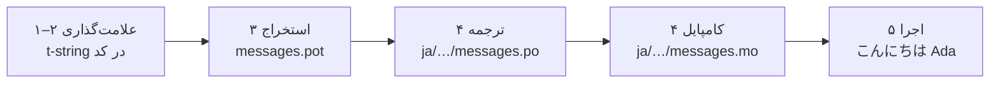

# آموزش

این صفحه از یک پوشهٔ خالی آغاز می‌کند و به برنامه‌ای می‌رسد که به ژاپنی
خوش‌آمد می‌گوید. پنج گام، بدون پیش‌فرضِ هیچ تجربه‌ای با gettext، و هر
فرمان همراه با خروجی‌ای که واقعاً تولید می‌کند نشان داده می‌شود — تا در
هر گام بدانید در مسیر درست هستید یا نه.

به پایتون 3.14 یا جدیدتر نیاز دارید، چون t-string نحو تازه‌ای در 3.14
است. زبان مقصدِ نمونهٔ این صفحه ژاپنی است، اما هیچ‌چیز به این انتخاب
وابسته نیست — در گام ۴ هر زبان دیگری را جایگزین کنید؛ کد محلی `ja` تنها
جایی است که این زبان را نام می‌برد.

## ۱. نصب { #1-install }

```console
python -m pip install "gettext-tstrings[babel]"
```

افزونهٔ `[babel]` ابزار [Babel] را می‌آورد؛ همان ابزاری که در گام ۳
پیام‌های شما را در فایل‌های کاتالوگ گرد می‌آورد. این یک ابزار زمانِ
توسعه است: کد عملیاتی تنها با کتابخانهٔ استاندارد رندر می‌کند.

## ۲. علامت‌گذاری یک پیام در کد { #2-mark-a-message-in-your-code }

فایل `app.py` را بسازید:

```python
from gettext_tstrings import tr

name = "Ada"
print(tr(t"Hello {name}"))
```

`t"Hello {name}"` شبیه یک f-string است، اما پیشوند `t` متن و مقدار را
به‌جای ادغام درجا، جدا از هم نگه می‌دارد. همین جدایی است که به `tr()`
اجازه می‌دهد ترجمهٔ کل جملهٔ `Hello {name}` را جست‌وجو کند و مقدار را
پس از آن جای‌گذاری کند.

همین حالا اجرایش کنید:

```console
$ python app.py
Hello Ada
```

هنوز هیچ ترجمه‌ای نصب نشده، پس متن مبدأ همان‌طور که هست رندر می‌شود.
برنامه‌ای که از این کتابخانه استفاده می‌کند هرگز برای اجرا *نیازمند*
کاتالوگ نیست — انگلیسی (یا هر زبان مبدأ شما) پشتیبانِ درونی است.

## ۳. استخراج پیام‌ها { #3-extract-the-messages }

مترجم‌ها کد شما را نمی‌خوانند؛ فایل کوچکی به نام **کاتالوگ** میان شما و
آن‌ها رفت‌وآمد می‌کند. نخستین گام برای ساختن آن، گرد آوردن همهٔ
پیام‌های علامت‌گذاری‌شده از دل کد است.

با ساختن `babel.cfg` به Babel بگویید پیام‌هایتان را چگونه بیابد:

```ini
[gettext_tstrings: **.py]
encoding = utf-8
```

سپس آن‌ها را در یک فایل الگو (`.pot`) استخراج کنید:

```console
$ mkdir -p locales
$ pybabel extract -F babel.cfg -c "Translators:" -o locales/messages.pot .
extracting messages from app.py (encoding="utf-8")
writing PO template file to locales/messages.pot
```

اکنون `locales/messages.pot` برای هر پیام یک مدخل دارد:

```po
#. gettext-tstrings
#: app.py:4
#, python-brace-format
msgid "Hello {name}"
msgstr ""
```

`msgid` کلیدی است که کد شما جست‌وجو خواهد کرد. `msgstr`ِ خالی جای ترجمه
است — اما نه در این فایل: `.pot` یک *الگو* است و گام بعدی برای هر زبان
یک نسخه از آن می‌گیرد.

## ۴. ترجمه و کامپایل { #4-translate-and-compile }

کاتالوگ ژاپنی را از روی الگو بسازید:

```console
$ pybabel init -i locales/messages.pot -d locales -l ja
creating catalog locales/ja/LC_MESSAGES/messages.po based on locales/messages.pot
```

فایل `locales/ja/LC_MESSAGES/messages.po` را باز کنید و `msgstr` را پر
کنید:

```po
msgid "Hello {name}"
msgstr "こんにちは {name}"
```

`{name}` را دقیقاً همان‌طور که هست نگه دارید — جای‌نگهدار همان راهی است
که مقدار از آن جای خود را در جملهٔ ترجمه‌شده پیدا می‌کند، و ترجمه آزاد
است آن را هر جا که زبان مقصد لازم دارد جابه‌جا کند. در یک پروژهٔ واقعی
همین فایل `.po` است که به مترجم می‌سپارید یا به پلتفرم ترجمه بارگذاری
می‌کنید؛ قالب در هر دو حالت یکی است.

کاتالوگ‌ها به شکل متن ویرایش می‌شوند اما به شکل دودویی (`.mo`) بار
می‌شوند؛ پس کامپایل کنید:

```console
$ pybabel compile -d locales
compiling catalog locales/ja/LC_MESSAGES/messages.po to locales/ja/LC_MESSAGES/messages.mo
```

این فرمان یک تور ایمنی هم هست. اگر ترجمه جای‌نگهدار را خراب کرده بود —
مثلاً `{nome}` به‌جای `{name}` — از پذیرفتن آن سر باز می‌زد:

```console
$ pybabel compile -d locales
error: locales/ja/LC_MESSAGES/messages.po:24: translation does not match the
source placeholders: {name} is missing; {nome} is not in the source message
1 errors encountered.
```

## ۵. اجرا { #5-run-it }

`app.py` را به کاتالوگ کامپایل‌شده وصل کنید. روی نشانگرها کلیک کنید تا
ببینید هر خط چه می‌کند:

```python
import gettext

from gettext_tstrings import Translator

_ = Translator(gettext.translation("messages", localedir="locales", languages=["ja"]))  # (1)!

name = "Ada"
print(_(t"Hello {name}"))  # (2)!
```

1. کتابخانهٔ استاندارد `.mo`ِ کامپایل‌شده را بار می‌کند و `Translator`
   آن را به یک فراخوانی‌پذیر می‌بندد. `_` نام مرسوم gettext برای «این را
   ترجمه کن» است — کوتاه، چون روی هر رشتهٔ رو به کاربر ظاهر می‌شود. این
   همان تابع `tr` است، بسته‌شده به یک کاتالوگ.
2. در لحظهٔ فراخوانی: متن t-string به کلید جست‌وجوی `Hello {name}` تبدیل
   می‌شود، کاتالوگ پاسخ `こんにちは {name}` را می‌دهد، پاسخ در برابر
   جای‌نگهدارهای مبدأ بررسی می‌شود، و تنها پس از آن مقدار جای‌گذاری
   می‌شود.

```console
$ python app.py
こんにちは Ada
```

این کل چرخه است، و ارزشش را دارد که یک‌جا در یک تصویر دیده شود:



**علامت‌گذاری ← استخراج ← ترجمه ← کامپایل ← اجرا.** هر چیز دیگری در این
وب‌گاه، پرداختی بر یکی از همین پنج گام است.

## گام‌های بعدی { #where-next }

- [چرا t-string؟](comparison.md) — این طراحی از چه چیزی محافظت می‌کند، در
  مقایسه با `%(name)s` و `.format()` و رشته‌های `$`.
- [راهنما](guide.md) — صورت‌های جمع، زبانِ هر درخواست، رشته‌های معوق، و
  آنچه در زمان اجرا رخ می‌دهد وقتی کاتالوگ به هر حال خراب باشد.
- [در محیط عملیاتی](workflow.md) — همین چرخه آن‌گونه که یک تیم هفته به
  هفته می‌گرداند: به‌روزرسانی کاتالوگ‌ها، دروازه‌های CI، و پلتفرم‌های
  ترجمه.
- [استخراج](extraction.md) — مرجع کامل `pybabel`: نام‌های تابع سفارشی،
  حالت سخت‌گیرانه در CI، و بررسی‌هایی که از کاتالوگ‌هایتان پاسداری
  می‌کنند.

  [Babel]: https://babel.pocoo.org/
