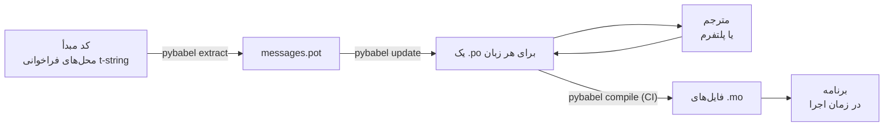

# در محیط عملیاتی

[آموزش](tutorial.md) چرخه را یک بار، تنها، روی برنامه‌ای با یک پیام
می‌گرداند. در یک پروژهٔ واقعی چرخه در گردش می‌ماند: پیام‌ها پس از
ترجمه‌شدن تغییر می‌کنند، مترجم جای دیگری و با برنامهٔ خودش کار می‌کند،
و با هر انتشار یک کاتالوگ کامپایل‌شده روانه می‌شود. این صفحه همان تمرین
است — چه چیزی در مخزن می‌ماند، چه چیزی سفر می‌کند، CI باید بر چه چیزی
دروازه بگذارد، و زمان اجرا زبان را کجا می‌بندد.

## شکل یک پروژه { #the-shape-of-a-project }

```text
myapp/
├── babel.cfg
├── pyproject.toml
├── src/
│   └── myapp/
└── locales/
    ├── messages.pot
    ├── ja/LC_MESSAGES/messages.po
    └── de/LC_MESSAGES/messages.po
```

فایل `babel.cfg`، الگوی `.pot` و هر `.po` را کامیت کنید — این‌ها
سرچشمه‌های ساختِ ترجمه‌اند و دیف‌هایشان همان راهی است که تغییرهای
ترجمه را بازبینی می‌کنید. فایل‌های `.mo`ِ کامپایل‌شده مصنوع ساخت‌اند:
آن‌ها را به‌جای کامیت‌کردن در CI یا هنگام بسته‌بندی تولید کنید تا هرگز
یک `.po` و `.mo`ِ آن نتوانند بر سر آنچه روانه می‌شود اختلاف داشته
باشند.

یک فایل در هر جهت نقشی دارد: `.pot` پیام‌های شما را به *بیرون* نزد
مترجم‌ها می‌برد و فایل‌های `.po` ترجمه‌ها را *باز*می‌آورند. هر چه در
ادامه می‌آید، آمدوشد میان آن دو است.



## چرخه پس از نخستین ترجمه { #the-cycle-after-the-first-translation }

`pybabel init`ِ آموزش برای هر زبان فقط یک بار اجرا می‌شود و بس. از آن
پس چرخهٔ کاری **استخراج ← به‌روزرسانی ← ترجمه ← کامپایل** است و مرکزش
`pybabel update` است که الگوی تازه را بی‌آنکه ترجمه‌های موجود را دور
بریزد، در کاتالوگ‌های موجود ادغام می‌کند.

فرض کنید خوش‌آمدِ `Hello {name}` — که پیش‌تر `こんにちは {name}` ترجمه
شده — در کد به `Welcome back, {name}` بازنویسی شود. استخراج و
به‌روزرسانی کنید:

```console
$ pybabel extract -F babel.cfg -c "Translators:" -o locales/messages.pot .
extracting messages from app.py (encoding="utf-8")
writing PO template file to locales/messages.pot
$ pybabel update -i locales/messages.pot -d locales
updating catalog locales/ja/LC_MESSAGES/messages.po based on locales/messages.pot
```

اکنون کاتالوگ ژاپنی این را دارد:

```po
#. gettext-tstrings
#: app.py:4
#, fuzzy, python-brace-format
msgid "Welcome back, {name}"
msgstr "こんにちは {name}"
```

Babel متوجه شد msgid تازه شبیه یکی از حذف‌شده‌هاست و آن را با ترجمهٔ
قدیمی جفت کرد — اما جفت را با پرچم **fuzzy** نشان گذاشت: حدسِ یک ماشین
در انتظار یک انسان. این پرچم دندان دارد. `pybabel compile` **مدخل‌های
fuzzy را از `.mo` کنار می‌گذارد**؛ پس تا مترجمی جفت را تأیید نکند،
برنامه متن انگلیسیِ تازه را رندر می‌کند، نه یک ژاپنیِ بیات را:

```console
$ pybabel compile -d locales
compiling catalog locales/ja/LC_MESSAGES/messages.po to locales/ja/LC_MESSAGES/messages.mo
$ python app.py
Welcome back, Ada
```

بنابراین پیامِ تغییرکرده همان‌گونه تنزل می‌کند که پیامِ خراب — به زبان
مبدأ، هرگز به ترجمه‌ای منسوخ. سهم مترجم از چرخه، بازنگری `msgstr` و
حذف پرچم `fuzzy` است؛ کامپایل بعدی مدخل را برمی‌دارد.

!!! note "نام جای‌نگهدارها بخشی از هویت پیام است"

    msgid کلید کاتالوگ است و *نام* جای‌نگهدار درون آن است — پس تغییر
    نام یک متغیر در کد (`name` ← `user_name`) msgid را عوض می‌کند و
    ترجمهٔ آن را در همهٔ زبان‌ها دوباره به چرخهٔ fuzzy می‌فرستد.
    متغیرهای درون‌یابی‌شده را با واژه‌هایی نام‌گذاری کنید که مترجم
    بفهمد، و تنها با دلیل تغییر نام دهید.

    قالب‌بندی تصویرِ آینه‌ای است: `!r` و `:.2f`
    [جزء msgid نیستند](internals.md#from-template-to-msgid)؛ پس سفت
    کردن `{amount:,.2f}` به `{amount:,.0f}` در هیچ کاتالوگی چیزی را
    تغییر نمی‌دهد. بازنویسی خودِ *جمله*، البته، تغییری واقعی است — همان
    چرخهٔ بالا.

## CI بر چه دروازه می‌گذارد { #what-ci-gates }

سه شکست ارزش یک بیلد قرمز را دارند: کاتالوگ‌ها از کد عقب افتادند،
ترجمه‌ای یک جای‌نگهدار را شکست، یا مدخلی خراب تا زمان اجرا سُرید. برای
هر شکست یک گام:

```yaml
- run: pybabel extract -F babel.cfg -c "Translators:" -o locales/messages.pot .
- run: pybabel update -i locales/messages.pot -d locales --check
- run: pybabel compile -d locales
- run: pytest
```

`pybabel update --check` چیزی بازنویسی نمی‌کند و وقتی کاتالوگی از الگویِ
تازه‌استخراج‌شده عقب باشد با وضعیت ناصفر خارج می‌شود — نگهبانِ در برابر
ادغام کدی که پیام‌هایش را کسی دوباره استخراج نکرده است.
`pybabel compile` بررسی‌های جای‌نگهدارِ هم Babel و هم
[بررسی‌کنندهٔ ثبت‌شدهٔ](extraction.md#your-existing-toolchain-validates-these-catalogs)
این بسته را اجرا می‌کند.

!!! bug "`--check` نمی‌تواند بر کاتالوگی که از بافتار استفاده می‌کند دروازه بگذارد"

    در Babel 2.18.0، `pybabel update --check` **هر** کاتالوگی را که
    `msgctxt` دارد عقب‌افتاده گزارش می‌کند، در هر اجرا، هر قدر هم که
    به‌روز باشد. مقایسه از `Catalog.is_identical` می‌گذرد که هر پیام را
    با کلیدی می‌جوید که پیام زیر آن ذخیره شده است — و برای پیامِ
    بافتاردار آن کلید جفتِ `(id, context)` است، که `Catalog.get` آن را
    نمی‌پذیرد. جست‌وجو چیزی برنمی‌گرداند و دو کاتالوگ هرگز برابر
    درنمی‌آیند:

    ```pycon
    >>> from babel.messages.catalog import Catalog
    >>> c = Catalog(locale="ja")
    >>> c.add("Guide", "ガイド", context="navigation")
    <Message 'Guide' (flags: [])>
    >>> c.is_identical(c)
    False
    ```

    پس اگر اصلاً از `pgettext` یا `npgettext` استفاده کنید — و رفعِ ابهام
    از یک هم‌نام همان دلیلِ وجودشان است — این گام به بدترین شکلِ ممکن
    بی‌اثر می‌شود: همیشه قرمز، پس تیم خاموشش می‌کند، پس دیگر هیچ چیز
    جلوی عقب‌افتادگی را نمی‌گیرد. تا وقتی که در بالادست رفع شود، خودتان
    مجموعه‌های پیام را مقایسه کنید. خواندنِ الگو و هر کاتالوگ با
    `babel.messages.pofile.read_po` و مقایسهٔ
    `{(m.context, m.id) for m in catalog if m.id}` تمامِ آن بررسی است، و
    همان کاری است که [بیلدِ خودِ این وب‌گاه](index.md) می‌کند.

!!! danger "وضعیت خروج را بررسی کنید، نه لاگ را"

    `pybabel compile` هر خطای جای‌نگهدار را گزارش می‌کند، با وضعیت
    ناصفر خارج می‌شود — **و `.mo` را به هر حال می‌نویسد**. خط لوله‌ای
    که کامپایل می‌کند و سپس `locales/` را در ایمیج کپی می‌کند، کاتالوگ
    خراب را روانه می‌کند مگر آن‌که خروج ناصفر واقعاً جلویش را بگیرد.
    گذاشتن این‌که آن گام بیلد را شکست دهد، مانند بالا، تمامِ راه‌حل
    است.

خط آخر همان مجموعه‌آزمون همیشگی شماست، با یک عادتِ افزوده: جایی در آن،
دست‌کم یک پیام از هر زبانِ روانه‌شده را از یک مترجم سخت‌گیر بگذرانید —

```python
import gettext

from gettext_tstrings import Translator


def test_catalogs_render(language: str) -> None:
    translations = gettext.translation("messages", localedir="locales", languages=[language])
    _ = Translator(translations, strict=True)
    name = "Ada"
    assert _(t"Welcome back, {name}")
```

— چون `strict=True`
[آن‌جا استثنا می‌دهد که محیط عملیاتی بی‌صدا فرو می‌نشست](guide.md#what-happens-when-a-catalog-is-wrong)
و یک رندرِ زمانِ اجرا تنها بررسی‌ای است که کاتالوگ را دقیقاً همان‌طور
می‌بیند که برنامه خواهد دید، با `.mo` و همه‌چیز.

## کار با مترجم‌ها و پلتفرم‌ها { #working-with-translators-and-platforms }

فایل `.po` قالبِ تبادل کل جهان gettext است، و همین دلیلِ استفادهٔ
دوبارهٔ این کتابخانه از آن است: سپردن ترجمه یعنی سپردن یک فایل، چه
گیرنده همکاری با یک ویرایشگر PO باشد و چه پلتفرمی مانند Weblate یا
Crowdin. سه چیز این دست‌به‌دست‌شدن را خوب از آب درمی‌آورد:

**بگویید پیام برای چیست.** توضیحی در کد همراه پیام سفر می‌کند — همان
که پرچم `-c "Translators:"` گرد می‌آورد:

```python
from gettext_tstrings import tr

name = "Ada"
# Translators: shown on the dashboard right after sign-in
print(tr(t"Welcome back, {name}"))
```

```po
#. Translators: shown on the dashboard right after sign-in
#. gettext-tstrings
#: app.py:5
#, python-brace-format
msgid "Welcome back, {name}"
msgstr ""
```

مترجم آن توضیح را در ویرایشگرش می‌بیند، کنار پیام، آن سوی جهان. این
ارزان‌ترین اهرم کیفیت در کل گردش کار است. برای واژه‌ای که هم‌نامِ خودش
است — «Open»ِ دکمه در برابر «Open»ِ وضعیت — به پیام با `pgettext` یک
[بافتار](guide.md#binding-a-catalog) بدهید که به یک `msgctxt`ِ نمایان
در کاتالوگ تبدیل می‌شود.

**بگذارید پلتفرم جای‌نگهدارها را اعتبارسنجی کند.** هر پیامِ
استخراج‌شده از یک t-string پرچم `python-brace-format` را دارد، و همان
یک خط است که QA جای‌نگهدار را در ابزارهایی که در کنترل شما نیستند روشن
می‌کند — Weblate این بررسی را مستند می‌کند، پلتفرم‌های تجاری بررسیِ
خودشان را بر همان پرچم سوار کرده‌اند و `msgfmt --check-format` آن را در
هر خط لولهٔ گنو اعمال می‌کند. جزئیات، و آنچه بررسی‌کنندهٔ همراه فراتر
از آن‌ها می‌گیرد، در
[صفحهٔ استخراج](extraction.md#your-existing-toolchain-validates-these-catalogs)
است.

**به تور ایمنی فقط همان‌قدر اعتماد کنید که می‌کِشد.** هر چه از یک
پلتفرم بازمی‌گردد هنوز داده‌ای است که وارد بیلد شما می‌شود؛
دروازه‌های CIِ بالا همان چیزی‌اند که «پلتفرم احتمالاً این را بررسی
کرده» را به «این نمی‌تواند خراب روانه شود» تبدیل می‌کنند.

## بستن زبان در زمان اجرا { #binding-a-language-at-runtime }

هر چه تا این‌جا بود کاتالوگ تولید می‌کند. تصمیم باقی‌مانده این است که
برنامه کجا یکی را انتخاب کند، و یک پاسخ صادقانه دارد: یک بار به‌ازای هر
*قلمروِ یک زبان* ببندید — برای CLI پردازه، برای سرویس وب درخواست.

=== "یک پردازه، یک زبان"

    یک ابزار خط فرمان یا برنامهٔ دسکتاپ محیط کاربر را یک بار، هنگام
    راه‌اندازی می‌خواند. پاس ندادن `languages=` می‌گذارد کتابخانهٔ
    استاندارد از روی `LANGUAGE` و `LC_ALL` و `LC_MESSAGES` و `LANG`
    مذاکره کند؛ `fallback=True` وقتی هیچ‌کدام با کاتالوگی که روانه
    کرده‌اید نخواند، به‌جای استثنا یک کاتالوگ تهی — متن مبدأ —
    برمی‌گرداند.

    ```python
    import gettext

    from gettext_tstrings import Translator

    _ = Translator(gettext.translation("messages", localedir="locales", fallback=True))

    name = "Ada"
    print(_(t"Welcome back, {name}"))
    ```

=== "Flask"

    یک برنامهٔ وب برای هر درخواست تصمیم می‌گیرد. هر کاتالوگ را یک بار
    هنگام import بار کنید، سپس پیش از اجرای view کاتالوگِ
    مذاکره‌شده را به بافتار ببندید —
    [`set_translations`](guide.md#per-request-language) بافتار-محلی
    است؛ پس درخواست‌های هم‌زمان به زبان‌های مختلف هرگز بستهٔ یکدیگر را
    نمی‌بینند.

    ```python
    import gettext

    from flask import Flask, request

    from gettext_tstrings import set_translations, tr

    LANGUAGES = ("en", "ja", "de")
    CATALOGS = {
        language: gettext.translation(
            "messages", localedir="locales", languages=[language], fallback=True
        )
        for language in LANGUAGES
    }

    app = Flask(__name__)


    @app.before_request
    def bind_language() -> None:
        language = request.accept_languages.best_match(LANGUAGES) or "en"
        set_translations(CATALOGS[language])


    @app.get("/")
    def home() -> str:
        name = "Ada"
        return tr(t"Welcome back, {name}")
    ```

=== "میان‌افزار ASGI"

    زیر فریم‌ورک‌های async — از FastAPI و Starlette تا هر چیز دیگر ASGI —
    درخواست را در [`use_translations`](guide.md#per-request-language)
    بپیچید: بسته در یک `ContextVar` زندگی می‌کند که تعویض تسک‌های
    async آن را به‌ازای هر درخواست حفظ می‌کند.

    ```python
    import gettext

    from fastapi import FastAPI, Request

    from gettext_tstrings import tr, use_translations

    LANGUAGES = ("en", "ja", "de")
    CATALOGS = {
        language: gettext.translation(
            "messages", localedir="locales", languages=[language], fallback=True
        )
        for language in LANGUAGES
    }

    app = FastAPI()


    @app.middleware("http")
    async def bind_language(request: Request, call_next):
        language = negotiate_language(request.headers.get("accept-language"), LANGUAGES)
        with use_translations(CATALOGS[language]):
            return await call_next(request)
    ```

    `negotiate_language` نمایندهٔ parse کردن Accept-Language شماست —
    بیشتر فریم‌ورک‌ها یا زیست‌بومشان یکی دارند؛ آنچه این‌جا مهم است،
    بستن دور `call_next` است.

دو عادتِ زمانِ اجرا تصویر را کامل می‌کنند. رشته‌هایی که در زمان import
ساخته می‌شوند — برچسب یک فرم، نام نمایشی یک enum — نباید زبانی را ثبت
کنند که هنگام import فعال بود؛ آن‌ها را با
[`lazy_gettext`](guide.md#deferred-translation) تعریف کنید تا در زبانِ
فعال هنگام *استفاده* رندر شوند. و لاگر `gettext_tstrings` را به جایی
هدایت کنید که انسانی نگاه می‌کند: هشدارهایش گزارشِ حالت آسان‌گیر از
ترجمه‌ای است که از همهٔ دروازه‌ها سُریده — یک خط برای هر پیام خراب، نه
یکی برای هر رندر.

## روانه‌سازی { #shipping }

محیط عملیاتی به بسته، فایل‌های `.mo` و دیگر هیچ نیاز دارد. Babel
وابستگیِ توسعه و CI است — `gettext-tstrings[babel]` را از ایمیج
عملیاتی بیرون نگه دارید و آن‌جا بستهٔ خالی را نصب کنید؛ رندر تنها با
کتابخانهٔ استاندارد می‌گردد. کاتالوگ‌ها را در همان بیلدی کامپایل کنید
که مصنوعِ استقراری را تولید می‌کند، تا `.mo`های درونش دقیقاً همان
`.po`های بازبینی‌شده باشند و هیچ‌چیزِ کامپایل‌شده روی لپ‌تاپ کسی هرگز
روانه نشود.

پیش از یک انتشار، چک‌لیستی که این صفحه به آن فرومی‌کاهد:

- `pybabel update --check` می‌گذرد — هیچ پیامی بی‌آنکه کاتالوگ‌ها
  بشنوند تغییر نکرده است.
- `pybabel compile` بیلد را بر وضعیت خروجش دروازه می‌کند.
- مدخل‌های `fuzzy`ِ باقی‌مانده عمدی‌اند — هر یک تا تأیید مترجم به‌صورت
  متن مبدأ رندر می‌شود.
- مجموعه‌آزمون هر زبانِ روانه‌شده را یک بار با `strict=True` رندر
  می‌کند.
- مصنوعِ عملیاتی فایل‌های `.mo` را دارد و Babel را ندارد.
- لاگر `gettext_tstrings` به پایش هدایت شده است.

## گام‌های بعدی { #where-next }

- [استخراج](extraction.md) — مرجعِ نیمهٔ ابزاریِ این صفحه: گزینه‌های
  نگاشت، نام‌های تابع سفارشی، حالت سخت‌گیرانه، و همهٔ بررسی‌کننده‌ها.
- [راهنما](guide.md) — نیمهٔ زمان اجرا: صورت‌های جمع، بافتارها،
  رشته‌های معوق، و حالت‌های شکست با جزئیات.
- [چگونه کار می‌کند](internals.md) — چرا msgid این شکلی است، و
  اعتبارسنجی واقعاً چه چیزی را بررسی می‌کند.
