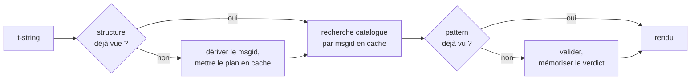

# Fonctionnement

Rien sur cette page n'est nécessaire pour utiliser la bibliothèque — le
[tutoriel](tutorial.md) et le [guide](guide.md) couvrent cela. Cette page
reconstruit plutôt la bibliothèque à partir des premiers principes : ce
qu'est réellement une t-string, comment un msgid en découle, ce qui rend une
traduction valide, et comment l'implémentation fait coûter à toute cette
vérification quelques dixièmes de microseconde. Lisez-la si vous êtes
curieux, si vous voulez contribuer, ou si vous comptez
[implémenter la convention vous-même](#reimplementing-it).

## Ce qu'est réellement une t-string { #what-a-t-string-actually-is }

Une f-string produit une `str`, et la produit immédiatement — au moment où
une fonction la reçoit, la valeur a été interpolée et la phrase est scellée.
Une t-string ([PEP 750]) a la même syntaxe et la même évaluation immédiate de
ses expressions, mais produit un type différent :

```pycon
>>> name = "Ada"
>>> f"Hello {name}!"
'Hello Ada!'
>>> t"Hello {name}!"
Template(strings=('Hello ', '!'), interpolations=(Interpolation('Ada', 'name', None, ''),))
```

Cet objet `Template` conserve, encore séparées, les parties dont une chaîne
d'outils de catalogue a besoin :

```pycon
>>> template = t"Total: {amount:,.2f}"
>>> template.strings
('Total: ', '')
>>> template.interpolations[0].expression
'amount'
>>> template.interpolations[0].value
1234.5
>>> template.interpolations[0].format_spec
',.2f'
```

- `strings` — le texte littéral autour des interpolations, dans l'ordre.
- Pour chaque interpolation : l'**expression** comme texte source
  (`'amount'`), sa **valeur** évaluée (`1234.5`), et l'éventuelle
  **conversion** (`!r`) et **spécification de format** (`,.2f`) — portées
  séparément au lieu d'être appliquées.

Tout ce que fait cette bibliothèque est une consommation disciplinée de cette
structure. Le langage a déjà opéré la seule séparation dont l'i18n a besoin —
le texte statique à part des valeurs — donc la bibliothèque n'analyse jamais
votre code source et ne devine jamais où une valeur se trouve dans une
phrase. Restent trois décisions : comment la structure devient une clé de
catalogue, ce qu'une traduction de cette clé peut dire, et comment les deux
se rendent à nouveau ensemble.

## Du template au msgid { #from-template-to-msgid }

Un msgid — la clé par laquelle un catalogue est indexé — est dérivé des
seules parties *statiques* du template. Parcourez `strings` et
`interpolations` dans l'ordre source ; échappez les accolades de chaque
segment littéral (`{` devient `{{`) ; pour chaque interpolation, émettez un
token `{name}`, où `name` est le texte de l'expression débarrassé des espaces
qui l'entourent. À partir de `t"Total: {amount:,.2f}"` :

```text
strings         ('Total: ', '')
interpolations  expression 'amount'   conversion None   format_spec ',.2f'
msgid           'Total: {amount}'
```

Chaque partie de cette règle a une raison :

- **L'expression doit être un nom simple** — `str.isidentifier()` est vrai
  et ce n'est pas un mot-clé Python. `t"Hello {user.name}"` est rejetée au
  site d'appel. Un msgid est une *clé* : il doit sortir identique à chaque
  exécution et à chaque extraction, et il est lu par des traducteurs, donc le
  marqueur doit être un mot stable et signifiant — pas un fragment de code
  qui invite le catalogue à devenir un langage d'expressions.
- **La conversion et la spécification de format n'entrent jamais dans le
  msgid.** Les traducteurs ne devraient pas avoir à lire `:,.2f`, et aucune
  traduction ne devrait pouvoir la changer. Le corollaire vaut d'être connu :
  resserrer `:,.2f` en `:,.0f` dans votre code ne change aucun msgid, donc
  n'invalide aucune traduction dans aucune langue. La clé du catalogue suit
  *ce que dit la phrase*, pas la façon dont la valeur est formatée.
- **Un nom répété doit répéter son formatage à l'identique.**
  `t"{x:.2f} vs {x:.3f}"` est rejetée, parce que les deux occurrences se
  replient sur le même token `{x}` et que le msgid ne pourrait plus dire quel
  formatage un rendu doit utiliser.
- **Le msgid vide n'est jamais recherché**, parce que gettext le réserve à
  l'en-tête de métadonnées du catalogue. `t""` se rend comme `""` sans
  toucher au catalogue.

L'ensemble complet des règles, y compris les cas limites que cette page
passe sous silence, est la
[SPEC §2](https://github.com/yhay81/gettext-tstrings/blob/main/SPEC.md).

## Ce qu'une traduction peut dire { #what-a-translation-may-say }

Un pattern qui revient d'un catalogue est analysé avec `string.Formatter` —
le même parseur que `str.format`. La grammaire est délibérément empruntée
plutôt qu'inventée : un pattern que cette bibliothèque accepte est un pattern
que l'écosystème au sens large comprend déjà. Deux contrôles s'appliquent
ensuite.

**La forme :** chaque champ doit être un `{name}` nu. Une conversion ou une
spécification de format — y compris le `{name:}` explicitement vide — est
rejetée, tout comme les champs positionnels (`{0}`, `{}`) et les noms
entourés d'espaces (`{ name }`). Ce dernier cas compte plus qu'il n'y
paraît : `str.format` et le `msgfmt` de GNU rejettent tous deux `{ name }`,
donc l'accepter ici produirait des catalogues qu'aucun autre outil de la
chaîne ne peut valider.

**Les noms :** l'ensemble des marqueurs du pattern est comparé à celui de la
source. Pour un message singulier, chaque nom de la source est *requis* et
rien d'autre n'est *autorisé*. Pour un message pluriel, les deux branches
sont fusionnées :

- **autorisé** = l'union des noms des deux branches
- **requis** = leur intersection

Ainsi, face à `t"One file"` / `t"{n} files"`, le nom `n` est autorisé dans la
traduction de chaque forme mais requis dans aucune. Cette asymétrie est ce
qui permet au système de pluriel d'une langue cible de différer de celui de
la source — le japonais traduit les deux branches avec une seule forme qui
utilise probablement `{n}` ; une langue avec plus de formes que l'anglais
peut avoir besoin de `{n}` dans une forme où l'anglais n'en a pas.

Rien de tout cela n'est hypothétique : le catalogue de l'habillage de ce site
porte lui-même le message pluriel `Built {n} localized page` / `Built {n}
localized pages` — deux branches anglaises — et les éditions du site
traduisent ce seul message en une à six formes :

| Catalogue | Formes | Les traductions, dans l'ordre des formes |
| --- | --- | --- |
| Japonais | 1 | `ローカライズ済みページを{n}件ビルドしました` |
| Turc | 2 | `{n} yerelleştirilmiş sayfa oluşturuldu` — deux fois, à l'identique : les noms turcs restent au singulier après un numéral |
| Italien | 2 | `Generata {n} pagina localizzata` · `Generate {n} pagine localizzate` — le participe s'accorde en genre et en nombre |
| Letton | 3 | `Izveidota {n} lokalizēta lapa` · `Izveidotas {n} lokalizētas lapas` · `Izveidots {n} lokalizētu lapu` — la troisième forme est pour **le zéro seul** |
| Russe | 3 | `Собрана {n} локализованная страница` · `Собраны {n} локализованные страницы` · `Собрано {n} локализованных страниц` |
| Polonais | 3 | `Zbudowano {n} zlokalizowaną stronę` · `Zbudowano {n} zlokalizowane strony` · `Zbudowano {n} zlokalizowanych stron` |
| Slovène | 4 | `Zgrajena {n} lokalizirana stran` · `Zgrajeni {n} lokalizirani strani` · `Zgrajene {n} lokalizirane strani` · `Zgrajenih {n} lokaliziranih strani` — la deuxième est un **duel**, pour exactement deux |
| Irlandais | 5 | `Tógadh {n} leathanach logánaithe` · `Tógadh {n} leathanaigh logánaithe` — un, deux, 3–6, 7–10, et le reste ; le radical alterne, mais *leathanach* commence par `l`, sur quoi aucune mutation irlandaise ne s'écrit, si bien que plusieurs formes coïncident |
| Arabe | 6 | parmi elles `تم إنشاء صفحة مترجمة واحدة ({n})` pour exactement un et `تم إنشاء {n} صفحات مترجمة` pour quelques-uns |

Chaque ligne est une entrée réelle des `i18n/*/LC_MESSAGES/site.po` de ce
dépôt, rendue par le [build multilingue](index.md) à chaque release — et un
test épingle ce tableau à ces catalogues, de sorte que les deux ne peuvent
pas diverger.

Dans ces limites, le réordonnancement et la répétition sont délibérément
libres. Les deux sont grammaticalement nécessaires dans de vraies langues, et
restreindre le nombre d'occurrences rejetterait des traductions correctes
sans aucun bénéfice de sécurité : une traduction ne peut de toute façon rien
*évaluer*, parce qu'aucun chemin d'évaluation n'existe — les marqueurs sont
recherchés par nom dans les valeurs déjà calculées du template, jamais passés
à `eval`, `getattr` ou `str.format` lui-même.

## Le rendu { #rendering }

Rendre un pattern validé est un parcours de ses fragments : émettre chaque
partie littérale et, pour chaque marqueur, prendre la valeur capturée par
l'interpolation et appliquer la conversion et la spécification de format
*côté source* — `format(convert(value, conversion), format_spec)`. Deux
garanties sont tenues ce faisant :

- **Chaque valeur distincte est formatée au plus une fois par rendu**, même
  quand la traduction répète un marqueur. La répétition change le nombre
  d'insertions du résultat, pas le nombre d'exécutions de votre
  `__format__`.
- **Pour les pluriels, un marqueur lit la branche qui l'a défini.** Un nom
  présent dans les deux branches lit la valeur capturée par la branche que la
  langue *source* sélectionne (`singular` quand `n == 1`, sinon `plural`) ;
  un nom propre à une branche lit toujours sa propre branche, même quand les
  règles de pluriel de la langue cible l'ont rendu disponible dans une autre
  forme.

Quand la validation échoue au moment du rendu, la réponse dépend de qui a
fourni le pattern. Un pattern sorti d'un *catalogue* se dégrade : une seule
ligne d'avertissement dans le journal et le rendu du texte source, gardant le
contrat de gettext selon lequel un catalogue cassé ne fait jamais tomber
l'application ([le guide montre les deux modes](guide.md#what-happens-when-a-catalog-is-wrong)).
Un pattern passé directement par l'appelant — `CompiledTemplate.render` —
lève toujours, parce qu'il n'y a pas de texte source vers lequel se
dégrader ; l'indulgence existe pour les recherches en catalogue, pas pour
les arguments.

## Les diagnostics font partie de la conception { #diagnostics-are-part-of-the-design }

Une erreur de marqueur atterrit généralement devant un traducteur, pas un
programmeur, et souvent dans un fichier où le problème est invisible. Dire
`{name} is missing` à quelqu'un qui voit ces caractères exacts dans son
éditeur est une impasse, donc les messages sont calculés avec trois règles :

- Un nom contenant un **caractère invisible** — un espace insécable produit
  par une méthode de saisie, une espace de largeur nulle — est imprimé avec
  ce caractère remplacé par son code point, en place : `{<U+00A0>name}`. Le
  lecteur a besoin de voir *où*.
- Un nom dont les lettres **mélangent les systèmes d'écriture**, le cas des
  homoglyphes, est montré deux fois — une fois lisiblement, une fois
  échappé — parce que `{nаme}` avec un `а` cyrillique est indistinguable de
  `{name}` à l'impression, et que la forme échappée est la seule orthographe
  qui les distingue.
- Tout le reste est montré **tel qu'écrit**. `{名前}` et `{café}` sont des
  noms ordinaires ; les échapper laisserait le lecteur incapable de
  retrouver ce qui était visé.

Sur le même principe, un marqueur « manquant » qui *semble* présent voit son
absence expliquée — accolades pleine chasse d'une méthode de saisie
est-asiatique, doublement `{{name}}` issu d'un aller-retour d'échappement,
nom hors de toute accolade. Le
[tableau de lecture des erreurs du guide](guide.md#reading-a-failure-message)
montre chacun de ces messages mot pour mot.

## Le chemin chaud { #the-hot-path }

Tout ce qui précède se produit pour chaque chaîne traduite qu'une
application rend, donc l'implémentation est bâtie autour d'une idée : **la
validation n'est jamais sautée, donc c'est la validation qui doit être mise
en cache.**



Trois caches, un par étape :

- **Un plan par structure de site d'appel.** Le tuple `strings` du template
  — un objet que l'interpréteur a déjà construit — sert de clé de cache,
  donc une recherche n'alloue rien. En cas de hit, l'expression, la
  conversion et la spécification de format de chaque interpolation sont tout
  de même comparées à celles enregistrées : deux sites d'appel qui partagent
  le texte littéral mais diffèrent par le formatage (`t"{x:.2f}"` contre
  `t"{x:.3f}"`) ne doivent pas entrer en collision, et cette comparaison est
  le prix d'une clé que l'interpréteur fournit gratuitement.
- **Un verdict par pattern.** La première fois qu'un catalogue répond avec un
  pattern donné, il est analysé et validé ; le résultat — un plan de rendu
  compilé, ou le constat d'invalidité — est conservé sur le plan. Chaque
  rendu ultérieur de ce message l'atteint en une seule recherche de
  dictionnaire. Les patterns invalides sont eux aussi mémorisés, ce qui
  explique qu'une entrée de catalogue cassée avertit une fois plutôt qu'à
  chaque rendu.
- **Un plan fusionné par paire de pluriels**, portant les ensembles
  union/intersection pour que l'arithmétique des branches se fasse une fois
  par message, pas une fois par appel.

Chaque cache est borné, et aucun ne retient de *valeurs* interpolées —
seulement la structure statique et le texte des patterns. Le résultat, mesuré
par
[`benchmarks/runtime.py`](https://github.com/yhay81/gettext-tstrings/blob/main/benchmarks/runtime.py) :
environ 0,4 µs pour un message à un champ, construction de la t-string
comprise, soit à peu près 2,5× un simple `gettext(...).format(...)` qui ne
vérifie rien. Le commentaire en tête de
[`core.py`](https://github.com/yhay81/gettext-tstrings/blob/main/src/gettext_tstrings/core.py)
consigne les mesures individuelles derrière ce profil.

## Réimplémenter la convention { #reimplementing-it }

Rien de tout cela n'est un savoir secret : la convention est consignée dans la
[spec v1](spec.md), et sa
[suite de conformité](spec.md#conformance) lisible par machine permet à un
extracteur, à un plugin d'IDE ou à une implémentation dans un autre langage de
se vérifier contre chaque règle expliquée sur cette page. Cette implémentation
exécute la suite dans ses propres tests, ce qui empêche cette page, la spec et
le code de dériver l'un de l'autre en silence.

  [PEP 750]: https://peps.python.org/pep-0750/
