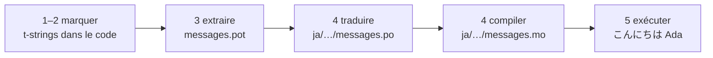

# Tutoriel

Cette page va d'un répertoire vide à un programme qui salue en japonais. Cinq
étapes, aucune expérience de gettext supposée, et chaque commande est montrée
avec la sortie qu'elle produit réellement — à chaque étape, vous savez donc si
vous êtes sur la bonne voie.

Il vous faut Python 3.14 ou plus récent, car les t-strings sont une syntaxe
nouvelle de la version 3.14. Le japonais est la langue cible d'exemple de
cette page, mais rien ne dépend de ce choix — substituez n'importe quelle
langue à l'étape 4, où le code de locale `ja` est la seule chose qui la
nomme.

## 1. Installer { #1-install }

```console
python -m pip install "gettext-tstrings[babel]"
```

L'extra `[babel]` installe [Babel], l'outil qui collecte vos messages dans des
fichiers catalogues à l'étape 3. C'est un outil de développement : le code de
production rend les messages avec la seule bibliothèque standard.

## 2. Marquer un message dans votre code { #2-mark-a-message-in-your-code }

Créez `app.py` :

```python
from gettext_tstrings import tr

name = "Ada"
print(tr(t"Hello {name}"))
```

`t"Hello {name}"` ressemble à une f-string, mais le préfixe `t` garde le texte
et la valeur séparés au lieu de les fusionner sur place. C'est cette séparation
qui permet à `tr()` de chercher une traduction pour la phrase complète
`Hello {name}` puis d'insérer la valeur ensuite.

Exécutez-le dès maintenant :

```console
$ python app.py
Hello Ada
```

Aucune traduction n'est encore installée, le texte source est donc rendu tel
quel. Un programme qui utilise cette bibliothèque n'*exige* jamais de catalogue
pour fonctionner — l'anglais (ou votre langue source, quelle qu'elle soit) est
le repli intégré.

## 3. Extraire les messages { #3-extract-the-messages }

Les traducteurs ne lisent pas votre code source ; un petit fichier appelé
**catalogue** voyage entre vous et eux. La première étape vers ce catalogue
consiste à collecter chaque message marqué dans le code.

Indiquez à Babel comment trouver vos messages en créant `babel.cfg` :

```ini
[gettext_tstrings: **.py]
encoding = utf-8
```

Puis extrayez vers un fichier modèle (`.pot`) :

```console
$ mkdir -p locales
$ pybabel extract -F babel.cfg -c "Translators:" -o locales/messages.pot .
extracting messages from app.py (encoding="utf-8")
writing PO template file to locales/messages.pot
```

`locales/messages.pot` contient désormais une entrée par message :

```po
#. gettext-tstrings
#: app.py:4
#, python-brace-format
msgid "Hello {name}"
msgstr ""
```

`msgid` est la clé que votre code recherchera. Le `msgstr` vide est l'endroit
où va une traduction — mais pas dans ce fichier : un `.pot` est un *modèle*,
et l'étape suivante le copie une fois par langue.

## 4. Traduire et compiler { #4-translate-and-compile }

Créez le catalogue japonais à partir du modèle :

```console
$ pybabel init -i locales/messages.pot -d locales -l ja
creating catalog locales/ja/LC_MESSAGES/messages.po based on locales/messages.pot
```

Ouvrez `locales/ja/LC_MESSAGES/messages.po` et remplissez le `msgstr` :

```po
msgid "Hello {name}"
msgstr "こんにちは {name}"
```

Gardez `{name}` exactement tel quel — le marqueur est ce qui permet à la valeur
de trouver sa place dans la phrase traduite, et la traduction est libre de le
déplacer là où la langue cible l'exige. Sur un vrai projet, ce fichier `.po`
est ce que vous remettez à un traducteur ou téléversez sur une plateforme de
traduction ; le format est le même dans les deux cas.

Les catalogues s'éditent en texte mais se chargent sous une forme binaire
(`.mo`), donc compilez :

```console
$ pybabel compile -d locales
compiling catalog locales/ja/LC_MESSAGES/messages.po to locales/ja/LC_MESSAGES/messages.mo
```

Cette commande est aussi un filet de sécurité. Si la traduction avait endommagé
le marqueur — `{nome}` au lieu de `{name}`, par exemple — elle refuserait de
passer :

```console
$ pybabel compile -d locales
error: locales/ja/LC_MESSAGES/messages.po:24: translation does not match the
source placeholders: {name} is missing; {nome} is not in the source message
1 errors encountered.
```

## 5. Exécuter { #5-run-it }

Pointez `app.py` vers le catalogue compilé. Cliquez sur les pastilles pour
voir ce que fait chaque ligne :

```python
import gettext

from gettext_tstrings import Translator

_ = Translator(gettext.translation("messages", localedir="locales", languages=["ja"]))  # (1)!

name = "Ada"
print(_(t"Hello {name}"))  # (2)!
```

1. La bibliothèque standard charge le `.mo` compilé, et `Translator` le lie à
   un appelable. `_` est le nom gettext conventionnel pour « traduis ceci » —
   court parce qu'il apparaît sur chaque chaîne destinée à l'utilisateur.
   C'est la même fonction que `tr`, liée à un catalogue.
2. À l'appel : le texte de la t-string devient la clé de recherche
   `Hello {name}`, le catalogue répond `こんにちは {name}`, la réponse est
   vérifiée contre les marqueurs de la source, et alors seulement la valeur
   est mise en place.

```console
$ python app.py
こんにちは Ada
```

Voilà toute la boucle, et elle vaut d'être vue en une seule image :



**Marquer → extraire → traduire → compiler → exécuter.** Tout le reste de ce
site est un approfondissement de l'une de ces cinq étapes.

## Pour continuer { #where-next }

- [Pourquoi les t-strings](comparison.md) — ce dont cette conception vous
  protège, comparée à `%(name)s`, `.format()` et aux chaînes `$`.
- [Guide](guide.md) — pluriels, langue par requête, chaînes différées et ce
  qui se passe à l'exécution quand un catalogue est malgré tout incorrect.
- [En production](workflow.md) — cette même boucle telle qu'une équipe la fait
  tourner, semaine après semaine : mise à jour des catalogues, barrières de CI
  et plateformes de traduction.
- [Extraction](extraction.md) — la référence `pybabel` complète : noms de
  fonctions personnalisés, mode strict pour la CI et les contrôles qui
  protègent vos catalogues.

  [Babel]: https://babel.pocoo.org/
