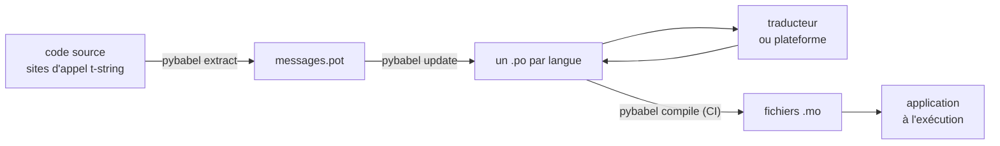

# En production

Le [tutoriel](tutorial.md) fait tourner la boucle une fois, seul, sur un
programme à un seul message. Sur un vrai projet, la boucle ne s'arrête plus :
des messages changent après avoir été traduits, le traducteur travaille
ailleurs et à son propre rythme, et un catalogue compilé accompagne chaque
release. Cette page décrit cette pratique — ce qui reste dans le dépôt, ce qui
voyage, ce que la CI doit verrouiller et où le runtime lie une langue.

Tout cela se ramène à six contrôles ; les voici d'emblée, et chaque section
ci-dessous en met un en place.

- `pybabel update --check` passe — aucun message n'a changé sans que les
  catalogues en aient été avertis.
- `pybabel compile` conditionne le build à son statut de sortie.
- Les entrées `fuzzy` restantes sont voulues — chacune se rend en texte source
  jusqu'à ce qu'un traducteur la confirme.
- La suite de tests rend une fois chaque langue livrée avec `strict=True`.
- L'artefact de production contient les fichiers `.mo` et pas Babel.
- Le logger `gettext_tstrings` est raccordé à la supervision.

## La forme d'un projet { #the-shape-of-a-project }

```text
myapp/
├── babel.cfg
├── pyproject.toml
├── src/
│   └── myapp/
└── locales/
    ├── messages.pot
    ├── ja/LC_MESSAGES/messages.po
    └── de/LC_MESSAGES/messages.po
```

Committez `babel.cfg`, le modèle `.pot` et chaque `.po` — ce sont les sources
du build de traduction, et leurs diffs sont votre outil de revue des
changements de traduction. Les fichiers `.mo` compilés sont des artefacts de
build : produisez-les en CI ou au moment du packaging plutôt que de les
committer, afin qu'un `.po` et son `.mo` ne puissent jamais diverger sur ce
qui est livré.

Un fichier joue un rôle dans chaque direction : le `.pot` transporte vos
messages *vers* les traducteurs, les fichiers `.po` rapportent les traductions
*en retour*. Le reste de cette page est ce qui circule entre les deux.



## Le cycle après la première traduction { #the-cycle-after-the-first-translation }

Le `pybabel init` du tutoriel s'exécute normalement une seule fois, à l'ajout
d'une langue. À partir de là, le cycle de travail est **extraire → mettre à
jour → traduire → compiler**, et son centre est `pybabel update`, qui fusionne
un modèle frais dans les catalogues existants sans jeter les traductions
qu'ils contiennent déjà.

Supposons que la salutation `Hello {name}` — déjà traduite en
`こんにちは {name}` — soit reformulée dans le code en `Welcome back, {name}`.
Extrayez puis mettez à jour :

```console
$ pybabel extract -F babel.cfg -c "Translators:" -o locales/messages.pot .
extracting messages from app.py (encoding="utf-8")
writing PO template file to locales/messages.pot
$ pybabel update -i locales/messages.pot -d locales
updating catalog locales/ja/LC_MESSAGES/messages.po based on locales/messages.pot
```

Le catalogue japonais contient désormais :

```po
#. gettext-tstrings
#: app.py:4
#, fuzzy, python-brace-format
msgid "Welcome back, {name}"
msgstr "こんにちは {name}"
```

Babel a remarqué que le nouveau msgid ressemblait à un msgid supprimé et l'a
apparié avec l'ancienne traduction — mais en marquant la paire **fuzzy** : la
supposition d'une machine en attente d'un humain. Ce flag change ce qui est
compilé : `pybabel compile` **exclut les entrées fuzzy du `.mo`**, donc tant
qu'un traducteur n'a pas confirmé la paire, l'application rend le nouveau texte
anglais plutôt qu'un japonais périmé :

```console
$ pybabel compile -d locales
compiling catalog locales/ja/LC_MESSAGES/messages.po to locales/ja/LC_MESSAGES/messages.mo
$ python app.py
Welcome back, Ada
```

Un message modifié se dégrade donc de la même façon qu'un message cassé —
vers la langue source, jamais vers une traduction obsolète. La part du
traducteur dans le cycle est de réviser le `msgstr` et de supprimer le flag
`fuzzy` ; la compilation suivante reprend l'entrée.

!!! note "Les noms des marqueurs font partie de l'identité du message"

    Le msgid est la clé du catalogue, et le *nom* du marqueur en fait
    partie — renommer une variable dans le code (`name` → `user_name`)
    change donc le msgid et renvoie la traduction de chaque langue dans le
    cycle fuzzy. Nommez les variables interpolées avec des mots qu'un
    traducteur comprendra, et ne les renommez que pour une bonne raison.

    Le formatage est l'image inverse : `!r` et `:.2f` ne font [pas partie du
    msgid](internals.md#from-template-to-msgid), donc resserrer
    `{amount:,.2f}` en `{amount:,.0f}` ne change rien dans aucun catalogue.
    Reformuler la *phrase*, bien sûr, est un vrai changement — c'est le cycle
    ci-dessus.

## Ce que la CI verrouille { #what-ci-gates }

Trois échecs méritent un build rouge : les catalogues ont pris du retard sur
le code, une traduction a cassé un marqueur, ou une entrée cassée s'est
glissée jusqu'au runtime. Une étape par échec :

```yaml
- run: pybabel extract -F babel.cfg -c "Translators:" -o locales/messages.pot .
- run: pybabel update -i locales/messages.pot -d locales --check
- run: pybabel compile -d locales
- run: pytest
```

`pybabel update --check` ne réécrit rien et sort avec un statut non nul quand
un catalogue est en retard sur le modèle fraîchement extrait — la garde
contre la fusion d'un code dont personne n'a réextrait les messages.
`pybabel compile` exécute les contrôles de marqueurs de Babel et du
[checker enregistré](extraction.md#your-existing-toolchain-validates-these-catalogs)
de ce paquet.

!!! bug "Babel 2.18.0 : `--check` ne peut pas verrouiller un catalogue qui utilise des contextes"

    Sur Babel 2.18.0, `pybabel update --check` signale **chaque** catalogue
    contenant un `msgctxt` comme en retard, à chaque exécution, quel que soit
    son degré d'actualité. Une barrière définitivement rouge est pire que pas
    de barrière, parce qu'une équipe finit par la désactiver — donc si vous
    utilisez ne serait-ce qu'une fois `pgettext` ou `npgettext`, remplacez
    cette étape plutôt que de vivre avec. Lire le modèle et chaque catalogue
    avec `babel.messages.pofile.read_po` et comparer
    `{(m.context, m.id) for m in catalog if m.id}` est tout le contrôle, et
    c'est ce que fait [le build de ce site](index.md). La cause est
    [détaillée sur Pièges](pitfalls.md#your-tools-have-bugs-too).

!!! danger "Vérifiez le statut de sortie, pas le journal"

    `pybabel compile` signale chaque erreur de marqueur, sort avec un statut
    non nul — **et écrit quand même le `.mo`**. Une pipeline qui compile
    puis copie `locales/` dans une image livre le catalogue cassé, sauf si le
    statut non nul l'arrête réellement. Laisser cette étape faire échouer le
    build, comme ci-dessus, est tout le correctif.

La dernière ligne est votre suite de tests ordinaire, avec une habitude en
plus : quelque part en son sein, rendez au moins un message par langue livrée
à travers un traducteur strict —

```python
import gettext

from gettext_tstrings import Translator


def test_catalogs_render(language: str) -> None:
    translations = gettext.translation("messages", localedir="locales", languages=[language])
    _ = Translator(translations, strict=True)
    name = "Ada"
    assert _(t"Welcome back, {name}")
```

— parce que `strict=True` [lève là où la production retomberait
silencieusement](guide.md#what-happens-when-a-catalog-is-wrong), et qu'un
rendu à l'exécution est le seul contrôle qui voit le catalogue exactement
comme l'application le verra, `.mo` compris.

## Travailler avec les traducteurs et les plateformes { #working-with-translators-and-platforms }

Le fichier `.po` est le format d'échange de tout le monde gettext, et c'est la
raison pour laquelle cette bibliothèque le réutilise : confier la traduction,
c'est remettre un fichier, que le destinataire soit un collègue avec un
éditeur PO ou une plateforme comme Weblate ou Crowdin. Trois choses font que
la passation fonctionne bien :

**Dites à quoi sert le message.** Un commentaire dans le code voyage avec le
message — c'est ce que collecte le flag `-c "Translators:"` :

```python
from gettext_tstrings import tr

name = "Ada"
# Translators: shown on the dashboard right after sign-in
print(tr(t"Welcome back, {name}"))
```

```po
#. Translators: shown on the dashboard right after sign-in
#. gettext-tstrings
#: app.py:5
#, python-brace-format
msgid "Welcome back, {name}"
msgstr ""
```

Un traducteur voit ce commentaire dans son éditeur, à côté du message, à
l'autre bout du monde. C'est le levier de qualité le moins cher de tout le
workflow. Pour un mot qui est son propre homonyme — « Open » le bouton contre
« Open » l'état — donnez au message un [contexte](guide.md#binding-a-catalog)
avec `pgettext`, qui devient un `msgctxt` visible dans le catalogue.

**Laissez la plateforme valider les marqueurs.** Chaque message extrait d'une
t-string porte le flag `python-brace-format`, et cette seule ligne est ce qui
active le contrôle qualité des marqueurs dans des outils que vous ne
contrôlez pas — Weblate documente le contrôle, les plateformes commerciales
appuient les leurs sur le même flag, et `msgfmt --check-format` l'applique
dans toute pipeline GNU. Les détails, et ce que le checker fourni attrape
au-delà, sont sur la
[page Extraction](extraction.md#your-existing-toolchain-validates-these-catalogs).

**Faites confiance au filet de sécurité, mais pas plus loin qu'il ne va.**
Ce qui revient d'une plateforme reste des données qui entrent dans votre
build ; les barrières de CI ci-dessus sont ce qui transforme « la plateforme
a probablement vérifié » en « ceci ne peut pas être livré cassé ».

## Lier une langue à l'exécution { #binding-a-language-at-runtime }

Tout ce qui précède produit des catalogues. La décision restante est
l'endroit où l'application en sélectionne un, et elle n'a qu'une réponse
honnête : liez une fois par *portée d'une langue* — le processus pour un CLI,
la requête pour un service web.

=== "Un processus, une langue"

    Un outil en ligne de commande ou une application de bureau lit
    l'environnement de l'utilisateur une fois, au démarrage. Ne pas passer
    `languages=` laisse la bibliothèque standard négocier depuis `LANGUAGE`,
    `LC_ALL`, `LC_MESSAGES` et `LANG` ; `fallback=True` renvoie un catalogue
    nul — le texte source — plutôt que de lever quand aucun d'eux ne
    correspond à un catalogue que vous livrez.

    ```python
    import gettext

    from gettext_tstrings import Translator

    _ = Translator(gettext.translation("messages", localedir="locales", fallback=True))

    name = "Ada"
    print(_(t"Welcome back, {name}"))
    ```

=== "Flask"

    Une application web décide par requête. Chargez chaque catalogue une fois
    à l'import, puis liez celui qui a été négocié au contexte avant
    l'exécution de la vue —
    [`set_translations`](guide.md#per-request-language) est local au
    contexte, donc des requêtes concurrentes dans des langues différentes ne
    voient jamais la liaison l'une de l'autre.

    ```python
    import gettext

    from flask import Flask, request

    from gettext_tstrings import set_translations, tr

    LANGUAGES = ("en", "ja", "de")
    CATALOGS = {
        language: gettext.translation(
            "messages", localedir="locales", languages=[language], fallback=True
        )
        for language in LANGUAGES
    }

    app = Flask(__name__)


    @app.before_request
    def bind_language() -> None:
        language = request.accept_languages.best_match(LANGUAGES) or "en"
        set_translations(CATALOGS[language])


    @app.get("/")
    def home() -> str:
        name = "Ada"
        return tr(t"Welcome back, {name}")
    ```

=== "Middleware ASGI"

    Sous les frameworks async — FastAPI, Starlette et tout ce qui est ASGI —
    enveloppez la requête dans
    [`use_translations`](guide.md#per-request-language) : la liaison vit dans
    une `ContextVar`, que la commutation des tâches async préserve par
    requête.

    ```python
    import gettext

    from fastapi import FastAPI, Request

    from gettext_tstrings import tr, use_translations

    LANGUAGES = ("en", "ja", "de")
    CATALOGS = {
        language: gettext.translation(
            "messages", localedir="locales", languages=[language], fallback=True
        )
        for language in LANGUAGES
    }

    app = FastAPI()


    @app.middleware("http")
    async def bind_language(request: Request, call_next):
        language = negotiate_language(request.headers.get("accept-language"), LANGUAGES)
        with use_translations(CATALOGS[language]):
            return await call_next(request)
    ```

    `negotiate_language` représente votre analyse d'Accept-Language — la
    plupart des frameworks ou leur écosystème en fournissent une ; ce qui
    compte ici est la liaison autour de `call_next`.

Deux habitudes d'exécution complètent le tableau. Les chaînes créées à
l'import — l'étiquette d'un formulaire, le nom d'affichage d'une enum — ne
doivent pas capturer la langue active pendant l'import ; définissez-les avec
[`lazy_gettext`](guide.md#deferred-translation) et elles se rendront dans la
langue active à l'*utilisation*. Et routez le logger `gettext_tstrings` vers
un endroit qu'un humain regarde : ses avertissements sont le mode indulgent
signalant une traduction qui a franchi toutes les barrières, une ligne par
message cassé plutôt qu'une par rendu.

## Livrer { #shipping }

La production a besoin du paquet, des fichiers `.mo`, et de rien d'autre.
Babel est une dépendance de développement et de CI — gardez
`gettext-tstrings[babel]` hors de l'image de production et installez-y le
paquet nu ; le rendu tourne avec la seule bibliothèque standard. Compilez les
catalogues dans le même build que celui qui produit l'artefact déployé, afin
que les `.mo` qu'il contient soient exactement les `.po` relus, et que rien
de compilé sur le portable de quelqu'un ne soit jamais livré.

Avant une release, la checklist à laquelle cette page se réduit :

- `pybabel update --check` passe — aucun message n'a changé sans que les
  catalogues en soient informés.
- `pybabel compile` conditionne le build à son statut de sortie.
- Les entrées `fuzzy` restantes sont intentionnelles — chacune se rend comme
  texte source tant qu'un traducteur ne l'a pas confirmée.
- La suite de tests rend chaque langue livrée une fois avec `strict=True`.
- L'artefact de production contient les fichiers `.mo` et aucun Babel.
- Le logger `gettext_tstrings` est routé vers la supervision.

## Pour continuer { #where-next }

- [Extraction](extraction.md) — la référence de la moitié outillage de cette
  page : options de mapping, noms de fonctions personnalisés, mode strict et
  chaque checker.
- [Guide](guide.md) — la moitié exécution : pluriels, contextes, chaînes
  différées et les modes d'échec en détail.
- [Fonctionnement](internals.md) — pourquoi le msgid a la forme qu'il a, et
  ce que la validation vérifie réellement.
