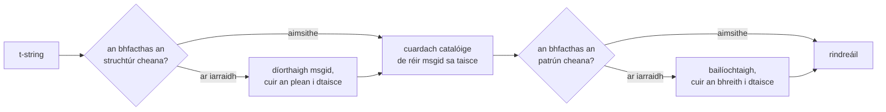

# Conas a oibríonn sé

Níl aon rud ar an leathanach seo riachtanach chun an leabharlann a úsáid —
clúdaíonn an [rang teagaisc](tutorial.md) agus an [treoir](guide.md) é sin.
Ina áit sin, atógann an leathanach seo an leabharlann ó na bunphrionsabail:
cad is t-string ann i ndáiríre, conas a thiteann msgid amach as, cad a fhágann
aistriúchán bailí, agus conas a fhágann an cur i bhfeidhm nach gcosnaíonn an
tseiceáil sin ar fad ach deichiúna de mhicreashoicind. Léigh é má tá fiosracht
ort, más mian leat cur leis, nó má tá sé i gceist agat
[an coinbhinsiún a chur i bhfeidhm tú féin](#reimplementing-it).

## Cad is t-string ann i ndáiríre { #what-a-t-string-actually-is }

Táirgeann f-string `str`, agus táirgeann sé láithreach é — faoin am a
bhfaigheann feidhm ar bith é, tá an luach idirshuite agus tá an abairt
séalaithe. Tá an chomhréir chéanna agus an mheastóireacht fhonnmhar chéanna ar
a chuid sloinn ag t-string ([PEP 750]), ach táirgeann sé cineál difriúil:

```pycon
>>> name = "Ada"
>>> f"Hello {name}!"
'Hello Ada!'
>>> t"Hello {name}!"
Template(strings=('Hello ', '!'), interpolations=(Interpolation('Ada', 'name', None, ''),))
```

Coinníonn an oibiacht `Template` sin na codanna a theastaíonn ó phíblíne
catalóige, scartha fós:

```pycon
>>> template = t"Total: {amount:,.2f}"
>>> template.strings
('Total: ', '')
>>> template.interpolations[0].expression
'amount'
>>> template.interpolations[0].value
1234.5
>>> template.interpolations[0].format_spec
',.2f'
```

- `strings` — an téacs litriúil timpeall ar na hidirshuímh, in ord.
- I gcás gach idirshuímh: an **slonn** mar théacs foinseach (`'amount'`), a
  **luach** measúnaithe (`1234.5`), agus aon **tiontú** (`!r`) agus
  **sonrú formáide** (`,.2f`) — á n-iompar ar leithligh in ionad iad a chur i
  bhfeidhm.

Níl i ngach rud a dhéanann an leabharlann seo ach ídiú disciplínithe ar an
struchtúr sin. Rinne an teanga cheana an t-aon deighilt a theastaíonn ó i18n —
téacs statach scartha ó luachanna — mar sin ní pharsálann an leabharlann do
chód foinseach riamh agus ní thugann sí buille faoi thuairim riamh faoin áit a
suíonn luach laistigh d'abairt. Is é atá fágtha ná trí chinneadh: conas a
éiríonn eochair chatalóige as an struchtúr, cad is féidir le haistriúchán ar
an eochair sin a rá, agus conas a rindreáileann an dá cheann le chéile arís.

## Ón teimpléad go dtí an msgid { #from-template-to-msgid }

Díorthaítear msgid — an eochair a n-innéacsaítear catalóg léi — ó chodanna
*statacha* an teimpléid amháin. Siúil trí `strings` agus `interpolations` in
ord na foinse; éalaigh na lúibíní i ngach mír litriúil (éiríonn `{{` as `{`);
i gcás gach idirshuímh, astaigh comhartha `{name}` amháin, áit arb é `name`
téacs an tsloinn agus an spás bán timpeall air bainte de. Ó
`t"Total: {amount:,.2f}"`:

```text
strings         ('Total: ', '')
interpolations  expression 'amount'   conversion None   format_spec ',.2f'
msgid           'Total: {amount}'
```

Tá cúis le gach cuid den riail sin:

- **Caithfidh an slonn a bheith ina ainm lom** — tá `str.isidentifier()` fíor
  agus ní eochairfhocal Python é. Diúltaítear do `t"Hello {user.name}"` ag
  láthair an ghlao. Is *eochair* é msgid: caithfidh sé teacht amach mar an
  gcéanna ag gach rith agus ag gach eastóscadh, agus léann aistritheoirí é,
  mar sin caithfidh an sealbhóir ionaid a bheith ina fhocal cobhsaí fiúntach —
  ní ina bhlúire cóid a thugann cuireadh don chatalóg éirí ina teanga sloinn.
- **Ní théann an tiontú ná an sonrú formáide isteach sa msgid riamh.** Níor
  cheart go mbeadh ar aistritheoirí `:,.2f` a léamh, agus níor cheart go
  bhféadfadh aon aistriúchán é a athrú. Is fiú an iarmhairt a bheith ar eolas
  agat: ní athraíonn `:,.2f` a theannadh go `:,.0f` i do chód aon msgid, mar
  sin ní chuireann sé aistriúchán ar bith ó bhail in aon teanga. Rianaíonn
  eochair na catalóige *an méid a deir an abairt*, ní an chaoi a bhformáidítear
  an luach.
- **Caithfidh ainm athdhéanta a fhormáidiú a athdhéanamh go beacht.**
  Diúltaítear do `t"{x:.2f} vs {x:.3f}"`, mar go dtiteann an dá tharlú isteach
  sa chomhartha `{x}` céanna agus nach bhféadfadh an msgid a rá a thuilleadh
  cén formáidiú ar cheart do rindreáil a úsáid.
- **Ní lorgaítear an msgid folamh riamh**, mar go gcoinníonn gettext é do
  cheanntásc meiteashonraí na catalóige féin. Rindreáileann `t""` mar `""` gan
  lámh a leagan ar an gcatalóg.

Tá an tacar iomlán rialacha, na cásanna imill a scipeálann an leathanach seo
san áireamh, in
[SPEC §2](https://github.com/yhay81/gettext-tstrings/blob/main/SPEC.md).

## Cad is féidir le haistriúchán a rá { #what-a-translation-may-say }

Parsáiltear patrún a fhilleann ó chatalóg le `string.Formatter` — an parsálaí
céanna a úsáideann `str.format`. Tá an ghramadach ar iasacht d'aon ghnó
seachas í a cheapadh: is patrún é ceann a nglacann an leabharlann seo leis a
thuigeann an t-éiceachóras níos leithne cheana. Ansin cuirtear dhá sheiceáil i
bhfeidhm.

**Cruth:** caithfidh gach réimse a bheith ina `{name}` lom. Diúltaítear do
thiontú nó do shonrú formáide — an `{name:}` atá folamh go follasach san
áireamh — mar aon le réimsí suímh (`{0}`, `{}`) agus le hainmneacha a bhfuil
spás bán stuáilte iontu (`{ name }`). Tá tábhacht níos mó leis an gceann
deireanach ná mar a fheictear: diúltaíonn `str.format` agus `msgfmt` GNU araon
do `{ name }`, mar sin dá nglacfaí leis anseo tháirgfí catalóga nach
bhféadfadh aon uirlis eile sa slabhra iad a bhailíochtú.

**Ainmneacha:** cuirtear tacar sealbhóirí ionaid an phatrúin i gcomparáid le
tacar na foinse. I gcás teachtaireachta uatha tá gach ainm foinseach
*riachtanach* agus níl aon rud eile *ceadaithe*. I gcás teachtaireachta iolra
cumasctar an dá bhrainse:

- **ceadaithe** = aontas ainmneacha an dá bhrainse
- **riachtanach** = a dtrasnú

Mar sin i gcoinne `t"One file"` / `t"{n} files"`, tá an t-ainm `n` ceadaithe in
aistriúchán ar cheachtar foirm ach níl sé riachtanach do cheachtar acu. Is í an
neamhshiméadracht sin a ligeann do chóras iolra na sprioctheanga bheith
difriúil le córas na foinse — aistríonn an tSeapáinis an dá bhrainse le foirm
amháin a úsáideann `{n}` is dócha; d'fhéadfadh go dteastódh `{n}` ó theanga a
bhfuil níos mó foirmeacha aici ná an Béarla i bhfoirm nach bhfuil ceann ar
bith ag an mBéarla.

Níl aon chuid de sin hipitéiseach: iompraíonn catalóg chróm an tsuímh seo féin
an teachtaireacht iolra `Built {n} localized page` / `Built {n} localized
pages` — dhá bhrainse Béarla — agus aistríonn eagráin an tsuímh an
teachtaireacht amháin sin go dtí idir foirm amháin agus sé cinn:

| Catalóg | Foirmeacha | Na haistriúcháin, in ord na bhfoirmeacha |
| --- | --- | --- |
| Seapáinis | 1 | `ローカライズ済みページを{n}件ビルドしました` |
| Tuircis | 2 | `{n} yerelleştirilmiş sayfa oluşturuldu` — faoi dhó, mar an gcéanna: fanann ainmfhocail na Tuircise san uatha i ndiaidh uimhreach |
| Iodáilis | 2 | `Generata {n} pagina localizzata` · `Generate {n} pagine localizzate` — réitíonn an rangabháil in inscne agus in uimhir |
| Rúisis | 3 | `Собрана {n} локализованная страница` · `Собраны {n} локализованные страницы` · `Собрано {n} локализованных страниц` |
| Polainnis | 3 | `Zbudowano {n} zlokalizowaną stronę` · `Zbudowano {n} zlokalizowane strony` · `Zbudowano {n} zlokalizowanych stron` |
| Araibis | 6 | ina measc `تم إنشاء صفحة مترجمة واحدة ({n})` do cheann amháin go beacht agus `تم إنشاء {n} صفحات مترجمة` do bheagán |

Is iontráil bheo é gach ró in `i18n/*/LC_MESSAGES/site.po` na stórlainne seo,
rindreáilte ag an [tógáil ilteangach](index.md) ag gach eisiúint — agus
greamaíonn tástáil an tábla seo do na catalóga sin, mar sin ní féidir leis an
dá cheann imeacht óna chéile.

Laistigh de na teorainneacha sin, tá an t-athordú agus an t-athdhéanamh gan
srian d'aon ghnó. Tá an dá rud riachtanach ó thaobh na gramadaí de i
bhfíortheangacha, agus dá gcuirfí srian ar líon na dtarluithe dhiúltófaí
d'aistriúcháin chearta gan buntáiste slándála ar bith: ní féidir le
haistriúchán aon rud a *mheas* fós, mar nach bhfuil aon chosán meastóireachta
ann — lorgaítear sealbhóirí ionaid de réir ainm i luachanna an teimpléid atá
ríofa cheana, agus ní chuirtear go dtí `eval`, `getattr` ná `str.format` féin
riamh iad.

## Rindreáil { #rendering }

Is siúlóid thar a chodanna í patrún bailíochtaithe a rindreáil: astaigh gach
cuid litriúil, agus i gcás gach sealbhóra ionaid, tóg luach gafa an idirshuímh
agus cuir an tiontú agus an sonrú formáide *ar thaobh na foinse* i bhfeidhm —
`format(convert(value, conversion), format_spec)`. Coinnítear dhá ráthaíocht
agus é sin á dhéanamh:

- **Ní fhormáidítear gach luach ar leith ach uair amháin ar a mhéad in aghaidh
  na rindreála**, fiú nuair a athdhéanann an t-aistriúchán sealbhóir ionaid.
  Athraíonn an t-athdhéanamh cé chomh minic a chuirtear an toradh isteach, ní
  cé chomh minic a ritheann do `__format__`.
- **I gcás iolraí, léann sealbhóir ionaid an brainse a shainigh é.** Léann
  ainm atá sa dá bhrainse an luach a ghabh an brainse a roghnaíonn an teanga
  *fhoinseach* (`singular` nuair is `n == 1`, `plural` seachas sin); léann ainm
  a bhaineann le brainse ar leith a bhrainse féin i gcónaí, fiú nuair a chuir
  rialacha iolra na sprioctheanga ar fáil i bhfoirm eile é.

Nuair a theipeann ar an mbailíochtú ag am rindreála, roinntear an freagra de
réir cé a sholáthair an patrún. Téann patrún a tháinig as *catalóg* in olcas:
logáil rabhadh amháin agus rindreáil an téacs foinseach, agus coinnigh conradh
gettext nach leagann catalóg lochtach an feidhmchlár riamh
([taispeánann an treoir an dá mhód](guide.md#what-happens-when-a-catalog-is-wrong)).
Ardaíonn patrún a chuir an glaoiteoir isteach go díreach —
`CompiledTemplate.render` — eisceacht i gcónaí, mar nach bhfuil aon téacs
foinseach ann le dul in olcas *uaidh*; tá an bhoige ann do chuardaigh
chatalóige, ní d'argóintí.

## Is cuid den dearadh iad na diagnóisicí { #diagnostics-are-part-of-the-design }

Is os comhair aistritheora seachas programmer a thagann earráid sealbhóra
ionaid de ghnáth, agus is minic i gcomhad ina bhfuil an fhadhb dofheicthe. Is
bóthar caoch é `{name} is missing` a rá le duine a fheiceann na carachtair
chruinne sin ina eagarthóir, mar sin ríomhtar na teachtaireachtaí de réir trí
riail:

- Priontáiltear ainm ina bhfuil **carachtar dofheicthe** — spás gan bhriseadh
  a chruthaigh modh ionchuir, spás nialas-leithid — agus pointe cóid an
  charachtair sin curtha ina áit, san áit chéanna: `{<U+00A0>name}`. Tá gá ag
  an léitheoir *an áit* a fheiceáil.
- Taispeántar ainm a bhfuil **córais scríbhneoireachta measctha** ina
  litreacha, cás na homaghlifeanna, faoi dhó — uair amháin go hinléite, uair
  amháin éalaithe — mar nach féidir `{nаme}` le `а` Coireallach a idirdhealú ó
  `{name}` i gcló, agus is í an fhoirm éalaithe `(nаme)` an t-aon litriú a
  aithníonn óna chéile iad.
- Taispeántar gach rud eile **mar a scríobhadh é**. Is gnáthainmneacha iad
  `{名前}` agus `{café}`; dá n-éalófaí iad d'fhágfaí an léitheoir gan a bheith
  in ann teacht ar an rud a bhí i gceist.

Ar an bprionsabal céanna, mínítear easpa sealbhóra ionaid atá "ar iarraidh"
ach a bhfuil an *chuma* air go bhfuil sé ann — lúibíní lánleithid ó mhodh
ionchuir Oirthear na hÁise, `{{name}}` dúblaithe ó thuras éalaithe, an t-ainm
lasmuigh d'aon lúibíní. Taispeánann
[tábla léite na dteipeanna sa treoir](guide.md#reading-a-failure-message) gach
ceann de na teachtaireachtaí seo focal ar fhocal.

## An cosán te { #the-hot-path }

Tarlaíonn a bhfuil thuas ar gach teaghrán aistrithe a rindreáileann
feidhmchlár, mar sin tá an cur i bhfeidhm tógtha timpeall ar smaoineamh
amháin: **ní scipeáiltear an bailíochtú riamh, mar sin caithfidh gurb é an
bailíochtú a chuirtear i dtaisce.**



Trí thaisce, ceann in aghaidh na céime:

- **Plean in aghaidh struchtúr láthair glao.** Is é an codach `strings` de
  chuid an teimpléid — oibiacht a thóg an léirmhínitheoir cheana — eochair na
  taisce, mar sin ní leithdháileann cuardach faic. Nuair a aimsítear ceann,
  déantar slonn, tiontú agus sonrú formáide gach idirshuímh a chur i
  gcomparáid leis na cinn taifeadta fós: níor cheart do dhá láthair ghlao a
  roinneann téacs litriúil ach a bhfuil formáidiú difriúil acu (`t"{x:.2f}"` i
  gcoinne `t"{x:.3f}"`) imbhualadh, agus is í an chomparáid sin an praghas ar
  eochair a úsáid a shíneann an léirmhínitheoir chugat saor in aisce.
- **Breith in aghaidh an phatrúin.** An chéad uair a fhreagraíonn catalóg le
  patrún ar leith, parsáiltear agus bailíochtaítear é; coinnítear an toradh —
  plean rindreála tiomsaithe, nó taifead ar neamhbhailíocht — ar an bplean.
  Sroicheann gach rindreáil níos déanaí ar an teachtaireacht sin é in aon
  chuardach foclóra amháin. Coinnítear cuimhne ar phatrúin neamhbhailí
  freisin, agus sin an fáth a dtugann iontráil chatalóige lochtach rabhadh
  uair amháin seachas ag gach rindreáil.
- **Plean cumaiscthe in aghaidh gach péire iolra**, ina bhfuil na tacair
  aontais/trasnaithe ionas nach dtarlaíonn uimhríocht na mbrainsí ach uair
  amháin in aghaidh na teachtaireachta, ní uair amháin in aghaidh an ghlao.

Tá teorainn le gach taisce, agus ní choinníonn ceann ar bith *luachanna*
idirshuite — níl ann ach struchtúr statach agus téacs patrúin. An toradh, arna
thomhas ag
[`benchmarks/runtime.py`](https://github.com/yhay81/gettext-tstrings/blob/main/benchmarks/runtime.py):
thart ar 0.4 µs do theachtaireacht a bhfuil réimse amháin inti, tógáil an
t-string féin san áireamh, thart ar 2.5× gnáth-`gettext(...).format(...)` nach
seiceálann faic. Taifeadann an tráchtaireacht ag barr
[`core.py`](https://github.com/yhay81/gettext-tstrings/blob/main/src/gettext_tstrings/core.py)
na tomhais aonair atá taobh thiar den chruth sin.

## É a athchur i bhfeidhm { #reimplementing-it }

Ní seanchas príobháideach é aon chuid de sin: tá an coinbhinsiún scríofa síos
mar [shonraíocht v1](spec.md), agus ligeann a
[sraith comhréireachta](spec.md#conformance) atá inléite ag meaisín
d'eastóscóir, do bhreiseán IDE, nó do chur i bhfeidhm i dteanga eile é féin a
sheiceáil i gcoinne gach rialach a mhínigh an leathanach seo. Ritheann an cur
i bhfeidhm seo an tsraith ina thástálacha féin, agus sin an rud a choinníonn
an leathanach seo, an tsonraíocht agus an cód ó imeacht óna chéile ina dtost.

  [PEP 750]: https://peps.python.org/pep-0750/
