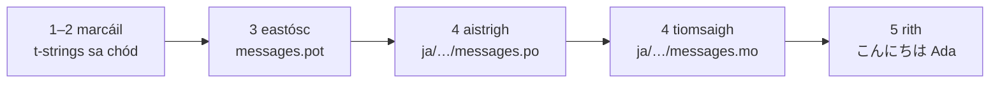

# Rang teagaisc

Téann an leathanach seo ó chomhadlann fholamh go clár a bheannaíonn i
Seapáinis. Cúig chéim, ní ghlactar le haon taithí ar gettext, agus taispeántar
gach ordú leis an aschur a chruthaíonn sé i ndáiríre — ionas go mbeidh a fhios
agat ag gach céim an bhfuil tú ar an mbóthar ceart.

Teastaíonn Python 3.14 nó níos nuaí uait, mar gur comhréir nua i 3.14 iad na
t-strings. Is í an tSeapáinis sprioc shamplach an leathanaigh seo, ach níl aon
rud ag brath ar an rogha sin — cuir teanga ar bith ina hionad i gcéim 4, áit
nach bhfuil ach an cód logánaithe `ja` á hainmniú.

## 1. Suiteáil { #1-install }

```console
python -m pip install "gettext-tstrings[babel]"
```

Tugann an breiseán `[babel]` isteach [Babel], an uirlis a bhailíonn do chuid
teachtaireachtaí i gcomhaid chatalóige i gcéim 3. Uirlis ama forbartha atá
inti: rindreáileann cód táirgthe leis an leabharlann chaighdeánach amháin.

## 2. Marcáil teachtaireacht i do chód { #2-mark-a-message-in-your-code }

Cruthaigh `app.py`:

```python
from gettext_tstrings import tr

name = "Ada"
print(tr(t"Hello {name}"))
```

Tá cuma f-string ar `t"Hello {name}"`, ach coinníonn an réimír `t` an téacs
agus an luach scartha óna chéile in ionad iad a chumasc láithreach. Is í an
deighilt sin a ligeann do `tr()` aistriúchán a lorg don abairt iomlán
`Hello {name}` agus an luach a chur isteach ina dhiaidh sin.

Rith anois é:

```console
$ python app.py
Hello Ada
```

Níl aon aistriúchán suiteáilte fós, mar sin rindreáiltear an téacs foinseach
mar atá. Ní *theastaíonn* catalóg riamh ó chlár a úsáideann an leabharlann seo
chun rith — is é an Béarla (nó cibé teanga fhoinseach atá agat) an cúltaca
ionsuite.

## 3. Eastósc na teachtaireachtaí { #3-extract-the-messages }

Ní léann aistritheoirí do chód foinseach; taistealaíonn comhad beag ar a
dtugtar **catalóg** idir tú féin agus iad. Is é an chéad chéim i dtreo
catalóige gach teachtaireacht mharcáilte a bhailiú amach as an gcód.

Inis do Babel conas do chuid teachtaireachtaí a aimsiú trí `babel.cfg` a
chruthú:

```ini
[gettext_tstrings: **.py]
encoding = utf-8
```

Ansin eastósc iad go comhad teimpléid (`.pot`):

```console
$ mkdir -p locales
$ pybabel extract -F babel.cfg -c "Translators:" -o locales/messages.pot .
extracting messages from app.py (encoding="utf-8")
writing PO template file to locales/messages.pot
```

Tá iontráil amháin in aghaidh na teachtaireachta i `locales/messages.pot`
anois:

```po
#. gettext-tstrings
#: app.py:4
#, python-brace-format
msgid "Hello {name}"
msgstr ""
```

Is é `msgid` an eochair a lorgóidh do chód. Is san `msgstr` folamh a théann
aistriúchán — ach ní sa chomhad seo: *teimpléad* is ea `.pot`, agus déanann an
chéad chéim eile cóip de uair amháin in aghaidh na teanga.

## 4. Aistrigh agus tiomsaigh { #4-translate-and-compile }

Cruthaigh an chatalóg Sheapáinise ón teimpléad:

```console
$ pybabel init -i locales/messages.pot -d locales -l ja
creating catalog locales/ja/LC_MESSAGES/messages.po based on locales/messages.pot
```

Oscail `locales/ja/LC_MESSAGES/messages.po` agus líon isteach an `msgstr`:

```po
msgid "Hello {name}"
msgstr "こんにちは {name}"
```

Coinnigh `{name}` díreach mar atá sé — is tríd an sealbhóir ionaid a aimsíonn
an luach a áit laistigh den abairt aistrithe, agus tá cead ag an aistriúchán é
a bhogadh cibé áit a theastaíonn ón sprioctheanga. I bhfíorthionscadal, is é
an comhad `.po` seo a shíneann tú chuig aistritheoir nó a uaslódálann tú chuig
ardán aistriúcháin; is í an fhormáid chéanna í ar aon chuma.

Cuirtear catalóga in eagar mar théacs ach luchtaítear i bhfoirm dhénártha
(`.mo`) iad, mar sin tiomsaigh:

```console
$ pybabel compile -d locales
compiling catalog locales/ja/LC_MESSAGES/messages.po to locales/ja/LC_MESSAGES/messages.mo
```

Is líontán sábhála an t-ordú seo freisin. Dá mbeadh an sealbhóir ionaid millte
ag an aistriúchán — `{nome}` in ionad `{name}`, cuir i gcás — dhiúltódh sé é a
ligean tríd:

```console
$ pybabel compile -d locales
error: locales/ja/LC_MESSAGES/messages.po:24: translation does not match the
source placeholders: {name} is missing; {nome} is not in the source message
1 errors encountered.
```

## 5. Rith é { #5-run-it }

Dírigh `app.py` ar an gcatalóg thiomsaithe. Cliceáil na marcóirí le feiceáil
cad tá ar siúl ag gach líne:

```python
import gettext

from gettext_tstrings import Translator

_ = Translator(gettext.translation("messages", localedir="locales", languages=["ja"]))  # (1)!

name = "Ada"
print(_(t"Hello {name}"))  # (2)!
```

1. Luchtaíonn an leabharlann chaighdeánach an `.mo` tiomsaithe, agus
   ceanglaíonn `Translator` le hoibiacht inghairthe é. Is é `_` an gnáthainm
   gettext ar "aistrigh é seo" — gairid mar go bhfeictear ar gach teaghrán a
   fheiceann an t-úsáideoir é. Is í an fheidhm chéanna í agus `tr`, ceangailte
   le catalóg amháin.
2. Ag an nglao: éiríonn téacs an t-string ina eochair chuardaigh
   `Hello {name}`, freagraíonn an chatalóg le `こんにちは {name}`, seiceáiltear
   an freagra i gcoinne sealbhóirí ionaid na foinse, agus ansin amháin a
   chuirtear an luach isteach.

```console
$ python app.py
こんにちは Ada
```

Sin an lúb ar fad, agus is fiú í a fheiceáil mar phictiúr amháin:



**Marcáil → eastósc → aistrigh → tiomsaigh → rith.** Níl i ngach rud eile ar
an suíomh seo ach mionchoigeartú ar cheann de na cúig chéim sin.

## Cá háit anois { #where-next }

- [Cén fáth t-strings](comparison.md) — cad uaidh a chosnaíonn an dearadh seo
  tú, i gcomparáid le `%(name)s`, `.format()` agus `$`-strings.
- [Treoir](guide.md) — iolraí, teangacha in aghaidh an iarratais, teaghráin
  iarchurtha, agus a tharlaíonn ag am rite nuair a bhíonn catalóg mícheart mar
  sin féin.
- [I dtáirgeadh](workflow.md) — an lúb chéanna seo mar a ritheann foireann í,
  seachtain i ndiaidh seachtaine: catalóga a nuashonrú, geataí CI, agus ardáin
  aistriúcháin.
- [Eastóscadh](extraction.md) — an tagairt iomlán do `pybabel`: ainmneacha
  feidhme saincheaptha, mód dian CI, agus na seiceálacha a chosnaíonn do
  chatalóga.

  [Babel]: https://babel.pocoo.org/
