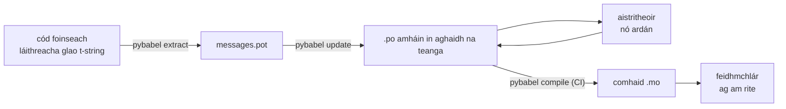

# I dtáirgeadh

Ritheann an [rang teagaisc](tutorial.md) an lúb uair amháin, ina haonar, ar
chlár a bhfuil teachtaireacht amháin ann. I bhfíorthionscadal leanann an lúb
ag casadh: athraíonn teachtaireachtaí tar éis iad a aistriú, oibríonn an
t-aistritheoir in áit eile agus ar a sceideal féin, agus seoltar catalóg
thiomsaithe le gach eisiúint. Is é an leathanach seo an cleachtas sin — cad a
fhanann sa stórlann, cad a thaistealaíonn, cad a chaithfidh CI a gheatú, agus
cén áit a gceanglaíonn an t-am rite teanga.

## Cruth tionscadail { #the-shape-of-a-project }

```text
myapp/
├── babel.cfg
├── pyproject.toml
├── src/
│   └── myapp/
└── locales/
    ├── messages.pot
    ├── ja/LC_MESSAGES/messages.po
    └── de/LC_MESSAGES/messages.po
```

Tiomantaigh `babel.cfg`, an teimpléad `.pot`, agus gach `.po` — is iad sin
foinsí thógáil an aistriúcháin, agus is trína ndifríochtaí a dhéanann tú
athbhreithniú ar athruithe aistriúcháin. Is déantáin tógála iad na comhaid
`.mo` thiomsaithe: cruthaigh i CI nó ag am pacáistithe iad seachas iad a
thiomantú, ionas nach bhféadfadh `.po` agus a `.mo` easaontú riamh faoi cad a
sheoltar.

Tá ról ag comhad amháin i ngach treo: iompraíonn an `.pot` do chuid
teachtaireachtaí *amach* chuig aistritheoirí, iompraíonn na comhaid `.po` na
haistriúcháin *ar ais*. Is é gach rud thíos an trácht idir an dá cheann sin.



## An timthriall tar éis an chéad aistriúcháin { #the-cycle-after-the-first-translation }

Ritheann `pybabel init` an ranga teagaisc uair amháin in aghaidh na teanga,
riamh. As sin amach is é **eastósc → nuashonraigh → aistrigh → tiomsaigh** an
timthriall oibre, agus is é `pybabel update` a lárionad, a fhilleann teimpléad
úr isteach sna catalóga atá ann cheana gan na haistriúcháin atá iontu cheana a
chaitheamh amach.

Abair go n-athfhoclaítear an beannú `Hello {name}` — atá aistrithe cheana mar
`こんにちは {name}` — sa chód go `Welcome back, {name}`. Eastósc agus
nuashonraigh:

```console
$ pybabel extract -F babel.cfg -c "Translators:" -o locales/messages.pot .
extracting messages from app.py (encoding="utf-8")
writing PO template file to locales/messages.pot
$ pybabel update -i locales/messages.pot -d locales
updating catalog locales/ja/LC_MESSAGES/messages.po based on locales/messages.pot
```

Tá an méid seo sa chatalóg Sheapáinise anois:

```po
#. gettext-tstrings
#: app.py:4
#, fuzzy, python-brace-format
msgid "Welcome back, {name}"
msgstr "こんにちは {name}"
```

Thug Babel faoi deara go bhfuil an msgid nua cosúil le ceann a baineadh amach
agus chuir sé leis an seanaistriúchán é — ach chuir sé an bhratach **fuzzy**
ar an bpéire: buille faoi thuairim meaisín ag feitheamh le duine. Tá fiacla ag
an mbratach. **Fágann `pybabel compile` iontrálacha fuzzy amach as an `.mo`**,
mar sin go dtí go ndeimhníonn aistritheoir an péire, rindreáileann an
feidhmchlár an téacs Béarla nua seachas seantéacs Seapáinise:

```console
$ pybabel compile -d locales
compiling catalog locales/ja/LC_MESSAGES/messages.po to locales/ja/LC_MESSAGES/messages.mo
$ python app.py
Welcome back, Ada
```

Téann teachtaireacht athraithe in olcas mar sin ar an mbealach céanna a
théann ceann lochtach — go dtí an teanga fhoinseach, riamh go dtí aistriúchán
as dáta. Is é cuid an aistritheora den timthriall an `msgstr` a leasú agus an
bhratach `fuzzy` a scriosadh; tógann an chéad tiomsú eile an iontráil suas.

!!! note "Is cuid d'aitheantas na teachtaireachta iad ainmneacha na sealbhóirí ionaid"

    Is é an msgid eochair na catalóige, agus tá *ainm* an tsealbhóra ionaid
    istigh ann — mar sin athraíonn athainmniú athróige sa chód
    (`name` → `user_name`) an msgid agus cuireann sé aistriúchán gach teanga
    air ar ais tríd an timthriall fuzzy. Ainmnigh athróga idirshuite mar
    fhocail a thuigfidh aistritheoir, agus ná hathainmnigh iad ach ar chúis
    mhaith.

    Is é an formáidiú a scáthán:
    [níl `!r` ná `:.2f` ina gcuid den msgid](internals.md#from-template-to-msgid),
    mar sin ní athraíonn `{amount:,.2f}` a theannadh go `{amount:,.0f}` rud ar
    bith in aon chatalóg. Is fíorathrú é an *abairt* a athfhoclú, ar ndóigh —
    sin an timthriall thuas.

## Cad a gheataíonn CI { #what-ci-gates }

Is fiú tógáil dhearg do thrí theip: thit na catalóga chun deiridh ar an gcód,
bhris aistriúchán sealbhóir ionaid, nó shleamhnaigh iontráil lochtach tríd go
dtí an t-am rite. Céim amháin in aghaidh na teipe:

```yaml
- run: pybabel extract -F babel.cfg -c "Translators:" -o locales/messages.pot .
- run: pybabel update -i locales/messages.pot -d locales --check
- run: pybabel compile -d locales
- run: pytest
```

Ní athscríobhann `pybabel update --check` rud ar bith agus scoireann sé le
stádas nach nialas nuair a bhíonn catalóg as dáta i gcomparáid leis an
teimpléad atá díreach eastósctha — an garda in aghaidh cód a chumasc nár
ath-eastósc aon duine a chuid teachtaireachtaí. Ritheann `pybabel compile`
seiceálacha sealbhóirí ionaid Babel agus
[an tseiceálaí atá cláraithe](extraction.md#your-existing-toolchain-validates-these-catalogs)
ag an bpacáiste seo araon.

!!! bug "Ní féidir le `--check` catalóg a úsáideann comhthéacsanna a gheatú"

    Ar Babel 2.18.0, tuairiscíonn `pybabel update --check` **gach** catalóg
    ina bhfuil `msgctxt` mar chatalóg atá as dáta, ag gach rith, is cuma cé
    chomh reatha is atá sí. Ritheann an chomparáid trí
    `Catalog.is_identical`, a lorgaíonn gach teachtaireacht de réir na
    heochrach faoina stóráiltear í — agus i gcás teachtaireachta comhthéacsúla
    is é an péire `(id, context)` an eochair sin, rud nach nglacann
    `Catalog.get` leis. Ní fhilleann an cuardach faic, agus ní bhíonn na
    catalóga cothrom lena chéile riamh:

    ```pycon
    >>> from babel.messages.catalog import Catalog
    >>> c = Catalog(locale="ja")
    >>> c.add("Guide", "ガイド", context="navigation")
    <Message 'Guide' (flags: [])>
    >>> c.is_identical(c)
    False
    ```

    Mar sin, má úsáideann tú `pgettext` nó `npgettext` ar chor ar bith — agus
    is é brí homainm a shoiléiriú an chúis a bhfuil siad ann — teipeann ar
    an gcéim seo ar an mbealach is measa: dearg i gcónaí, mar sin múchann
    foireann í, mar sin ní gheataíonn faic an tseanaois. Go dtí go gceartófar
    in aice na foinse é, déan comparáid idir na tacair teachtaireachtaí tú
    féin. Is é an tseiceáil iomlán an teimpléad agus gach catalóg a léamh le
    `babel.messages.pofile.read_po` agus `{(m.context, m.id) for m in catalog if m.id}`
    a chur i gcomparáid, agus sin an rud a dhéanann
    [tógáil an tsuímh seo féin](index.md).

!!! danger "Seiceáil an stádas scortha, ní an loga"

    Tuairiscíonn `pybabel compile` gach earráid sealbhóra ionaid, scoireann sé
    le stádas nach nialas — **agus scríobhann sé an `.mo` ar aon nós**.
    Seolann píblíne a thiomsaíonn agus a chóipeálann `locales/` isteach in
    íomhá ansin an chatalóg lochtach mura stopann an scor neamhnialasach í i
    ndáiríre. Is é an leigheas iomlán ligean don chéim teip a chur ar an
    tógáil, mar atá thuas.

Is í an líne dheireanach do ghnáthshraith tástála, agus nós amháin curtha léi:
áit éigin inti, rindreáil teachtaireacht amháin ar a laghad in aghaidh gach
teanga a sheoltar trí aistritheoir dian —

```python
import gettext

from gettext_tstrings import Translator

def test_catalogs_render(language: str) -> None:
    translations = gettext.translation("messages", localedir="locales", languages=[language])
    _ = Translator(translations, strict=True)
    name = "Ada"
    assert _(t"Welcome back, {name}")
```

— mar [ardaíonn `strict=True` eisceacht san áit a dtitfeadh an táirgeadh ar ais go ciúin](guide.md#what-happens-when-a-catalog-is-wrong),
agus is í rindreáil ag am rite an t-aon seiceáil a fheiceann an chatalóg
díreach mar a fheicfidh an feidhmchlár í, `.mo` agus uile.

## Ag obair le haistritheoirí agus le hardáin { #working-with-translators-and-platforms }

Is é an comhad `.po` formáid mhalartaithe an domhain gettext ar fad, agus sin
an fáth a n-athúsáideann an leabharlann seo é: ciallaíonn an t-aistriúchán a
thabhairt ar láimh comhad a thabhairt ar láimh, is cuma an comhghleacaí le
heagarthóir PO nó ardán ar nós Weblate nó Crowdin an faighteoir. Cuireann trí
rud an lámhchur i gcrích go maith:

**Abair cad chuige atá an teachtaireacht.** Taistealaíonn nóta tráchta sa chód
leis an teachtaireacht — sin an rud a bhailíonn an bhratach
`-c "Translators:"`:

```python
from gettext_tstrings import tr

name = "Ada"
# Translators: shown on the dashboard right after sign-in
print(tr(t"Welcome back, {name}"))
```

```po
#. Translators: shown on the dashboard right after sign-in
#. gettext-tstrings
#: app.py:5
#, python-brace-format
msgid "Welcome back, {name}"
msgstr ""
```

Feiceann aistritheoir an nóta sin ina eagarthóir, in aice na teachtaireachta,
ar an taobh eile den domhan. Is é an luamhán cáilíochta is saoire sa sreabhadh
oibre ar fad é. I gcás focail atá ina homainm dó féin — "Open" an cnaipe i
gcoinne "Open" an stáit — tabhair [comhthéacs](guide.md#binding-a-catalog) don
teachtaireacht le `pgettext`, rud a éiríonn ina `msgctxt` infheicthe sa
chatalóg.

**Lig don ardán na sealbhóirí ionaid a bhailíochtú.** Iompraíonn gach
teachtaireacht a eastósctar ó t-string an bhratach `python-brace-format`, agus
is í an líne amháin sin a lasann dearbhú cáilíochta na sealbhóirí ionaid in
uirlisí nach bhfuil faoi do smacht — doiciméadaíonn Weblate an tseiceáil,
bunaíonn ardáin thráchtála a gcinn féin ar an mbratach chéanna, agus
forfheidhmíonn `msgfmt --check-format` í in aon phíblíne GNU. Tá na sonraí,
agus an méid a bheireann an seiceálaí atá sa phacáiste air thairis sin, ar an
[leathanach faoin eastóscadh](extraction.md#your-existing-toolchain-validates-these-catalogs).

**Bíodh muinín agat as an líontán sábhála go díreach chomh fada agus a
shíneann sé.** Is sonraí atá ag teacht isteach i do thógáil fós cibé rud a
fhilleann ó ardán; is iad geataí CI thuas a iompaíonn "is dócha gur sheiceáil
an t-ardán é seo" ina "ní féidir é seo a sheoladh briste".

## Teanga a cheangal ag am rite { #binding-a-language-at-runtime }

Táirgeann gach rud go dtí seo catalóga. Is é an cinneadh atá fágtha cén áit a
roghnaíonn an feidhmchlár ceann acu, agus níl ach freagra macánta amháin air:
ceangail uair amháin in aghaidh *raon feidhme teanga* — an próiseas i gcás
CLI, an t-iarratas i gcás seirbhíse gréasáin.

=== "Próiseas amháin, teanga amháin"

    Léann uirlis líne na n-orduithe nó feidhmchlár deisce timpeallacht an
    úsáideora uair amháin, ag am tosaithe. Nuair nach gcuirtear `languages=`
    ar bith isteach ligtear don leabharlann chaighdeánach idirbheartaíocht a
    dhéanamh as `LANGUAGE`, `LC_ALL`, `LC_MESSAGES` agus `LANG`; filleann
    `fallback=True` catalóg nialasach — an téacs foinseach — seachas eisceacht
    a ardú nuair nach meaitseálann ceann ar bith díobh le catalóg a sheolann
    tú.

    ```python
    import gettext

    from gettext_tstrings import Translator

    _ = Translator(gettext.translation("messages", localedir="locales", fallback=True))

    name = "Ada"
    print(_(t"Welcome back, {name}"))
    ```

=== "Flask"

    Cinneann feidhmchlár gréasáin in aghaidh an iarratais. Luchtaigh gach
    catalóg uair amháin ag am iompórtála, ansin ceangail an ceann ar tháinig
    an idirbheartaíocht air leis an gcomhthéacs sula ritheann an t-amharc —
    tá [`set_translations`](guide.md#per-request-language) áitiúil don
    chomhthéacs, mar sin ní fheiceann iarratais chomhuaineacha i dteangacha
    éagsúla ceangal a chéile riamh.

    ```python
    import gettext

    from flask import Flask, request

    from gettext_tstrings import set_translations, tr

    LANGUAGES = ("en", "ja", "de")
    CATALOGS = {
        language: gettext.translation(
            "messages", localedir="locales", languages=[language], fallback=True
        )
        for language in LANGUAGES
    }

    app = Flask(__name__)

    @app.before_request
    def bind_language() -> None:
        language = request.accept_languages.best_match(LANGUAGES) or "en"
        set_translations(CATALOGS[language])

    @app.get("/")
    def home() -> str:
        name = "Ada"
        return tr(t"Welcome back, {name}")
    ```

=== "Bogearraí lárnacha ASGI"

    Faoi chreataí asincrónacha — FastAPI, Starlette, agus aon rud eile ASGI —
    fill an t-iarratas i [`use_translations`](guide.md#per-request-language):
    tá an ceangal ina chónaí i `ContextVar`, rud a chaomhnaíonn malartú
    tascanna asincrónacha in aghaidh an iarratais.

    ```python
    import gettext

    from fastapi import FastAPI, Request

    from gettext_tstrings import tr, use_translations

    LANGUAGES = ("en", "ja", "de")
    CATALOGS = {
        language: gettext.translation(
            "messages", localedir="locales", languages=[language], fallback=True
        )
        for language in LANGUAGES
    }

    app = FastAPI()

    @app.middleware("http")
    async def bind_language(request: Request, call_next):
        language = negotiate_language(request.headers.get("accept-language"), LANGUAGES)
        with use_translations(CATALOGS[language]):
            return await call_next(request)
    ```

    Seasann `negotiate_language` do do pharsáil Accept-Language —
    soláthraíonn formhór na gcreataí nó a n-éiceachórais ceann; is é an
    ceangal timpeall ar `call_next` an rud is tábhachtaí anseo.

Cuireann dhá nós ama rite bail ar an bpictiúr. Ní mór do theaghráin a
chruthaítear ag am iompórtála — lipéad foirme, ainm taispeána áirimh — gan
cibé teanga a bhí gníomhach le linn na hiompórtála a ghabháil; sainigh le
[`lazy_gettext`](guide.md#deferred-translation) iad agus rindreálfaidh siad sa
teanga atá gníomhach ag am a *n-úsáide*. Agus cuir logálaí `gettext_tstrings`
ar aghaidh chuig áit a mbreathnaíonn duine daonna: is é an mód bog atá ina
chuid rabhaidh ag tuairisciú aistriúcháin a shleamhnaigh thar gach geata, líne
amháin in aghaidh na teachtaireachta lochtaí seachas ceann in aghaidh na
rindreála.

## Seoladh { #shipping }

Ní theastaíonn ón táirgeadh ach an pacáiste, na comhaid `.mo`, agus faic eile.
Is spleáchas forbartha agus CI é Babel — coinnigh `gettext-tstrings[babel]`
amach as íomhá an táirgthe agus suiteáil an pacáiste lom ansin; ritheann an
rindreáil ar an leabharlann chaighdeánach amháin. Tiomsaigh na catalóga sa
tógáil chéanna a tháirgeann an déantán a imscarann tú, ionas gurb iad na
comhaid `.po` ar a ndearnadh athbhreithniú go díreach na comhaid `.mo` atá
istigh ann, agus nach seolfar rud ar bith a tiomsaíodh ar ríomhaire glúine
duine éigin.

Roimh eisiúint, an tseicliosta a bhfuil an leathanach seo laghdaithe chuige:

- Éiríonn le `pybabel update --check` — níor athraigh teachtaireacht ar bith
  gan na catalóga a chloisteáil faoi.
- Geataíonn `pybabel compile` an tógáil ar a stádas scortha.
- Tá na hiontrálacha `fuzzy` atá fágtha ann d'aon ghnó — rindreáileann gach
  ceann acu mar théacs foinseach go dtí go ndeimhníonn aistritheoir í.
- Rindreáileann an tsraith tástála gach teanga a sheoltar uair amháin le
  `strict=True`.
- Tá comhaid `.mo` i ndéantán an táirgthe agus níl Babel ar bith ann.
- Tá logálaí `gettext_tstrings` curtha ar aghaidh chuig an monatóireacht.

## Cá háit anois { #where-next }

- [Eastóscadh](extraction.md) — an tagairt do leath uirlisí an leathanaigh
  seo: roghanna mapála, ainmneacha feidhme saincheaptha, an mód dian, agus
  gach seiceálaí.
- [Treoir](guide.md) — an leath ama rite: iolraí, comhthéacsanna, teaghráin
  iarchurtha, agus na móid teipe go mion.
- [Conas a oibríonn sé](internals.md) — cén fáth a bhfuil an chuma sin ar an
  msgid, agus cad a sheiceálann an bailíochtú i ndáiríre.
