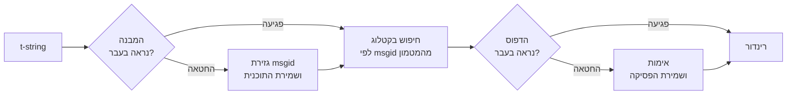

# איך זה עובד

שום דבר בעמוד הזה אינו נדרש כדי להשתמש בספרייה — [מדריך המבוא](tutorial.md)
וה[מדריך](guide.md) מכסים את זה. העמוד הזה בונה את הספרייה מחדש מעקרונות
ראשונים: מהי מחרוזת-t באמת, איך msgid נגזר ממנה, מה הופך תרגום לתקף, ואיך
המימוש גורם לכל הבדיקה הזו לעלות עשיריות מיקרו-שנייה. קראו אותו אם אתם
סקרנים, אם אתם רוצים לתרום, או אם בכוונתכם
[לממש את המוסכמה בעצמכם](#reimplementing-it).

## מהי מחרוזת-t באמת { #what-a-t-string-actually-is }

מחרוזת-f מפיקה `str`, ומפיקה אותו מיד — עד שפונקציה כלשהי מקבלת אותו, הערך
כבר עבר אינטרפולציה והמשפט חתום. למחרוזת-t ([PEP 750]) יש אותו תחביר ואותה
הערכה מיידית של הביטויים שלה, אבל היא מפיקה טיפוס אחר:

```pycon
>>> name = "Ada"
>>> f"Hello {name}!"
'Hello Ada!'
>>> t"Hello {name}!"
Template(strings=('Hello ', '!'), interpolations=(Interpolation('Ada', 'name', None, ''),))
```

אובייקט ה-`Template` הזה שומר את החלקים שצינור קטלוגים זקוק להם, עדיין
מופרדים:

```pycon
>>> template = t"Total: {amount:,.2f}"
>>> template.strings
('Total: ', '')
>>> template.interpolations[0].expression
'amount'
>>> template.interpolations[0].value
1234.5
>>> template.interpolations[0].format_spec
',.2f'
```

- `strings` — הטקסט המילולי סביב האינטרפולציות, לפי הסדר.
- לכל אינטרפולציה: ה**ביטוי** כטקסט מקור (`'amount'`), ה**ערך** המחושב שלו
  (`1234.5`), וכל **המרה** (`!r`) ו**מפרט פורמט** (`,.2f`) — נישאים בנפרד
  במקום להיות מוחלים.

כל מה שהספרייה הזו עושה הוא צריכה ממושמעת של המבנה הזה. השפה כבר ביצעה את
ההפרדה האחת שבינאום זקוק לה — טקסט סטטי בנפרד מערכים — ולכן הספרייה לעולם
לא מנתחת את קוד המקור שלכם ולעולם לא מנחשת היכן ערך יושב בתוך משפט. מה
שנותר הוא שלוש הכרעות: איך המבנה הופך למפתח קטלוג, מה תרגום של המפתח הזה
רשאי לומר, ואיך השניים מתרנדרים חזרה יחד.

## מתבנית ל-msgid { #from-template-to-msgid }

msgid — המפתח שקטלוג ממופתח לפיו — נגזר מהחלקים ה*סטטיים* של התבנית בלבד.
עברו על `strings` ועל `interpolations` בסדר המקור; מלטו בסוגריים מסולסלים
כל מקטע מילולי (`{` הופך ל-`{{`); ולכל אינטרפולציה פלטו אסימון `{name}`
אחד, כאשר `name` הוא טקסט הביטוי לאחר הסרת רווחים עוטפים. מתוך
`t"Total: {amount:,.2f}"`:

```text
strings         ('Total: ', '')
interpolations  expression 'amount'   conversion None   format_spec ',.2f'
msgid           'Total: {amount}'
```

לכל חלק בכלל הזה יש סיבה:

- **הביטוי חייב להיות שם פשוט** — `str.isidentifier()` מחזיר אמת והוא אינו
  מילה שמורה של Python.‏ `t"Hello {user.name}"` נדחית באתר הקריאה. msgid
  הוא *מפתח*: הוא חייב לצאת זהה בכל הרצה ובכל חילוץ, והוא נקרא על ידי
  מתרגמים, ולכן מציין המקום חייב להיות מילה יציבה ובעלת משמעות — לא מקטע
  קוד שמזמין את הקטלוג להפוך לשפת ביטויים.
- **ההמרה ומפרט הפורמט לעולם לא נכנסים ל-msgid.** מתרגמים לא צריכים לקרוא
  `:,.2f`, ואף תרגום לא אמור להיות מסוגל לשנות אותו. שווה להכיר את
  המסקנה הנגזרת: הידוק `:,.2f` ל-`:,.0f` בקוד שלכם לא משנה אף msgid, ולכן
  אינו מבטל אף תרגום באף שפה. מפתח הקטלוג עוקב אחרי *מה שהמשפט אומר*, לא
  אחרי אופן הפורמט של הערך.
- **שם חוזר חייב לחזור על הפורמט שלו במדויק.**
  `t"{x:.2f} vs {x:.3f}"` נדחית, כי שני המופעים מתמזגים לאותו אסימון `{x}`
  וה-msgid כבר לא היה יכול לומר באיזה פורמט רינדור אמור להשתמש.
- **ה-msgid הריק לעולם לא נדרש בקטלוג**, כי gettext שומר אותו לכותרת
  המטא-נתונים של הקטלוג עצמו. `t""` מרונדרת כ-`""` בלי לגעת בקטלוג.

מערכת הכללים המלאה, כולל מקרי קצה שהעמוד הזה מדלג עליהם, נמצאת
ב-[SPEC §2](https://github.com/yhay81/gettext-tstrings/blob/main/SPEC.md).

## מה תרגום רשאי לומר { #what-a-translation-may-say }

דפוס שחוזר מקטלוג מנותח באמצעות `string.Formatter` — אותו מנתח שבו
`str.format` משתמש. הדקדוק שאול בכוונה ולא מומצא: דפוס שהספרייה הזו מקבלת
הוא דפוס שהאקוסיסטם הרחב כבר מבין. אחר כך חלות שתי בדיקות.

**צורה:** כל שדה חייב להיות `{name}` חשוף. המרה או מפרט פורמט — כולל
`{name:}` הריק במפורש — נדחים, וכך גם שדות מיקומיים (`{0}`,‏ `{}`) ושמות
מרופדי רווחים (`{ name }`). האחרון חשוב יותר משהוא נראה: גם `str.format`
וגם `msgfmt` של GNU דוחים `{ name }`, ולכן קבלתו כאן הייתה מייצרת קטלוגים
ששום כלי אחר בשרשרת לא יכול לאמת.

**שמות:** קבוצת מצייני המקום של הדפוס מושווית לזו של המקור. בהודעת יחיד כל
שם מהמקור הוא *נדרש* ושום דבר אחר אינו *מותר*. בהודעת ריבוי שני הענפים
ממוזגים:

- **מותר** = איחוד השמות של שני הענפים
- **נדרש** = החיתוך שלהם

כך שמול `t"One file"` / `t"{n} files"`, השם `n` מותר בתרגום של כל אחת
מהצורות אך אינו נדרש באף אחת. האסימטריה הזו היא שמאפשרת למערכת הריבוי של
שפת היעד להיות שונה משל המקור — יפנית מתרגמת את שני הענפים בצורה אחת
שכנראה משתמשת ב-`{n}`; שפה עם יותר צורות מאנגלית עשויה להזדקק ל-`{n}`
בצורה שבה לאנגלית אין כלל.

שום דבר מזה אינו היפותטי: קטלוג הכרום של האתר הזה עצמו נושא את הודעת
הריבוי `Built {n} localized page` / `Built {n} localized pages` — שני
ענפים באנגלית — ומהדורות האתר מתרגמות את ההודעה האחת הזו לכל דבר שבין
צורה אחת לשש:

| קטלוג | צורות | התרגומים, לפי סדר הצורות |
| --- | --- | --- |
| יפנית | 1 | `ローカライズ済みページを{n}件ビルドしました` |
| טורקית | 2 | `{n} yerelleştirilmiş sayfa oluşturuldu` — פעמיים, זהה לחלוטין: שמות עצם בטורקית נשארים ביחיד אחרי מספר |
| איטלקית | 2 | `Generata {n} pagina localizzata` · `Generate {n} pagine localizzate` — הבינוני מותאם במין ובמספר |
| רוסית | 3 | `Собрана {n} локализованная страница` · `Собраны {n} локализованные страницы` · `Собрано {n} локализованных страниц` |
| פולנית | 3 | `Zbudowano {n} zlokalizowaną stronę` · `Zbudowano {n} zlokalizowane strony` · `Zbudowano {n} zlokalizowanych stron` |
| ערבית | 6 | ביניהן `تم إنشاء صفحة مترجمة واحدة ({n})` לאחד בדיוק ו-`تم إنشاء {n} صفحات مترجمة` לכמה |

כל שורה היא רשומה חיה ב-`i18n/*/LC_MESSAGES/site.po` של המאגר הזה,
המרונדרת על ידי [הבנייה הרב-לשונית](index.md) בכל שחרור — ובדיקה מצמידה את
הטבלה הזו לאותם קטלוגים, כך שהשניים אינם יכולים להיסחף זה מזה.

בתוך הגבולות האלה, שינוי סדר וחזרה אינם מוגבלים בכוונה. שניהם הכרחיים
דקדוקית בשפות אמיתיות, והגבלת מספרי המופעים הייתה דוחה תרגומים נכונים בלי
שום רווח אבטחתי: תרגום עדיין אינו יכול *להעריך* דבר, כי לא קיים שום נתיב
הערכה — מצייני מקום נדרשים לפי שם מתוך הערכים שכבר חושבו בתבנית, ולעולם
אינם מוזנים ל-`eval`, ל-`getattr` או ל-`str.format` עצמו.

## רינדור { #rendering }

רינדור של דפוס מאומת הוא הליכה על המקטעים שלו: פלטו כל חלק מילולי, ולכל
מציין מקום קחו את הערך שנלכד באינטרפולציה והחילו את ההמרה ומפרט הפורמט של
*צד המקור* — `format(convert(value, conversion), format_spec)`. תוך כדי
כך נשמרות שתי ערובות:

- **כל ערך ייחודי מפורמט לכל היותר פעם אחת בכל רינדור**, גם כשהתרגום חוזר
  על מציין מקום. חזרה משנה כמה פעמים התוצאה משובצת, לא כמה פעמים
  ה-`__format__` שלכם רץ.
- **בריבוי, מציין מקום קורא את הענף שהגדיר אותו.** שם שנוכח בשני הענפים
  קורא את הערך שנלכד בענף ששפת ה*מקור* בוחרת (`singular` כאשר `n == 1`,
  אחרת `plural`); שם ייחודי לענף קורא תמיד את הענף שלו, גם כשכללי הריבוי
  של שפת היעד הפכו אותו לזמין בצורה אחרת.

כשהאימות נכשל בזמן רינדור, התגובה מתפצלת לפי מי שסיפק את הדפוס. דפוס שהגיע
מ*קטלוג* מתדרדר בחן: נרשמת אזהרה אחת ומרונדר טקסט המקור, תוך שמירה על
החוזה של gettext שקטלוג פגום לעולם אינו מפיל את היישום
([המדריך מציג את שני המצבים](guide.md#what-happens-when-a-catalog-is-wrong)).
דפוס שהקורא העביר ישירות — `CompiledTemplate.render` — תמיד מרים חריגה, כי
אין טקסט מקור להתדרדר *אליו*; הסלחנות קיימת עבור חיפושי קטלוג, לא עבור
ארגומנטים.

## האבחון הוא חלק מהתכנון { #diagnostics-are-part-of-the-design }

שגיאת מציין מקום נוחתת בדרך כלל מול מתרגם, לא מול מתכנת, ולעתים קרובות
בקובץ שבו הבעיה בלתי נראית. לומר `{name} is missing` למי שרואה בדיוק את
התווים האלה בעורך שלו הוא מבוי סתום, ולכן ההודעות מחושבות לפי שלושה
כללים:

- שם המכיל **תו בלתי נראה** — רווח קשיח ששיטת קלט הפיקה, רווח ברוחב אפס —
  מודפס כשהתו הזה מוחלף בנקודת הקוד שלו, במקומו: `{<U+00A0>name}`. הקורא
  צריך לראות *היכן*.
- שם שהאותיות שלו **מערבבות מערכות כתב**, מקרה ההומוגליפים, מוצג פעמיים —
  פעם באופן קריא, פעם ממולט — כי `{nаme}` עם `а` קירילית אינו ניתן להבחנה
  מ-`{name}` בדפוס, והצורה הממולטת `(nаme)` היא האיות היחיד שמבדיל
  ביניהם.
- כל השאר מוצג **כפי שנכתב**. `{名前}` ו-`{café}` הם שמות רגילים; מילוטם
  היה משאיר את הקורא בלי יכולת למצוא למה הכוונה.

מאותו עיקרון, מציין מקום "חסר" ש*נראה* נוכח מקבל הסבר להיעדרו — סוגריים
מסולסלים ברוחב מלא משיטת קלט מזרח-אסייתית, הכפלת `{{name}}` מסבב מילוט
הלוך ושוב, השם שמחוץ לכל סוגריים.
[טבלת קריאת הכשלים במדריך](guide.md#reading-a-failure-message) מציגה כל
אחת מההודעות האלה כלשונה.

## הנתיב החם { #the-hot-path }

כל האמור לעיל קורה על כל מחרוזת מתורגמת שיישום מרנדר, ולכן המימוש בנוי
סביב רעיון אחד: **האימות לעולם אינו מדולג, ולכן האימות הוא מה שחייב להיות
במטמון.**



שלושה מטמונים, אחד לכל שלב:

- **תוכנית לכל מבנה של אתר קריאה.** ה-tuple‏ `strings` של התבנית — אובייקט
  שהמפרש כבר בנה — הוא מפתח המטמון, ולכן חיפוש אינו מקצה דבר. בפגיעה,
  הביטוי, ההמרה ומפרט הפורמט של כל אינטרפולציה עדיין מושווים לאלה
  שנרשמו: שני אתרי קריאה שחולקים טקסט מילולי אך נבדלים בפורמט
  (`t"{x:.2f}"` מול `t"{x:.3f}"`) אסור שיתנגשו, וההשוואה הזו היא מחיר
  השימוש במפתח שהמפרש מוסר בחינם.
- **פסיקה לכל דפוס.** בפעם הראשונה שקטלוג עונה בדפוס נתון, הוא מנותח
  ומאומת; התוצאה — תוכנית רינדור מהודרת, או רישום של אי-תקפות — נשמרת על
  התוכנית. כל רינדור מאוחר יותר של אותה הודעה מגיע אליה בחיפוש מילון
  אחד. גם דפוסים לא תקפים נזכרים, ולכן רשומת קטלוג שבורה מזהירה פעם אחת
  ולא בכל רינדור.
- **תוכנית ממוזגת לכל זוג ריבוי**, המחזיקה את קבוצות האיחוד/החיתוך כך
  שחשבון הענפים מתבצע פעם אחת לכל הודעה, לא פעם לכל קריאה.

כל מטמון תחום בגודלו, ואף אחד מהם אינו שומר *ערכים* שעברו אינטרפולציה —
רק מבנה סטטי וטקסט דפוסים. התוצאה, כפי שנמדדה על ידי
[`benchmarks/runtime.py`](https://github.com/yhay81/gettext-tstrings/blob/main/benchmarks/runtime.py):
בערך 0.4 מיקרו-שנייה להודעה עם שדה אחד, כולל בניית מחרוזת ה-t עצמה — פי
2.5 בקירוב מ-`gettext(...).format(...)` פשוט שאינו בודק דבר. ההערות בראש
[`core.py`](https://github.com/yhay81/gettext-tstrings/blob/main/src/gettext_tstrings/core.py)
מתעדות את המדידות הפרטניות שמאחורי הצורה הזו.

## לממש את זה מחדש { #reimplementing-it }

שום דבר מהאמור לעיל אינו ידע נסתר: המוסכמה כתובה כ-[spec v1](spec.md),
ו[חבילת התאימות](spec.md#conformance) הקריאה למכונה שלה מאפשרת למחלץ,
לתוסף IDE או למימוש בשפה אחרת לבדוק את עצמו מול כל כלל שהעמוד הזה הסביר.
המימוש הזה מריץ את החבילה בבדיקות של עצמו, וזה מה ששומר שהעמוד הזה, המפרט
והקוד לא ייסחפו זה מזה בשקט.

  [PEP 750]: https://peps.python.org/pep-0750/
