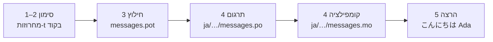

# מדריך המבוא

עמוד זה מוביל מתיקייה ריקה ועד תוכנית שמברכת ביפנית. חמישה שלבים, בלי
להניח שום ניסיון קודם עם gettext, וכל פקודה מוצגת עם הפלט שהיא באמת
מפיקה — כך שבכל שלב תדעו אם אתם בכיוון הנכון.

נדרש Python 3.14 ומעלה, כי מחרוזות-t הן תחביר חדש ב-3.14. יפנית היא שפת
היעד בדוגמה של עמוד זה, אבל שום דבר לא תלוי בבחירה הזו — אפשר להציב כל
שפה אחרת בשלב 4, שבו קוד השפה `ja` הוא הדבר היחיד שמציין אותה.

## 1. התקנה { #1-install }

```console
python -m pip install "gettext-tstrings[babel]"
```

התוספת `[babel]` מביאה איתה את [Babel], הכלי שאוסף את ההודעות שלכם לקובצי
קטלוג בשלב 3. זהו כלי לזמן הפיתוח בלבד: קוד הייצור מבצע רינדור באמצעות
הספרייה הסטנדרטית לבדה.

## 2. סימון הודעה בקוד { #2-mark-a-message-in-your-code }

צרו את `app.py`:

```python
from gettext_tstrings import tr

name = "Ada"
print(tr(t"Hello {name}"))
```

`t"Hello {name}"` נראית כמו מחרוזת-f, אבל התחילית `t` שומרת על הפרדה בין
הטקסט לערך במקום למזג אותם בו במקום. ההפרדה הזו היא מה שמאפשר ל-`tr()`
לחפש תרגום למשפט השלם `Hello {name}` ולהכניס את הערך רק אחר כך.

הריצו עכשיו:

```console
$ python app.py
Hello Ada
```

עדיין לא הותקנו תרגומים, ולכן טקסט המקור מוצג כפי שהוא. תוכנית שמשתמשת
בספרייה הזו לעולם אינה *דורשת* קטלוג כדי לרוץ — אנגלית (או כל שפת מקור
אחרת שלכם) היא הנסיגה לטקסט המקור המובנית.

## 3. חילוץ ההודעות { #3-extract-the-messages }

מתרגמים אינם קוראים את קוד המקור שלכם; קובץ קטן שנקרא **קטלוג** הוא
שנודד ביניכם לבינם. הצעד הראשון לקראתו הוא איסוף כל הודעה מסומנת מתוך
הקוד.

ספרו ל-Babel איך למצוא את ההודעות שלכם על ידי יצירת `babel.cfg`:

```ini
[gettext_tstrings: **.py]
encoding = utf-8
```

ואז חלצו לקובץ תבנית (`.pot`):

```console
$ mkdir -p locales
$ pybabel extract -F babel.cfg -c "Translators:" -o locales/messages.pot .
extracting messages from app.py (encoding="utf-8")
writing PO template file to locales/messages.pot
```

`locales/messages.pot` מכיל כעת רשומה אחת לכל הודעה:

```po
#. gettext-tstrings
#: app.py:4
#, python-brace-format
msgid "Hello {name}"
msgstr ""
```

`msgid` הוא המפתח שהקוד שלכם יחפש. ה-`msgstr` הריק הוא המקום שאליו נכנס
תרגום — אבל לא בקובץ הזה: קובץ `.pot` הוא *תבנית*, והשלב הבא מעתיק אותו
פעם אחת לכל שפה.

## 4. תרגום וקומפילציה { #4-translate-and-compile }

צרו את הקטלוג היפני מתוך התבנית:

```console
$ pybabel init -i locales/messages.pot -d locales -l ja
creating catalog locales/ja/LC_MESSAGES/messages.po based on locales/messages.pot
```

פתחו את `locales/ja/LC_MESSAGES/messages.po` ומלאו את ה-`msgstr`:

```po
msgid "Hello {name}"
msgstr "こんにちは {name}"
```

השאירו את `{name}` בדיוק כפי שהוא — מציין המקום הוא הדרך שבה הערך מוצא
את מקומו בתוך המשפט המתורגם, והתרגום חופשי להזיז אותו לכל מקום ששפת
היעד צריכה. בפרויקט אמיתי, קובץ ה-`.po` הזה הוא מה שמוסרים למתרגם או
מעלים לפלטפורמת תרגום; הפורמט זהה בשני המקרים.

קטלוגים נערכים כטקסט אך נטענים בצורה בינארית (`.mo`), ולכן יש לקמפל:

```console
$ pybabel compile -d locales
compiling catalog locales/ja/LC_MESSAGES/messages.po to locales/ja/LC_MESSAGES/messages.mo
```

הפקודה הזו היא גם רשת ביטחון. אילו התרגום היה פוגע במציין המקום —
`{nome}` במקום `{name}`, למשל — היא הייתה מסרבת לעבור:

```console
$ pybabel compile -d locales
error: locales/ja/LC_MESSAGES/messages.po:24: translation does not match the
source placeholders: {name} is missing; {nome} is not in the source message
1 errors encountered.
```

## 5. הרצה { #5-run-it }

כוונו את `app.py` אל הקטלוג המקומפל. לחצו על הסמנים כדי לראות מה כל
שורה עושה:

```python
import gettext

from gettext_tstrings import Translator

_ = Translator(gettext.translation("messages", localedir="locales", languages=["ja"]))  # (1)!

name = "Ada"
print(_(t"Hello {name}"))  # (2)!
```

1. הספרייה הסטנדרטית טוענת את קובץ ה-`.mo` המקומפל, ו-Translator קושר
   אותו לאובייקט שניתן לקריאה. `_` הוא השם המקובל ב-gettext עבור "תרגם
   את זה" — קצר, כי הוא מופיע על כל מחרוזת הפונה למשתמש. זו אותה פונקציה
   כמו `tr`, קשורה לקטלוג אחד.
2. ברגע הקריאה: הטקסט של מחרוזת-t הופך למפתח החיפוש `Hello {name}`,
   הקטלוג עונה `こんにちは {name}`, התשובה נבדקת מול מצייני המקום של
   המקור, ורק אז מוכנס הערך.

```console
$ python app.py
こんにちは Ada
```

זו כל הלולאה, וכדאי לראות אותה כתמונה אחת:



**סימון ← חילוץ ← תרגום ← קומפילציה ← הרצה.** כל שאר התוכן באתר הזה הוא
ליטוש של אחד מחמשת השלבים האלה.

## לאן ממשיכים { #where-next }

- [למה מחרוזות-t](comparison.md) — מפני מה העיצוב הזה מגן עליכם, בהשוואה
  ל-`%(name)s`, ל-`.format()` ולמחרוזות-`$`.
- [מדריך](guide.md) — צורות ריבוי, שפה לכל בקשה, מחרוזות דחויות, ומה
  קורה בזמן ריצה כשקטלוג בכל זאת שגוי.
- [בסביבת ייצור](workflow.md) — אותה לולאה בדיוק כפי שצוות מריץ אותה,
  שבוע אחר שבוע: עדכון קטלוגים, שערי CI ופלטפורמות תרגום.
- [חילוץ](extraction.md) — מדריך העזר המלא של `pybabel`: שמות פונקציות
  מותאמים אישית, מצב CI קפדני, והבדיקות ששומרות על הקטלוגים שלכם.

  [Babel]: https://babel.pocoo.org/
