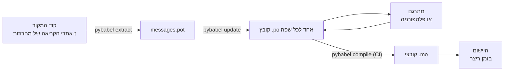

# בסביבת ייצור

[מדריך המבוא](tutorial.md) מריץ את הלולאה פעם אחת, לבד, על תוכנית עם הודעה
אחת. בפרויקט אמיתי הלולאה ממשיכה להסתובב: הודעות משתנות אחרי שכבר תורגמו,
המתרגם עובד במקום אחר ולפי לוח הזמנים שלו, וקטלוג מהודר נשלח עם כל גרסה.
העמוד הזה הוא הפרקטיקה הזו — מה נשאר במאגר, מה נודד, מה CI חייב לחסום,
והיכן זמן הריצה קושר שפה.

## צורת הפרויקט { #the-shape-of-a-project }

```text
myapp/
├── babel.cfg
├── pyproject.toml
├── src/
│   └── myapp/
└── locales/
    ├── messages.pot
    ├── ja/LC_MESSAGES/messages.po
    └── de/LC_MESSAGES/messages.po
```

הכניסו למאגר את `babel.cfg`, את תבנית ה-`.pot` ואת כל קובצי ה-`.po` — הם
המקורות של בניית התרגום, וה-diffs שלהם הם הדרך שבה אתם סוקרים שינויי
תרגום. קובצי ה-`.mo` המהודרים הם תוצרי בנייה: הפיקו אותם ב-CI או בזמן
האריזה במקום להכניס אותם למאגר, כך שקובץ `.po` וה-`.mo` שלו לעולם לא
יוכלו לחלוק זה על זה בשאלה מה נשלח.

לקובץ אחד יש תפקיד בכל כיוון: ה-`.pot` נושא את ההודעות שלכם *החוצה* אל
המתרגמים, וקובצי ה-`.po` מחזירים את התרגומים *בחזרה*. כל מה שלהלן הוא
התנועה בין שני אלה.



## המחזור שאחרי התרגום הראשון { #the-cycle-after-the-first-translation }

`pybabel init` של מדריך המבוא רץ פעם אחת לכל שפה, ולתמיד. מכאן ואילך
מחזור העבודה הוא **חילוץ ← עדכון ← תרגום ← הידור**, ובמרכזו
`pybabel update`, שמקפל תבנית טרייה אל תוך הקטלוגים הקיימים מבלי לזרוק
את התרגומים שכבר נמצאים בהם.

נניח שהברכה `Hello {name}` — שכבר תורגמה כ-`こんにちは {name}` — נוסחה
מחדש בקוד ל-`Welcome back, {name}`. חלצו ועדכנו:

```console
$ pybabel extract -F babel.cfg -c "Translators:" -o locales/messages.pot .
extracting messages from app.py (encoding="utf-8")
writing PO template file to locales/messages.pot
$ pybabel update -i locales/messages.pot -d locales
updating catalog locales/ja/LC_MESSAGES/messages.po based on locales/messages.pot
```

הקטלוג היפני מכיל כעת:

```po
#. gettext-tstrings
#: app.py:4
#, fuzzy, python-brace-format
msgid "Welcome back, {name}"
msgstr "こんにちは {name}"
```

Babel הבחין שה-msgid החדש דומה לאחד שהוסר וצימד אותו לתרגום הישן — אבל
סימן את הצמד **fuzzy**: ניחוש של מכונה הממתין לאדם. לדגל הזה יש שיניים.
`pybabel compile` **משמיט רשומות fuzzy מן ה-`.mo`**, כך שעד שמתרגם יאשר
את הצמד, היישום מרנדר את הטקסט האנגלי החדש ולא טקסט יפני מיושן:

```console
$ pybabel compile -d locales
compiling catalog locales/ja/LC_MESSAGES/messages.po to locales/ja/LC_MESSAGES/messages.mo
$ python app.py
Welcome back, Ada
```

הודעה שהשתנתה מידרדרת אפוא בדיוק כמו הודעה שבורה — אל שפת המקור, לעולם
לא אל תרגום מיושן. חלקו של המתרגם במחזור הוא לתקן את ה-`msgstr` ולמחוק
את דגל ה-`fuzzy`; ההידור הבא יאסוף את הרשומה.

!!! note "שמות מצייני המקום הם חלק מזהות ההודעה"

    ה-msgid הוא מפתח הקטלוג, ו*שמו* של מציין המקום נמצא בתוכו — ולכן
    שינוי שם של משתנה בקוד (מ-`name` ל-`user_name`) משנה את ה-msgid
    ושולח את התרגום שלו בכל שפה בחזרה דרך מחזור ה-fuzzy. תנו למשתנים
    המשולבים שמות שהם מילים שמתרגם יבין, ושנו את שמם רק מסיבה טובה.

    העיצוב הוא תמונת הראי: `!r` ו-`:.2f` [אינם חלק
    מה-msgid](internals.md#from-template-to-msgid), ולכן הידוק
    `{amount:,.2f}` ל-`{amount:,.0f}` אינו משנה דבר בשום קטלוג. ניסוח
    מחדש של ה*משפט*, כמובן, הוא שינוי אמיתי — וזהו המחזור שלמעלה.

## מה CI חוסם { #what-ci-gates }

שלושה כשלים שווים build אדום: הקטלוגים פיגרו אחרי הקוד, תרגום שבר מציין
מקום, או שרשומה שבורה חמקה אל זמן הריצה. צעד אחד לכל כשל:

```yaml
- run: pybabel extract -F babel.cfg -c "Translators:" -o locales/messages.pot .
- run: pybabel update -i locales/messages.pot -d locales --check
- run: pybabel compile -d locales
- run: pytest
```

`pybabel update --check` אינו כותב דבר ויוצא בקוד שונה מאפס כאשר קטלוג
אינו מעודכן ביחס לתבנית שחולצה זה עתה — השומר מפני מיזוג קוד שאיש לא
חילץ מחדש את הודעותיו. `pybabel compile` מריץ את בדיקות מצייני המקום גם
של Babel וגם של
[הבודק הרשום](extraction.md#your-existing-toolchain-validates-these-catalogs)
של החבילה הזו.

!!! bug "`--check` אינו יכול לחסום קטלוג שמשתמש בהקשרים"

    ב-Babel 2.18.0, `pybabel update --check` מדווח על **כל** קטלוג שמכיל
    `msgctxt` כלא מעודכן, בכל הרצה, לא משנה עד כמה הוא עדכני. ההשוואה
    עוברת דרך `Catalog.is_identical`, שמחפש כל הודעה לפי המפתח שתחתיו היא
    מאוחסנת — ובהודעה עם הקשר המפתח הזה הוא הצמד `(id, context)`, שאותו
    `Catalog.get` אינו מקבל. החיפוש חוזר ריק, והקטלוגים לעולם אינם יוצאים
    שווים:

    ```pycon
    >>> from babel.messages.catalog import Catalog
    >>> c = Catalog(locale="ja")
    >>> c.add("Guide", "ガイド", context="navigation")
    <Message 'Guide' (flags: [])>
    >>> c.is_identical(c)
    False
    ```

    לכן אם אתם משתמשים ב-`pgettext` או ב-`npgettext` בכלל — ופירוק
    דו-משמעות של הומונימים הוא כל סיבת קיומם — הצעד הזה כושל בדרך הגרועה
    מכול: תמיד אדום, ולכן הצוות מכבה אותו, ולכן שום דבר אינו חוסם פיגור.
    עד שהדבר יתוקן במעלה הזרם, השוו את קבוצות ההודעות בעצמכם. קריאת
    התבנית וכל קטלוג עם `babel.messages.pofile.read_po` והשוואת
    `{(m.context, m.id) for m in catalog if m.id}` היא כל הבדיקה, וזה מה
    ש[הבנייה של האתר הזה עצמו](index.md) עושה.

!!! danger "בדקו את קוד היציאה, לא את הלוג"

    `pybabel compile` מדווח על כל שגיאת מציין מקום, יוצא בקוד שונה מאפס
    — **וכותב את ה-`.mo` בכל זאת**. צינור שמהדר ואז מעתיק את `locales/`
    לתוך image ישלח את הקטלוג השבור אלא אם קוד היציאה השונה מאפס באמת
    עוצר אותו. לתת לצעד להכשיל את ה-build, כמו למעלה, הוא כל התיקון.

השורה האחרונה היא חבילת הבדיקות הרגילה שלכם, עם הרגל אחד נוסף: אי-שם
בתוכה, רנדרו לפחות הודעה אחת לכל שפה שנשלחת, דרך מתרגם קפדני —

```python
import gettext

from gettext_tstrings import Translator


def test_catalogs_render(language: str) -> None:
    translations = gettext.translation("messages", localedir="locales", languages=[language])
    _ = Translator(translations, strict=True)
    name = "Ada"
    assert _(t"Welcome back, {name}")
```

— מפני ש-`strict=True` [זורק חריגה במקום שבו הייצור היה נסוג בשקט לטקסט
המקור](guide.md#what-happens-when-a-catalog-is-wrong), ורינדור בזמן
ריצה הוא הבדיקה היחידה שרואה את הקטלוג בדיוק כפי שהיישום יראה אותו,
כולל ה-`.mo` וכל השאר.

## עבודה עם מתרגמים ופלטפורמות { #working-with-translators-and-platforms }

קובץ ה-`.po` הוא פורמט המעבר של עולם gettext כולו, וזו הסיבה שהספרייה
הזו עושה בו שימוש חוזר: להעביר תרגום הלאה פירושו להעביר קובץ, בין שהמקבל
הוא עמית עם עורך PO ובין שהוא פלטפורמת תרגום כמו Weblate או Crowdin.
שלושה דברים גורמים למסירה לעבוד היטב:

**אמרו למה ההודעה משמשת.** הערה בקוד נוסעת יחד עם ההודעה — זה מה שהדגל
`-c "Translators:"` אוסף:

```python
from gettext_tstrings import tr

name = "Ada"
# Translators: shown on the dashboard right after sign-in
print(tr(t"Welcome back, {name}"))
```

```po
#. Translators: shown on the dashboard right after sign-in
#. gettext-tstrings
#: app.py:5
#, python-brace-format
msgid "Welcome back, {name}"
msgstr ""
```

מתרגם רואה את ההערה הזו בעורך שלו, ליד ההודעה, בצדו האחר של העולם. זהו
מנוף האיכות הזול ביותר בכל תהליך העבודה. למילה שהיא הומונים של עצמה —
"Open" הכפתור לעומת "Open" המצב — תנו להודעה
[הקשר](guide.md#binding-a-catalog) באמצעות `pgettext`, שהופך
ל-`msgctxt` גלוי בקטלוג.

**תנו לפלטפורמה לאמת את מצייני המקום.** כל הודעה שחולצה ממחרוזת-t נושאת
את הדגל `python-brace-format`, והשורה האחת הזו היא שמדליקה בקרת איכות
של מצייני מקום בכלים שאינכם שולטים בהם — Weblate מתעדת את הבדיקה,
פלטפורמות מסחריות תולות את הבדיקות שלהן באותו דגל, ו-`msgfmt
--check-format` אוכף אותה בכל צינור GNU. הפרטים, ומה שהבודק המצורף תופס
מעבר להם, נמצאים
ב[עמוד החילוץ](extraction.md#your-existing-toolchain-validates-these-catalogs).

**סמכו על רשת הביטחון בדיוק עד היכן שהיא מגיעה.** מה שחוזר מפלטפורמה
הוא עדיין נתונים שנכנסים ל-build שלכם; שערי ה-CI שלמעלה הם מה שהופך את
"הפלטפורמה כנראה בדקה את זה" ל"זה לא יכול להישלח שבור".

## קשירת שפה בזמן ריצה { #binding-a-language-at-runtime }

כל מה שעד כה מייצר קטלוגים. ההחלטה שנותרה היא היכן היישום בוחר אחד מהם,
ויש לה תשובה כנה אחת: קשרו פעם אחת לכל *טווח חיים של שפה* — התהליך בכלי
שורת פקודה, הבקשה בשירות ווב.

=== "תהליך אחד, שפה אחת"

    כלי שורת פקודה או יישום שולחני קורא את סביבת המשתמש פעם אחת, בעת
    ההפעלה. אי-העברת `languages=` מניחה לספרייה התקנית לנהל משא ומתן
    מתוך `LANGUAGE`, `LC_ALL`, `LC_MESSAGES` ו-`LANG`; `fallback=True`
    מחזיר קטלוג ריק — טקסט המקור — במקום לזרוק חריגה כשאף אחד מהם אינו
    תואם קטלוג שאתם משלחים.

    ```python
    import gettext

    from gettext_tstrings import Translator

    _ = Translator(gettext.translation("messages", localedir="locales", fallback=True))

    name = "Ada"
    print(_(t"Welcome back, {name}"))
    ```

=== "Flask"

    יישום ווב מחליט לכל בקשה. טענו כל קטלוג פעם אחת בעת הייבוא, ואז
    קשרו את הקטלוג שנבחר במשא ומתן להקשר לפני שה-view רץ —
    [`set_translations`](guide.md#per-request-language) הוא מקומי
    להקשר, ולכן בקשות מקביליות בשפות שונות לעולם אינן רואות זו את
    הקשירה של זו.

    ```python
    import gettext

    from flask import Flask, request

    from gettext_tstrings import set_translations, tr

    LANGUAGES = ("en", "ja", "de")
    CATALOGS = {
        language: gettext.translation(
            "messages", localedir="locales", languages=[language], fallback=True
        )
        for language in LANGUAGES
    }

    app = Flask(__name__)


    @app.before_request
    def bind_language() -> None:
        language = request.accept_languages.best_match(LANGUAGES) or "en"
        set_translations(CATALOGS[language])


    @app.get("/")
    def home() -> str:
        name = "Ada"
        return tr(t"Welcome back, {name}")
    ```

=== "middleware של ASGI"

    תחת frameworks אסינכרוניים — FastAPI, Starlette וכל דבר אחר שהוא
    ASGI — עטפו את הבקשה
    ב-[`use_translations`](guide.md#per-request-language): הקשירה חיה
    ב-`ContextVar`, שהחלפת המשימות האסינכרונית משמרת לכל בקשה בנפרד.

    ```python
    import gettext

    from fastapi import FastAPI, Request

    from gettext_tstrings import tr, use_translations

    LANGUAGES = ("en", "ja", "de")
    CATALOGS = {
        language: gettext.translation(
            "messages", localedir="locales", languages=[language], fallback=True
        )
        for language in LANGUAGES
    }

    app = FastAPI()


    @app.middleware("http")
    async def bind_language(request: Request, call_next):
        language = negotiate_language(request.headers.get("accept-language"), LANGUAGES)
        with use_translations(CATALOGS[language]):
            return await call_next(request)
    ```

    `negotiate_language` מייצג את ניתוח ה-Accept-Language שלכם — רוב
    ה-frameworks או הסביבות שסביבם מספקים כזה; מה שחשוב כאן הוא הקשירה
    סביב `call_next`.

שני הרגלים בזמן ריצה משלימים את התמונה. מחרוזות שנוצרות בזמן ייבוא —
תווית של טופס, שם התצוגה של enum — אסור שילכדו את השפה שבמקרה הייתה
פעילה במהלך הייבוא; הגדירו אותן עם
[`lazy_gettext`](guide.md#deferred-translation) והן ירונדרו בשפה
הפעילה בזמן ה*שימוש*. ונתבו את הלוגר של `gettext_tstrings` למקום שבו
אדם מסתכל: האזהרות שלו הן המצב הסלחני המדווח על תרגום שחמק מכל שער,
שורה אחת לכל הודעה שבורה ולא שורה לכל רינדור.

## שילוח { #shipping }

סביבת הייצור צריכה את החבילה, את קובצי ה-`.mo`, ותו לא. Babel היא תלות
של פיתוח ושל CI — השאירו את `gettext-tstrings[babel]` מחוץ ל-image של
הייצור והתקינו שם את החבילה החשופה; הרינדור רץ על הספרייה התקנית לבדה.
הדרו את הקטלוגים באותו build שמייצר את הארטיפקט שאתם פורסים, כך שקובצי
ה-`.mo` שבתוכו הם בדיוק קובצי ה-`.po` שנסקרו, ושום דבר שהודר על המחשב
הנייד של מישהו לעולם לא נשלח.

לפני שחרור גרסה, זו רשימת הביקורת שאליה מצטמצם העמוד הזה:

- `pybabel update --check` עובר — שום הודעה לא השתנתה בלי שהקטלוגים
  שמעו על כך.
- `pybabel compile` חוסם את ה-build לפי קוד היציאה שלו.
- רשומות ה-`fuzzy` שנותרו הן מכוונות — כל אחת מהן מרונדרת כטקסט המקור
  עד שמתרגם יאשר אותה.
- חבילת הבדיקות מרנדרת כל שפה שנשלחת פעם אחת עם `strict=True`.
- ארטיפקט הייצור מכיל קובצי `.mo` ולא מכיל Babel.
- הלוגר של `gettext_tstrings` מנותב אל הניטור.

## לאן ממשיכים { #where-next }

- [חילוץ](extraction.md) — עמוד העיון לחצי הכלים של העמוד הזה: אפשרויות
  מיפוי, שמות פונקציות מותאמים אישית, מצב קפדני, וכל בודק.
- [מדריך](guide.md) — החצי של זמן הריצה: צורות ריבוי, הקשרים, מחרוזות
  דחויות, ומצבי הכשל בפירוט.
- [איך זה עובד](internals.md) — למה ה-msgid נראה כפי שהוא נראה, ומה
  האימות באמת בודק.
