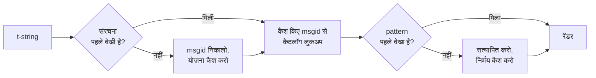

# यह कैसे काम करता है

इस पेज की कोई भी बात लाइब्रेरी के उपयोग के लिए आवश्यक नहीं है — वह
[ट्यूटोरियल](tutorial.md) और [गाइड](guide.md) कवर करते हैं। यह पेज इसकी
बजाय लाइब्रेरी को पहले सिद्धांतों से दोबारा गढ़ता है: t-string वास्तव में
क्या है, उससे msgid कैसे निकलता है, अनुवाद को वैध क्या बनाता है, और
क्रियान्वयन इस सारी जाँच की लागत माइक्रोसेकंड के दसवें हिस्सों तक कैसे
पहुँचाता है। इसे पढ़ें यदि आप जिज्ञासु हैं, योगदान देना चाहते हैं, या
[परिपाटी को स्वयं लागू करने](#reimplementing-it) की योजना रखते हैं।

## t-string वास्तव में क्या है { #what-a-t-string-actually-is }

f-string एक `str` उत्पन्न करता है, और तुरंत उत्पन्न करता है — किसी फ़ंक्शन
तक पहुँचते-पहुँचते value इंटरपोलेट हो चुकी है और वाक्य सील हो चुका है।
t-string ([PEP 750]) का सिंटैक्स वही है और एक्सप्रेशनों का उतना ही तुरंत
मूल्यांकन भी, पर वह एक अलग type उत्पन्न करता है:

```pycon
>>> name = "Ada"
>>> f"Hello {name}!"
'Hello Ada!'
>>> t"Hello {name}!"
Template(strings=('Hello ', '!'), interpolations=(Interpolation('Ada', 'name', None, ''),))
```

वह `Template` ऑब्जेक्ट कैटलॉग pipeline को चाहिए वे सारे हिस्से, अब भी
अलग-अलग, सँजोए रखता है:

```pycon
>>> template = t"Total: {amount:,.2f}"
>>> template.strings
('Total: ', '')
>>> template.interpolations[0].expression
'amount'
>>> template.interpolations[0].value
1234.5
>>> template.interpolations[0].format_spec
',.2f'
```

- `strings` — इंटरपोलेशनों के आस-पास का शाब्दिक टेक्स्ट, क्रम में।
- हर इंटरपोलेशन के लिए: स्रोत टेक्स्ट के रूप में **expression** (`'amount'`),
  उसकी मूल्यांकित **value** (`1234.5`), और कोई **conversion** (`!r`) तथा
  **format spec** (`,.2f`) — लागू करने की बजाय अलग-अलग ढोए हुए।

यह लाइब्रेरी जो कुछ करती है, वह उस संरचना का अनुशासित उपभोग है। भाषा ने
i18n को चाहिए वह एक विभाजन — स्थिर टेक्स्ट values से अलग — पहले ही कर दिया,
इसलिए लाइब्रेरी कभी आपका सोर्स कोड parse नहीं करती और कभी अनुमान नहीं लगाती
कि वाक्य के भीतर value कहाँ बैठी है। बचते हैं तीन निर्णय: संरचना कैटलॉग key
कैसे बनती है, उस key का अनुवाद क्या कह सकता है, और दोनों वापस साथ कैसे
रेंडर होते हैं।

## टेम्पलेट से msgid तक { #from-template-to-msgid }

msgid — वह key जिस पर कैटलॉग अनुक्रमित है — टेम्पलेट के केवल *स्थिर* हिस्सों
से व्युत्पन्न होता है। `strings` और `interpolations` पर स्रोत क्रम में चलें;
हर शाब्दिक खंड को brace-escape करें (`{` बनता है `{{`); हर इंटरपोलेशन के लिए
एक `{name}` token निकालें, जहाँ `name` एक्सप्रेशन का टेक्स्ट है, आस-पास का
whitespace हटाकर। `t"Total: {amount:,.2f}"` से:

```text
strings         ('Total: ', '')
interpolations  expression 'amount'   conversion None   format_spec ',.2f'
msgid           'Total: {amount}'
```

उस नियम के हर हिस्से का एक कारण है:

- **एक्सप्रेशन को सादा नाम होना ही चाहिए** — `str.isidentifier()` सत्य हो
  और वह Python keyword न हो। `t"Hello {user.name}"` कॉल स्थल पर ही अस्वीकृत
  है। msgid एक *key* है: उसे हर रन और हर एक्सट्रैक्शन में एक जैसा निकलना है,
  और उसे अनुवादक पढ़ते हैं, इसलिए placeholder को स्थिर, अर्थपूर्ण शब्द होना
  चाहिए — कोई कोड-टुकड़ा नहीं जो कैटलॉग को एक्सप्रेशन भाषा बनने का निमंत्रण
  दे।
- **conversion और format spec कभी msgid में नहीं जाते।** अनुवादकों को
  `:,.2f` नहीं पढ़ना चाहिए, और कोई अनुवाद उसे बदल नहीं पाना चाहिए। इसका
  उपफल जानने लायक़ है: अपने कोड में `:,.2f` को कसकर `:,.0f` कर देना कोई
  msgid नहीं बदलता, इसलिए किसी भी भाषा का कोई अनुवाद अमान्य नहीं करता।
  कैटलॉग key इस पर नज़र रखता है कि *वाक्य क्या कहता है*, इस पर नहीं कि
  value कैसे फ़ॉर्मैट होती है।
- **दोहराए गए नाम को अपनी फ़ॉर्मैटिंग हूबहू दोहरानी होगी।**
  `t"{x:.2f} vs {x:.3f}"` अस्वीकृत है, क्योंकि दोनों उपस्थितियाँ एक ही
  `{x}` token में सिमट जाती हैं और msgid फिर यह नहीं बता पाता कि रेंडर किस
  फ़ॉर्मैटिंग का उपयोग करे।
- **खाली msgid कभी नहीं खोजा जाता**, क्योंकि gettext उसे कैटलॉग के अपने
  metadata header के लिए आरक्षित रखता है। `t""` कैटलॉग को छुए बिना `""` के
  रूप में रेंडर होता है।

पूरा नियम-समुच्चय, उन किनारे के मामलों समेत जो यह पेज छोड़ देता है,
[SPEC §2](https://github.com/yhay81/gettext-tstrings/blob/main/SPEC.md) है।

## अनुवाद क्या कह सकता है { #what-a-translation-may-say }

कैटलॉग से लौटता pattern `string.Formatter` से parse होता है — वही parser जो
`str.format` उपयोग करता है। व्याकरण जान-बूझकर गढ़ने की बजाय उधार लिया गया
है: जो pattern यह लाइब्रेरी स्वीकार करती है, उसे व्यापक इकोसिस्टम पहले से
समझता है। फिर दो जाँचें लागू होती हैं।

**आकार:** हर field एक नंगा `{name}` होना चाहिए। conversion या format spec —
स्पष्ट रूप से खाली `{name:}` समेत — अस्वीकृत है, जैसे positional fields
(`{0}`, `{}`) और whitespace-गद्देदार नाम (`{ name }`) भी। अंतिम वाला जितना
दिखता है उससे ज़्यादा मायने रखता है: `str.format` और GNU `msgfmt` दोनों
`{ name }` को अस्वीकार करते हैं, इसलिए उसे यहाँ स्वीकारना ऐसे कैटलॉग पैदा
करता जिन्हें श्रृंखला का कोई और टूल सत्यापित नहीं कर सकता।

**नाम:** pattern के placeholder समुच्चय की तुलना स्रोत से होती है। एकवचन
संदेश के लिए हर स्रोत नाम *आवश्यक* है और उसके सिवा कुछ *अनुमत* नहीं।
बहुवचन संदेश के लिए दोनों शाखाएँ मिला दी जाती हैं:

- **अनुमत** = दोनों शाखाओं के नामों का union
- **आवश्यक** = उनका intersection

तो `t"One file"` / `t"{n} files"` के विरुद्ध नाम `n` किसी भी रूप के अनुवाद
में अनुमत है पर किसी में आवश्यक नहीं। यही विषमता लक्ष्य भाषा की बहुवचन
प्रणाली को स्रोत से भिन्न होने देती है — जापानी दोनों शाखाओं का अनुवाद एक
रूप से करती है जो संभवतः `{n}` उपयोग करता है; अंग्रेज़ी से अधिक रूपों वाली
भाषा को `{n}` वहाँ चाहिए हो सकता है जहाँ अंग्रेज़ी में कोई रूप ही नहीं।

इनमें से कुछ भी काल्पनिक नहीं: इस साइट का अपना chrome कैटलॉग बहुवचन संदेश
`Built {n} localized page` / `Built {n} localized pages` — दो अंग्रेज़ी
शाखाएँ — रखता है, और साइट के संस्करण उसी एक संदेश का अनुवाद एक से लेकर छह
रूपों तक में करते हैं:

| कैटलॉग | रूप | अनुवाद, रूप-क्रम में |
| --- | --- | --- |
| जापानी | 1 | `ローカライズ済みページを{n}件ビルドしました` |
| तुर्की | 2 | `{n} yerelleştirilmiş sayfa oluşturuldu` — दो बार, बिल्कुल एक जैसा: संख्यावाचक के बाद तुर्की संज्ञाएँ एकवचन ही रहती हैं |
| इतालवी | 2 | `Generata {n} pagina localizzata` · `Generate {n} pagine localizzate` — कृदंत लिंग और वचन में मेल खाता है |
| लातवियाई | 3 | `Izveidota {n} lokalizēta lapa` · `Izveidotas {n} lokalizētas lapas` · `Izveidots {n} lokalizētu lapu` — तीसरा रूप **केवल शून्य** के लिए है |
| रूसी | 3 | `Собрана {n} локализованная страница` · `Собраны {n} локализованные страницы` · `Собрано {n} локализованных страниц` |
| पोलिश | 3 | `Zbudowano {n} zlokalizowaną stronę` · `Zbudowano {n} zlokalizowane strony` · `Zbudowano {n} zlokalizowanych stron` |
| स्लोवेनियाई | 4 | `Zgrajena {n} lokalizirana stran` · `Zgrajeni {n} lokalizirani strani` · `Zgrajene {n} lokalizirane strani` · `Zgrajenih {n} lokaliziranih strani` — दूसरा **द्विवचन** है, ठीक दो के लिए |
| आयरिश | 5 | `Tógadh {n} leathanach logánaithe` · `Tógadh {n} leathanaigh logánaithe` — एक, दो, 3–6, 7–10, और शेष; धातु बदलती है पर *leathanach* `l` से शुरू होता है, जिस पर आयरिश का कोई भी आदि-विकार लिखा नहीं जाता, इसलिए कई रूप आपस में मिल जाते हैं |
| अरबी | 6 | जिनमें ठीक एक के लिए `تم إنشاء صفحة مترجمة واحدة ({n})` और कुछेक के लिए `تم إنشاء {n} صفحات مترجمة` शामिल हैं |

हर पंक्ति इस रिपॉज़िटरी की `i18n/*/LC_MESSAGES/site.po` में एक जीवित
प्रविष्टि है, जिसे [बहुभाषी बिल्ड](index.md) हर रिलीज़ पर रेंडर करता है —
और एक टेस्ट इस तालिका को उन कैटलॉगों से बाँधे रखता है, ताकि दोनों कभी अलग
न हो सकें।

इन सीमाओं के भीतर, पुनर्क्रमण और दोहराव जान-बूझकर अनियंत्रित हैं। दोनों
वास्तविक भाषाओं में व्याकरण की दृष्टि से आवश्यक हैं, और उपस्थिति की गिनती
सीमित करना सही अनुवादों को बिना किसी सुरक्षा-लाभ के अस्वीकार करता: अनुवाद
अब भी कुछ *मूल्यांकित* नहीं कर सकता, क्योंकि मूल्यांकन का कोई रास्ता ही
नहीं है — placeholders टेम्पलेट की पहले से गणना की हुई values में नाम से
खोजे जाते हैं, कभी `eval`, `getattr` या स्वयं `str.format` को नहीं दिए
जाते।

## रेंडरिंग { #rendering }

सत्यापित pattern को रेंडर करना उसके खंडों पर एक चहलक़दमी है: हर शाब्दिक
हिस्सा निकालें, और हर placeholder के लिए इंटरपोलेशन की कैप्चर की हुई value
लेकर *स्रोत-पक्ष* का conversion और format spec लागू करें —
`format(convert(value, conversion), format_spec)`। यह करते हुए दो गारंटियाँ
निभाई जाती हैं:

- **हर विशिष्ट value प्रति रेंडर अधिकतम एक बार फ़ॉर्मैट होती है**, तब भी जब
  अनुवाद placeholder दोहराता हो। दोहराव यह बदलता है कि परिणाम कितनी बार
  डाला जाता है, यह नहीं कि आपका `__format__` कितनी बार चलता है।
- **बहुवचन में placeholder उसी शाखा को पढ़ता है जिसने उसे परिभाषित किया।**
  दोनों शाखाओं में मौजूद नाम वह value पढ़ता है जिसे *स्रोत* भाषा द्वारा
  चुनी गई शाखा ने कैप्चर किया (`n == 1` पर `singular`, अन्यथा `plural`);
  शाखा-विशिष्ट नाम हमेशा अपनी ही शाखा पढ़ता है, तब भी जब लक्ष्य भाषा के
  बहुवचन नियमों ने उसे किसी और रूप में उपलब्ध कर दिया हो।

रेंडर के समय सत्यापन विफल होने पर प्रतिक्रिया इस आधार पर बँटती है कि pattern
किसने दिया। जो pattern *कैटलॉग* से निकला, वह degrade होता है: एक चेतावनी
लॉग करो और स्रोत टेक्स्ट रेंडर करो — gettext का यह अनुबंध निभाते हुए कि
टूटा हुआ कैटलॉग एप्लिकेशन को कभी नहीं गिराता
([गाइड दोनों मोड दिखाती है](guide.md#what-happens-when-a-catalog-is-wrong))।
जो pattern कॉलर ने सीधे दिया — `CompiledTemplate.render` — वह हमेशा
exception उठाता है, क्योंकि degrade होने के लिए कोई स्रोत टेक्स्ट है ही
नहीं; उदारता कैटलॉग लुकअप के लिए है, arguments के लिए नहीं।

## निदान भी डिज़ाइन का हिस्सा हैं { #diagnostics-are-part-of-the-design }

placeholder की त्रुटि प्रायः प्रोग्रामर नहीं, अनुवादक के सामने पहुँचती है,
और अक्सर ऐसी फ़ाइल में जहाँ समस्या अदृश्य है। जो व्यक्ति वे सटीक अक्षर अपने
एडिटर में देख सकता है, उससे `{name} is missing` कहना बंद गली है, इसलिए
संदेश तीन नियमों से गणना किए जाते हैं:

- जिस नाम में **अदृश्य अक्षर** है — input method का पैदा किया no-break
  space, कोई zero-width space — वह उस अक्षर की जगह उसका code point रखकर,
  उसी स्थान पर छापा जाता है: `{<U+00A0>name}`। पाठक को देखना है कि *कहाँ*।
- जिस नाम के अक्षर **लिपियाँ मिलाते हैं** — homoglyph का मामला — वह दो बार
  दिखाया जाता है, एक बार पठनीय, एक बार escaped — क्योंकि सिरिलिक `а` वाला
  `{nаme}` छपाई में `{name}` से अभेद्य है, और escaped रूप `(nаme)` ही वह
  इकलौती वर्तनी है जो दोनों को अलग बताती है।
- बाक़ी सब **जैसा लिखा गया वैसा** दिखाया जाता है। `{名前}` और `{café}`
  साधारण नाम हैं; उन्हें escape करना पाठक को यह ढूँढने में असमर्थ छोड़ता कि
  आशय क्या था।

इसी सिद्धांत पर, जो "ग़ायब" placeholder मौजूद *दिखता* है, उसकी अनुपस्थिति की
व्याख्या मिलती है — पूर्वी एशियाई input method के full-width braces, escaping
के चक्कर से आया `{{name}}` दोहरीकरण, या braces के बाहर पड़ा नाम।
अनुवादकों के लिए लिखी गई
[विफलता-पठन तालिका](translators.md#reading-a-failure-message) इनमें से हर
संदेश को हूबहू दिखाती है।

## हॉट पाथ { #the-hot-path }

ऊपर का सब कुछ एप्लिकेशन के हर अनूदित स्ट्रिंग पर होता है, इसलिए
क्रियान्वयन एक विचार के इर्द-गिर्द बना है: **सत्यापन कभी नहीं छोड़ा जाता,
इसलिए कैश वही होना चाहिए जो सत्यापन है।**



तीन कैश, हर चरण का एक:

- **प्रति कॉल-स्थल संरचना एक योजना।** टेम्पलेट का `strings` tuple — एक
  ऑब्जेक्ट जिसे interpreter पहले ही बना चुका है — कैश key है, इसलिए लुकअप
  कुछ allocate नहीं करता। hit पर भी हर इंटरपोलेशन के expression, conversion
  और format spec की दर्ज किए हुओं से तुलना होती है: शाब्दिक टेक्स्ट साझा
  करने वाले पर फ़ॉर्मैटिंग में भिन्न दो कॉल स्थल (`t"{x:.2f}"` बनाम
  `t"{x:.3f}"`) आपस में टकराने नहीं चाहिए, और वह तुलना interpreter से
  मुफ़्त मिली key उपयोग करने की क़ीमत है।
- **प्रति pattern एक निर्णय।** कैटलॉग जब पहली बार किसी pattern से उत्तर
  देता है, वह parse और सत्यापित होता है; परिणाम — एक संकलित रेंडर योजना, या
  अमान्यता का रिकॉर्ड — योजना पर रखा जाता है। उस संदेश का हर बाद का रेंडर
  उस तक एक dictionary लुकअप में पहुँचता है। अमान्य patterns भी याद रखे जाते
  हैं, इसीलिए टूटी हुई कैटलॉग एंट्री हर रेंडर पर नहीं, एक बार चेतावनी देती
  है।
- **प्रति बहुवचन-जोड़ी एक मिली हुई योजना**, जो union/intersection समुच्चय
  रखती है, ताकि शाखाओं का अंकगणित प्रति संदेश एक बार हो, प्रति कॉल नहीं।

हर कैश सीमाबद्ध है, और कोई भी इंटरपोलेट की गई *values* नहीं रखता — केवल
स्थिर संरचना और pattern का टेक्स्ट। परिणाम, जिसे
[`benchmarks/runtime.py`](https://github.com/yhay81/gettext-tstrings/blob/main/benchmarks/runtime.py)
से मापा गया: एक-field वाले संदेश के लिए लगभग 0.4 µs, t-string के निर्माण
समेत — कुछ न जाँचने वाले सादे `gettext(...).format(...)` का लगभग 2.5×।
[`core.py`](https://github.com/yhay81/gettext-tstrings/blob/main/src/gettext_tstrings/core.py)
के शीर्ष की टिप्पणी उस आकार के पीछे के अलग-अलग माप दर्ज करती है।

## इसे फिर से लागू करना { #reimplementing-it }

ऊपर का कुछ भी गुप्त विद्या नहीं है: परिपाटी [spec v1](spec.md) के रूप में
लिखी हुई है, और उसका मशीन-पठनीय [कन्फ़ॉर्मन्स सुइट](spec.md#conformance)
किसी एक्सट्रैक्टर, IDE plugin, या किसी और भाषा के क्रियान्वयन को इस पेज पर
समझाए हर नियम के विरुद्ध स्वयं को जाँचने देता है। यह क्रियान्वयन उस सुइट को
अपने ही परीक्षणों में चलाता है — यही वह चीज़ है जो इस पेज, spec और कोड को
चुपचाप अलग-अलग बहक जाने से रोकती है।

  [PEP 750]: https://peps.python.org/pep-0750/
