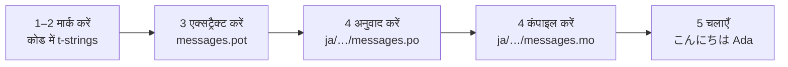

# ट्यूटोरियल

यह पेज खाली डायरेक्टरी से शुरू होकर जापानी में अभिवादन करने वाले प्रोग्राम
तक जाता है। पाँच चरण, gettext का कोई अनुभव अपेक्षित नहीं, और हर कमांड उसी
आउटपुट के साथ दिखाई गई है जो वह वास्तव में देती है — ताकि हर चरण पर आप जान
सकें कि आप सही राह पर हैं या नहीं।

आपको Python 3.14 या नया चाहिए, क्योंकि t-strings 3.14 का नया सिंटैक्स हैं।
जापानी इस पेज का उदाहरण-लक्ष्य है, पर इस चुनाव पर कुछ निर्भर नहीं करता —
चरण 4 में कोई भी भाषा रख लें; वहाँ locale कोड `ja` ही एकमात्र चीज़ है जो
उसका नाम लेती है।

## 1. इंस्टॉल { #1-install }

```console
python -m pip install "gettext-tstrings[babel]"
```

`[babel]` extra के साथ [Babel] आता है — वह टूल जो चरण 3 में आपके संदेशों को
कैटलॉग फ़ाइलों में इकट्ठा करता है। यह विकास-कालीन टूल है: प्रोडक्शन कोड
केवल मानक लाइब्रेरी से रेंडर करता है।

## 2. अपने कोड में एक संदेश मार्क करें { #2-mark-a-message-in-your-code }

`app.py` बनाएँ:

```python
from gettext_tstrings import tr

name = "Ada"
print(tr(t"Hello {name}"))
```

`t"Hello {name}"` देखने में f-string जैसा है, लेकिन `t` उपसर्ग टेक्स्ट और
value को उसी क्षण मिला देने की बजाय अलग-अलग रखता है। यही अलगाव `tr()` को यह
सुविधा देता है कि वह पूरे वाक्य `Hello {name}` का अनुवाद खोजे और value को
बाद में जोड़े।

अब इसे चलाएँ:

```console
$ python app.py
Hello Ada
```

अभी कोई अनुवाद इंस्टॉल नहीं है, इसलिए स्रोत टेक्स्ट ज्यों का त्यों रेंडर
होता है। इस लाइब्रेरी का उपयोग करने वाले प्रोग्राम को चलने के लिए कैटलॉग
कभी *अनिवार्य* नहीं होता — अंग्रेज़ी (या जो भी आपकी स्रोत भाषा हो) अंतर्निहित
फ़ॉलबैक है।

## 3. संदेशों को एक्सट्रैक्ट करें { #3-extract-the-messages }

अनुवादक आपका सोर्स कोड नहीं पढ़ते; आपके और उनके बीच **कैटलॉग** नाम की एक
छोटी फ़ाइल आती-जाती है। उसकी ओर पहला क़दम है कोड में मार्क किए हर संदेश को
इकट्ठा करना।

`babel.cfg` बनाकर Babel को बताएँ कि आपके संदेश कहाँ मिलेंगे:

```ini
[gettext_tstrings: **.py]
encoding = utf-8
```

फिर एक टेम्पलेट फ़ाइल (`.pot`) में एक्सट्रैक्ट करें:

```console
$ mkdir -p locales
$ pybabel extract -F babel.cfg -c "Translators:" -o locales/messages.pot .
extracting messages from app.py (encoding="utf-8")
writing PO template file to locales/messages.pot
```

अब `locales/messages.pot` में प्रति संदेश एक एंट्री है:

```po
#. gettext-tstrings
#: app.py:4
#, python-brace-format
msgid "Hello {name}"
msgstr ""
```

`msgid` वह key है जिसे आपका कोड खोजेगा। खाली `msgstr` वह जगह है जहाँ अनुवाद
जाता है — पर इस फ़ाइल में नहीं: `.pot` एक *टेम्पलेट* है, और अगला चरण उसे हर
भाषा के लिए एक बार कॉपी करता है।

## 4. अनुवाद और कंपाइल करें { #4-translate-and-compile }

टेम्पलेट से जापानी कैटलॉग बनाएँ:

```console
$ pybabel init -i locales/messages.pot -d locales -l ja
creating catalog locales/ja/LC_MESSAGES/messages.po based on locales/messages.pot
```

`locales/ja/LC_MESSAGES/messages.po` खोलें और `msgstr` भरें:

```po
msgid "Hello {name}"
msgstr "こんにちは {name}"
```

`{name}` को हूबहू वैसा ही रखें — placeholder ही वह ज़रिया है जिससे value
अनूदित वाक्य में अपनी जगह पाती है, और अनुवाद उसे वहाँ ले जाने के लिए
स्वतंत्र है जहाँ लक्ष्य भाषा को चाहिए। वास्तविक प्रोजेक्ट में यही `.po`
फ़ाइल आप अनुवादक को सौंपते हैं या अनुवाद प्लेटफ़ॉर्म पर अपलोड करते हैं;
फ़ॉर्मैट दोनों स्थितियों में एक ही है।

कैटलॉग टेक्स्ट के रूप में संपादित होते हैं पर बाइनरी रूप (`.mo`) में लोड
होते हैं, इसलिए कंपाइल करें:

```console
$ pybabel compile -d locales
compiling catalog locales/ja/LC_MESSAGES/messages.po to locales/ja/LC_MESSAGES/messages.mo
```

यह कमांड एक सुरक्षा जाल भी है। अगर अनुवाद ने placeholder को नुक़सान पहुँचाया
होता — मान लीजिए `{name}` की जगह `{nome}` — तो यह पास होने से इनकार कर देती:

```console
$ pybabel compile -d locales
error: locales/ja/LC_MESSAGES/messages.po:24: translation does not match the
source placeholders: {name} is missing; {nome} is not in the source message
1 errors encountered.
```

## 5. चलाएँ { #5-run-it }

`app.py` को कंपाइल किए गए कैटलॉग की ओर इंगित करें। हर पंक्ति क्या कर रही
है, यह देखने के लिए मार्करों पर क्लिक करें:

```python
import gettext

from gettext_tstrings import Translator

_ = Translator(gettext.translation("messages", localedir="locales", languages=["ja"]))  # (1)!

name = "Ada"
print(_(t"Hello {name}"))  # (2)!
```

1. मानक लाइब्रेरी कंपाइल किए गए `.mo` को लोड करती है, और `Translator` उसे
   एक callable से बाँध देता है। `_` gettext में "इसका अनुवाद करो" का
   पारंपरिक नाम है — छोटा इसलिए, क्योंकि यह हर उपयोगकर्ता-सम्मुख स्ट्रिंग
   पर आता है। यह वही फ़ंक्शन है जो `tr` है, बस एक कैटलॉग से बँधा हुआ।
2. कॉल के समय: t-string का टेक्स्ट लुकअप key `Hello {name}` बनता है, कैटलॉग
   उत्तर देता है `こんにちは {name}`, उत्तर की जाँच स्रोत placeholders के
   विरुद्ध होती है, और उसके बाद ही value अंदर रखी जाती है।

```console
$ python app.py
こんにちは Ada
```

बस, यही पूरा लूप है — और इसे एक चित्र के रूप में देखना उपयोगी है:



**मार्क → एक्सट्रैक्ट → अनुवाद → कंपाइल → रन।** इस साइट पर बाक़ी सब कुछ
इन्हीं पाँच चरणों में से किसी एक का परिष्कार है।

## आगे कहाँ जाएँ { #where-next }

- [t-strings क्यों](comparison.md) — `%(name)s`, `.format()` और `$`-strings
  की तुलना में यह डिज़ाइन आपको किन चीज़ों से बचाता है।
- [गाइड](guide.md) — बहुवचन, प्रति-request भाषाएँ, deferred strings, और
  कैटलॉग फिर भी ग़लत हो तो रनटाइम पर क्या होता है।
- [प्रोडक्शन में](workflow.md) — यही लूप जैसे कोई टीम हफ़्ते-दर-हफ़्ते
  चलाती है: कैटलॉग अपडेट, CI गेट, और अनुवाद प्लेटफ़ॉर्म।
- [एक्सट्रैक्शन](extraction.md) — `pybabel` का पूरा संदर्भ: अपने फ़ंक्शन
  नाम, सख़्त CI मोड, और आपके कैटलॉग की रखवाली करने वाली जाँचें।

  [Babel]: https://babel.pocoo.org/
