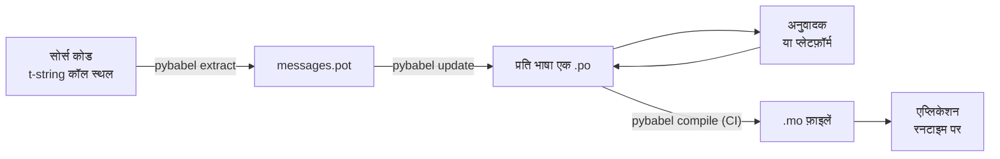

# प्रोडक्शन में

[ट्यूटोरियल](tutorial.md) लूप को एक बार चलाता है, अकेले, एक संदेश वाले
प्रोग्राम पर। वास्तविक प्रोजेक्ट में लूप घूमता रहता है: संदेश अनुवाद हो
जाने के बाद बदलते हैं, अनुवादक कहीं और और अपनी समय-सारणी पर काम करता है,
और हर रिलीज़ के साथ एक कंपाइल किया हुआ कैटलॉग शिप होता है। यह पेज वही
अभ्यास है — रिपॉज़िटरी में क्या रहता है, क्या यात्रा करता है, CI को क्या
गेट करना ही चाहिए, और रनटाइम भाषा को कहाँ बाँधता है।

कुल मिलाकर यह छह जाँचें बनती हैं, इसलिए वे सबसे पहले; नीचे का हर खंड उनमें
से एक को सेट करता है।

- `pybabel update --check` पास होती है — कोई संदेश कैटलॉग को बताए बिना बदला
  नहीं।
- `pybabel compile` के exit status पर बिल्ड गेट होता है।
- बची हुई `fuzzy` एंट्रियाँ जान-बूझकर हैं — जब तक कोई अनुवादक पुष्टि न करे,
  उनमें से हर एक स्रोत टेक्स्ट के रूप में रेंडर होती है।
- टेस्ट सुइट हर शिप होने वाली भाषा को एक बार `strict=True` के साथ रेंडर करता
  है।
- प्रोडक्शन आर्टिफ़ैक्ट में `.mo` फ़ाइलें हैं और Babel नहीं।
- `gettext_tstrings` लॉगर मॉनिटरिंग तक पहुँचाया गया है।

## प्रोजेक्ट की बनावट { #the-shape-of-a-project }

```text
myapp/
├── babel.cfg
├── pyproject.toml
├── src/
│   └── myapp/
└── locales/
    ├── messages.pot
    ├── ja/LC_MESSAGES/messages.po
    └── de/LC_MESSAGES/messages.po
```

`babel.cfg`, `.pot` टेम्पलेट, और हर `.po` को commit करें — ये अनुवाद बिल्ड
के स्रोत हैं, और इनके diff ही वह तरीक़ा हैं जिससे आप अनुवाद के बदलावों की
समीक्षा करते हैं। कंपाइल की हुई `.mo` फ़ाइलें बिल्ड आर्टिफ़ैक्ट हैं: उन्हें
commit करने की बजाय CI या पैकेजिंग के समय बनाएँ, ताकि कोई `.po` और उसकी
`.mo` कभी इस पर असहमत न हो सकें कि क्या शिप होता है।

एक फ़ाइल की भूमिका दोनों दिशाओं में है: `.pot` आपके संदेशों को अनुवादकों की
ओर *बाहर* ले जाता है, `.po` फ़ाइलें अनुवादों को *वापस* लाती हैं। इस पेज का
बाक़ी हिस्सा वही है जो इन दोनों के बीच आता-जाता है।



## पहले अनुवाद के बाद का चक्र { #the-cycle-after-the-first-translation }

ट्यूटोरियल का `pybabel init` सामान्यतः एक ही बार चलता है, जब कोई भाषा जोड़ी
जाती है। उसके बाद कार्यशील चक्र है **एक्सट्रैक्ट → अपडेट → अनुवाद → कंपाइल**, और उसका केंद्र
है `pybabel update`, जो ताज़ा टेम्पलेट को मौजूदा कैटलॉग में इस तरह समाहित
करता है कि उनमें पहले से मौजूद अनुवाद फेंके न जाएँ।

मान लीजिए अभिवादन `Hello {name}` — जिसका अनुवाद `こんにちは {name}` पहले हो
चुका है — कोड में बदलकर `Welcome back, {name}` कर दिया गया। एक्सट्रैक्ट और
अपडेट करें:

```console
$ pybabel extract -F babel.cfg -c "Translators:" -o locales/messages.pot .
extracting messages from app.py (encoding="utf-8")
writing PO template file to locales/messages.pot
$ pybabel update -i locales/messages.pot -d locales
updating catalog locales/ja/LC_MESSAGES/messages.po based on locales/messages.pot
```

जापानी कैटलॉग में अब यह है:

```po
#. gettext-tstrings
#: app.py:4
#, fuzzy, python-brace-format
msgid "Welcome back, {name}"
msgstr "こんにちは {name}"
```

Babel ने देखा कि नया msgid किसी हटाए गए msgid से मिलता-जुलता है और उसे
पुराने अनुवाद से जोड़ दिया — पर जोड़ी को **fuzzy** फ़्लैग कर दिया: मशीन का
अनुमान, मनुष्य की प्रतीक्षा में। यह फ़्लैग बदल देता है कि क्या कंपाइल होता
है। `pybabel compile`
**fuzzy एंट्रियों को `.mo` से बाहर रखता है**, इसलिए जब तक अनुवादक जोड़ी की
पुष्टि नहीं करता, एप्लिकेशन बासी जापानी की बजाय नया अंग्रेज़ी टेक्स्ट रेंडर
करता है:

```console
$ pybabel compile -d locales
compiling catalog locales/ja/LC_MESSAGES/messages.po to locales/ja/LC_MESSAGES/messages.mo
$ python app.py
Welcome back, Ada
```

इसलिए बदला हुआ संदेश उसी तरह degrade होता है जिस तरह टूटा हुआ — स्रोत भाषा
की ओर, कभी किसी पुराने पड़ चुके अनुवाद की ओर नहीं। चक्र में अनुवादक का
हिस्सा है `msgstr` को संशोधित करना और `fuzzy` फ़्लैग हटाना; अगला compile
एंट्री को उठा लेता है।

!!! note "Placeholder नाम संदेश की पहचान का हिस्सा हैं"

    msgid ही कैटलॉग की key है, और placeholder का *नाम* उसके भीतर है — इसलिए
    कोड में वेरिएबल का नाम बदलना (`name` → `user_name`) msgid बदल देता है
    और हर भाषा में उसके अनुवाद को वापस fuzzy चक्र में भेज देता है।
    इंटरपोलेट किए जाने वाले वेरिएबल को ऐसे शब्दों के नाम दें जो अनुवादक
    समझेगा, और नाम केवल किसी कारण से बदलें।

    फ़ॉर्मैटिंग इसका दर्पण-प्रतिबिंब है: `!r` और `:.2f`
    [msgid का हिस्सा नहीं हैं](internals.md#from-template-to-msgid), इसलिए
    `{amount:,.2f}` को `{amount:,.0f}` कर देना किसी कैटलॉग में कुछ नहीं
    बदलता। *वाक्य* को फिर से लिखना, निस्संदेह, असली बदलाव है — वही ऊपर का
    चक्र है।

## CI क्या गेट करता है { #what-ci-gates }

तीन विफलताएँ लाल बिल्ड के लायक़ हैं: कैटलॉग कोड से पीछे रह गए, किसी अनुवाद
ने placeholder तोड़ दिया, या कोई टूटी हुई एंट्री रनटाइम तक फिसल गई। हर
विफलता के लिए एक चरण:

```yaml
- run: pybabel extract -F babel.cfg -c "Translators:" -o locales/messages.pot .
- run: pybabel update -i locales/messages.pot -d locales --check
- run: pybabel compile -d locales
- run: pytest
```

`pybabel update --check` कुछ भी नहीं लिखता और जब कोई कैटलॉग ताज़ा
एक्सट्रैक्ट किए गए टेम्पलेट से पुराना पड़ जाए तो non-zero से बाहर निकलता है
— उस कोड के merge होने के विरुद्ध पहरा जिसके संदेश किसी ने दोबारा
एक्सट्रैक्ट नहीं किए। `pybabel compile` Babel और इस पैकेज के
[पंजीकृत checker](extraction.md#your-existing-toolchain-validates-these-catalogs)
दोनों की placeholder जाँचें चलाता है।

!!! bug "Babel 2.18.0: `--check` उन कैटलॉग को गेट नहीं कर सकता जो context का उपयोग करते हैं"

    Babel 2.18.0 पर, `pybabel update --check` `msgctxt` वाले **हर** कैटलॉग को
    हर बार पुराना बताता है, चाहे वह कितना भी ताज़ा क्यों न हो। जो गेट हमेशा
    विफल रहता है वह गेट न होने से बुरा है, क्योंकि टीम उसे बंद कर देती है —
    इसलिए यदि आप `pgettext` या `npgettext` का ज़रा भी उपयोग करते हैं, तो इस
    चरण के साथ जीने की बजाय उसे बदल दीजिए। टेम्पलेट और हर कैटलॉग को
    `babel.messages.pofile.read_po` से पढ़ना और
    `{(m.context, m.id) for m in catalog if m.id}` की तुलना करना ही पूरी जाँच
    है, और [इस साइट का अपना बिल्ड](index.md) यही करता है। कारण
    [Pitfalls पर लिखा है](pitfalls.md#your-tools-have-bugs-too)।

!!! danger "लॉग नहीं, exit status देखें"

    `pybabel compile` हर placeholder त्रुटि रिपोर्ट करता है, non-zero से
    बाहर निकलता है — **और `.mo` फिर भी लिख देता है**। जो pipeline कंपाइल
    करके `locales/` को इमेज में कॉपी करती है, वह टूटा हुआ कैटलॉग शिप कर
    देती है — जब तक कि non-zero exit उसे वास्तव में रोक न दे। चरण को बिल्ड
    विफल करने देना, जैसा ऊपर है, पूरा समाधान यही है।

अंतिम पंक्ति आपका साधारण टेस्ट सुइट है, एक आदत जोड़कर: उसमें कहीं, हर शिप
होने वाली भाषा का कम से कम एक संदेश एक strict translator से रेंडर करें —

```python
import gettext

from gettext_tstrings import Translator


def test_catalogs_render(language: str) -> None:
    translations = gettext.translation("messages", localedir="locales", languages=[language])
    _ = Translator(translations, strict=True)
    name = "Ada"
    assert _(t"Welcome back, {name}")
```

— क्योंकि `strict=True`
[वहाँ exception उठाता है जहाँ प्रोडक्शन चुपचाप फ़ॉलबैक करता](guide.md#what-happens-when-a-catalog-is-wrong),
और रनटाइम रेंडर ही वह इकलौती जाँच है जो कैटलॉग को ठीक वैसे देखती है जैसे
एप्लिकेशन देखेगा — `.mo` समेत।

## अनुवादकों और प्लेटफ़ॉर्मों के साथ काम करना { #working-with-translators-and-platforms }

`.po` फ़ाइल पूरे gettext संसार का विनिमय फ़ॉर्मैट है, और यही कारण है कि यह
लाइब्रेरी उसे पुन: उपयोग करती है: अनुवाद सौंपने का अर्थ है एक फ़ाइल सौंपना,
चाहे पाने वाला PO एडिटर वाला कोई सहकर्मी हो या Weblate या Crowdin जैसा
प्लेटफ़ॉर्म। तीन चीज़ें इस हस्तांतरण को अच्छी तरह चलाती हैं:

**बताएँ कि संदेश किसलिए है।** कोड की टिप्पणी संदेश के साथ यात्रा करती है —
`-c "Translators:"` फ़्लैग यही इकट्ठा करता है:

```python
from gettext_tstrings import tr

name = "Ada"
# Translators: shown on the dashboard right after sign-in
print(tr(t"Welcome back, {name}"))
```

```po
#. Translators: shown on the dashboard right after sign-in
#. gettext-tstrings
#: app.py:5
#, python-brace-format
msgid "Welcome back, {name}"
msgstr ""
```

अनुवादक वह टिप्पणी अपने एडिटर में, संदेश के बग़ल में, दुनिया के दूसरे छोर
पर देखता है। यह पूरे वर्कफ़्लो का सबसे सस्ता गुणवत्ता-लीवर है। जो शब्द अपने
आप का समनाम (homonym) है — "Open" बटन बनाम "Open" स्थिति — उसे `pgettext`
से एक [context](guide.md#binding-a-catalog) दें, जो कैटलॉग में दृश्य
`msgctxt` बन जाता है।

**Placeholder सत्यापन प्लेटफ़ॉर्म को करने दें।** t-string से एक्सट्रैक्ट
हुआ हर संदेश `python-brace-format` फ़्लैग ढोता है, और वही एक पंक्ति उन टूलों
में placeholder QA चालू करती है जिन पर आपका नियंत्रण नहीं है — Weblate इस
जाँच को प्रलेखित करता है, व्यावसायिक प्लेटफ़ॉर्म अपनी जाँचें इसी फ़्लैग पर
आधारित रखते हैं, और `msgfmt --check-format` किसी भी GNU pipeline में इसे
लागू करता है। विवरण, और बंडल किया हुआ checker इनसे आगे क्या पकड़ता है,
[एक्सट्रैक्शन पेज](extraction.md#your-existing-toolchain-validates-these-catalogs)
पर है।

**सुरक्षा जाल पर उतना ही भरोसा करें जितनी दूर वह जाता है।** प्लेटफ़ॉर्म से
जो भी वापस आता है वह अब भी आपके बिल्ड में प्रवेश करता डेटा है; ऊपर के CI
गेट ही "प्लेटफ़ॉर्म ने शायद यह जाँचा होगा" को "यह टूटा हुआ शिप नहीं हो
सकता" में बदलते हैं।

## रनटाइम पर भाषा बाँधना { #binding-a-language-at-runtime }

अब तक का सब कुछ कैटलॉग बनाता है। बचा हुआ निर्णय यह है कि एप्लिकेशन एक
कैटलॉग कहाँ चुनता है। *भाषा के दायरे* पर एक बार बाँधें — CLI के लिए प्रोसेस,
वेब सेवा के लिए request।

=== "एक प्रोसेस, एक भाषा"

    कोई कमांड-लाइन टूल या डेस्कटॉप एप्लिकेशन उपयोगकर्ता का परिवेश एक बार,
    शुरुआत में पढ़ता है। `languages=` न देने पर मानक लाइब्रेरी `LANGUAGE`,
    `LC_ALL`, `LC_MESSAGES` और `LANG` से भाषा तय करती है; `fallback=True`
    exception उठाने की बजाय एक null कैटलॉग — स्रोत टेक्स्ट — लौटाता है, जब
    इनमें से कोई भी आपके शिप किए कैटलॉग से मेल न खाए।

    ```python
    import gettext

    from gettext_tstrings import Translator

    _ = Translator(gettext.translation("messages", localedir="locales", fallback=True))

    name = "Ada"
    print(_(t"Welcome back, {name}"))
    ```

=== "Flask"

    वेब एप्लिकेशन प्रति request निर्णय लेता है। हर कैटलॉग import पर एक बार
    लोड करें, फिर view चलने से पहले तय की गई भाषा को context से बाँधें —
    [`set_translations`](guide.md#per-request-language) context-local है,
    इसलिए अलग-अलग भाषाओं में समवर्ती requests एक-दूसरे की binding कभी नहीं
    देखतीं।

    ```python
    import gettext

    from flask import Flask, request

    from gettext_tstrings import set_translations, tr

    LANGUAGES = ("en", "ja", "de")
    CATALOGS = {
        language: gettext.translation(
            "messages", localedir="locales", languages=[language], fallback=True
        )
        for language in LANGUAGES
    }

    app = Flask(__name__)


    @app.before_request
    def bind_language() -> None:
        language = request.accept_languages.best_match(LANGUAGES) or "en"
        set_translations(CATALOGS[language])


    @app.get("/")
    def home() -> str:
        name = "Ada"
        return tr(t"Welcome back, {name}")
    ```

=== "ASGI middleware"

    async फ़्रेमवर्क के अंतर्गत — FastAPI, Starlette, और बाक़ी सब जो ASGI
    है — request को [`use_translations`](guide.md#per-request-language) में
    लपेटें: binding एक `ContextVar` में रहती है, जिसे async task switching
    प्रति request सुरक्षित रखती है।

    ```python
    import gettext

    from fastapi import FastAPI, Request

    from gettext_tstrings import tr, use_translations

    LANGUAGES = ("en", "ja", "de")
    CATALOGS = {
        language: gettext.translation(
            "messages", localedir="locales", languages=[language], fallback=True
        )
        for language in LANGUAGES
    }

    app = FastAPI()


    @app.middleware("http")
    async def bind_language(request: Request, call_next):
        language = negotiate_language(request.headers.get("accept-language"), LANGUAGES)
        with use_translations(CATALOGS[language]):
            return await call_next(request)
    ```

    `negotiate_language` आपके Accept-Language parsing का स्थानापन्न है —
    अधिकांश फ़्रेमवर्क या उनके इकोसिस्टम एक देते हैं; यहाँ जो मायने रखता है
    वह `call_next` के इर्द-गिर्द binding है।

दो रनटाइम आदतें चित्र को पूरा करती हैं। import के समय बनी स्ट्रिंग्स — कोई
फ़ॉर्म लेबल, किसी enum का प्रदर्शित नाम — को वह भाषा कैप्चर नहीं करनी चाहिए
जो import के दौरान सक्रिय थी; उन्हें
[`lazy_gettext`](guide.md#deferred-translation) से परिभाषित करें और वे
*उपयोग* के समय सक्रिय भाषा में रेंडर होती हैं। और `gettext_tstrings` logger
को वहाँ भेजें जहाँ कोई मनुष्य देखता हो: इसकी चेतावनियाँ उदार मोड की वह
रिपोर्ट हैं जो हर गेट से फिसल गए अनुवाद की सूचना देती हैं — प्रति टूटे
संदेश एक पंक्ति, प्रति रेंडर नहीं।

## शिपिंग { #shipping }

प्रोडक्शन को चाहिए पैकेज, `.mo` फ़ाइलें, और कुछ नहीं। Babel विकास और CI की
निर्भरता है — `gettext-tstrings[babel]` को प्रोडक्शन इमेज से बाहर रखें और
वहाँ नंगा पैकेज इंस्टॉल करें; रेंडरिंग अकेली मानक लाइब्रेरी पर चलती है।
कैटलॉग उसी बिल्ड में कंपाइल करें जो deploy होने वाला आर्टिफ़ैक्ट बनाता है,
ताकि उसके भीतर की `.mo` फ़ाइलें ठीक वही समीक्षित `.po` फ़ाइलें हों, और किसी
के लैपटॉप पर कंपाइल हुआ कुछ भी कभी शिप न हो।

वे किस तरह यात्रा करती हैं, यह इस पर निर्भर है कि आप क्या deploy करते हैं।
wheel उन्हें package data के रूप में ले जाता है, जिसका अर्थ है कि कैटलॉग
पैकेज डायरेक्टरी के *भीतर* रहने चाहिए — `src/myapp/locales/`, न कि शीर्ष-स्तर
की `locales/` — और बिल्ड बैकएंड को यह बताना पड़ता है कि उन फ़ाइलों को शामिल
करे जिन्हें `.gitignore` सामान्यतः छिपा देती है:

=== "Hatchling"

    ```toml
    [tool.hatch.build]
    # .mo files are build output, so they are gitignored; name them or the
    # wheel ships without a single translation.
    artifacts = ["src/myapp/locales/**/*.mo"]
    ```

=== "setuptools"

    ```toml
    [tool.setuptools.package-data]
    myapp = ["locales/*/LC_MESSAGES/*.mo"]
    ```

उन्हें स्रोत ट्री के सापेक्ष किसी path के बजाय पैकेज के ज़रिए वापस पढ़ें —
वह path wheel इंस्टॉल होते ही अस्तित्व में रहना बंद कर देता है:

```python
import gettext
from importlib.resources import as_file, files

with as_file(files("myapp") / "locales") as localedir:
    translations = gettext.translation("messages", localedir=localedir, languages=["ja"])
```

कंटेनर इमेज का काम आसान है: बिल्ड स्टेज में कंपाइल करें और परिणाम कॉपी कर
लें, Babel को उसी स्टेज में छोड़ते हुए।

```dockerfile
FROM python:3.14-slim AS build
COPY . /src
RUN cd /src && python -m pip install ".[babel]" \
    && pybabel compile -d src/myapp/locales

FROM python:3.14-slim
COPY --from=build /src /src
RUN python -m pip install /src   # no [babel]: rendering needs the stdlib only
```

रिलीज़ से पहले, यह पेज जिस checklist में सिमटता है:

- `pybabel update --check` पास होता है — कोई संदेश कैटलॉग को बताए बिना नहीं
  बदला।
- `pybabel compile` अपने exit status पर बिल्ड को गेट करता है।
- बची हुई `fuzzy` एंट्रियाँ जानबूझकर हैं — हर एक तब तक स्रोत टेक्स्ट के रूप
  में रेंडर होती है जब तक अनुवादक पुष्टि न कर दे।
- टेस्ट सुइट हर शिप होने वाली भाषा को `strict=True` के साथ एक बार रेंडर
  करता है।
- प्रोडक्शन आर्टिफ़ैक्ट में `.mo` फ़ाइलें हैं और कोई Babel नहीं।
- `gettext_tstrings` logger मॉनिटरिंग तक पहुँचाया गया है।

## आगे कहाँ जाएँ { #where-next }

- [एक्सट्रैक्शन](extraction.md) — इस पेज के टूलिंग-पक्ष का संदर्भ: mapping
  विकल्प, अपने फ़ंक्शन नाम, सख़्त मोड, और हर checker।
- [गाइड](guide.md) — रनटाइम-पक्ष: बहुवचन, context, deferred strings, और
  विफलता के तरीक़े विस्तार से।
- [यह कैसे काम करता है](internals.md) — msgid ऐसा क्यों दिखता है, और सत्यापन
  वास्तव में क्या जाँचता है।
