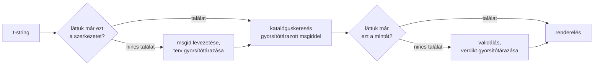

# Hogyan működik

Ezen az oldalon semmi nem szükséges a könyvtár használatához — azt az
[oktatóanyag](tutorial.md) és a [kézikönyv](guide.md) fedi le. Ez az oldal
ehelyett első elvekből építi fel a könyvtárat: mi is valójában egy t-string,
hogyan esik ki belőle egy msgid, mitől érvényes egy fordítás, és hogyan éri el
a megvalósítás, hogy ez az egész ellenőrzés a mikroszekundum tizedeibe
kerüljön. Olvasd el, ha kíváncsi vagy, ha hozzá szeretnél járulni, vagy ha
[magad készülsz megvalósítani a konvenciót](#reimplementing-it).

## Mi is valójában egy t-string { #what-a-t-string-actually-is }

Az f-string `str` értéket állít elő, méghozzá azonnal — mire bármelyik
függvény megkapja, az érték már interpolálódott, és a mondat lezárult. A
t-string ([PEP 750]) ugyanezzel a szintaxissal és a kifejezései ugyanilyen
mohó kiértékelésével él, de más típust állít elő:

```pycon
>>> name = "Ada"
>>> f"Hello {name}!"
'Hello Ada!'
>>> t"Hello {name}!"
Template(strings=('Hello ', '!'), interpolations=(Interpolation('Ada', 'name', None, ''),))
```

Ez a `Template` objektum elkülönítve őrzi meg azokat a részeket, amelyekre egy
katalógusfolyamatnak szüksége van:

```pycon
>>> template = t"Total: {amount:,.2f}"
>>> template.strings
('Total: ', '')
>>> template.interpolations[0].expression
'amount'
>>> template.interpolations[0].value
1234.5
>>> template.interpolations[0].format_spec
',.2f'
```

- `strings` — az interpolációk körüli literális szöveg, sorrendben.
- Minden interpolációra: a **kifejezés** forrásszövegként (`'amount'`), a
  **kiértékelt** értéke (`1234.5`), valamint az esetleges **konverzió** (`!r`)
  és **formátumleíró** (`,.2f`) — külön hordozva, nem alkalmazva.

Minden, amit ez a könyvtár tesz, ennek a szerkezetnek a fegyelmezett
felhasználása. A nyelv már elvégezte azt az egyetlen szétválasztást, amelyre
az i18n-nek szüksége van — statikus szöveg külön az értékektől —, így a
könyvtár soha nem elemzi a forráskódodat, és soha nem találgatja, hol áll egy
érték a mondaton belül. Ami hátramarad, az három döntés: hogyan lesz a
szerkezetből katalóguskulcs, mit mondhat ennek a kulcsnak a fordítása, és
hogyan renderelődik a kettő újra együtt.

## A sablontól a msgidig { #from-template-to-msgid }

A msgid — a kulcs, amely szerint egy katalógus indexelve van — kizárólag a
sablon *statikus* részeiből származik. Járd be a `strings` és az
`interpolations` elemeit forrásbeli sorrendben; escape-eld kapcsos
zárójelekkel az egyes literális szakaszokat (a `{` `{{` lesz); minden
interpolációra bocsáss ki egy `{name}` tokent, ahol a `name` a kifejezés
szövege a körülvevő térköz nélkül. A `t"Total: {amount:,.2f}"` esetében:

```text
strings         ('Total: ', '')
interpolations  expression 'amount'   conversion None   format_spec ',.2f'
msgid           'Total: {amount}'
```

Ennek a szabálynak minden részéhez tartozik egy ok:

- **A kifejezésnek puszta névnek kell lennie** — a `str.isidentifier()` igaz
  rá, és nem Python-kulcsszó. A `t"Hello {user.name}"` már a hívás helyén
  elutasításra kerül. A msgid egy *kulcs*: minden futáskor és minden
  kinyeréskor azonosan kell kijönnie, és fordítók olvassák, ezért a
  helyőrzőnek stabil, értelmes szónak kell lennie — nem olyan kódtöredéknek,
  amely arra hívja a katalógust, hogy kifejezésnyelvvé váljon.
- **A konverzió és a formátumleíró sosem kerül be a msgidbe.** A fordítóknak
  nem kellene a `:,.2f` leírót olvasniuk, és egyetlen fordítás se
  változtathassa meg. Az ebből következő tanulság megéri: ha a kódodban a
  `:,.2f` leírót `:,.0f` alakra szigorítod, az egyetlen msgidet sem
  változtatja meg, tehát egyetlen nyelven sem érvénytelenít fordítást. A
  katalóguskulcs azt követi, *mit mond a mondat*, nem azt, hogyan formázódik
  az érték.
- **Egy ismételt névnek pontosan meg kell ismételnie a formázását.** A
  `t"{x:.2f} vs {x:.3f}"` elutasításra kerül, mert mindkét előfordulás
  ugyanabba a `{x}` tokenbe olvad össze, és a msgid többé nem tudná megmondani,
  melyik formázást használja egy renderelés.
- **Az üres msgidet soha nem keressük ki**, mert a gettext ezt a katalógus
  saját metaadat-fejlécének tartja fenn. A `t""` a katalógus érintése nélkül
  `""` alakban jelenik meg.

A teljes szabályrendszer, beleértve az ezen az oldalon kihagyott
határeseteket, a
[SPEC 2. §](https://github.com/yhay81/gettext-tstrings/blob/main/SPEC.md).

## Mit mondhat egy fordítás { #what-a-translation-may-say }

A katalógusból visszatérő mintát a `string.Formatter` elemzi — ugyanaz az
elemző, amelyet a `str.format` használ. A nyelvtan szándékosan kölcsönzött, és
nem kitalált: az a minta, amelyet ez a könyvtár elfogad, olyan, amelyet a
tágabb ökoszisztéma már ért. Ezután két ellenőrzés következik.

**Alak:** minden mezőnek puszta `{name}` alakúnak kell lennie. A konverzió
vagy a formátumleíró — beleértve a kifejezetten üres `{name:}` alakot is —
elutasításra kerül, ahogy a pozicionális mezők (`{0}`, `{}`) és a térközzel
kipárnázott nevek (`{ name }`) is. Az utolsó többet nyom, mint amennyinek
látszik: a `str.format` és a GNU `msgfmt` egyaránt elutasítja a `{ name }`
alakot, így ha itt elfogadnánk, olyan katalógusok születnének, amelyeket a
lánc egyetlen más eszköze sem tud validálni.

**Nevek:** a minta helyőrzőhalmazát a forráséhoz hasonlítjuk. Egyes számú
üzenetnél minden forrásnév *kötelező*, és semmi más nem *megengedett*. Többes
számú üzenetnél a két ágat egyesítjük:

- **megengedett** = a két ág neveinek uniója
- **kötelező** = a metszetük

Így a `t"One file"` / `t"{n} files"` ellenében az `n` név mindkét alak
fordításában megengedett, de egyikben sem kötelező. Épp ez az aszimmetria
teszi lehetővé, hogy a célnyelv többesszám-rendszere eltérjen a
forrásnyelvétől — a japán mindkét ágat egyetlen alakkal fordítja, amely
alighanem használja az `{n}` helyőrzőt; egy angolnál több alakot ismerő
nyelvnek szüksége lehet az `{n}` helyőrzőre olyan alakban, amilyen az angolban
nincs is.

Semmi ebből nem elméleti: ennek a webhelynek a saját keretkatalógusa maga is
tartalmazza a `Built {n} localized page` / `Built {n} localized pages` többes
számú üzenetet — két angol ágat —, a webhely kiadásai pedig ezt az egyetlen
üzenetet egy alaktól hatig terjedően fordítják le:

| Katalógus | Alakok | A fordítások, alakok szerinti sorrendben |
| --- | --- | --- |
| japán | 1 | `ローカライズ済みページを{n}件ビルドしました` |
| török | 2 | `{n} yerelleştirilmiş sayfa oluşturuldu` — kétszer, azonosan: a török főnevek számnév után egyes számban maradnak |
| olasz | 2 | `Generata {n} pagina localizzata` · `Generate {n} pagine localizzate` — a melléknévi igenév nemben és számban egyeztetve |
| orosz | 3 | `Собрана {n} локализованная страница` · `Собраны {n} локализованные страницы` · `Собрано {n} локализованных страниц` |
| lengyel | 3 | `Zbudowano {n} zlokalizowaną stronę` · `Zbudowano {n} zlokalizowane strony` · `Zbudowano {n} zlokalizowanych stron` |
| arab | 6 | köztük `تم إنشاء صفحة مترجمة واحدة ({n})` pontosan egyre és `تم إنشاء {n} صفحات مترجمة` néhányra |

Minden sor élő bejegyzés ennek a tárolónak az `i18n/*/LC_MESSAGES/site.po`
fájljaiban, amelyeket a [többnyelvű build](index.md) rendereli minden
kiadáskor — és egy teszt ehhez a táblázathoz szegezi azokat a katalógusokat,
így a kettő nem sodródhat szét.

Ezeken a határokon belül az átrendezés és az ismétlés szándékosan
korlátozatlan. Mindkettő nyelvtanilag szükséges valódi nyelvekben, és az
előfordulások számának korlátozása helyes fordításokat utasítana el, minden
biztonsági haszon nélkül: egy fordítás továbbra sem *értékelhet ki* semmit,
mert nincs kiértékelési útvonal — a helyőrzőket név szerint keressük ki a
sablon már kiszámított értékei közül, és soha nem adjuk át őket az `eval`, a
`getattr` vagy maga a `str.format` kezébe.

## Renderelés { #rendering }

Egy validált minta renderelése végigjárás a darabjain: bocsásd ki az egyes
literális részeket, minden helyőrzőnél pedig vedd az interpoláció elkapott
értékét, és alkalmazd a *forrásoldali* konverziót és formátumleírót —
`format(convert(value, conversion), format_spec)`. Eközben két garanciát
tartunk:

- **Minden különböző érték renderelésenként legfeljebb egyszer formázódik**,
  még akkor is, ha a fordítás megismétel egy helyőrzőt. Az ismétlés azt
  változtatja meg, hányszor kerül be az eredmény, nem azt, hányszor fut le a
  `__format__` metódusod.
- **Többes számoknál egy helyőrző azt az ágat olvassa, amely definiálta.** A
  mindkét ágban jelen lévő név annak az ágnak az elkapott értékét olvassa,
  amelyet a *forrásnyelv* választ (`singular`, ha `n == 1`, egyébként
  `plural`); az ágspecifikus név mindig a saját ágát olvassa, még akkor is, ha
  a célnyelv többesszám-szabályai más alakban is elérhetővé tették.

Ha a validálás renderelési időben elbukik, a válasz aszerint válik szét, ki
adta a mintát. A *katalógusból* érkezett minta degradálódik: egy
figyelmeztetés a naplóba, és a forrásszöveg renderelése, megtartva a gettext
szerződését, hogy egy hibás katalógus soha nem viszi le az alkalmazást
([a kézikönyv mindkét módot bemutatja](guide.md#what-happens-when-a-catalog-is-wrong)).
Az a minta, amelyet a hívó közvetlenül adott át — `CompiledTemplate.render` —
mindig kivételt vált ki, mert nincs forrásszöveg, *amelyre* degradálódhatna;
az elnézés a katalóguskeresésekért van, nem az argumentumokért.

## A diagnosztika a terv része { #diagnostics-are-part-of-the-design }

Egy helyőrzőhiba rendszerint fordító elé kerül, nem programozó elé, és gyakran
olyan fájlban, ahol a probléma láthatatlan. Zsákutca azt mondani, hogy
`{name} is missing`, olyasvalakinek, aki pontosan ezeket a karaktereket látja
a szerkesztőjében, ezért az üzeneteket három szabály szerint számítjuk ki:

- Az **láthatatlan karaktert** tartalmazó nevet — egy beviteli módszer által
  előállított nem törhető szóközt, egy nulla szélességű szóközt — úgy írjuk
  ki, hogy azt a karaktert a kódpontjára cseréljük, a helyén:
  `{<U+00A0>name}`. Az olvasónak azt kell látnia, *hol*.
- Az **írásrendszereket keverő** betűkből álló nevet, a homoglifa-esetet,
  kétszer mutatjuk meg — egyszer olvashatóan, egyszer escape-elve —, mert a
  cirill `а` betűs `{nаme}` nyomtatásban megkülönböztethetetlen a `{name}`
  alaktól, és az escape-elt `(nаme)` írásmód az egyetlen, amely elárulja a
  különbséget.
- Minden mást **úgy mutatunk, ahogy írva van**. A `{名前}` és a `{café}`
  hétköznapi nevek; ha escape-elnénk őket, az olvasó nem találná meg, mire is
  gondoltak.

Ugyanezen elv alapján a „hiányzó” helyőrző, amely jelen lévőnek *látszik*,
megkapja a hiánya magyarázatát — kelet-ázsiai beviteli módszerből származó
teljes szélességű kapcsos zárójelek, escape-elési oda-vissza útból származó
`{{name}}` megkettőzés, a kapcsos zárójeleken kívülre került név. A
[kézikönyv hibaolvasási táblázata](guide.md#reading-a-failure-message)
szó szerint mutatja mindegyik üzenetet.

## A forró útvonal { #the-hot-path }

Mindez minden egyes lefordított szövegnél lezajlik, amelyet egy alkalmazás
lerenderel, ezért a megvalósítás egyetlen gondolat köré épül: **a validálást
sosem hagyjuk ki, tehát épp a validálásnak kell gyorsítótárazódnia.**



Három gyorsítótár, szakaszonként egy:

- **Egy terv hívásihely-szerkezetenként.** A sablon `strings` tuple-je — egy
  objektum, amelyet az értelmező amúgy is felépített — a gyorsítótár kulcsa,
  így egy keresés semmit nem allokál. Találat esetén a rendszer minden
  interpoláció kifejezését, konverzióját és formátumleíróját ettől függetlenül
  összeveti a rögzítettekkel: két hívási hely, amely osztozik a literális
  szövegen, de a formázásban eltér (`t"{x:.2f}"` szemben a `t"{x:.3f}"`
  alakkal), nem ütközhet, és ez az összevetés az ára annak, hogy olyan kulcsot
  használunk, amelyet az értelmező ingyen ad a kezünkbe.
- **Egy verdikt mintánként.** Amikor egy katalógus először válaszol egy adott
  mintával, azt elemezzük és validáljuk; az eredmény — egy lefordított
  renderelési terv vagy az érvénytelenség feljegyzése — a terven marad. Ennek
  az üzenetnek minden későbbi renderelése egyetlen szótárkereséssel jut el
  hozzá. Az érvénytelen mintákat is megjegyezzük, és ezért figyelmeztet egy
  elromlott katalógusbejegyzés egyszer, nem pedig minden renderelésnél.
- **Egy egyesített terv többesszám-páronként**, amely az unió- és
  metszethalmazokat tartja, hogy az ágaritmetika üzenetenként egyszer
  történjen meg, ne hívásonként.

Minden gyorsítótár korlátos, és egyik sem tart meg interpolált *értékeket* —
csak statikus szerkezetet és mintaszöveget. Az eredmény, a
[`benchmarks/runtime.py`](https://github.com/yhay81/gettext-tstrings/blob/main/benchmarks/runtime.py)
mérése szerint: nagyjából 0,4 µs egy egymezős üzenetre, magának a t-stringnek
a felépítésével együtt, ami körülbelül 2,5-szerese egy semmit nem ellenőrző,
sima `gettext(...).format(...)` hívásnak. A
[`core.py`](https://github.com/yhay81/gettext-tstrings/blob/main/src/gettext_tstrings/core.py)
tetején lévő kommentár rögzíti az e mögött álló egyedi méréseket.

## Megvalósítani máshogy { #reimplementing-it }

A fentiekből semmi nem titkos tudás: a konvenciót leírtuk
[v1-es specifikációként](spec.md), géppel olvasható
[konformitási készlete](spec.md#conformance) pedig lehetővé teszi, hogy egy
kinyerő, egy IDE-bővítmény vagy egy másik nyelvű megvalósítás ellenőrizze
magát az oldalon elmagyarázott minden szabály ellenében. Ez a megvalósítás a
saját tesztjeiben futtatja a készletet, és épp ez tartja meg attól ezt az
oldalt, a specifikációt és a kódot, hogy csendben szétsodródjanak.

  [PEP 750]: https://peps.python.org/pep-0750/