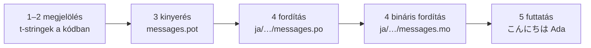

# Oktatóanyag

Ez az oldal üres könyvtárból indul, és egy japánul köszönő programig jut el.
Öt lépés, gettext-tapasztalat nélkül is követhető, és minden parancs azzal a
kimenettel szerepel, amelyet ténylegesen ad — így minden lépésnél tudod, hogy
jó úton jársz-e.

Python 3.14 vagy újabb kell hozzá, mert a t-string a 3.14 új szintaxisa. A
japán csak ennek az oldalnak a példacélnyelve, semmi sem múlik ezen a
választáson — a 4. lépésben bármelyik nyelvre lecserélheted, ott a `ja`
területi kód az egyetlen dolog, amely megnevezi.

## 1. Telepítés { #1-install }

```console
python -m pip install "gettext-tstrings[babel]"
```

A `[babel]` extra behozza a [Babel]t, azt az eszközt, amely a 3. lépésben
katalógusfájlokba gyűjti az üzeneteidet. Ez fejlesztésidejű eszköz: az éles
kód a standard könyvtárral egymagában renderel.

## 2. Jelölj meg egy üzenetet a kódodban { #2-mark-a-message-in-your-code }

Hozd létre az `app.py` fájlt:

```python
from gettext_tstrings import tr

name = "Ada"
print(tr(t"Hello {name}"))
```

A `t"Hello {name}"` úgy néz ki, mint egy f-string, de a `t` előtag külön
tartja a szöveget és az értéket ahelyett, hogy azon nyomban összeolvasztaná
őket. Épp ez a szétválasztás teszi lehetővé, hogy a `tr()` a teljes
`Hello {name}` mondathoz keressen fordítást, és csak utána illessze be az
értéket.

Futtasd is le rögtön:

```console
$ python app.py
Hello Ada
```

Fordítás még nincs telepítve, ezért a forrásszöveg úgy jelenik meg,
ahogy van. Az ezt a könyvtárat használó program soha nem *igényel* katalógust
a futáshoz — az angol (vagy bármi legyen is a forrásnyelved) a beépített
tartalék.

## 3. Nyerd ki az üzeneteket { #3-extract-the-messages }

A fordítók nem olvassák a forráskódodat; helyette egy **katalógusnak**
nevezett kis fájl jár közted és köztük. Az első lépés efelé az, hogy
összegyűjtsük a kódból az összes megjelölt üzenetet.

Mondd meg a Babelnek, hol találja az üzeneteidet: hozd létre a `babel.cfg`
fájlt:

```ini
[gettext_tstrings: **.py]
encoding = utf-8
```

Ezután nyerd ki őket egy sablonfájlba (`.pot`):

```console
$ mkdir -p locales
$ pybabel extract -F babel.cfg -c "Translators:" -o locales/messages.pot .
extracting messages from app.py (encoding="utf-8")
writing PO template file to locales/messages.pot
```

A `locales/messages.pot` mostantól üzenetenként egy bejegyzést tartalmaz:

```po
#. gettext-tstrings
#: app.py:4
#, python-brace-format
msgid "Hello {name}"
msgstr ""
```

A `msgid` az a kulcs, amelyet a kódod ki fog keresni. Az üres `msgstr` helyére
kerül a fordítás — de nem ebben a fájlban: a `.pot` egy *sablon*, a következő
lépés pedig nyelvenként egyszer lemásolja.

## 4. Fordítás és bináris fordítás { #4-translate-and-compile }

Hozd létre a japán katalógust a sablonból:

```console
$ pybabel init -i locales/messages.pot -d locales -l ja
creating catalog locales/ja/LC_MESSAGES/messages.po based on locales/messages.pot
```

Nyisd meg a `locales/ja/LC_MESSAGES/messages.po` fájlt, és töltsd ki a
`msgstr` értékét:

```po
msgid "Hello {name}"
msgstr "こんにちは {name}"
```

A `{name}` maradjon pontosan úgy, ahogy van — a helyőrző az, ami révén az
érték megtalálja a helyét a lefordított mondaton belül, a fordítás pedig
szabadon oda mozgathatja, ahová a célnyelvnek kell. Valódi projektben ezt a
`.po` fájlt adod oda egy fordítónak, vagy töltöd fel egy fordítási
platformra; a formátum mindkét esetben ugyanaz.

A katalógusokat szövegként szerkesztjük, de bináris formában (`.mo`) töltődnek
be, ezért fordítsd le őket:

```console
$ pybabel compile -d locales
compiling catalog locales/ja/LC_MESSAGES/messages.po to locales/ja/LC_MESSAGES/messages.mo
```

Ez a parancs egyben biztonsági háló is. Ha a fordítás megrongálta volna a
helyőrzőt — mondjuk `{name}` helyett `{nome}` szerepelne —, nem engedné át:

```console
$ pybabel compile -d locales
error: locales/ja/LC_MESSAGES/messages.po:24: translation does not match the
source placeholders: {name} is missing; {nome} is not in the source message
1 errors encountered.
```

## 5. Futtasd { #5-run-it }

Irányítsd az `app.py` fájlt a lefordított katalógusra. Kattints a jelölőkre,
hogy lásd, melyik sor mit csinál:

```python
import gettext

from gettext_tstrings import Translator

_ = Translator(gettext.translation("messages", localedir="locales", languages=["ja"]))  # (1)!

name = "Ada"
print(_(t"Hello {name}"))  # (2)!
```

1. A standard könyvtár betölti a lefordított `.mo` fájlt, a `Translator` pedig
   egy hívható objektumhoz köti. A `_` a gettext szokásos neve arra, hogy
   „fordítsd le ezt” — azért rövid, mert minden felhasználónak szánt szövegnél
   megjelenik. Ugyanaz a függvény, mint a `tr`, csak egyetlen katalógushoz
   kötve.
2. A híváskor: a t-string szövegéből lesz a `Hello {name}` keresőkulcs, a
   katalógus a `こんにちは {name}` választ adja, a választ összeveti a
   rendszer a forrás helyőrzőivel, és csak ezután kerül be az érték.

```console
$ python app.py
こんにちは Ada
```

Ez az egész ciklus, és megéri egyetlen képként is látni:



**Megjelölés → kinyerés → fordítás → bináris fordítás → futtatás.** Ezen a
webhelyen minden más ennek az öt lépésnek valamelyikét finomítja.

## Merre tovább { #where-next }

- [Miért t-string?](comparison.md) — mitől véd meg ez a felépítés a
  `%(name)s`, a `.format()` és a `$`-stringek mellett.
- [Kézikönyv](guide.md) — többes számok, kérésenkénti nyelvek, késleltetett
  szövegek, és mi történik futásidőben, ha egy katalógus mégis hibás.
- [Éles üzemben](workflow.md) — ugyanez a ciklus úgy, ahogy egy csapat
  működteti, hétről hétre: katalógusfrissítés, CI-kapuk és fordítási
  platformok.
- [Kinyerés](extraction.md) — a teljes `pybabel`-referencia: saját
  függvénynevek, szigorú CI-mód, és a katalógusaidat őrző ellenőrzések.

  [Babel]: https://babel.pocoo.org/