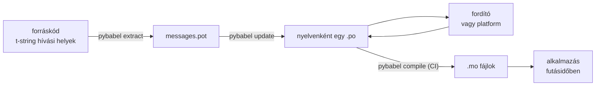

# Éles üzemben

Az [oktatóanyag](tutorial.md) egyszer futtatja végig a ciklust, egyedül, egy
egyetlen üzenetből álló programon. Valódi projektben a ciklus tovább forog: az
üzenetek megváltoznak, miután lefordították őket, a fordító máshol és saját
ütemben dolgozik, és minden kiadással szállítunk egy lefordított katalógust.
Ez az oldal maga a gyakorlat — mi marad a tárolóban, mi utazik, mit kell a
CI-nek kapuznia, és hol köti be a nyelvet a futásidő.

## Egy projekt alakja { #the-shape-of-a-project }

```text
myapp/
├── babel.cfg
├── pyproject.toml
├── src/
│   └── myapp/
└── locales/
    ├── messages.pot
    ├── ja/LC_MESSAGES/messages.po
    └── de/LC_MESSAGES/messages.po
```

Verziókövesd a `babel.cfg` fájlt, a `.pot` sablont és minden `.po` fájlt — ezek
a fordítási build forrásai, és a diffjeik révén nézed át a fordítási
változásokat. A lefordított `.mo` fájlok build-artefaktumok: a
verziókövetésbe tétel helyett CI-ben vagy csomagoláskor állítsd elő őket, hogy
egy `.po` és a hozzá tartozó `.mo` soha ne mondhasson mást arról, mi kerül
kiszállításra.

Egy-egy fájlnak mindkét irányban szerepe van: a `.pot` viszi *ki* az
üzeneteidet a fordítókhoz, a `.po` fájlok hozzák *vissza* a fordításokat.
Minden, ami alább következik, e kettő közti forgalom.



## A kör az első fordítás után { #the-cycle-after-the-first-translation }

Az oktatóanyag `pybabel init` parancsa nyelvenként egyszer fut le, örökre.
Ettől kezdve a munkakör: **kinyerés → frissítés → fordítás → bináris
fordítás**, és ennek középpontja a `pybabel update`, amely úgy gyúrja bele a
friss sablont a meglévő katalógusokba, hogy közben nem dobja el a bennük már
meglévő fordításokat.

Tegyük fel, hogy a `Hello {name}` köszönést — amelynek fordítása már
`こんにちは {name}` — a kódban `Welcome back, {name}` alakra fogalmazzuk át.
Nyerd ki és frissíts:

```console
$ pybabel extract -F babel.cfg -c "Translators:" -o locales/messages.pot .
extracting messages from app.py (encoding="utf-8")
writing PO template file to locales/messages.pot
$ pybabel update -i locales/messages.pot -d locales
updating catalog locales/ja/LC_MESSAGES/messages.po based on locales/messages.pot
```

A japán katalógus most ezt tartalmazza:

```po
#. gettext-tstrings
#: app.py:4
#, fuzzy, python-brace-format
msgid "Welcome back, {name}"
msgstr "こんにちは {name}"
```

A Babel észrevette, hogy az új msgid hasonlít egy eltávolítottra, és
párosította a régi fordítással — de **fuzzy** jelzővel látta el a párost: egy
gép tippje, amely emberre vár. A jelzőnek foga van. A `pybabel compile`
**kihagyja a fuzzy bejegyzéseket a `.mo` fájlból**, így amíg egy fordító meg
nem erősíti a párosítást, az alkalmazás az új angol szöveget jeleníti meg egy
elavult japán helyett:

```console
$ pybabel compile -d locales
compiling catalog locales/ja/LC_MESSAGES/messages.po to locales/ja/LC_MESSAGES/messages.mo
$ python app.py
Welcome back, Ada
```

Egy megváltozott üzenet tehát ugyanúgy degradálódik, ahogy egy elromlott — a
forrásnyelvre, sosem egy elavult fordításra. A fordító feladata a körben az,
hogy átdolgozza a `msgstr` értékét, és törölje a `fuzzy` jelzőt; a következő
bináris fordítás már felveszi a bejegyzést.

!!! note "A helyőrzők neve az üzenet azonosságának része"

    A msgid a katalógus kulcsa, és a helyőrző *neve* benne van — így egy
    változó átnevezése a kódban (`name` → `user_name`) megváltoztatja a
    msgidet, és minden nyelv fordítását visszaküldi a fuzzy körbe. Az
    interpolált változókat olyan szavakkal nevezd el, amelyeket egy fordító is
    megért, és csak indokolt esetben nevezd át őket.

    A formázás ennek a tükörképe: a `!r` és a `:.2f`
    [nem része a msgidnek](internals.md#from-template-to-msgid), így a
    `{amount:,.2f}` szigorítása `{amount:,.0f}` alakra egyetlen katalógusban
    sem változtat semmit. Magának a *mondatnak* az átfogalmazása persze valódi
    változás — az a fenti kör.

## Mit kapuz a CI { #what-ci-gates }

Három hiba érdemli meg a piros buildet: a katalógusok lemaradtak a kód
mögött, egy fordítás elrontott egy helyőrzőt, vagy egy hibás bejegyzés
átcsúszott a futásidőig. Hibánként egy lépés:

```yaml
- run: pybabel extract -F babel.cfg -c "Translators:" -o locales/messages.pot .
- run: pybabel update -i locales/messages.pot -d locales --check
- run: pybabel compile -d locales
- run: pytest
```

A `pybabel update --check` semmit nem ír át, és nem nulla státusszal lép ki,
ha egy katalógus elavult a frissen kinyert sablonhoz képest — ez az őre annak,
hogy ne kerüljön be olyan kód, amelynek üzeneteit senki nem nyerte ki újra. A
`pybabel compile` futtatja mind a Babel, mind ennek a csomagnak a
helyőrző-ellenőrzéseit
([regisztrált ellenőrző](extraction.md#your-existing-toolchain-validates-these-catalogs)).

!!! bug "A `--check` nem tud kapuzni kontextust használó katalógust"

    A Babel 2.18.0 verzióján a `pybabel update --check` **minden** olyan
    katalógust elavultként jelent, amely `msgctxt` bejegyzést tartalmaz —
    minden futáskor, bármilyen naprakész is. Az összehasonlítás a
    `Catalog.is_identical` metóduson keresztül fut, amely minden üzenetet azon
    a kulcson keres ki, amely alatt tárolva van — kontextusos üzenetnél pedig
    ez a kulcs az `(id, context)` páros, amelyet a `Catalog.get` nem fogad el.
    A keresés semmit nem ad vissza, és a katalógusok soha nem bizonyulnak
    egyenlőnek:

    ```pycon
    >>> from babel.messages.catalog import Catalog
    >>> c = Catalog(locale="ja")
    >>> c.add("Guide", "ガイド", context="navigation")
    <Message 'Guide' (flags: [])>
    >>> c.is_identical(c)
    False
    ```

    Vagyis ha egyáltalán használsz `pgettext`-et vagy `npgettext`-et — és a
    homonimák egyértelműsítése épp az, amiért léteznek —, ez a lépés a
    legrosszabb módon bukik nyitottra: mindig piros, ezért egy csapat
    kikapcsolja, ezért semmi nem kapuzza az elavulást. Amíg fel nem javítják
    az upstreamben, hasonlítsd össze magad az üzenethalmazokat. A sablon és
    minden katalógus beolvasása a `babel.messages.pofile.read_po` függvénnyel,
    majd a `{(m.context, m.id) for m in catalog if m.id}` halmazok
    összevetése — ennyi az egész ellenőrzés, és pontosan ezt teszi
    [ennek a webhelynek a saját buildje](index.md).

!!! danger "A kilépési státuszt nézd, ne a naplót"

    A `pybabel compile` jelent minden helyőrzőhibát, nem nulla státusszal lép
    ki — **és mégis megírja a `.mo` fájlt**. Az a folyamat, amely lefordít,
    majd bemásolja a `locales/` könyvtárat egy image-be, kiszállítja a hibás
    katalógust, hacsak a nem nulla kilépés ténylegesen meg nem állítja. A
    teljes javítás annyi, hogy hagyod a lépést elbuktatni a buildet, mint
    fentebb.

Az utolsó sor a szokásos tesztkészleted, egyetlen szokással kiegészítve:
valahol benne rendereld le legalább egy üzenetet minden kiszállított nyelven
egy szigorú fordítón keresztül —

```python
import gettext

from gettext_tstrings import Translator


def test_catalogs_render(language: str) -> None:
    translations = gettext.translation("messages", localedir="locales", languages=[language])
    _ = Translator(translations, strict=True)
    name = "Ada"
    assert _(t"Welcome back, {name}")
```

— mert a `strict=True`
[ott vált ki kivételt, ahol az éles üzem némán visszaesne](guide.md#what-happens-when-a-catalog-is-wrong),
és egy futásidejű renderelés az egyetlen ellenőrzés, amely pontosan úgy látja
a katalógust, ahogy az alkalmazás fogja, `.mo`-stul, mindenestül.

## Munka fordítókkal és platformokkal { #working-with-translators-and-platforms }

A `.po` fájl az egész gettext-világ csereformátuma, és ezért használja újra ez
a könyvtár: a fordítás átadása azt jelenti, hogy átadsz egy fájlt — akár egy
PO-szerkesztőt használó kollégának, akár egy platformnak, például a
Weblate-nek vagy a Crowdinnak. Három dolog teszi jóvá ezt az átadást:

**Mondd meg, mire való az üzenet.** Egy kódbeli megjegyzés együtt utazik az
üzenettel — ezt gyűjti be a `-c "Translators:"` kapcsoló:

```python
from gettext_tstrings import tr

name = "Ada"
# Translators: shown on the dashboard right after sign-in
print(tr(t"Welcome back, {name}"))
```

```po
#. Translators: shown on the dashboard right after sign-in
#. gettext-tstrings
#: app.py:5
#, python-brace-format
msgid "Welcome back, {name}"
msgstr ""
```

A fordító ezt a megjegyzést látja a szerkesztőjében, az üzenet mellett, a világ
másik felén. Ez a legolcsóbb minőségi emelő az egész munkafolyamatban. Az
olyan szónál, amely önmaga homonimája — az „Open” mint gomb szemben az „Open”
mint állapot —, adj az üzenetnek [kontextust](guide.md#binding-a-catalog) a
`pgettext` segítségével, amelyből látható `msgctxt` lesz a katalógusban.

**Hagyd, hogy a platform validálja a helyőrzőket.** Minden t-stringből kinyert
üzenet a `python-brace-format` jelzőt viseli, és épp ez az egyetlen sor
kapcsolja be a helyőrző-QA-t azokban az eszközökben, amelyeket nem te
irányítasz — a Weblate dokumentálja az ellenőrzést, a kereskedelmi platformok
ugyanerre a jelzőre kötik a sajátjukat, és a `msgfmt --check-format` minden
GNU-folyamatban kikényszeríti. A részletek, és hogy a mellékelt ellenőrző mit
kap el ezeken túl, a [kinyerési oldalon](extraction.md#your-existing-toolchain-validates-these-catalogs)
találhatók.

**Bízz a biztonsági hálóban pontosan addig, ameddig ér.** Bármi jön is vissza
egy platformról, az továbbra is a buildedbe belépő adat; a fenti CI-kapuk
azok, amelyek a „a platform valószínűleg ellenőrizte ezt” mondatot azzá
alakítják, hogy „ez nem szállítható ki hibásan”.

## Nyelv bekötése futásidőben { #binding-a-language-at-runtime }

Minden eddigi katalógusokat állít elő. A hátralévő döntés az, hogy hol
választ közülük az alkalmazás, és erre egy őszinte válasz van: köss be
egyszer *egy nyelv hatóköre* szerint — CLI-nél a folyamat, webszolgáltatásnál
a kérés szintjén.

=== "Egy folyamat, egy nyelv"

    Egy parancssori eszköz vagy asztali alkalmazás egyszer, induláskor
    olvassa be a felhasználó környezetét. Ha nem adsz meg `languages=`
    paramétert, a standard könyvtár a `LANGUAGE`, az `LC_ALL`, az
    `LC_MESSAGES` és a `LANG` alapján egyezkedik; a `fallback=True` null
    katalógust — vagyis forrásszöveget — ad vissza kivétel helyett, ha egyik
    sem illeszkedik az általad szállított katalógusokra.

    ```python
    import gettext

    from gettext_tstrings import Translator

    _ = Translator(gettext.translation("messages", localedir="locales", fallback=True))

    name = "Ada"
    print(_(t"Welcome back, {name}"))
    ```

=== "Flask"

    Egy webalkalmazás kérésenként dönt. Töltsd be minden katalógust egyszer,
    importáláskor, majd köss be a kiegyezett katalógust a kontextusba, mielőtt
    a nézet lefut — a [`set_translations`](guide.md#per-request-language)
    kontextuslokális, így a különböző nyelvű párhuzamos kérések soha nem
    látják egymás kötését.

    ```python
    import gettext

    from flask import Flask, request

    from gettext_tstrings import set_translations, tr

    LANGUAGES = ("en", "ja", "de")
    CATALOGS = {
        language: gettext.translation(
            "messages", localedir="locales", languages=[language], fallback=True
        )
        for language in LANGUAGES
    }

    app = Flask(__name__)


    @app.before_request
    def bind_language() -> None:
        language = request.accept_languages.best_match(LANGUAGES) or "en"
        set_translations(CATALOGS[language])


    @app.get("/")
    def home() -> str:
        name = "Ada"
        return tr(t"Welcome back, {name}")
    ```

=== "ASGI-köztesréteg"

    Aszinkron keretrendszerek alatt — FastAPI, Starlette és minden más
    ASGI-alapú — csomagold a kérést
    [`use_translations`](guide.md#per-request-language) blokkba: a kötés egy
    `ContextVar` változóban él, amelyet az aszinkron feladatváltás kérésenként
    megőriz.

    ```python
    import gettext

    from fastapi import FastAPI, Request

    from gettext_tstrings import tr, use_translations

    LANGUAGES = ("en", "ja", "de")
    CATALOGS = {
        language: gettext.translation(
            "messages", localedir="locales", languages=[language], fallback=True
        )
        for language in LANGUAGES
    }

    app = FastAPI()


    @app.middleware("http")
    async def bind_language(request: Request, call_next):
        language = negotiate_language(request.headers.get("accept-language"), LANGUAGES)
        with use_translations(CATALOGS[language]):
            return await call_next(request)
    ```

    A `negotiate_language` az Accept-Language feldolgozásodat képviseli — a
    legtöbb keretrendszer vagy annak ökoszisztémája ad ilyet; itt a
    `call_next` köré tett kötés a lényeg.

Két futásidejű szokás teszi teljessé a képet. Az importáláskor létrehozott
szövegek — egy űrlapfelirat, egy enum megjelenített neve — nem kaphatják el
azt a nyelvet, amely az importálás alatt épp aktív volt; definiáld őket a
[`lazy_gettext`](guide.md#deferred-translation) függvénnyel, és a
*használatkor* aktív nyelven fognak megjelenni. Emellett irányítsd a
`gettext_tstrings` naplózóját oda, ahová ember is néz: a figyelmeztetései az
elnéző mód jelentései olyan fordításról, amely átcsúszott minden kapun —
elromlott üzenetenként egy sor, nem renderelésenként egy.

## Kiszállítás { #shipping }

Az éles üzemnek a csomagra, a `.mo` fájlokra és semmi másra van szüksége. A
Babel fejlesztési és CI-függőség — a `gettext-tstrings[babel]` maradjon ki az
éles image-ből, oda a csupasz csomagot telepítsd; a renderelés a standard
könyvtáron egymagán fut. A katalógusokat ugyanabban a buildben fordítsd
binárisra, amely a telepítendő artefaktumot előállítja, hogy a benne lévő
`.mo` fájlok pontosan az átnézett `.po` fájlok legyenek, és soha ne kerüljön
ki semmi, amit valakinek a laptopján fordítottak le.

Kiadás előtt az az ellenőrzőlista, amellyé ez az oldal összesűrűsödik:

- A `pybabel update --check` átmegy — nincs üzenetváltozás, amelyről a
  katalógusok ne értesültek volna.
- A `pybabel compile` a kilépési státusza alapján kapuzza a buildet.
- A megmaradt `fuzzy` bejegyzések szándékosak — mindegyik forrásszövegként
  jelenik meg, amíg egy fordító meg nem erősíti.
- A tesztkészlet minden kiszállított nyelvet lerenderel egyszer,
  `strict=True` mellett.
- Az éles artefaktum `.mo` fájlokat tartalmaz, Babelt nem.
- A `gettext_tstrings` naplózója a monitorozásba van irányítva.

## Merre tovább { #where-next }

- [Kinyerés](extraction.md) — ennek az oldalnak az eszközoldali fele
  részletesen: leképezési beállítások, saját függvénynevek, szigorú mód és
  minden ellenőrző.
- [Kézikönyv](guide.md) — a futásidejű fél: többes számok, kontextusok,
  késleltetett szövegek és a hibamódok részletesen.
- [Hogyan működik](internals.md) — miért néz ki így a msgid, és mit ellenőriz
  valójában a validálás.