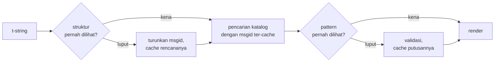

# Cara kerjanya

Tidak ada di halaman ini yang wajib untuk memakai pustaka ini —
[tutorial](tutorial.md) dan [panduan](guide.md) mencakup itu. Halaman ini
justru membangun ulang pustaka ini dari prinsip pertama: apa sebenarnya sebuah
t-string, bagaimana sebuah msgid lahir darinya, apa yang membuat sebuah
terjemahan valid, dan bagaimana implementasinya membuat semua pemeriksaan itu
berbiaya sepersepuluh mikrodetik. Bacalah jika Anda penasaran, jika Anda ingin
berkontribusi, atau jika Anda berencana
[mengimplementasikan konvensinya sendiri](#reimplementing-it).

## Apa sebenarnya sebuah t-string { #what-a-t-string-actually-is }

Sebuah f-string menghasilkan `str`, dan menghasilkannya seketika — pada saat
fungsi mana pun menerimanya, nilainya telah diinterpolasi dan kalimatnya telah
tersegel. Sebuah t-string ([PEP 750]) memiliki sintaks yang sama dan evaluasi
ekspresi yang sama-sama segera, tetapi menghasilkan tipe yang berbeda:

```pycon
>>> name = "Ada"
>>> f"Hello {name}!"
'Hello Ada!'
>>> t"Hello {name}!"
Template(strings=('Hello ', '!'), interpolations=(Interpolation('Ada', 'name', None, ''),))
```

Objek `Template` itu menyimpan bagian-bagian yang dibutuhkan pipeline katalog,
masih terpisah:

```pycon
>>> template = t"Total: {amount:,.2f}"
>>> template.strings
('Total: ', '')
>>> template.interpolations[0].expression
'amount'
>>> template.interpolations[0].value
1234.5
>>> template.interpolations[0].format_spec
',.2f'
```

- `strings` — teks literal di sekeliling interpolasi, berurutan.
- Untuk setiap interpolasi: **expression** sebagai teks sumber (`'amount'`),
  **value** hasil evaluasinya (`1234.5`), serta **conversion** (`!r`) dan
  **format spec** (`,.2f`) apa pun — dibawa terpisah alih-alih diterapkan.

Semua yang dilakukan pustaka ini adalah konsumsi yang disiplin atas struktur
itu. Bahasanya sudah membuat satu pemisahan yang dibutuhkan i18n — teks statis
terpisah dari nilai — sehingga pustaka ini tidak pernah mem-parse kode sumber
Anda dan tidak pernah menebak di mana sebuah nilai berada di dalam sebuah
kalimat. Yang tersisa adalah tiga keputusan: bagaimana strukturnya menjadi
kunci katalog, apa yang boleh dikatakan terjemahan atas kunci itu, dan
bagaimana keduanya dirender kembali bersama.

## Dari template ke msgid { #from-template-to-msgid }

Sebuah msgid — kunci pengindeks sebuah katalog — diturunkan dari bagian
*statis* template saja. Telusuri `strings` dan `interpolations` dalam urutan
sumber; escape kurung kurawal setiap segmen literal (`{` menjadi `{{`); untuk
setiap interpolasi, keluarkan satu token `{name}`, di mana `name` adalah teks
ekspresi dengan spasi di sekelilingnya dibuang. Dari `t"Total: {amount:,.2f}"`:

```text
strings         ('Total: ', '')
interpolations  expression 'amount'   conversion None   format_spec ',.2f'
msgid           'Total: {amount}'
```

Setiap bagian aturan itu punya alasan:

- **Ekspresinya harus nama polos** — `str.isidentifier()` bernilai benar dan
  ia bukan kata kunci Python. `t"Hello {user.name}"` ditolak di tempat
  pemanggilan. Sebuah msgid adalah *kunci*: ia harus keluar identik di setiap
  eksekusi dan setiap ekstraksi, dan ia dibaca oleh penerjemah, sehingga
  placeholder-nya harus kata yang stabil dan bermakna — bukan penggalan kode
  yang mengundang katalog menjadi bahasa ekspresi.
- **Conversion dan format spec tidak pernah masuk ke msgid.** Penerjemah tidak
  seharusnya harus membaca `:,.2f`, dan tidak ada terjemahan yang boleh
  mengubahnya. Korolarinya patut diketahui: mengetatkan `:,.2f` menjadi
  `:,.0f` di kode Anda tidak mengubah msgid mana pun, sehingga tidak
  membatalkan terjemahan mana pun di bahasa mana pun. Kunci katalog mengikuti
  *apa yang dikatakan kalimatnya*, bukan bagaimana nilainya diformat.
- **Nama yang berulang harus mengulang pemformatannya persis.**
  `t"{x:.2f} vs {x:.3f}"` ditolak, karena kedua kemunculannya runtuh menjadi
  token `{x}` yang sama dan msgid-nya tidak lagi bisa mengatakan pemformatan
  mana yang harus dipakai sebuah render.
- **Msgid kosong tidak pernah dicari**, karena gettext mencadangkannya untuk
  header metadata katalog itu sendiri. `t""` merender sebagai `""` tanpa
  menyentuh katalog.

Kumpulan aturan lengkapnya, termasuk kasus tepi yang dilewati halaman ini, ada
di [SPEC §2](https://github.com/yhay81/gettext-tstrings/blob/main/SPEC.md).

## Apa yang boleh dikatakan sebuah terjemahan { #what-a-translation-may-say }

Sebuah pattern yang kembali dari katalog di-parse dengan `string.Formatter` —
parser yang sama yang dipakai `str.format`. Tata bahasanya sengaja dipinjam
alih-alih diciptakan: pattern yang diterima pustaka ini adalah pattern yang
sudah dipahami ekosistem yang lebih luas. Lalu dua pemeriksaan berlaku.

**Bentuk:** setiap field harus berupa `{name}` polos. Sebuah conversion atau
format spec — termasuk `{name:}` yang kosong eksplisit — ditolak, begitu pula
field posisional (`{0}`, `{}`) dan nama berbantalan spasi (`{ name }`). Yang
terakhir lebih penting dari kelihatannya: `str.format` dan GNU `msgfmt`
sama-sama menolak `{ name }`, sehingga menerimanya di sini akan menghasilkan
katalog yang tidak bisa divalidasi perkakas lain mana pun dalam rantainya.

**Nama:** himpunan placeholder pattern-nya dibandingkan dengan milik sumber.
Untuk pesan tunggal, setiap nama sumber *diwajibkan* dan tidak ada yang lain
*diizinkan*. Untuk pesan jamak, kedua cabang digabungkan:

- **diizinkan** = union nama-nama kedua cabang
- **diwajibkan** = interseksinya

Jadi terhadap `t"One file"` / `t"{n} files"`, nama `n` diizinkan dalam
terjemahan salah satu bentuk tetapi tidak diwajibkan pada keduanya. Asimetri
itulah yang membiarkan sistem jamak bahasa sasaran berbeda dari milik sumber —
bahasa Jepang menerjemahkan kedua cabang dengan satu bentuk yang kemungkinan
memakai `{n}`; bahasa dengan lebih banyak bentuk daripada Inggris mungkin
membutuhkan `{n}` di bentuk yang tidak dimiliki bahasa Inggris.

Tidak ada satu pun dari itu yang hipotetis: katalog chrome situs ini sendiri
membawa pesan jamak `Built {n} localized page` / `Built {n} localized pages` —
dua cabang bahasa Inggris — dan edisi-edisi situs ini menerjemahkan satu pesan
itu menjadi mulai dari satu bentuk hingga enam:

| Katalog | Bentuk | Terjemahannya, dalam urutan bentuk |
| --- | --- | --- |
| Jepang | 1 | `ローカライズ済みページを{n}件ビルドしました` |
| Turki | 2 | `{n} yerelleştirilmiş sayfa oluşturuldu` — dua kali, identik: nomina bahasa Turki tetap tunggal setelah kata bilangan |
| Italia | 2 | `Generata {n} pagina localizzata` · `Generate {n} pagine localizzate` — partisipnya menyesuaikan gender dan jumlah |
| Rusia | 3 | `Собрана {n} локализованная страница` · `Собраны {n} локализованные страницы` · `Собрано {n} локализованных страниц` |
| Polandia | 3 | `Zbudowano {n} zlokalizowaną stronę` · `Zbudowano {n} zlokalizowane strony` · `Zbudowano {n} zlokalizowanych stron` |
| Arab | 6 | di antaranya `تم إنشاء صفحة مترجمة واحدة ({n})` untuk tepat satu dan `تم إنشاء {n} صفحات مترجمة` untuk beberapa |

Setiap baris adalah entri hidup di `i18n/*/LC_MESSAGES/site.po` repositori ini,
dirender oleh [build multibahasa](index.md) pada setiap rilis — dan sebuah
pengujian memaku tabel ini ke katalog-katalog itu, sehingga keduanya tidak
dapat saling menjauh.

Dalam batas-batas itu, pengurutan ulang dan pengulangan sengaja dibiarkan
bebas. Keduanya secara tata bahasa diperlukan di bahasa-bahasa nyata, dan
membatasi jumlah kemunculan akan menolak terjemahan yang benar tanpa manfaat
keamanan apa pun: sebuah terjemahan tetap tidak dapat *mengevaluasi* apa pun,
karena tidak ada jalur evaluasi — placeholder dicari menurut nama di
nilai-nilai yang sudah dihitung milik template, tidak pernah diumpankan ke
`eval`, `getattr`, atau `str.format` itu sendiri.

## Rendering { #rendering }

Merender pattern yang tervalidasi adalah penelusuran atas potongan-potongannya:
keluarkan setiap bagian literal, dan untuk setiap placeholder, ambil nilai
tangkapan interpolasinya dan terapkan conversion serta format spec *sisi
sumber* — `format(convert(value, conversion), format_spec)`. Dua jaminan
dijaga selama melakukannya:

- **Setiap nilai berbeda diformat paling banyak sekali per render**, bahkan
  ketika terjemahan mengulang sebuah placeholder. Pengulangan mengubah
  seberapa sering hasilnya disisipkan, bukan seberapa sering `__format__` Anda
  berjalan.
- **Untuk bentuk jamak, sebuah placeholder membaca cabang yang
  mendefinisikannya.** Nama yang hadir di kedua cabang membaca nilai yang
  ditangkap cabang yang dipilih bahasa *sumber* (`singular` ketika `n == 1`,
  selain itu `plural`); nama khusus satu cabang selalu membaca cabangnya
  sendiri, bahkan ketika aturan jamak bahasa sasaran membuatnya tersedia di
  bentuk lain.

Ketika validasi gagal saat render, tanggapannya dipisah menurut siapa yang
memasok pattern-nya. Pattern yang keluar dari *katalog* terdegradasi: catat
satu peringatan dan render teks sumber, menjaga kontrak gettext bahwa katalog
yang rusak tidak pernah menjatuhkan aplikasi
([panduan menunjukkan kedua modenya](guide.md#what-happens-when-a-catalog-is-wrong)).
Pattern yang dilewatkan pemanggil secara langsung —
`CompiledTemplate.render` — selalu melempar galat, karena tidak ada teks
sumber untuk menjadi tempat degradasi; kelonggaran ada untuk pencarian
katalog, bukan untuk argumen.

## Diagnostik adalah bagian dari desain { #diagnostics-are-part-of-the-design }

Galat placeholder biasanya mendarat di depan seorang penerjemah, bukan
programmer, dan sering di berkas tempat masalahnya tak terlihat. Mengatakan
`{name} is missing` kepada orang yang bisa melihat karakter-karakter persis
itu di editornya adalah jalan buntu, jadi pesan-pesannya dihitung dengan tiga
aturan:

- Nama yang berisi **karakter tak terlihat** — no-break space yang dihasilkan
  metode input, zero-width space — dicetak dengan karakter itu digantikan
  titik kodenya, di tempatnya: `{<U+00A0>name}`. Pembacanya perlu melihat
  *di mana*.
- Nama yang huruf-hurufnya **mencampur sistem tulisan**, kasus homoglif,
  ditampilkan dua kali — sekali terbaca, sekali di-escape — karena `{nаme}`
  dengan `а` Kiril tak terbedakan dari `{name}` saat dicetak, dan bentuk
  escape `(nаme)` adalah satu-satunya penulisan yang membedakan keduanya.
- Semua yang lain ditampilkan **sebagaimana tertulis**. `{名前}` dan `{café}`
  adalah nama biasa; meng-escape-nya akan membuat pembaca tak mampu menemukan
  apa yang dimaksud.

Dengan prinsip yang sama, placeholder "hilang" yang *tampak* hadir dijelaskan
ketiadaannya — kurung kurawal lebar penuh dari metode input Asia Timur,
penggandaan `{{name}}` dari perjalanan pulang-pergi escaping, nama di luar
kurung kurawal mana pun.
[Tabel pembacaan kegagalan panduan](guide.md#reading-a-failure-message)
menunjukkan masing-masing pesan itu verbatim.

## Jalur panas { #the-hot-path }

Semua di atas terjadi pada setiap string terjemahan yang dirender sebuah
aplikasi, sehingga implementasinya dibangun di sekitar satu gagasan:
**validasi tidak pernah dilewati, jadi validasilah yang harus di-cache.**



Tiga cache, satu per tahap:

- **Satu rencana per struktur tempat pemanggilan.** Tuple `strings` milik
  template — objek yang sudah dibangun interpreter — adalah kunci cache-nya,
  sehingga sebuah pencarian tidak mengalokasikan apa pun. Saat kena, ekspresi,
  conversion, dan format spec setiap interpolasi tetap dibandingkan dengan
  yang tercatat: dua tempat pemanggilan yang berbagi teks literal tetapi
  berbeda pemformatan (`t"{x:.2f}"` melawan `t"{x:.3f}"`) tidak boleh
  bertabrakan, dan pembandingan itu adalah harga memakai kunci yang diserahkan
  interpreter secara cuma-cuma.
- **Satu putusan per pattern.** Pertama kali sebuah katalog menjawab dengan
  pattern tertentu, ia di-parse dan divalidasi; hasilnya — rencana render
  terkompilasi, atau catatan ketidakvalidan — disimpan pada rencananya. Setiap
  render berikutnya atas pesan itu mencapainya dalam satu pencarian dictionary.
  Pattern yang tidak valid juga diingat, itulah sebabnya entri katalog yang
  rusak memberi peringatan sekali dan bukan pada setiap render.
- **Satu rencana gabungan per pasangan jamak**, menyimpan himpunan
  union/interseksi sehingga aritmetika cabangnya terjadi sekali per pesan,
  bukan sekali per pemanggilan.

Setiap cache dibatasi, dan tak satu pun menahan *nilai* interpolasi — hanya
struktur statis dan teks pattern. Hasilnya, diukur oleh
[`benchmarks/runtime.py`](https://github.com/yhay81/gettext-tstrings/blob/main/benchmarks/runtime.py):
kira-kira 0.4 µs untuk pesan satu field termasuk konstruksi t-string-nya
sendiri, sekitar 2.5× dari `gettext(...).format(...)` polos yang tidak
memeriksa apa pun. Komentar di bagian atas
[`core.py`](https://github.com/yhay81/gettext-tstrings/blob/main/src/gettext_tstrings/core.py)
mencatat pengukuran-pengukuran individual di balik bentuk itu.

## Mengimplementasikannya kembali { #reimplementing-it }

Tidak ada di atas yang menjadi pengetahuan tersembunyi: konvensinya dituliskan
sebagai [spec v1](spec.md), dan
[suite konformans](spec.md#conformance) terbaca mesinnya membiarkan sebuah
ekstraktor, plugin IDE, atau implementasi di bahasa lain memeriksa dirinya
terhadap setiap aturan yang dijelaskan halaman ini. Implementasi ini
menjalankan suite itu di dalam pengujiannya sendiri, itulah yang menjaga
halaman ini, spesifikasinya, dan kodenya tidak saling menjauh dalam diam.

  [PEP 750]: https://peps.python.org/pep-0750/
