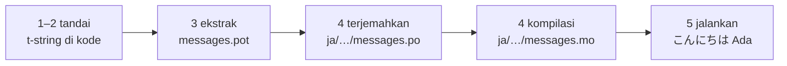

# Tutorial

Halaman ini menempuh jalan dari direktori kosong ke program yang menyapa dalam
bahasa Jepang. Lima langkah, tanpa mengandaikan pengalaman gettext, dan setiap
perintah ditampilkan bersama keluaran yang benar-benar dihasilkannya — sehingga
di setiap langkah Anda tahu apakah masih berada di jalur yang benar.

Anda memerlukan Python 3.14 atau lebih baru, karena t-string adalah sintaks
baru di 3.14. Bahasa Jepang adalah sasaran contoh halaman ini, tetapi tidak ada
yang bergantung pada pilihan itu. Untuk memakai bahasa lain, ganti `ja` di
langkah 4 — kode locale itu satu-satunya hal yang menyebutnya.

## 1. Instalasi { #1-install }

```console
python -m pip install "gettext-tstrings[babel]"
```

Extra `[babel]` menghadirkan [Babel], perkakas yang mengumpulkan pesan-pesan
Anda ke dalam berkas katalog di langkah 3. Ia perkakas masa pengembangan: kode
produksi merender dengan pustaka standar saja.

## 2. Tandai sebuah pesan di kode Anda { #2-mark-a-message-in-your-code }

Buat `app.py`:

```python
from gettext_tstrings import tr

name = "Ada"
print(tr(t"Hello {name}"))
```

`t"Hello {name}"` terlihat seperti f-string, tetapi prefiks `t` menjaga teks
dan nilai tetap terpisah alih-alih menggabungkannya di tempat. Pemisahan itulah
yang memungkinkan `tr()` mencari terjemahan untuk kalimat utuh `Hello {name}`
dan menyisipkan nilainya sesudahnya.

Jalankan sekarang:

```console
$ python app.py
Hello Ada
```

Belum ada terjemahan yang terpasang, jadi teks sumber dirender apa adanya.
Program yang memakai pustaka ini tidak pernah *mewajibkan* katalog untuk
berjalan — bahasa Inggris (atau apa pun bahasa sumber Anda) adalah fallback
bawaannya.

## 3. Ekstrak pesan-pesannya { #3-extract-the-messages }

Penerjemah umumnya bekerja dari katalog alih-alih dari kode sumber, jadi sebuah
berkas kecil yang disebut **katalog** berpindah-pindah antara Anda dan mereka.
Langkah pertama menuju ke sana adalah mengumpulkan setiap pesan yang ditandai
keluar dari kode.

Beri tahu Babel cara menemukan pesan Anda dengan membuat `babel.cfg`:

```ini
[gettext_tstrings: **.py]
encoding = utf-8
```

Lalu ekstrak ke sebuah berkas templat (`.pot`):

```console
$ mkdir -p locales
$ pybabel extract -F babel.cfg -c "Translators:" -o locales/messages.pot .
extracting messages from app.py (encoding="utf-8")
writing PO template file to locales/messages.pot
```

`locales/messages.pot` kini berisi satu entri per pesan:

```po
#. gettext-tstrings
#: app.py:4
#, python-brace-format
msgid "Hello {name}"
msgstr ""
```

`msgid` adalah kunci yang akan dicari kode Anda. `msgstr` yang kosong adalah
tempat terjemahan ditulis — tetapi bukan di berkas ini: sebuah `.pot` adalah
*templat*, dan langkah berikutnya menyalinnya sekali per bahasa.

## 4. Terjemahkan dan kompilasi { #4-translate-and-compile }

Buat katalog bahasa Jepang dari templat itu:

```console
$ pybabel init -i locales/messages.pot -d locales -l ja
creating catalog locales/ja/LC_MESSAGES/messages.po based on locales/messages.pot
```

Buka `locales/ja/LC_MESSAGES/messages.po` dan isikan `msgstr`-nya:

```po
msgid "Hello {name}"
msgstr "こんにちは {name}"
```

Pertahankan `{name}` persis apa adanya — placeholder itulah cara nilai
menemukan tempatnya di dalam kalimat terjemahan, dan terjemahan bebas
memindahkannya ke mana pun bahasa sasaran membutuhkannya. Di proyek nyata,
berkas `.po` inilah yang Anda serahkan ke penerjemah atau unggah ke platform
penerjemahan; formatnya sama saja.

Katalog disunting sebagai teks tetapi dimuat dalam bentuk biner (`.mo`), jadi
kompilasilah:

```console
$ pybabel compile -d locales
compiling catalog locales/ja/LC_MESSAGES/messages.po to locales/ja/LC_MESSAGES/messages.mo
```

Perintah ini juga jaring pengaman. Seandainya terjemahan merusak
placeholder-nya — `{nome}` alih-alih `{name}`, misalnya — ia akan menolak
lolos:

```console
$ pybabel compile -d locales
error: locales/ja/LC_MESSAGES/messages.po:24: translation does not match the
source placeholders: {name} is missing; {nome} is not in the source message
1 errors encountered.
```

Satu catatan yang layak diketahui sekarang: ia melaporkan galatnya dan keluar
dengan status bukan nol, tetapi tetap menulis `.mo`-nya. Pada proyek nyata,
CI-lah yang harus berhenti pada status keluar itu —
[Dalam produksi](workflow.md#what-ci-gates) menyiapkannya.

## 5. Jalankan { #5-run-it }

Langkah 2–4 memakai `tr()`, yang mencari sebuah katalog dan tidak menemukannya.
Sekarang setelah katalognya ada, muat dan ikat sekali: `Translator` memegang
sebuah katalog agar titik pemanggilannya tidak perlu menyebutnya, dan `_` adalah
nama gettext konvensional untuk hasilnya.

Arahkan `app.py` ke katalog yang telah dikompilasi. Klik penandanya untuk
melihat apa yang dilakukan setiap baris:

```python
import gettext

from gettext_tstrings import Translator

_ = Translator(gettext.translation("messages", localedir="locales", languages=["ja"]))  # (1)!

name = "Ada"
print(_(t"Hello {name}"))  # (2)!
```

1. Pustaka standar memuat `.mo` hasil kompilasi, dan `Translator` mengikatnya
   ke sebuah callable. `_` adalah nama gettext konvensional untuk "terjemahkan
   ini" — pendek karena ia muncul di setiap string yang dilihat pengguna. Ia
   melakukan penerjemahan yang sama dengan `tr`, terikat ke satu katalog.
2. Pada pemanggilan: teks t-string menjadi kunci pencarian `Hello {name}`,
   katalog menjawab `こんにちは {name}`, jawabannya diperiksa terhadap
   placeholder sumber, dan hanya setelah itu nilainya dimasukkan.

```console
$ python app.py
こんにちは Ada
```

Itulah seluruh putarannya, dan layak dilihat sebagai satu gambar:



**Tandai → ekstrak → terjemahkan → kompilasi → jalankan.** Semua hal lain di
situs ini adalah penghalusan dari salah satu di antara lima langkah itu.

## Ke mana selanjutnya { #where-next }

- [Mengapa t-string](comparison.md) — apa yang dilindungi desain ini dari
  Anda, dibandingkan `%(name)s`, `.format()`, dan `$`-string.
- [Panduan](guide.md) — bentuk jamak, bahasa per permintaan, string tertunda,
  dan apa yang terjadi saat runtime ketika sebuah katalog tetap saja salah.
- [Dalam produksi](workflow.md) — putaran yang sama sebagaimana dijalankan
  sebuah tim, minggu demi minggu: memperbarui katalog, gerbang CI, dan
  platform penerjemahan.
- [Ekstraksi](extraction.md) — referensi `pybabel` lengkap: nama fungsi
  kustom, mode CI ketat, dan pemeriksaan yang menjaga katalog Anda.
- [Migrasi](migration.md) — jika proyek yang sebenarnya ingin Anda kerjakan
  dengan ini sudah punya katalog gettext.
- [Untuk penerjemah](translators.md) — satu halaman untuk diserahkan kepada
  siapa pun yang mengisi baris `msgstr` itu.

  [Babel]: https://babel.pocoo.org/
