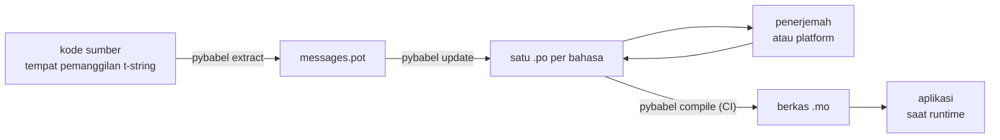

# Dalam produksi

[Tutorial](tutorial.md) menjalankan putarannya sekali, sendirian, pada program
dengan satu pesan. Di proyek nyata putaran itu terus berputar: pesan berubah
setelah diterjemahkan, penerjemah bekerja di tempat lain dan menurut jadwalnya
sendiri, dan katalog terkompilasi dikirim bersama setiap rilis. Halaman ini
adalah praktik itu — apa yang tinggal di repositori, apa yang bepergian, apa
yang harus dijaga CI, dan di mana runtime mengikat sebuah bahasa.

## Bentuk sebuah proyek { #the-shape-of-a-project }

```text
myapp/
├── babel.cfg
├── pyproject.toml
├── src/
│   └── myapp/
└── locales/
    ├── messages.pot
    ├── ja/LC_MESSAGES/messages.po
    └── de/LC_MESSAGES/messages.po
```

Commit `babel.cfg`, templat `.pot`, dan setiap `.po` — mereka adalah sumber
dari build terjemahan, dan diff mereka adalah cara Anda meninjau perubahan
terjemahan. Berkas `.mo` terkompilasi adalah artefak build: hasilkan di CI
atau saat pengemasan alih-alih meng-commit-nya, sehingga sebuah `.po` dan
`.mo`-nya tidak pernah bisa berselisih tentang apa yang dikirim.

Satu berkas berperan di setiap arah: `.pot` membawa pesan-pesan Anda *keluar*
ke penerjemah, berkas-berkas `.po` membawa terjemahan *kembali*. Semua di
bawah ini adalah lalu lintas antara keduanya.



## Siklus setelah terjemahan pertama { #the-cycle-after-the-first-translation }

`pybabel init` milik tutorial berjalan sekali per bahasa, selamanya. Sejak
itu, siklus kerjanya adalah **ekstrak → update → terjemahkan → kompilasi**,
dan pusatnya adalah `pybabel update`, yang melipat sebuah templat segar ke
dalam katalog yang ada tanpa membuang terjemahan yang sudah ada di dalamnya.

Misalkan sapaan `Hello {name}` — yang sudah diterjemahkan sebagai
`こんにちは {name}` — ditulis ulang di kode menjadi `Welcome back, {name}`.
Ekstrak dan update:

```console
$ pybabel extract -F babel.cfg -c "Translators:" -o locales/messages.pot .
extracting messages from app.py (encoding="utf-8")
writing PO template file to locales/messages.pot
$ pybabel update -i locales/messages.pot -d locales
updating catalog locales/ja/LC_MESSAGES/messages.po based on locales/messages.pot
```

Katalog bahasa Jepang kini berisi:

```po
#. gettext-tstrings
#: app.py:4
#, fuzzy, python-brace-format
msgid "Welcome back, {name}"
msgstr "こんにちは {name}"
```

Babel menyadari msgid baru itu menyerupai yang dihapus dan memasangkannya
dengan terjemahan lama — tetapi menandai pasangan itu **fuzzy**: tebakan mesin
yang menunggu manusia. Flag itu bergigi. `pybabel compile` **mengecualikan
entri fuzzy dari `.mo`**, sehingga sampai seorang penerjemah menegaskan
pasangan itu, aplikasi merender teks Inggris yang baru alih-alih teks Jepang
yang basi:

```console
$ pybabel compile -d locales
compiling catalog locales/ja/LC_MESSAGES/messages.po to locales/ja/LC_MESSAGES/messages.mo
$ python app.py
Welcome back, Ada
```

Sebuah pesan yang berubah karena itu terdegradasi dengan cara yang sama
seperti pesan yang rusak — ke bahasa sumber, tidak pernah ke terjemahan yang
kedaluwarsa. Bagian penerjemah dalam siklus ini adalah merevisi `msgstr` dan
menghapus flag `fuzzy`; kompilasi berikutnya memungut entri itu.

!!! note "Nama placeholder adalah bagian dari identitas pesan"

    Msgid adalah kunci katalog, dan *nama* placeholder ada di dalamnya —
    sehingga mengganti nama sebuah variabel di kode (`name` → `user_name`)
    mengubah msgid dan mengirim terjemahan setiap bahasa atasnya kembali
    melewati siklus fuzzy. Namai variabel yang diinterpolasi dengan kata-kata
    yang akan dipahami penerjemah, dan ganti namanya hanya dengan alasan.

    Pemformatan adalah bayangan cerminnya: `!r` dan `:.2f`
    [bukan bagian dari msgid](internals.md#from-template-to-msgid), sehingga
    mengetatkan `{amount:,.2f}` menjadi `{amount:,.0f}` tidak mengubah apa pun
    di katalog mana pun. Menulis ulang *kalimatnya*, tentu saja, adalah
    perubahan sungguhan — itulah siklus di atas.

## Apa yang dijaga CI { #what-ci-gates }

Tiga kegagalan layak membuat build merah: katalog tertinggal dari kode,
sebuah terjemahan merusak placeholder, atau entri yang rusak lolos sampai ke
runtime. Satu langkah per kegagalan:

```yaml
- run: pybabel extract -F babel.cfg -c "Translators:" -o locales/messages.pot .
- run: pybabel update -i locales/messages.pot -d locales --check
- run: pybabel compile -d locales
- run: pytest
```

`pybabel update --check` tidak menulis ulang apa pun dan keluar dengan status
bukan nol ketika sebuah katalog ketinggalan zaman terhadap templat yang baru
diekstrak — penjaga terhadap me-merge kode yang pesannya tidak diekstrak ulang
siapa pun. `pybabel compile` menjalankan pemeriksaan placeholder milik Babel
dan
[checker terdaftar](extraction.md#your-existing-toolchain-validates-these-catalogs)
paket ini.

!!! bug "`--check` tidak dapat menjaga katalog yang memakai konteks"

    Pada Babel 2.18.0, `pybabel update --check` melaporkan **setiap** katalog
    yang memuat `msgctxt` sebagai ketinggalan zaman, pada setiap kali
    dijalankan, sebaru apa pun katalog itu. Perbandingannya berjalan melalui
    `Catalog.is_identical`, yang mencari setiap pesan berdasarkan kunci tempat
    pesan itu disimpan — dan untuk pesan kontekstual kunci itu adalah pasangan
    `(id, context)`, yang tidak diterima oleh `Catalog.get`. Pencariannya tidak
    mengembalikan apa pun, dan katalog-katalognya tidak pernah dinilai sama:

    ```pycon
    >>> from babel.messages.catalog import Catalog
    >>> c = Catalog(locale="ja")
    >>> c.add("Guide", "ガイド", context="navigation")
    <Message 'Guide' (flags: [])>
    >>> c.is_identical(c)
    False
    ```

    Jadi jika Anda memakai `pgettext` atau `npgettext` sama sekali — dan
    membedakan homonim adalah alasan keduanya ada — langkah ini gagal terbuka
    dengan cara yang paling buruk: selalu merah, sehingga sebuah tim
    mematikannya, sehingga tidak ada lagi yang menjaga keusangan. Sampai hal
    itu diperbaiki di hulu, bandingkan sendiri himpunan pesannya. Membaca
    templat dan setiap katalog dengan `babel.messages.pofile.read_po` lalu
    membandingkan `{(m.context, m.id) for m in catalog if m.id}` adalah
    keseluruhan pemeriksaannya, dan itulah yang dilakukan
    [build situs ini sendiri](index.md).

!!! danger "Periksa status keluarnya, bukan log-nya"

    `pybabel compile` melaporkan setiap galat placeholder, keluar dengan
    status bukan nol — **dan tetap menulis `.mo`-nya**. Pipeline yang
    mengompilasi lalu menyalin `locales/` ke sebuah image mengirimkan katalog
    yang rusak kecuali status keluar bukan nol itu benar-benar
    menghentikannya. Membiarkan langkah itu menggagalkan build, seperti di
    atas, adalah keseluruhan perbaikannya.

Baris terakhir adalah suite pengujian biasa Anda, dengan satu kebiasaan
tambahan: di suatu tempat di dalamnya, render setidaknya satu pesan per bahasa
yang dikirim melalui translator yang ketat —

```python
import gettext

from gettext_tstrings import Translator

def test_catalogs_render(language: str) -> None:
    translations = gettext.translation("messages", localedir="locales", languages=[language])
    _ = Translator(translations, strict=True)
    name = "Ada"
    assert _(t"Welcome back, {name}")
```

— karena `strict=True`
[melempar galat di tempat produksi akan diam-diam kembali ke teks sumber](guide.md#what-happens-when-a-catalog-is-wrong),
dan sebuah render runtime adalah satu-satunya pemeriksaan yang melihat katalog
persis seperti aplikasi akan melihatnya, `.mo` dan semuanya.

## Bekerja dengan penerjemah dan platform { #working-with-translators-and-platforms }

Berkas `.po` adalah format pertukaran seluruh dunia gettext, itulah alasan
pustaka ini memakainya kembali: menyerahkan penerjemahan berarti menyerahkan
sebuah berkas, entah penerimanya seorang kolega dengan editor PO atau sebuah
platform seperti Weblate atau Crowdin. Tiga hal membuat serah terima itu
berjalan baik:

**Katakan untuk apa pesan itu.** Sebuah komentar di kode bepergian bersama
pesannya — itulah yang dikumpulkan flag `-c "Translators:"`:

```python
from gettext_tstrings import tr

name = "Ada"
# Translators: shown on the dashboard right after sign-in
print(tr(t"Welcome back, {name}"))
```

```po
#. Translators: shown on the dashboard right after sign-in
#. gettext-tstrings
#: app.py:5
#, python-brace-format
msgid "Welcome back, {name}"
msgstr ""
```

Seorang penerjemah melihat komentar itu di editornya, di sebelah pesannya, di
belahan dunia yang lain. Itu tuas kualitas termurah di seluruh alur kerja.
Untuk kata yang menjadi homonim dirinya sendiri — "Open" si tombol versus
"Open" si keadaan — beri pesannya sebuah [konteks](guide.md#binding-a-catalog)
dengan `pgettext`, yang menjadi `msgctxt` yang terlihat di katalog.

**Biarkan platform memvalidasi placeholder.** Setiap pesan yang diekstrak
dari t-string membawa flag `python-brace-format`, dan satu baris itulah yang
menyalakan QA placeholder di perkakas yang tidak Anda kendalikan — Weblate
mendokumentasikan pemeriksaannya, platform komersial menautkan milik mereka
pada flag yang sama, dan `msgfmt --check-format` menegakkannya di pipeline GNU
mana pun. Detailnya, dan apa yang ditangkap checker bawaan di luar itu, ada di
[halaman ekstraksi](extraction.md#your-existing-toolchain-validates-these-catalogs).

**Percayai jaring pengamannya persis sejauh jangkauannya.** Apa pun yang
kembali dari sebuah platform tetaplah data yang memasuki build Anda; gerbang
CI di atas adalah yang mengubah "platformnya mungkin sudah memeriksa ini"
menjadi "ini tidak mungkin dikirim dalam keadaan rusak".

## Mengikat bahasa saat runtime { #binding-a-language-at-runtime }

Semua sejauh ini menghasilkan katalog. Keputusan yang tersisa adalah di mana
aplikasi memilih satu, dan itu punya satu jawaban jujur: ikat sekali per
*lingkup sebuah bahasa* — proses untuk CLI, permintaan untuk layanan web.

=== "Satu proses, satu bahasa"

    Perkakas baris perintah atau aplikasi desktop membaca lingkungan pengguna
    sekali, saat mulai. Tidak melewatkan `languages=` membiarkan pustaka
    standar bernegosiasi dari `LANGUAGE`, `LC_ALL`, `LC_MESSAGES`, dan `LANG`;
    `fallback=True` mengembalikan katalog null — teks sumber — alih-alih
    melempar galat ketika tak satu pun dari mereka cocok dengan katalog yang
    Anda kirim.

    ```python
    import gettext

    from gettext_tstrings import Translator

    _ = Translator(gettext.translation("messages", localedir="locales", fallback=True))

    name = "Ada"
    print(_(t"Welcome back, {name}"))
    ```

=== "Flask"

    Aplikasi web memutuskan per permintaan. Muat setiap katalog sekali saat
    impor, lalu ikat yang ternegosiasi ke konteks sebelum view berjalan —
    [`set_translations`](guide.md#per-request-language) bersifat
    context-local, sehingga permintaan bersamaan dalam bahasa berbeda tidak
    pernah melihat ikatan satu sama lain.

    ```python
    import gettext

    from flask import Flask, request

    from gettext_tstrings import set_translations, tr

    LANGUAGES = ("en", "ja", "de")
    CATALOGS = {
        language: gettext.translation(
            "messages", localedir="locales", languages=[language], fallback=True
        )
        for language in LANGUAGES
    }

    app = Flask(__name__)

    @app.before_request
    def bind_language() -> None:
        language = request.accept_languages.best_match(LANGUAGES) or "en"
        set_translations(CATALOGS[language])

    @app.get("/")
    def home() -> str:
        name = "Ada"
        return tr(t"Welcome back, {name}")
    ```

=== "Middleware ASGI"

    Di bawah framework async — FastAPI, Starlette, dan apa pun yang ASGI —
    bungkus permintaan dalam
    [`use_translations`](guide.md#per-request-language): ikatannya hidup di
    sebuah `ContextVar`, yang dipertahankan pergantian task async per
    permintaan.

    ```python
    import gettext

    from fastapi import FastAPI, Request

    from gettext_tstrings import tr, use_translations

    LANGUAGES = ("en", "ja", "de")
    CATALOGS = {
        language: gettext.translation(
            "messages", localedir="locales", languages=[language], fallback=True
        )
        for language in LANGUAGES
    }

    app = FastAPI()

    @app.middleware("http")
    async def bind_language(request: Request, call_next):
        language = negotiate_language(request.headers.get("accept-language"), LANGUAGES)
        with use_translations(CATALOGS[language]):
            return await call_next(request)
    ```

    `negotiate_language` mewakili parsing Accept-Language Anda — sebagian
    besar framework atau ekosistemnya menyediakannya; yang penting di sini
    adalah ikatan di sekeliling `call_next`.

Dua kebiasaan runtime melengkapi gambarnya. String yang dibuat saat impor —
label formulir, nama tampilan sebuah enum — tidak boleh menangkap bahasa apa
pun yang aktif selama impor; definisikan dengan
[`lazy_gettext`](guide.md#deferred-translation) dan mereka merender dalam
bahasa yang aktif saat *digunakan*. Dan arahkan logger `gettext_tstrings` ke
tempat yang dilihat manusia: peringatannya adalah mode longgar yang melaporkan
terjemahan yang lolos dari setiap gerbang, satu baris per pesan yang rusak dan
bukan satu per render.

## Pengiriman { #shipping }

Produksi membutuhkan paketnya, berkas-berkas `.mo`, dan tidak yang lain. Babel
adalah dependensi pengembangan dan CI — jauhkan `gettext-tstrings[babel]` dari
image produksi dan pasang paket polosnya di sana; rendering berjalan dengan
pustaka standar saja. Kompilasi katalog di build yang sama yang menghasilkan
artefak yang Anda deploy, sehingga berkas `.mo` di dalamnya persis berkas
`.po` yang telah ditinjau, dan tidak ada hasil kompilasi laptop siapa pun yang
pernah terkirim.

Sebelum sebuah rilis, daftar periksa yang menjadi inti halaman ini:

- `pybabel update --check` lolos — tidak ada pesan yang berubah tanpa
  katalognya mendengar.
- `pybabel compile` menggerbangkan build pada status keluarnya.
- Entri `fuzzy` yang tersisa memang disengaja — masing-masing merender sebagai
  teks sumber sampai seorang penerjemah menegaskannya.
- Suite pengujian merender setiap bahasa yang dikirim sekali dengan
  `strict=True`.
- Artefak produksi berisi berkas `.mo` dan tanpa Babel.
- Logger `gettext_tstrings` diarahkan ke pemantauan.

## Ke mana selanjutnya { #where-next }

- [Ekstraksi](extraction.md) — referensi untuk paruh perkakas halaman ini:
  opsi pemetaan, nama fungsi kustom, mode ketat, dan setiap checker.
- [Panduan](guide.md) — paruh runtime-nya: bentuk jamak, konteks, string
  tertunda, dan mode-mode kegagalan secara terperinci.
- [Cara kerjanya](internals.md) — mengapa msgid berbentuk seperti itu, dan apa
  yang sebenarnya diperiksa validasi.
