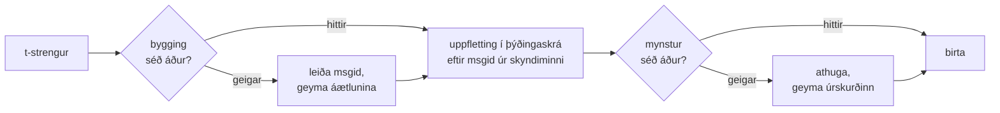

# Hvernig þetta virkar

Ekkert á þessari síðu er nauðsynlegt til að nota safnið —
[kennsluefnið](tutorial.md) og [handbókin](guide.md) sjá um það. Þessi síða
byggir safnið þess í stað upp á nýtt frá grunnreglum: hvað t-strengur er í
raun og veru, hvernig msgid dettur út úr honum, hvað gerir þýðingu gilda, og
hvernig útfærslan lætur alla þá athugun kosta tíundu hluta úr míkrósekúndu.
Lestu hana ef þú ert forvitinn, ef þig langar að leggja til, eða ef þú
hyggst [útfæra venjuna sjálfur](#reimplementing-it).

## Hvað t-strengur er í raun og veru { #what-a-t-string-actually-is }

f-strengur framleiðir `str`, og framleiðir hann samstundis — um leið og
eitthvert fall tekur við honum er búið að skeyta gildinu inn og setningin er
innsigluð. t-strengur ([PEP 750]) hefur sömu málskipan og reiknar segðir
sínar jafn snemma, en framleiðir aðra tegund:

```pycon
>>> name = "Ada"
>>> f"Hello {name}!"
'Hello Ada!'
>>> t"Hello {name}!"
Template(strings=('Hello ', '!'), interpolations=(Interpolation('Ada', 'name', None, ''),))
```

Þessi `Template`-hlutur heldur þeim hlutum sem þýðingaskrárkeðja þarf, enn
aðskildum:

```pycon
>>> template = t"Total: {amount:,.2f}"
>>> template.strings
('Total: ', '')
>>> template.interpolations[0].expression
'amount'
>>> template.interpolations[0].value
1234.5
>>> template.interpolations[0].format_spec
',.2f'
```

- `strings` — fasti textinn kringum innskeytingarnar, í röð.
- Fyrir hverja innskeytingu: **segðin** sem frumtexti (`'amount'`), útreiknað
  **gildi** hennar (`1234.5`), og hver sú **umbreyting** (`!r`) og
  **sniðlýsing** (`,.2f`) sem er til staðar — borin með fremur en beitt.

Allt sem þetta safn gerir er öguð neysla þeirrar byggingar. Málið hafði þegar
gert þann eina aðskilnað sem i18n þarf — fastan texta frá gildum — svo að
safnið þáttar aldrei frumkóðann þinn og giskar aldrei á hvar gildi situr inni
í setningu. Eftir standa þrjár ákvarðanir: hvernig byggingin verður að lykli
þýðingaskrár, hvað þýðing á þeim lykli má segja, og hvernig þau tvö birtast
saman aftur.

## Frá sniðmáti að msgid { #from-template-to-msgid }

Msgid — lykillinn sem þýðingaskrá er skrásett eftir — er leitt eingöngu af
*föstu* hlutum sniðmátsins. Gakktu gegnum `strings` og `interpolations` í röð
frumtextans; escape-ritaðu slaufusviga í hverjum föstum bút (`{` verður
`{{`); gefðu út eitt `{name}`-tákn fyrir hverja innskeytingu, þar sem `name`
er texti segðarinnar með bilum í kring skorin af. Út frá
`t"Total: {amount:,.2f}"`:

```text
strings         ('Total: ', '')
interpolations  expression 'amount'   conversion None   format_spec ',.2f'
msgid           'Total: {amount}'
```

Hver hluti þeirrar reglu á sér ástæðu:

- **Segðin verður að vera bert nafn** — `str.isidentifier()` er satt og það
  er ekki lykilorð í Python. `t"Hello {user.name}"` er hafnað á kallstaðnum.
  Msgid er *lykill*: hann verður að koma eins út í hverri keyrslu og hverjum
  útdrætti, og þýðendur lesa hann, svo staðgengillinn verður að vera stöðugt,
  merkingarbært orð — ekki kóðabútur sem býður þýðingaskránni að verða að
  segðamáli.
- **Umbreytingin og sniðlýsingin komast aldrei inn í msgid-ið.** Þýðendur
  eiga ekki að þurfa að lesa `:,.2f`, og engin þýðing á að geta breytt því.
  Fylgisetningin er þess virði að vita: að herða `:,.2f` í `:,.0f` í kóðanum
  þínum breytir engu msgid-i, svo það ógildir enga þýðingu á neinu tungumáli.
  Lykill þýðingaskrárinnar fylgir *því sem setningin segir*, ekki því hvernig
  gildið er sniðið.
- **Endurtekið nafn verður að endurtaka snið sitt nákvæmlega.**
  `t"{x:.2f} vs {x:.3f}"` er hafnað, því bæði tilvikin falla saman í sama
  `{x}`-táknið og msgid-ið gæti ekki lengur sagt hvaða snið birting ætti að
  nota.
- **Tóma msgid-ið er aldrei flett upp**, því gettext tekur það frá fyrir
  lýsigagnahaus þýðingaskrárinnar sjálfrar. `t""` birtist sem `""` án þess að
  snerta þýðingaskrána.

Allt reglusafnið, þar með talin jaðartilvik sem þessi síða sleppir, er
[SPEC §2](https://github.com/yhay81/gettext-tstrings/blob/main/SPEC.md).

## Hvað þýðing má segja { #what-a-translation-may-say }

Mynstur sem kemur til baka úr þýðingaskrá er þáttað með `string.Formatter` —
sama þáttaranum og `str.format` notar. Málfræðin er fengin að láni af ásettu
ráði fremur en fundin upp: mynstur sem þetta safn tekur við er mynstur sem
vistkerfið í kring skilur nú þegar. Síðan eru tvær athuganir gerðar.

**Lag:** hver reitur verður að vera bert `{name}`. Umbreytingu eða sniðlýsingu
— þar með talið hinu beinlínis tóma `{name:}` — er hafnað, og sömuleiðis
reitum eftir stöðu (`{0}`, `{}`) og nöfnum með bilum í kring (`{ name }`). Það
síðasta skiptir meira máli en sýnist: bæði `str.format` og GNU `msgfmt` hafna
`{ name }`, svo að taka við því hér myndi framleiða þýðingaskrár sem ekkert
annað tól í keðjunni getur staðfest.

**Nöfn:** mengi staðgengla mynstursins er borið saman við mengi frumtextans.
Fyrir eintöluskilaboð er hvert nafn frumtextans *áskilið* og ekkert annað
*leyfilegt*. Fyrir fleirtöluskilaboð eru greinarnar tvær sameinaðar:

- **leyfilegt** = sammengi nafnanna í báðum greinum
- **áskilið** = sniðmengi þeirra

Þannig að gagnvart `t"One file"` / `t"{n} files"` er nafnið `n` leyfilegt í
þýðingu hvorrar myndar sem er en áskilið í hvorugri. Það ójafnvægi er það sem
leyfir fleirtölukerfi markmálsins að vera annað en frummálsins — japanska
þýðir báðar greinarnar með einni mynd sem notar líklega `{n}`; mál með fleiri
myndir en enskan gæti þurft `{n}` í mynd þar sem enskan hefur enga.

Ekkert af þessu er tilgáta: viðmótsþýðingaskrá þessa vefs sjálfs ber
fleirtöluskilaboðin `Built {n} localized page` / `Built {n} localized pages`
— tvær enskar greinar — og útgáfur vefsins þýða þau einu skilaboð yfir í allt
frá einni mynd upp í sex:

| Þýðingaskrá | Myndir | Þýðingarnar, í röð myndanna |
| --- | --- | --- |
| Japanska | 1 | `ローカライズ済みページを{n}件ビルドしました` |
| Tyrkneska | 2 | `{n} yerelleştirilmiş sayfa oluşturuldu` — tvisvar, alveg eins: tyrknesk nafnorð standa í eintölu á eftir töluorði |
| Ítalska | 2 | `Generata {n} pagina localizzata` · `Generate {n} pagine localizzate` — lýsingarhátturinn samræmist í kyni og tölu |
| Lettneska | 3 | `Izveidota {n} lokalizēta lapa` · `Izveidotas {n} lokalizētas lapas` · `Izveidots {n} lokalizētu lapu` — þriðja myndin er **fyrir núllið eitt** |
| Rússneska | 3 | `Собрана {n} локализованная страница` · `Собраны {n} локализованные страницы` · `Собрано {n} локализованных страниц` |
| Pólska | 3 | `Zbudowano {n} zlokalizowaną stronę` · `Zbudowano {n} zlokalizowane strony` · `Zbudowano {n} zlokalizowanych stron` |
| Slóvenska | 4 | `Zgrajena {n} lokalizirana stran` · `Zgrajeni {n} lokalizirani strani` · `Zgrajene {n} lokalizirane strani` · `Zgrajenih {n} lokaliziranih strani` — önnur myndin er **tvítala**, fyrir nákvæmlega tvö |
| Írska | 5 | `Tógadh {n} leathanach logánaithe` · `Tógadh {n} leathanaigh logánaithe` — einn, tveir, 3–6, 7–10 og afgangurinn; stofninn víxlast, en *leathanach* byrjar á `l`, sem engin írsk framstöðubreyting ritar, svo nokkrar myndir falla saman |
| Arabíska | 6 | meðal þeirra `تم إنشاء صفحة مترجمة واحدة ({n})` fyrir nákvæmlega einn og `تم إنشاء {n} صفحات مترجمة` fyrir fáeina |

Hver einasta lína er lifandi færsla í `i18n/*/LC_MESSAGES/site.po` þessarar
geymslu, birt af [fjöltyngdu byggingunni](index.md) við hverja útgáfu — og
próf festir þessa töflu við þær þýðingaskrár, svo að þær tvær geta ekki rekið
í sundur.

Innan þeirra marka eru víxlun og endurtekning óheftar af ásettu ráði. Hvort
tveggja er málfræðilega nauðsynlegt í raunverulegum tungumálum, og að takmarka
fjölda tilvika myndi hafna réttum þýðingum án nokkurs öryggisávinnings: þýðing
getur eftir sem áður ekki *reiknað* neitt út, því engin reikningsleið er til —
staðgenglum er flett upp eftir nafni í þeim gildum sniðmátsins sem þegar hafa
verið reiknuð, þeir eru aldrei matreiddir ofan í `eval`, `getattr` eða
`str.format` sjálft.

## Birting { #rendering }

Að birta athugað mynstur er ganga gegnum búta þess: gefðu út hvern fastan
hluta, og taktu fyrir hvern staðgengil það gildi sem innskeytingin greip og
beittu umbreytingunni og sniðlýsingunni *frá hlið frumtextans* —
`format(convert(value, conversion), format_spec)`. Tveimur ábyrgðum er haldið
á meðan:

- **Hvert ólíkt gildi er sniðið í mesta lagi einu sinni í hverri birtingu**,
  jafnvel þegar þýðingin endurtekur staðgengil. Endurtekning breytir því hve
  oft niðurstaðan er sett inn, ekki því hve oft `__format__` þitt keyrir.
- **Í fleirtölu les staðgengill þá grein sem skilgreindi hann.** Nafn sem er
  til í báðum greinum les það gildi sem greinin sem *frummálið* velur greip
  (`singular` þegar `n == 1`, annars `plural`); nafn sem tilheyrir einni grein
  les alltaf sína eigin grein, jafnvel þegar fleirtölureglur markmálsins gerðu
  það aðgengilegt í annarri mynd.

Þegar athugun bregst við birtingu ræðst svarið af því hver lagði mynstrið til.
Mynstur sem kom úr *þýðingaskrá* hrörnar: skráðu eina viðvörun og birtu
frumtextann, og haltu þar með samningi gettext um að biluð þýðingaskrá felli
aldrei forritið
([handbókin sýnir báða hamina](guide.md#what-happens-when-a-catalog-is-wrong)).
Mynstur sem kallandinn rétti beint inn — `CompiledTemplate.render` — varpar
alltaf, því enginn frumtexti er til að hrörna *frá*; eftirgefanleikinn er til
fyrir uppflettingar í þýðingaskrá, ekki fyrir viðföng.

## Greiningarskilaboð eru hluti af hönnuninni { #diagnostics-are-part-of-the-design }

Villa í staðgengli lendir yfirleitt fyrir framan þýðanda, ekki forritara, og
oft í skrá þar sem vandinn er ósýnilegur. Að segja `{name} is missing` við
einhvern sem sér einmitt þá stafi í ritlinum sínum er blindgata, svo að
skilaboðin eru reiknuð eftir þremur reglum:

- Nafn sem inniheldur **ósýnilegan staf** — fast bil sem innsláttaraðferð
  framleiddi, núllbreitt bil — er prentað með þeim staf skiptum út fyrir
  kóðapunkt sinn, á staðnum: `{<U+00A0>name}`. Lesandinn þarf að sjá *hvar*.
- Nafn þar sem stafirnir **blanda ritkerfum**, samstöfunartilvikið, er sýnt
  tvisvar — einu sinni læsilega, einu sinni með escape-ritun — því `{nаme}`
  með kýrillísku `а` er ógreinanlegt frá `{name}` á prenti, og
  escape-myndin `(nаme)` er eina ritmyndin sem greinir þau að.
- Allt annað er sýnt **eins og það er ritað**. `{名前}` og `{café}` eru
  venjuleg nöfn; að escape-rita þau myndi skilja lesandann eftir ófæran um að
  finna það sem átt var við.

Eftir sömu grunnreglu fær staðgengill sem „vantar“ en *sýnist* vera til
staðar fjarveru sína útskýrða — breiðir slaufusvigar úr austur-asískri
innsláttaraðferð, `{{name}}`-tvöföldun úr escape-ritun fram og til baka,
nafnið utan allra slaufusviga.
[Villulestrartafla handbókarinnar](guide.md#reading-a-failure-message) sýnir
hver þessara skilaboða orðrétt.

## Heita leiðin { #the-hot-path }

Allt ofangreint gerist við hvern þýddan streng sem forrit birtir, svo að
útfærslan er byggð kringum eina hugmynd: **athuguninni er aldrei sleppt, svo
athugunin er það sem verður að geyma í skyndiminni.**



Þrjú skyndiminni, eitt fyrir hvert stig:

- **Áætlun fyrir hverja byggingu kallstaðar.** `strings`-rúnan úr sniðmátinu
  — hlutur sem túlkurinn hefur þegar smíðað — er lykill skyndiminnisins, svo
  uppfletting frátekur ekkert minni. Þegar hún hittir eru segð, umbreyting og
  sniðlýsing hverrar innskeytingar eftir sem áður bornar saman við þær sem
  skráðar voru: tveir kallstaðir sem deila föstum texta en eru ólíkir í sniði
  (`t"{x:.2f}"` andspænis `t"{x:.3f}"`) mega ekki rekast á, og sá samanburður
  er verðið fyrir að nota lykil sem túlkurinn réttir manni ókeypis.
- **Úrskurður fyrir hvert mynstur.** Í fyrsta sinn sem þýðingaskrá svarar með
  tilteknu mynstri er það þáttað og athugað; niðurstaðan — vistþýdd
  birtingaráætlun, eða skráning um ógildi — er geymd á áætluninni. Sérhver
  síðari birting þeirra skilaboða nær í hana með einni uppflettingu í
  orðabók. Ógild mynstur eru líka munuð, og þess vegna varar biluð færsla í
  þýðingaskrá við einu sinni fremur en við hverja birtingu.
- **Sameinuð áætlun fyrir hvert fleirtölupar**, sem geymir sammengis- og
  sniðmengismengin svo að greinareikningurinn fari fram einu sinni fyrir hver
  skilaboð, ekki einu sinni í hverju kalli.

Sérhvert skyndiminni er takmarkað, og ekkert þeirra heldur eftir innskeyttum
*gildum* — aðeins fastri byggingu og texta mynstra. Niðurstaðan, mæld af
[`benchmarks/runtime.py`](https://github.com/yhay81/gettext-tstrings/blob/main/benchmarks/runtime.py):
um það bil 0,4 µs fyrir skilaboð með einum reit, að meðtalinni smíði
t-strengsins sjálfs, eða um 2,5× á við bert `gettext(...).format(...)` sem
athugar ekkert. Athugasemdirnar efst í
[`core.py`](https://github.com/yhay81/gettext-tstrings/blob/main/src/gettext_tstrings/core.py)
skrá einstöku mælingarnar að baki þessari mynd.

## Að útfæra það upp á nýtt { #reimplementing-it }

Ekkert af ofangreindu er leynileg vitneskja: venjan er skrifuð niður sem
[forskrift v1](spec.md), og vélleseinlegu [samræmisprófin](spec.md#conformance)
gera útdráttartóli, viðbót við þróunarumhverfi eða útfærslu í öðru
forritunarmáli kleift að athuga sjálft sig gagnvart hverri þeirri reglu sem
þessi síða útskýrði. Þessi útfærsla keyrir prófmengið í sínum eigin prófum,
og það er það sem kemur í veg fyrir að þessi síða, forskriftin og kóðinn reki
hljóðlaust í sundur.

  [PEP 750]: https://peps.python.org/pep-0750/
