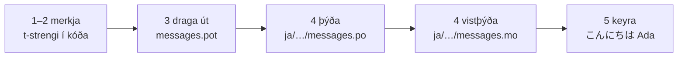

# Kennsluefni

Þessi síða fer úr tómri möppu í forrit sem heilsar á japönsku. Fimm skref,
engrar gettext-reynslu krafist, og hver skipun er sýnd með því úttaki sem hún
skilar í raun — svo að í hverju skrefi veistu hvort þú ert á réttri leið.

Þú þarft Python 3.14 eða nýrri, því t-strengir eru ný málskipan í 3.14.
Japanska er markmál dæmisins á þessari síðu, en ekkert veltur á því vali —
settu hvaða tungumál sem er í staðinn í skrefi 4, þar sem staðfærslukóðinn
`ja` er það eina sem nefnir það.

## 1. Uppsetning { #1-install }

```console
python -m pip install "gettext-tstrings[babel]"
```

Aukapakkinn `[babel]` dregur inn [Babel], tólið sem safnar skilaboðunum þínum
í þýðingaskrár í skrefi 3. Það er tól þróunartímans: kóði í rekstri birtir
texta með staðalsafninu einu saman.

## 2. Merktu skilaboð í kóðanum þínum { #2-mark-a-message-in-your-code }

Búðu til `app.py`:

```python
from gettext_tstrings import tr

name = "Ada"
print(tr(t"Hello {name}"))
```

`t"Hello {name}"` lítur út eins og f-strengur, en `t`-forskeytið heldur
textanum og gildinu aðskildum í stað þess að steypa þeim saman á staðnum. Sá
aðskilnaður er það sem gerir `tr()` kleift að fletta upp þýðingu á heilli
setningunni `Hello {name}` og skjóta gildinu inn á eftir.

Keyrðu það núna:

```console
$ python app.py
Hello Ada
```

Engar þýðingar eru uppsettar enn, svo frumtextinn birtist óbreyttur. Forrit
sem notar þetta safn *krefst* aldrei þýðingaskrár til að keyra — enskan (eða
hvert það mál sem frumtextinn þinn er á) er innbyggða vararleiðin.

## 3. Dragðu skilaboðin út { #3-extract-the-messages }

Þýðendur lesa ekki frumkóðann þinn; lítil skrá sem kallast **þýðingaskrá**
ferðast milli ykkar. Fyrsta skrefið að slíkri skrá er að safna hverjum
merktum skilaboðum út úr kóðanum.

Segðu Babel hvernig eigi að finna skilaboðin þín með því að búa til
`babel.cfg`:

```ini
[gettext_tstrings: **.py]
encoding = utf-8
```

Dragðu svo út í sniðmátsskrá (`.pot`):

```console
$ mkdir -p locales
$ pybabel extract -F babel.cfg -c "Translators:" -o locales/messages.pot .
extracting messages from app.py (encoding="utf-8")
writing PO template file to locales/messages.pot
```

`locales/messages.pot` inniheldur nú eina færslu fyrir hver skilaboð:

```po
#. gettext-tstrings
#: app.py:4
#, python-brace-format
msgid "Hello {name}"
msgstr ""
```

`msgid` er lykillinn sem kóðinn þinn mun fletta upp. Tóma `msgstr`-ið er þar
sem þýðingin á að fara — en ekki í þessari skrá: `.pot` er *sniðmát*, og
næsta skref afritar það einu sinni fyrir hvert tungumál.

## 4. Þýddu og vistþýddu { #4-translate-and-compile }

Búðu til japönsku þýðingaskrána út frá sniðmátinu:

```console
$ pybabel init -i locales/messages.pot -d locales -l ja
creating catalog locales/ja/LC_MESSAGES/messages.po based on locales/messages.pot
```

Opnaðu `locales/ja/LC_MESSAGES/messages.po` og fylltu út `msgstr`:

```po
msgid "Hello {name}"
msgstr "こんにちは {name}"
```

Haltu `{name}` nákvæmlega eins og hann er — staðgengillinn er leiðin sem
gildið finnur sér stað eftir inni í þýddu setningunni, og þýðingunni er
frjálst að færa hann þangað sem markmálið þarf. Í raunverulegu verkefni er
þessi `.po`-skrá það sem þú réttir þýðanda eða hleður upp á
þýðingavettvang; sniðið er hið sama hvort heldur er.

Þýðingaskrár eru ritaðar sem texti en lesnar inn á tvíundarformi (`.mo`), svo
vistþýddu:

```console
$ pybabel compile -d locales
compiling catalog locales/ja/LC_MESSAGES/messages.po to locales/ja/LC_MESSAGES/messages.mo
```

Þessi skipun er líka öryggisnet. Hefði þýðingin skemmt staðgengilinn —
`{nome}` í stað `{name}`, til dæmis — hefði hún neitað að hleypa henni í
gegn:

```console
$ pybabel compile -d locales
error: locales/ja/LC_MESSAGES/messages.po:24: translation does not match the
source placeholders: {name} is missing; {nome} is not in the source message
1 errors encountered.
```

## 5. Keyrðu það { #5-run-it }

Beindu `app.py` að vistþýddu þýðingaskránni. Smelltu á merkin til að sjá hvað
hver lína er að gera:

```python
import gettext

from gettext_tstrings import Translator

_ = Translator(gettext.translation("messages", localedir="locales", languages=["ja"]))  # (1)!

name = "Ada"
print(_(t"Hello {name}"))  # (2)!
```

1. Staðalsafnið les inn vistþýddu `.mo`-skrána og `Translator` bindur hana
   við kallanlegt fall. `_` er venjubundna gettext-nafnið fyrir „þýddu
   þetta“ — stutt af því að það kemur fyrir við hvern einasta streng sem
   notandi sér. Það er sama fall og `tr`, bundið einni þýðingaskrá.
2. Við kallið: texti t-strengsins verður uppflettilykillinn `Hello {name}`,
   þýðingaskráin svarar `こんにちは {name}`, svarið er borið saman við
   staðgengla frumtextans, og fyrst þá er gildinu skotið inn.

```console
$ python app.py
こんにちは Ada
```

Þetta er öll hringrásin, og hún er þess virði að sjá í einni mynd:



**Merkja → draga út → þýða → vistþýða → keyra.** Allt annað á þessum vef er
útfærsla á einhverju þessara fimm skrefa.

## Hvert næst { #where-next }

- [Hvers vegna t-strings](comparison.md) — hverju þessi hönnun ver þig fyrir,
  borið saman við `%(name)s`, `.format()` og `$`-strengi.
- [Handbók](guide.md) — fleirtala, tungumál eftir beiðni, frestaðir strengir,
  og hvað gerist á keyrslutíma þegar þýðingaskrá er engu að síður röng.
- [Í rekstri](workflow.md) — sama hringrás eins og teymi keyrir hana, viku
  eftir viku: að uppfæra þýðingaskrár, CI-hlið og þýðingavettvangar.
- [Útdráttur](extraction.md) — heildarheimildin um `pybabel`: eigin
  fallanöfn, strangur CI-hamur og athuganirnar sem gæta þýðingaskránna
  þinna.

  [Babel]: https://babel.pocoo.org/
