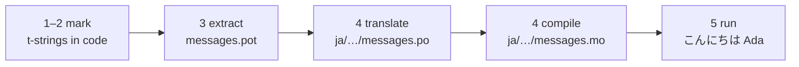

# Tutorial

This page goes from an empty directory to a program that greets in Japanese.
Five steps, no gettext experience assumed, and every command is shown with the
output it actually produces — so at each step you know whether you are on
track.

You need Python 3.14 or newer, because t-strings are new syntax in 3.14.
Japanese is this page's example target, but nothing depends on that choice —
substitute any language in step 4, where the locale code `ja` is the only
thing that names it.

## 1. Install { #1-install }

```console
python -m pip install "gettext-tstrings[babel]"
```

The `[babel]` extra brings in [Babel], the tool that collects your messages
into catalog files in step 3. It is a development-time tool: production code
renders with the standard library alone.

## 2. Mark a message in your code { #2-mark-a-message-in-your-code }

Create `app.py`:

```python
from gettext_tstrings import tr

name = "Ada"
print(tr(t"Hello {name}"))
```

`t"Hello {name}"` looks like an f-string, but the `t` prefix keeps the text
and the value separate instead of merging them on the spot. That separation is
what lets `tr()` look up a translation for the whole sentence `Hello {name}`
and insert the value afterwards.

Run it now:

```console
$ python app.py
Hello Ada
```

No translations are installed yet, so the source text renders as-is. A program
using this library never *requires* a catalog to run — English (or whatever
your source language is) is the built-in fallback.

## 3. Extract the messages { #3-extract-the-messages }

Translators do not read your source code; a small file called a **catalog**
travels between you and them. The first step toward one is collecting every
marked message out of the code.

Tell Babel how to find your messages by creating `babel.cfg`:

```ini
[gettext_tstrings: **.py]
encoding = utf-8
```

Then extract into a template file (`.pot`):

```console
$ mkdir -p locales
$ pybabel extract -F babel.cfg -c "Translators:" -o locales/messages.pot .
extracting messages from app.py (encoding="utf-8")
writing PO template file to locales/messages.pot
```

`locales/messages.pot` now contains one entry per message:

```po
#. gettext-tstrings
#: app.py:4
#, python-brace-format
msgid "Hello {name}"
msgstr ""
```

`msgid` is the key your code will look up. The empty `msgstr` is where a
translation goes — but not in this file: a `.pot` is a *template*, and the
next step copies it once per language.

## 4. Translate and compile { #4-translate-and-compile }

Create the Japanese catalog from the template:

```console
$ pybabel init -i locales/messages.pot -d locales -l ja
creating catalog locales/ja/LC_MESSAGES/messages.po based on locales/messages.pot
```

Open `locales/ja/LC_MESSAGES/messages.po` and fill in the `msgstr`:

```po
msgid "Hello {name}"
msgstr "こんにちは {name}"
```

Keep `{name}` exactly as it is — the placeholder is how the value finds its
place inside the translated sentence, and the translation is free to move it
wherever the target language needs it. On a real project this `.po` file is
what you hand to a translator or upload to a translation platform; the format
is the same either way.

Catalogs are edited as text but loaded in a binary form (`.mo`), so compile:

```console
$ pybabel compile -d locales
compiling catalog locales/ja/LC_MESSAGES/messages.po to locales/ja/LC_MESSAGES/messages.mo
```

This command is also a safety net. Had the translation damaged the
placeholder — `{nome}` instead of `{name}`, say — it would refuse to pass:

```console
$ pybabel compile -d locales
error: locales/ja/LC_MESSAGES/messages.po:24: translation does not match the
source placeholders: {name} is missing; {nome} is not in the source message
1 errors encountered.
```

## 5. Run it { #5-run-it }

Point `app.py` at the compiled catalog. Click the markers to see what each
line is doing:

```python
import gettext

from gettext_tstrings import Translator

_ = Translator(gettext.translation("messages", localedir="locales", languages=["ja"]))  # (1)!

name = "Ada"
print(_(t"Hello {name}"))  # (2)!
```

1. The standard library loads the compiled `.mo`, and `Translator` binds it
   to a callable. `_` is the conventional gettext name for "translate this" —
   short because it appears on every user-facing string. It is the same
   function as `tr`, bound to one catalog.
2. At the call: the t-string's text becomes the lookup key `Hello {name}`,
   the catalog answers `こんにちは {name}`, the answer is checked against the
   source placeholders, and only then is the value put in.

```console
$ python app.py
こんにちは Ada
```

That is the whole loop, and it is worth seeing as one picture:



**Mark → extract → translate → compile → run.** Everything else on this site
is a refinement of one of those five steps.

## Where next { #where-next }

- [Why t-strings](comparison.md) — what this design protects you from,
  compared to `%(name)s`, `.format()`, and `$`-strings.
- [Guide](guide.md) — plurals, per-request languages, deferred strings, and
  what happens at runtime when a catalog is wrong anyway.
- [In production](workflow.md) — this same loop as a team runs it, week after
  week: updating catalogs, CI gates, and translation platforms.
- [Extraction](extraction.md) — the full `pybabel` reference: custom function
  names, strict CI mode, and the checks that guard your catalogs.

  [Babel]: https://babel.pocoo.org/
