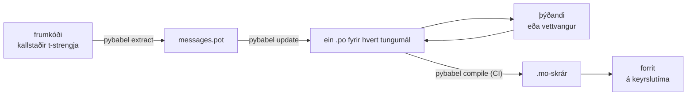

# Í rekstri

[Kennsluefnið](tutorial.md) keyrir hringrásina einu sinni, í einrúmi, á
forriti með einum skilaboðum. Í raunverulegu verkefni heldur hringrásin
áfram að snúast: skilaboð breytast eftir að þau hafa verið þýdd, þýðandinn
vinnur annars staðar og á sínum eigin tíma, og vistþýdd þýðingaskrá fylgir
hverri útgáfu. Þessi síða er sú iðja — hvað dvelur í geymslunni, hvað
ferðast, hvað CI verður að stöðva, og hvar keyrslutíminn bindur tungumál.

Það sem þetta leggur sig saman í eru sex athuganir, svo hér eru þær fyrst;
hver kafli hér að neðan setur eina þeirra upp.

- `pybabel update --check` stenst — engum skilaboðum var breytt án þess að
  þýðingaskrárnar frétti af því.
- `pybabel compile` stöðvar bygginguna út frá lokastöðu sinni.
- Þær `fuzzy`-færslur sem eftir standa eru ásetningur — hver þeirra birtist
  sem frumtexti þar til þýðandi staðfestir hana.
- Prófmengið birtir hvert útgefið tungumál einu sinni með `strict=True`.
- Rekstrarafurðin inniheldur `.mo`-skrár og engan Babel.
- Atburðaskrárritill `gettext_tstrings` er leiddur til vöktunar.

## Lag verkefnisins { #the-shape-of-a-project }

```text
myapp/
├── babel.cfg
├── pyproject.toml
├── src/
│   └── myapp/
└── locales/
    ├── messages.pot
    ├── ja/LC_MESSAGES/messages.po
    └── de/LC_MESSAGES/messages.po
```

Settu `babel.cfg`, `.pot`-sniðmátið og hverja `.po`-skrá í útgáfustýringu —
þær eru frumgögn þýðingabyggingarinnar, og mismunur þeirra er leiðin til að
lesa yfir breytingar á þýðingum. Vistþýddu `.mo`-skrárnar eru afurðir
byggingar: búðu þær til í CI eða við pökkun fremur en að festa þær í
geymsluna, svo að `.po`-skrá og `.mo`-skrá hennar geti aldrei verið
ósammála um hvað fer út.

Ein skrá gegnir hlutverki í hvora átt: `.pot` ber skilaboðin þín *út* til
þýðenda, `.po`-skrárnar bera þýðingarnar *til baka*. Afgangur þessarar síðu er
það sem hreyfist á milli þeirra.



## Ferlið eftir fyrstu þýðinguna { #the-cycle-after-the-first-translation }

`pybabel init` úr kennsluefninu keyrir að jafnaði einu sinni, þegar tungumáli
er bætt við. Upp frá því er vinnuferlið **draga út → uppfæra → þýða →
vistþýða**, og miðja þess er `pybabel update`, sem fellir nýtt sniðmát inn í
þýðingaskrárnar sem fyrir eru án þess að fleygja þýðingunum sem þegar eru í
þeim.

Segjum að kveðjan `Hello {name}` — þegar þýdd sem `こんにちは {name}` — sé
endurorðuð í kóðanum í `Welcome back, {name}`. Dragðu út og uppfærðu:

```console
$ pybabel extract -F babel.cfg -c "Translators:" -o locales/messages.pot .
extracting messages from app.py (encoding="utf-8")
writing PO template file to locales/messages.pot
$ pybabel update -i locales/messages.pot -d locales
updating catalog locales/ja/LC_MESSAGES/messages.po based on locales/messages.pot
```

Japanska þýðingaskráin inniheldur nú:

```po
#. gettext-tstrings
#: app.py:4
#, fuzzy, python-brace-format
msgid "Welcome back, {name}"
msgstr "こんにちは {name}"
```

Babel tók eftir að nýja msgid-ið líkist einu sem var fjarlægt og paraði það
við gömlu þýðinguna — en merkti parið **fuzzy**: ágiskun vélar sem bíður
manneskju. Flaggið breytir því hvað vistþýðist. `pybabel compile` **skilur
fuzzy-færslur undan `.mo`-skránni**, svo að þar til þýðandi staðfestir parið
birtir forritið nýja enska textann fremur en úreltan japanskan:

```console
$ pybabel compile -d locales
compiling catalog locales/ja/LC_MESSAGES/messages.po to locales/ja/LC_MESSAGES/messages.mo
$ python app.py
Welcome back, Ada
```

Breytt skilaboð hrörna því á sama hátt og biluð — yfir í frummálið, aldrei
yfir í úrelta þýðingu. Hlutur þýðandans í ferlinu er að endurskoða `msgstr`
og eyða `fuzzy`-flagginu; næsta vistþýðing tekur færsluna með.

!!! note "Nöfn staðgengla eru hluti af auðkenni skilaboðanna"

    Msgid-ið er lykill þýðingaskrárinnar og *nafn* staðgengilsins er inni í
    því — svo að endurnefna breytu í kóðanum (`name` → `user_name`) breytir
    msgid-inu og sendir þýðingu þess á hverju tungumáli aftur gegnum
    fuzzy-hringinn. Gefðu innskeyttum breytum nöfn sem eru orð sem þýðandi
    skilur, og endurnefndu þær aðeins ef ástæða er til.

    Sniðið er spegilmynd þessa: `!r` og `:.2f` eru
    [ekki hluti af msgid-inu](internals.md#from-template-to-msgid), svo að
    herða `{amount:,.2f}` í `{amount:,.0f}` breytir engu í neinni
    þýðingaskrá. Að endurorða *setninguna* er auðvitað raunveruleg breyting —
    það er ferlið hér að ofan.

## Hvað CI stöðvar { #what-ci-gates }

Þrjár bilanir eru rauðrar byggingar virði: þýðingaskrárnar drógust aftur úr
kóðanum, þýðing skemmdi staðgengil, eða biluð færsla slapp alla leið á
keyrslutímann. Eitt skref fyrir hverja bilun:

```yaml
- run: pybabel extract -F babel.cfg -c "Translators:" -o locales/messages.pot .
- run: pybabel update -i locales/messages.pot -d locales --check
- run: pybabel compile -d locales
- run: pytest
```

`pybabel update --check` endurskrifar ekkert og lýkur með stöðu frábrugðinni
núlli þegar þýðingaskrá er ekki í takt við nýútdregna sniðmátið — vörnin gegn
því að sameina kóða þar sem enginn dró skilaboðin út að nýju.
`pybabel compile` keyrir athuganir Babel á staðgenglum og
[skráða athugarann](extraction.md#your-existing-toolchain-validates-these-catalogs)
úr þessum pakka.

!!! bug "Babel 2.18.0: `--check` getur ekki stöðvað þýðingaskrá sem notar samhengi"

    Í Babel 2.18.0 tilkynnir `pybabel update --check` **hverja** þýðingaskrá
    sem inniheldur `msgctxt` sem úrelta, í hverri einustu keyrslu, hversu
    fersk sem hún er. Hlið sem bilar varanlega er verra en ekkert hlið, því
    teymið slekkur á því — svo að ef þú notar `pgettext` eða `npgettext`
    yfirleitt skaltu skipta þessu skrefi út fremur en að búa við það. Að lesa
    sniðmátið og hverja þýðingaskrá með `babel.messages.pofile.read_po` og
    bera saman `{(m.context, m.id) for m in catalog if m.id}` er öll
    athugunin, og það er það sem [bygging þessa vefs sjálfs](index.md) gerir.
    Orsökin er [rakin á Fallgryfjum](pitfalls.md#your-tools-have-bugs-too).

!!! danger "Athugaðu lokastöðuna, ekki atburðaskrána"

    `pybabel compile` tilkynnir hverja staðgengilsvillu, lýkur með stöðu
    frábrugðinni núlli — **og skrifar `.mo`-skrána hvort eð er**. Keðja sem
    vistþýðir og afritar svo `locales/` inn í ímynd sendir bilaða
    þýðingaskrá frá sér nema lokastaðan stöðvi hana raunverulega. Að láta
    skrefið fella bygginguna, eins og hér að ofan, er öll lausnin.

Síðasta línan er venjulega prófmengið þitt, með einum vana bætt við:
einhvers staðar í því skaltu birta að minnsta kosti ein skilaboð fyrir hvert
tungumál sem fer út, gegnum strangan þýðanda —

```python
import gettext

from gettext_tstrings import Translator


def test_catalogs_render(language: str) -> None:
    translations = gettext.translation("messages", localedir="locales", languages=[language])
    _ = Translator(translations, strict=True)
    name = "Ada"
    assert _(t"Welcome back, {name}")
```

— því að `strict=True` [varpar þar sem rekstur myndi falla hljóðlaust til baka](guide.md#what-happens-when-a-catalog-is-wrong),
og birting á keyrslutíma er eina athugunin sem sér þýðingaskrána nákvæmlega
eins og forritið mun sjá hana, `.mo` og allt.

## Að vinna með þýðendum og vettvöngum { #working-with-translators-and-platforms }

`.po`-skráin er skiptisniðið í öllum gettext-heiminum, og það er ástæðan
fyrir því að þetta safn endurnýtir hana: að rétta þýðinguna áfram þýðir að
rétta skrá, hvort sem viðtakandinn er samstarfsmaður með PO-ritil eða
vettvangur á borð við Weblate eða Crowdin. Þrennt gerir afhendinguna góða:

**Segðu til hvers skilaboðin eru.** Athugasemd í kóðanum ferðast með
skilaboðunum — það er einmitt það sem flaggið `-c "Translators:"` safnar:

```python
from gettext_tstrings import tr

name = "Ada"
# Translators: shown on the dashboard right after sign-in
print(tr(t"Welcome back, {name}"))
```

```po
#. Translators: shown on the dashboard right after sign-in
#. gettext-tstrings
#: app.py:5
#, python-brace-format
msgid "Welcome back, {name}"
msgstr ""
```

Þýðandi sér þá athugasemd í ritli sínum, við hliðina á skilaboðunum, hinum
megin á hnettinum. Það er ódýrasta gæðastöngin í allri hringrásinni. Fyrir
orð sem er samhljóða sjálfu sér — „Open“ sem hnappur andspænis „Open“ sem
ástand — gefðu skilaboðunum [samhengi](guide.md#binding-a-catalog) með
`pgettext`, sem verður að sýnilegu `msgctxt` í þýðingaskránni.

**Láttu vettvanginn staðfesta staðgenglana.** Hver þau skilaboð sem dregin
eru út úr t-streng bera `python-brace-format`-flaggið, og sú eina lína er það
sem kveikir á gæðaathugun staðgengla í tólum sem þú ræður engu um — Weblate
skjalfestir athugunina, viðskiptavettvangar lykla sína eigin á sama flagg, og
`msgfmt --check-format` framfylgir henni í hverri GNU-keðju. Smáatriðin, og
hvað meðfylgjandi athugarinn grípur umfram þau, eru á
[útdráttarsíðunni](extraction.md#your-existing-toolchain-validates-these-catalogs).

**Treystu öryggisnetinu nákvæmlega jafn langt og það nær.** Hvað sem kemur
til baka frá vettvangi eru enn gögn á leið inn í bygginguna þína; CI-hliðin
hér að ofan eru það sem breytir „vettvangurinn athugaði þetta líklega“ í
„þetta getur ekki farið út bilað“.

## Að binda tungumál á keyrslutíma { #binding-a-language-at-runtime }

Allt hingað til framleiðir þýðingaskrár. Ákvörðunin sem eftir stendur er hvar
forritið velur eina, og hún á sér eitt heiðarlegt svar: bittu einu sinni fyrir
hvert *gildissvið tungumáls* — ferlið fyrir skipanalínutól, beiðnina fyrir
vefþjónustu.

=== "Eitt ferli, eitt tungumál"

    Skipanalínutól eða skjáborðsforrit les umhverfi notandans einu sinni, við
    ræsingu. Að gefa ekkert `languages=` lætur staðalsafnið semja út frá
    `LANGUAGE`, `LC_ALL`, `LC_MESSAGES` og `LANG`; `fallback=True` skilar
    tómri þýðingaskrá — frumtextanum — fremur en að varpa þegar ekkert
    þeirra stemmir við þýðingaskrá sem þú sendir með.

    ```python
    import gettext

    from gettext_tstrings import Translator

    _ = Translator(gettext.translation("messages", localedir="locales", fallback=True))

    name = "Ada"
    print(_(t"Welcome back, {name}"))
    ```

=== "Flask"

    Vefforrit ákveður fyrir hverja beiðni. Lestu hverja þýðingaskrá inn einu
    sinni við innflutning, bittu svo þá sem samið var um við samhengið áður en
    sýnin keyrir — [`set_translations`](guide.md#per-request-language) er
    bundið samhenginu, svo samhliða beiðnir á ólíkum tungumálum sjá aldrei
    bindingu hver annarrar.

    ```python
    import gettext

    from flask import Flask, request

    from gettext_tstrings import set_translations, tr

    LANGUAGES = ("en", "ja", "de")
    CATALOGS = {
        language: gettext.translation(
            "messages", localedir="locales", languages=[language], fallback=True
        )
        for language in LANGUAGES
    }

    app = Flask(__name__)


    @app.before_request
    def bind_language() -> None:
        language = request.accept_languages.best_match(LANGUAGES) or "en"
        set_translations(CATALOGS[language])


    @app.get("/")
    def home() -> str:
        name = "Ada"
        return tr(t"Welcome back, {name}")
    ```

=== "ASGI-millilag"

    Undir ósamstilltum umgjörðum — FastAPI, Starlette og hverju öðru sem
    talar ASGI — vefðu beiðnina inn í
    [`use_translations`](guide.md#per-request-language): bindingin býr í
    `ContextVar`, sem skipting milli ósamstilltra verka varðveitir fyrir
    hverja beiðni.

    ```python
    import gettext

    from fastapi import FastAPI, Request

    from gettext_tstrings import tr, use_translations

    LANGUAGES = ("en", "ja", "de")
    CATALOGS = {
        language: gettext.translation(
            "messages", localedir="locales", languages=[language], fallback=True
        )
        for language in LANGUAGES
    }

    app = FastAPI()


    @app.middleware("http")
    async def bind_language(request: Request, call_next):
        language = negotiate_language(request.headers.get("accept-language"), LANGUAGES)
        with use_translations(CATALOGS[language]):
            return await call_next(request)
    ```

    `negotiate_language` stendur fyrir þáttun þína á Accept-Language — flestar
    umgjarðir eða vistkerfi þeirra leggja slíkt til; það sem skiptir máli hér
    er bindingin utan um `call_next`.

Tveir vanar á keyrslutíma fullkomna myndina. Strengir sem verða til við
innflutning — merking á eyðublaði, birtingarnafn í talnaupptalningu — mega
ekki grípa það tungumál sem var virkt við innflutninginn; skilgreindu þá með
[`lazy_gettext`](guide.md#deferred-translation) og þeir birtast á því
tungumáli sem er virkt við *notkun*. Og beindu atburðaskrárriti
`gettext_tstrings` þangað sem manneskja lítur: viðvaranir þess eru
eftirgefanlegi hamurinn að tilkynna þýðingu sem slapp gegnum hvert hlið, ein
lína fyrir hver biluð skilaboð fremur en ein fyrir hverja birtingu.

## Að senda frá sér { #shipping }

Rekstur þarf pakkann, `.mo`-skrárnar og ekkert annað. Babel er háð eining
þróunar og CI — haltu `gettext-tstrings[babel]` utan rekstrarímyndarinnar og
settu bera pakkann upp þar; birting keyrir á staðalsafninu einu saman.
Vistþýddu þýðingaskrár í sömu byggingu og framleiðir afurðina sem þú setur
upp, svo að `.mo`-skrárnar inni í henni séu nákvæmlega þær `.po`-skrár sem
lesnar voru yfir, og ekkert sem vistþýtt var á fartölvu einhvers fari nokkurn
tíma út.

Fyrir útgáfu er gátlistinn sem þessi síða þjappast í:

- `pybabel update --check` stenst — engum skilaboðum var breytt án þess að
  þýðingaskrárnar frétti af því.
- `pybabel compile` lætur lokastöðu sína stöðva bygginguna.
- Þær `fuzzy`-færslur sem eftir standa eru ásetningur — hver þeirra birtist
  sem frumtexti þar til þýðandi staðfestir hana.
- Prófmengið birtir hvert tungumál sem fer út einu sinni með `strict=True`.
- Rekstrarafurðin inniheldur `.mo`-skrár og ekkert Babel.
- Atburðaskrárriti `gettext_tstrings` er beint í vöktun.

## Hvert næst { #where-next }

- [Útdráttur](extraction.md) — uppflettiritið um tólahelming þessarar síðu:
  valkostir vörpunar, eigin fallanöfn, strangur hamur og hver einasti
  athugari.
- [Handbók](guide.md) — keyrslutímahelmingurinn: fleirtala, samhengi,
  frestaðir strengir og bilanahamirnir í smáatriðum.
- [Hvernig þetta virkar](internals.md) — hvers vegna msgid-ið lítur út eins
  og það gerir, og hvað athugunin skoðar í raun.
