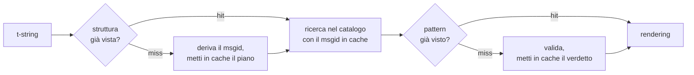

# Come funziona

Niente in questa pagina è necessario per usare la libreria — il
[tutorial](tutorial.md) e la [guida](guide.md) coprono quello. Questa pagina
ricostruisce invece la libreria dai primi principi: che cosa è davvero una
t-string, come un msgid ne discende, che cosa rende valida una traduzione e
come l'implementazione fa costare tutto quel controllo decimi di
microsecondo. Leggila se sei curioso, se vuoi contribuire o se hai in mente
di [implementare tu stesso la convenzione](#reimplementing-it).

## Che cosa è davvero una t-string { #what-a-t-string-actually-is }

Una f-string produce una `str`, e la produce immediatamente — quando una
funzione la riceve, il valore è già stato interpolato e la frase è sigillata.
Una t-string ([PEP 750]) ha la stessa sintassi e la stessa valutazione
immediata delle sue espressioni, ma produce un tipo diverso:

```pycon
>>> name = "Ada"
>>> f"Hello {name}!"
'Hello Ada!'
>>> t"Hello {name}!"
Template(strings=('Hello ', '!'), interpolations=(Interpolation('Ada', 'name', None, ''),))
```

Quell'oggetto `Template` conserva, ancora separate, le parti di cui una
pipeline di cataloghi ha bisogno:

```pycon
>>> template = t"Total: {amount:,.2f}"
>>> template.strings
('Total: ', '')
>>> template.interpolations[0].expression
'amount'
>>> template.interpolations[0].value
1234.5
>>> template.interpolations[0].format_spec
',.2f'
```

- `strings` — il testo letterale attorno alle interpolazioni, in ordine.
- Per ogni interpolazione: l'**espressione** come testo sorgente
  (`'amount'`), il suo **valore** valutato (`1234.5`) e le eventuali
  **conversione** (`!r`) e **specifica di formato** (`,.2f`) — trasportate
  separatamente invece di essere applicate.

Tutto ciò che questa libreria fa è un consumo disciplinato di quella
struttura. Il linguaggio ha già compiuto l'unica separazione di cui l'i18n ha
bisogno — il testo statico distinto dai valori — quindi la libreria non
analizza mai il tuo codice sorgente e non indovina mai dove un valore stia
dentro una frase. Restano tre decisioni: come la struttura diventa una chiave
di catalogo, che cosa può dire una traduzione di quella chiave e come le due
si rendono di nuovo insieme.

## Dal template al msgid { #from-template-to-msgid }

Un msgid — la chiave con cui un catalogo è indicizzato — è derivato soltanto
dalle parti *statiche* del template. Percorri `strings` e `interpolations` in
ordine di sorgente; escapa le graffe di ogni segmento letterale (`{` diventa
`{{`); per ogni interpolazione, emetti un token `{name}`, dove `name` è il
testo dell'espressione privato degli spazi circostanti. Da
`t"Total: {amount:,.2f}"`:

```text
strings         ('Total: ', '')
interpolations  expression 'amount'   conversion None   format_spec ',.2f'
msgid           'Total: {amount}'
```

Ogni parte di quella regola ha una ragione:

- **L'espressione deve essere un nome semplice** — `str.isidentifier()` è
  vero e non è una parola chiave Python. `t"Hello {user.name}"` è rifiutata
  nel punto di chiamata. Un msgid è una *chiave*: deve venire fuori identico
  a ogni esecuzione e a ogni estrazione, ed è letto dai traduttori, quindi il
  segnaposto deve essere una parola stabile e significativa — non un
  frammento di codice che inviti il catalogo a diventare un linguaggio di
  espressioni.
- **La conversione e la specifica di formato non entrano mai nel msgid.** I
  traduttori non dovrebbero dover leggere `:,.2f`, e nessuna traduzione
  dovrebbe poterlo cambiare. Il corollario vale la pena di conoscerlo:
  stringere `:,.2f` in `:,.0f` nel tuo codice non cambia nessun msgid, quindi
  non invalida nessuna traduzione in nessuna lingua. La chiave di catalogo
  traccia *che cosa dice la frase*, non come il valore è formattato.
- **Un nome ripetuto deve ripetere esattamente la sua formattazione.**
  `t"{x:.2f} vs {x:.3f}"` è rifiutata, perché entrambe le occorrenze
  collassano nello stesso token `{x}` e il msgid non potrebbe più dire quale
  formattazione un rendering debba usare.
- **Il msgid vuoto non viene mai cercato**, perché gettext lo riserva
  all'intestazione di metadati del catalogo stesso. `t""` viene resa come
  `""` senza toccare il catalogo.

L'insieme completo delle regole, inclusi i casi limite che questa pagina
salta, è la
[SPEC §2](https://github.com/yhay81/gettext-tstrings/blob/main/SPEC.md).

## Che cosa può dire una traduzione { #what-a-translation-may-say }

Un pattern che torna da un catalogo viene analizzato con `string.Formatter` —
lo stesso parser che usa `str.format`. La grammatica è deliberatamente presa
in prestito anziché inventata: un pattern che questa libreria accetta è uno
che l'ecosistema più ampio già comprende. Poi si applicano due controlli.

**Forma:** ogni campo deve essere un semplice `{name}`. Una conversione o una
specifica di formato — incluso l'esplicitamente vuoto `{name:}` — è
rifiutata, come lo sono i campi posizionali (`{0}`, `{}`) e i nomi con spazi
di riempimento (`{ name }`). L'ultimo conta più di quanto sembri:
`str.format` e GNU `msgfmt` rifiutano entrambi `{ name }`, quindi accettarlo
qui produrrebbe cataloghi che nessun altro strumento della catena può
validare.

**Nomi:** l'insieme dei segnaposto del pattern è confrontato con quello della
sorgente. Per un messaggio singolare ogni nome sorgente è *richiesto* e
nient'altro è *consentito*. Per un messaggio plurale i due rami vengono fusi:

- **consentito** = l'unione dei nomi di entrambi i rami
- **richiesto** = la loro intersezione

Così, contro `t"One file"` / `t"{n} files"`, il nome `n` è consentito in una
traduzione di entrambe le forme ma richiesto in nessuna. Quell'asimmetria è
ciò che permette al sistema di plurali di una lingua di destinazione di
differire da quello della sorgente — il giapponese traduce entrambi i rami
con una sola forma che probabilmente usa `{n}`; una lingua con più forme
dell'inglese può aver bisogno di `{n}` in una forma dove l'inglese non ne ha.

Niente di tutto questo è ipotetico: il catalogo dell'interfaccia di questo
stesso sito contiene il messaggio plurale `Built {n} localized page` /
`Built {n} localized pages` — due rami inglesi — e le edizioni del sito
traducono quell'unico messaggio in un numero di forme che va da una a sei:

| Catalogo | Forme | Le traduzioni, in ordine di forma |
| --- | --- | --- |
| Giapponese | 1 | `ローカライズ済みページを{n}件ビルドしました` |
| Turco | 2 | `{n} yerelleştirilmiş sayfa oluşturuldu` — due volte, identica: i sostantivi turchi restano al singolare dopo un numerale |
| Italiano | 2 | `Generata {n} pagina localizzata` · `Generate {n} pagine localizzate` — il participio concorda in genere e numero |
| Lettone | 3 | `Izveidota {n} lokalizēta lapa` · `Izveidotas {n} lokalizētas lapas` · `Izveidots {n} lokalizētu lapu` — la terza forma è per **il solo zero** |
| Russo | 3 | `Собрана {n} локализованная страница` · `Собраны {n} локализованные страницы` · `Собрано {n} локализованных страниц` |
| Polacco | 3 | `Zbudowano {n} zlokalizowaną stronę` · `Zbudowano {n} zlokalizowane strony` · `Zbudowano {n} zlokalizowanych stron` |
| Sloveno | 4 | `Zgrajena {n} lokalizirana stran` · `Zgrajeni {n} lokalizirani strani` · `Zgrajene {n} lokalizirane strani` · `Zgrajenih {n} lokaliziranih strani` — la seconda è un **duale**, per esattamente due |
| Irlandese | 5 | `Tógadh {n} leathanach logánaithe` · `Tógadh {n} leathanaigh logánaithe` — uno, due, 3–6, 7–10 e il resto; il tema alterna, ma *leathanach* inizia per `l`, che nessuna mutazione irlandese scrive, così diverse forme coincidono |
| Arabo | 6 | tra cui `تم إنشاء صفحة مترجمة واحدة ({n})` per esattamente uno e `تم إنشاء {n} صفحات مترجمة` per pochi |

Ogni riga è una voce viva nei `i18n/*/LC_MESSAGES/site.po` di questo
repository, resa dalla [build multilingue](index.md) a ogni release — e un
test vincola questa tabella a quei cataloghi, così le due cose non possono
divergere.

Entro quei limiti, riordino e ripetizione sono deliberatamente senza
vincoli. Entrambi sono grammaticalmente necessari in lingue reali, e
limitare il numero di occorrenze rifiuterebbe traduzioni corrette senza alcun
beneficio di sicurezza: una traduzione continua a non poter *valutare*
niente, perché nessun percorso di valutazione esiste — i segnaposto sono
cercati per nome tra i valori già calcolati del template, mai passati a
`eval`, `getattr` o allo stesso `str.format`.

## Rendering { #rendering }

Rendere un pattern validato è una passeggiata sui suoi frammenti: emetti ogni
parte letterale e, per ogni segnaposto, prendi il valore catturato
dall'interpolazione e applica la conversione e la specifica di formato *del
lato sorgente* — `format(convert(value, conversion), format_spec)`. Due
garanzie vengono mantenute nel farlo:

- **Ogni valore distinto è formattato al più una volta per rendering**, anche
  quando la traduzione ripete un segnaposto. La ripetizione cambia quante
  volte il risultato viene inserito, non quante volte il tuo `__format__`
  viene eseguito.
- **Per i plurali, un segnaposto legge il ramo che lo ha definito.** Un nome
  presente in entrambi i rami legge il valore catturato dal ramo che la
  lingua *sorgente* seleziona (`singular` quando `n == 1`, altrimenti
  `plural`); un nome specifico di un ramo legge sempre il proprio ramo, anche
  quando le regole di plurale della lingua di destinazione lo hanno reso
  disponibile in un'altra forma.

Quando la validazione fallisce al momento del rendering, la risposta dipende
da chi ha fornito il pattern. Un pattern uscito da un *catalogo* degrada:
registra un avviso e rendi il testo sorgente, mantenendo il contratto di
gettext per cui un catalogo danneggiato non abbatte mai l'applicazione
([la guida mostra entrambe le modalità](guide.md#what-happens-when-a-catalog-is-wrong)).
Un pattern che il chiamante ha passato direttamente —
`CompiledTemplate.render` — solleva sempre, perché non c'è un testo sorgente
da cui degradare; la permissività esiste per le ricerche nel catalogo, non
per gli argomenti.

## La diagnostica è parte del design { #diagnostics-are-part-of-the-design }

Un errore di segnaposto di solito finisce davanti a un traduttore, non a un
programmatore, e spesso in un file dove il problema è invisibile. Dire
`{name} is missing` a qualcuno che può vedere esattamente quei caratteri nel
suo editor è un vicolo cieco, quindi i messaggi sono calcolati con tre
regole:

- Un nome che contiene un **carattere invisibile** — uno spazio unificatore
  prodotto da un metodo di input, uno spazio a larghezza zero — viene
  stampato con quel carattere sostituito dal suo punto di codice, al suo
  posto: `{<U+00A0>name}`. Il lettore ha bisogno di vedere *dove*.
- Un nome le cui lettere **mescolano sistemi di scrittura**, il caso degli
  omoglifi, viene mostrato due volte — una in forma leggibile, una escapata —
  perché `{nаme}` con una `а` cirillica è indistinguibile da `{name}` in
  stampa, e la forma escapata `(nаme)` è l'unica grafia che le distingue.
- Tutto il resto è mostrato **come scritto**. `{名前}` e `{café}` sono nomi
  normali; escaparli lascerebbe il lettore incapace di trovare ciò che si
  intendeva.

Sullo stesso principio, un segnaposto "mancante" che *sembra* presente
riceve una spiegazione della sua assenza — graffe a larghezza intera da un
metodo di input est-asiatico, il raddoppio `{{name}}` da un giro di escaping,
il nome fuori da qualunque graffa. La
[tabella di lettura dei fallimenti della guida](guide.md#reading-a-failure-message)
mostra ciascuno di questi messaggi alla lettera.

## Il percorso caldo { #the-hot-path }

Tutto quanto sopra accade su ogni stringa tradotta che un'applicazione rende,
quindi l'implementazione è costruita attorno a un'idea: **la validazione non
viene mai saltata, quindi la validazione dev'essere ciò che finisce in
cache.**



Tre cache, una per stadio:

- **Un piano per struttura di punto di chiamata.** La tupla `strings` del
  template — un oggetto che l'interprete ha già costruito — è la chiave di
  cache, quindi una ricerca non alloca nulla. Su un hit, l'espressione, la
  conversione e la specifica di formato di ogni interpolazione vengono
  comunque confrontate con quelle registrate: due punti di chiamata che
  condividono il testo letterale ma differiscono nella formattazione
  (`t"{x:.2f}"` contro `t"{x:.3f}"`) non devono collidere, e quel confronto è
  il prezzo di usare una chiave che l'interprete consegna gratis.
- **Un verdetto per pattern.** La prima volta che un catalogo risponde con un
  dato pattern, questo viene analizzato e validato; il risultato — un piano
  di rendering compilato, o la registrazione dell'invalidità — è conservato
  sul piano. Ogni rendering successivo di quel messaggio lo raggiunge con una
  sola ricerca in dizionario. Anche i pattern invalidi vengono ricordati, ed
  è per questo che una voce di catalogo danneggiata avvisa una volta sola
  invece che a ogni rendering.
- **Un piano fuso per coppia plurale**, che contiene gli insiemi di
  unione/intersezione così che l'aritmetica dei rami avvenga una volta per
  messaggio, non una volta per chiamata.

Ogni cache è limitata, e nessuna trattiene *valori* interpolati — solo
struttura statica e testo dei pattern. Il risultato, misurato da
[`benchmarks/runtime.py`](https://github.com/yhay81/gettext-tstrings/blob/main/benchmarks/runtime.py):
circa 0,4 µs per un messaggio a un campo, inclusa la costruzione della
t-string stessa, circa 2,5 volte un semplice `gettext(...).format(...)` che
non controlla nulla. Il commento in testa a
[`core.py`](https://github.com/yhay81/gettext-tstrings/blob/main/src/gettext_tstrings/core.py)
registra le singole misurazioni dietro quella forma.

## Reimplementarla { #reimplementing-it }

Niente di quanto sopra è sapere riservato: la convenzione è messa per
iscritto come [spec v1](spec.md), e la sua
[suite di conformità](spec.md#conformance) leggibile dalle macchine permette
a un estrattore, a un plugin per IDE o a un'implementazione in un altro
linguaggio di verificarsi contro ogni regola che questa pagina ha spiegato.
Questa implementazione esegue la suite nei propri test, ed è ciò che
impedisce a questa pagina, alla spec e al codice di allontanarsi in silenzio.

  [PEP 750]: https://peps.python.org/pep-0750/
