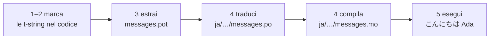

# Tutorial

Questa pagina va da una directory vuota a un programma che saluta in
giapponese. Cinque passi, nessuna esperienza con gettext richiesta, e ogni
comando è mostrato con l'output che produce davvero — così a ogni passo sai
se sei sulla strada giusta.

Serve Python 3.14 o più recente, perché le t-string sono sintassi nuova
della 3.14. Il giapponese è la lingua di esempio di questa pagina, ma niente
dipende da quella scelta. Per usare un'altra lingua, sostituisci `ja` al
passo 4 — quel codice di locale è l'unica cosa che la nomina.

## 1. Installa { #1-install }

```console
python -m pip install "gettext-tstrings[babel]"
```

L'extra `[babel]` porta con sé [Babel], lo strumento che al passo 3 raccoglie
i tuoi messaggi nei file di catalogo. È uno strumento da tempo di sviluppo: il
codice di produzione fa il rendering con la sola libreria standard.

## 2. Marca un messaggio nel codice { #2-mark-a-message-in-your-code }

Crea `app.py`:

```python
from gettext_tstrings import tr

name = "Ada"
print(tr(t"Hello {name}"))
```

`t"Hello {name}"` sembra una f-string, ma il prefisso `t` mantiene separati il
testo e il valore invece di fonderli sul posto. È quella separazione a
permettere a `tr()` di cercare una traduzione per l'intera frase
`Hello {name}` e inserire il valore dopo.

Eseguilo subito:

```console
$ python app.py
Hello Ada
```

Non c'è ancora nessuna traduzione installata, quindi il testo sorgente viene
reso così com'è. Un programma che usa questa libreria non *richiede* mai un
catalogo per funzionare — l'inglese (o qualunque sia la tua lingua sorgente)
è il ripiego incorporato.

## 3. Estrai i messaggi { #3-extract-the-messages }

I traduttori di solito lavorano sui cataloghi anziché sul codice sorgente,
quindi tra te e loro viaggia un piccolo file chiamato **catalogo**. Il primo
passo verso di esso è raccogliere dal codice ogni messaggio marcato.

Di' a Babel come trovare i tuoi messaggi creando `babel.cfg`:

```ini
[gettext_tstrings: **.py]
encoding = utf-8
```

Poi estrai in un file template (`.pot`):

```console
$ mkdir -p locales
$ pybabel extract -F babel.cfg -c "Translators:" -o locales/messages.pot .
extracting messages from app.py (encoding="utf-8")
writing PO template file to locales/messages.pot
```

`locales/messages.pot` ora contiene una voce per messaggio:

```po
#. gettext-tstrings
#: app.py:4
#, python-brace-format
msgid "Hello {name}"
msgstr ""
```

`msgid` è la chiave che il tuo codice cercherà. Il `msgstr` vuoto è dove va
una traduzione — ma non in questo file: un `.pot` è un *template*, e il
prossimo passo lo copia una volta per lingua.

## 4. Traduci e compila { #4-translate-and-compile }

Crea il catalogo giapponese a partire dal template:

```console
$ pybabel init -i locales/messages.pot -d locales -l ja
creating catalog locales/ja/LC_MESSAGES/messages.po based on locales/messages.pot
```

Apri `locales/ja/LC_MESSAGES/messages.po` e riempi il `msgstr`:

```po
msgid "Hello {name}"
msgstr "こんにちは {name}"
```

Mantieni `{name}` esattamente com'è — il segnaposto è il modo in cui il
valore trova il suo posto dentro la frase tradotta, e la traduzione è libera
di spostarlo dovunque la lingua di destinazione lo richieda. In un progetto
reale questo file `.po` è ciò che consegni a un traduttore o carichi su una
piattaforma di traduzione; il formato è lo stesso in entrambi i casi.

I cataloghi si modificano come testo ma si caricano in forma binaria (`.mo`),
quindi compila:

```console
$ pybabel compile -d locales
compiling catalog locales/ja/LC_MESSAGES/messages.po to locales/ja/LC_MESSAGES/messages.mo
```

Questo comando è anche una rete di sicurezza. Se la traduzione avesse
danneggiato il segnaposto — `{nome}` invece di `{name}`, poniamo — si
rifiuterebbe di passare:

```console
$ pybabel compile -d locales
error: locales/ja/LC_MESSAGES/messages.po:24: translation does not match the
source placeholders: {name} is missing; {nome} is not in the source message
1 errors encountered.
```

Un avvertimento che vale la pena conoscere fin d'ora: segnala l'errore ed esce
con stato diverso da zero, ma scrive comunque il `.mo`. Su un progetto vero è
la CI a doversi fermare su quello stato di uscita —
[In produzione](workflow.md#what-ci-gates) lo configura.

## 5. Eseguilo { #5-run-it }

I passi 2–4 hanno usato `tr()`, che cerca un catalogo e non ne trova nessuno.
Ora che ne esiste uno, caricalo e legalo una volta sola: `Translator` tiene un
catalogo perché i punti di chiamata non debbano nominarlo, e `_` è il nome
gettext convenzionale per il risultato.

Punta `app.py` al catalogo compilato. Fai clic sui marcatori per vedere che
cosa fa ogni riga:

```python
import gettext

from gettext_tstrings import Translator

_ = Translator(gettext.translation("messages", localedir="locales", languages=["ja"]))  # (1)!

name = "Ada"
print(_(t"Hello {name}"))  # (2)!
```

1. La libreria standard carica il `.mo` compilato e `Translator` lo lega a un
   callable. `_` è il nome gettext convenzionale per "traduci questo" — corto
   perché compare su ogni stringa rivolta all'utente. Esegue la stessa
   traduzione di `tr`, legata a un solo catalogo.
2. Alla chiamata: il testo della t-string diventa la chiave di ricerca
   `Hello {name}`, il catalogo risponde `こんにちは {name}`, la risposta
   viene verificata contro i segnaposto sorgente, e solo allora il valore
   viene inserito.

```console
$ python app.py
こんにちは Ada
```

Questo è l'intero ciclo, e vale la pena vederlo in un colpo d'occhio:



**Marca → estrai → traduci → compila → esegui.** Tutto il resto di questo
sito è un raffinamento di uno di quei cinque passi.

## Dove proseguire { #where-next }

- [Perché le t-string](comparison.md) — da che cosa ti protegge questo
  design, rispetto a `%(name)s`, `.format()` e alle `$`-string.
- [Guida](guide.md) — plurali, lingue per richiesta, stringhe differite e che
  cosa succede a runtime quando un catalogo è comunque sbagliato.
- [In produzione](workflow.md) — questo stesso ciclo come lo conduce un team,
  settimana dopo settimana: aggiornamento dei cataloghi, controlli in CI e
  piattaforme di traduzione.
- [Estrazione](extraction.md) — il riferimento completo per `pybabel`: nomi
  di funzione personalizzati, modalità strict per la CI e i controlli che
  proteggono i tuoi cataloghi.
- [Migrazione](migration.md) — se il progetto in cui vuoi davvero fare tutto
  questo ha già cataloghi gettext.
- [Per i traduttori](translators.md) — l'unica pagina da consegnare a chi
  riempie quelle righe `msgstr`.

  [Babel]: https://babel.pocoo.org/
